# Sumário

<strong>Navegação</strong>

1. [O que é Big Data](#big-data)
2. [Sistemas de armazenamento de dados](#sistemas-de-armazenamento-de-dados)
3. [Armazenamento e Processamento Paralelo](#armazenamento-e-processamento-paralelo)
4. [Cloud Computing](#cloud-computing)
5. [MLOps e DataOps](#mlops-e-dataops)
6. [Dados como serviço](#dados-como-serviço)
7. [ETL - extração, transformação e carga de dados](#etl---extração-transformação-e-carga-de-dados)
8. [O que é Big Data Analytics](#o-que-é-big-data-analytics)
9. [Como Iniciar um projeto em Big Data](#como-iniciar-um-projeto-de-big-data)

## BIG DATA

- Neste exato momento, 2.5 quintilhões de bytes são gerados por dia para nortear indivíduos, empresas e governos, e está dobrando a cada dois anos.

- Cerca de 90% de todos os dados gerados no planeta, foram gerados nos últimos 2 anos.

- Aproximadamente 80% dos dados são não-estruturados ou estão em diferentes formatos, que dificulta a análise

- Toda vez que fazemos uma compra, uma ligação ou interagimos nas redes sociais, estamos produzindo esses dados.

- Com a recente conectividade em objetos, tal como relógios, carros e até geladeiras, as informações capturadas se tornam massivas e podem ser cruzadas para criar modelos preditivos cada vez mais elaborados, apontando e, até prevendo, o comportamento de empresas e clientes.

- BIG DATA é uma coleção de conjuntos de dados, grandes e complexos, que não podem ser processados por bancos de dados ou aplicações de processamento tradicionais

- o alto volume de dados gerado em alta velocidade e com muita variedade, isso é o que define BIG DATA

- O google estima que a humanidade criou nos últimos 5 anos, o equivalente a 300 exabytes de dados ou seja: 300.000.000.000.000.000.000

- Podemos definir o conceito de BIG DATA como sendo conjuntos de dados extremamente amplos e que, por este motivo, necessitam de ferramentas especialmente preparadas para lidar com grandes volumes, velocidade e variedade, de forma que toda e qualquer informação disponível nos dados possa ser encontrada, analisada e aproveitada em tempo hábil

- Análise de grades quantidades de dados para geração de resultados importantes que, em volumes menores dificilmente seriam alcançados

- O big data nos dá uma visão clara do que é granular, não temos de nos fixar na causalidade, Podemos descobrir padrões e correlações nos dados que nos propiciem novas e valiosas ideias

## Sistemas de armazenamento de dados:

### Os 4Vs do Big Data: 

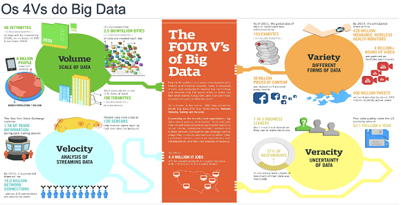

- Volume, Variedade, Velocidade e Veracidade

- para ser chamado de big data é preciso conter os 4 Vs em harmonia

**VOLUME (tamanho dos dados):**

- Espera-se que 40zettabytes de dados sejam criados por ano no mundo

- Cerca de 2.5 quintillionbytes de dados são criados por dia

- Existem atualmente cerca de 6 bilhões de telefones móveis no planeta

- Cada empresa americana armazena cerca de 100 Terabytes de dados.

**VARIEDADE (formato dos dados):**

- 150 exabytes é a estimativa de dados que foram gerados especificamente para tratamento de casos de doença em todo o mundo por ano desde 2011.

- Mais de 4 bilhões de horas por mês são usadas para assistir vídeos no YOUTUBE

- 30 bilhões de imagens são publicadas por mês no Facebook

- 200 milhões de usuários ativos por mês, publicam 400 milhões de tweets por dia

**VELOCIDADE (geração de dados):**

- 1 Terabyte de informação é criada durante uma única sessão da bolsa de valores Americana, a New York Stock Exchange (NYSE)

- Aproximadamente 100 sensores estão instalados nos carros modernos para monitorar nível de combustível, pressão dos pneus e muitos outros aspectos do veículo

- 18.9 bilhões de conexões de rede já existem no mundo

**VERACIDADE (confiabilidade dos dados):**

- Atualmente 1 em cada 3 gestores tem experimentado problemas relacionados a veracidade dos dados para tomar decisões de negócios

- Além disso, estima-se que 3.1 trilhões de dólares por ano sejam desperdiçados devido a problemas de qualidade dos dados.

### BIG DATA x CIÊNCIA DE DADOS

- Big Data é a matéria-prima, ou seja, dados.
- Ciência de dados é um conjunto de técnicas para análise de dados.
- Quando aplicamos ciência de dados ao big data extraímos valor e então temos o que é chamado de Big Data Anaytics.

### EXEMPLOS DE APLICAÇÃO DO BIG DATA ANALYTICS

- Uma companhia Aérea pode extrair, armazenar, processar e analisar dados de viagens dos passageiros a fim de oferecer rotas com maior probabilidade de venda.

- Uma rede de supermercados pode extrair, armazenar, processar e analisar dados de compras a fim de detectar padrões e organizar os produtos de forma a aumentar as vendas

- Uma rede de hotéis pode extrair, armazenar, processar e analisar dados de comentários de clientes em redes sociais para customizar seus serviços, aumentar as vendas e reduzir custos.

- Uma rede de hospitais pode extrair, armazenar, processar e analisar dados de exames médicos a fim de personalizar e otimizar o atendimento dos pacientes

- A parte mais relevante é o valor que voce extrai dos dados

- 1024 Kilobytes = 1 Megabyte

- 1024 Megabytes = 1 Gigabyte

- 1024 Gigabytes = 1 Terabyte

- 1024 Terabytes = 1 Petabyte

- 1024 Petabytes = 1 Exabyte

- 1024 Exabytes = 1 Zettabyte 

- 1024 Zettabytes = 1 Yottabyte [Facebook e Google estão aqui]

- 1024 Yottabytes = 1 Brontobyte

- 1024 Brontobytes = 1 Geobyte

----------

## O V DE VOLUME EM BIG DATA

- O V de volume é crítico em Big Data
- Como vamos armazenar grandes conjuntos de dados?
- Como vamos acessar grandes conjuntos de dados armazenados?
- Precisamos realmente armazenar tudo?
- Como armazenar Big Data?
- Os dados são estruturados ou podem ser estruturados antes do armazenamento?
	_Usamos um Data Warehouse!_
- Os dados não são estruturados ou Não podem ser estruturados antes do armazenamento?
	_Usamos um Data Lake ou um Data Store_

### BANCOS DE DADOS RELACIONAIS X NOSQL

### RELACIONAL

- Banco de dados relacionais são estruturados e com schema (organização dos dados) bem definido
- O schema é definido e criado antes do armazenamento dos dados
- Um data ware house, por exemplo é criado com alguma tecnologia de bando relacional como SGBD( sistema gerenciado de banco de dados) oracle, IBM DB2, Microsoft SQL Server, MySQL, PostgreSQL e muitos outros
- Em um banco de dados relacional os dados são organizados em tabelas que se relacionam

### NOSQL

- Bancos de dados Não relacionais (noSQL) partem do princípio que os dados podem ser semi ou não estruturados e que outros tipos de relacionamentos podem existir entre os dados
- Podemos usar bancos de dados NoSQL para construir data lakes e data stores (eles são conceitos)
- Normalmente não precisamos definir o schema antes do armazenamento ou o schema é definido no momento do armazenamento dos dados
- Existem diversos tipos de bancos de dados NoSQL : Key-Value, Graph Db (grafo), column family e Document

### DATA WAREHOUSES (DW)

- Um Data Warehouse é um sistema de armazenamento que conecta e harmoniza grandes quantidades de dados de muitas fontes diferentes
- O objetivo do DW é alimentar a inteligência de negócios (Business Intelligence), relatórios e análises e oferecer suporte aos requisitos de negócio, para que as empresas possam transformar seus dados em insights e tomar decisões inteligentes baseadas em dados
- Os DWs armazenam dados atuais e históricos em um único lugar e atuam como a única fonte de informações confiáveis para uma organização
- Os dados fluem para um DW a partir de sistemas transacionais ( como ERP e CRM ), bancos de dados e fontes externas, como sistemas de parceiros, dispositivos de internet das coisas (IoT), aplicativos de mídia social - geralmente em uma cadência regular

- O surgimento da computação em nuvem causou uma mudança no cenário

- Nos últimos anos, os locais de armazenamento de dados mudaram da infraestrutura local tradicional para vários locais, incluindo nuvem privada e nuvem pública

- O schema deve ser definido antes do processo de armazenamento dos dados

- Os DWs modernos são projetados para lidar com dados estruturados e não estruturados, como vídeos, arquivos de imagem e dados de sensor (embora data lakes ainda sejam opções melhores para dados não estruturados)

__“Exemplo nosql para data warehouse, uma empresa quer criar uma ia para detecção de tumor, a empresa tem um servidor com S.O, ela cria uma pasta e coloca todas as imagens de vários pacientes com raio x, as imagens são marcadas com Possui Tumor e Não possui tumor, a empresa não quer criar um data lake, então ela cria um  schema com uma tabela e 3 colunas = 1- nome da imagem, 2- id se tem tumor ou não, 3- caminho para pasta da imagem, É UMA QUESTÃO DE ARQUITETURA E NÃO DE TECNOLOGIA"__

- Alguns aproveitam a análise integrada e a tecnologia de banco de dados in-memory ( que mantém o conjunto de dados na memória do computador em vez de no armazenamento em disco ) para fornecer acesso em tempo real a dados confiáveis e impulsionar a tomada de decisões

- alguns SGBDs é possível colocar na memória ram, pois o acesso é mais rapido a memória do que no disco

- Sem Dw é muito difícil combinar dados de fontes heterogêneas, garantir que estejam no formato certo para análise e obter uma visão atual e de longo alcance dos dados ao longo do tempo

- Dw ainda é a principal forma de armazenar dados, data lake e data store ainda não superaram o DW

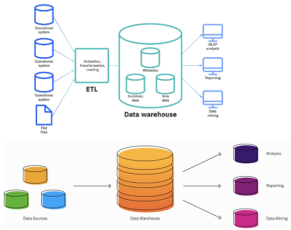

### BENEFÍCIOS DO DW

- Melhor análise de negócios: com o DW, os tomadores de decisão tem acesso a dados de várias fontes e não precisam mais tomar decisões com base em informações incompletas. 

- Consultas mais Rápidas: os DWs são construídos, especificamente para recuperação e análise rápida de dados. Com um DW, você pode consultar rapidamente grandes quantidades de dados consolidados com pouco ou nenhum suporte de TI.

- cuidado para não deixar o DW grande demais e causar demora nas consultas, é principal aspecto é a agilidade na consulta de dados

- Melhoria da qualidade dos dados: Antes de serem carregados no DW, os dados passam por um processo de limpeza garantindo que os dados sejam transformados em um formato consistente para apoiar análises e decisões, com base em dados precisos e de alta qualidade

- Visão histórica: ao armazenas dados históricos ricos, um data ware house permite que os tomadores de decisão aprendam com tendências e desafios passados, façam previsões e conduzam a melhoria contínua dos negócios.

### DATA LAKES

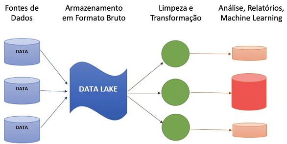

- No dw fazemos limpeza e transformação antes, acaba perdendo alguns dados no processo

- Um data lake é um repositório centralizado que permite armazenar todos os dados estruturados e não estruturados em qualquer escala. Podemos Armazenar os dados como estão na fonte, sem ter que primeiro estruturá-los e executar diferentes tipos de análises de painéis e visualizações a processamento de Big Data, análises em tempo real e aprendizado de máquina para orientar melhores decisões

- Dependendo dos requisitos, uma empresa típica exigirá um data Warehouse e um Data lake, pois eles atendem a diferentes necessidades e casos de uso

- A estrutura dos dados ou schema não é definida quando os dados são capturados, isso significa que você pode armazenar todos os dados em formato bruto sem a necessidade de saber quais perguntas de negócio deverão ser respondidas no futuro.

- Primeiro deve-se garantir a captura de todos os dados brutos direto no data lake e depois idealizar schema, ETL e passar pro DW para tomadas de decisões
- Diferentes tipos de análises, como consultar SQL , análises de Big Data, pesquisa de texto, análises em tempo real e aprendizado de máquina, podem ser usados para descobrir insights

- Os data lakes permitem que as empresas gerem diferentes tipos de percepções sobre os dados, desde relatórios sobre dados históricos até modelos preditivos criados com machine learning

- O principal desafio de uma arquitetura de data lake é que os dados brutos são armazenados sem supervisão do conteúdo. Para que um data lake torne os dados utilizáveis, ele precisa ter mecanismos definidos para catalogar e proteger os dados, Sem esses elementos, os dados não podem ser encontrados ou confiáveis, resultando em um “Pântano de dados” (DATA SWAMP). atender ás necessidades de públicos mais amplos exige que os data lakes tenham governança, gestão de metadados, consistência semântica e controle de acesso

- Data lake é um conceito e pode ser construído com diferentes tecnologias como APACHE HADOOP ou bancos de dados NOSQL.

- Podemos importar dados do DW para o Data lake e vice-versa dependendo das necessidades de negócio da empresa

- Para o DW normalmente usamos ETL ( extração, transformação e carga )

- Para o data lake normalmente usamos ELT ( Extração, carga e transformação )

- Data lakes e DWs podem fazer parte de uma grande estrutura central de armazenamento chamada Data Hub

### Benefícios do Data Lake

- Armazenamento em formato bruto: não precisamos limpar e transformar os dados antes do armazenamento

- Importação de qualquer quantidade de dados em tempo real: os dados são coletados de várias fontes e movidos para o data lake em seu formato original, Este processo permite dimensionar dados em qualquer tamanho, enquanto economiza tempo de definição de estruturas de dados, esquema e transformações

- Repositório centra para todos os dados da empresa: os data lakes permitem que várias funções como cientista de dados, engenheiros de machine learning, analista de dados e analista de negócios, acessem dados com sua ferramenta analítica específica.

- Sem necessidade de movimentação dos dados: análises podem ser executadas sem necessidade de mover os dados para um sistema de análise separado

### DEFININDO DATA STORES

- Um data store é um repositório para armazenar e gerenciar de forma persistente coleções de dados que incluem não apenas dados estruturados, mas também tipos de armazenamento variado , como documentos, dados no formato de chave-valor, filas de mensagens e outros formatos de arquivo

**Os tipos mais comuns de data stores:**

- Armazenamento de chave-valor ( Redis, Memcached )
- Motor de pesquisa de texto completo ( Elastic Search )
- Fila de mensagens ( Apache kafka )
- Sistemas de arquivos Distribuidos ( Hadoop HDFS, AWS S3 )

### Benefícios do Data Store

- Armazenamento de variados tipos de dados: dados que não se encaixam em outros repositórios de armazenamento

- Flexibilidade: armazenamento de dados aderente ás necessidades da aplicação final

- Suporte a dados semi-estruturados: dados que possuem alguma organização prévia, mas que devem ser usados em seu formato original

- Custo total menor: por se tratar de um tipo simplificado de armazenamento o custo total tende a ser menor que a outra solução de armazenamento

### SISTEMAS HÍBRIDOS DE ARMAZENAMENTO

- Com o avanço do Big data veremos cada vez mais sistemas híbridos de armazenamento, com dados armazenados em diferentes tipos de repositórios, local ou na nuvem.

- DWs, Data Lakes e Data Stores serão usados em conjunto criando assim uma grande estrutura de armazenamento de dados, um Data Hub.

----------
## Armazenamento e Processamento Paralelo

### O QUE É UM CLUSTER DE COMPUTADORES?

- Um servidor é um computador geralmente com alta capacidade computacional, que serve ( fornece) serviços de armazenamento, aplicações ou banco de dados

- Um servidor possui escalabilidade vertical, ou seja, há um limite até onde conseguimos incluir mais espaço em disco, mais processadores e mais memória RAM

- Um cluster de computadores é um conjunto de servidores com um mesmo propósito visando fornecer um tipo de serviço, como armazenamento ou processamento de dados

- Um cluster possui escalabilidade horizontal, ou seja, se quisermos aumentar a capacidade computacional incluímos mais máquinas no cluster ( além da escalabilidade vertical de cada máquina individual no cluster )

- Clusters de computadores são cada vez mais usados em Big data, o que nos permite realizar armazenamento e processamento paralelo através de diversas máquinas ( diversos servidores )

### O que é armazenamento Paralelo?

- Com clusters de computadores aumentamos de forma considerável a capacidade computacional

- O armazenamento paralelo consiste em distribuir o armazenamento de dados através de diversos servidores ( computadores ), o que permite aumentar de forma considerável a capacidade de armazenamento usando hardware de baixo custo

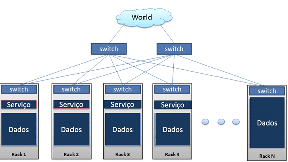

### Software para armazenamento paralelo - APACHE HADOOP

- Precisamos de um sistema de arquivos distribuido. Seu computador pessoal tem um sistema de arquivos ( NTFS, ext3, etc ) mas ele não foi desenvolvido para armazenamento distribuido

- Entre algumas opções, o Apache Hadoop HDFS ( hadoop distributed file system) tem se mostrado a solução ideal para gerenciar o armazenamento distribuido em um cluster de computadores 

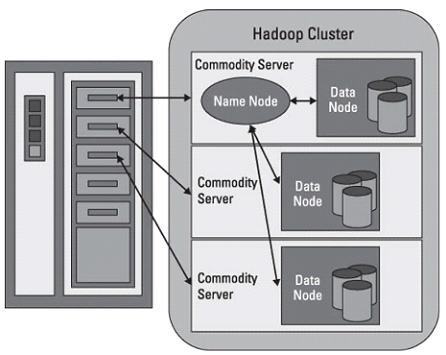

- O HDFS é o software responsável pela gestão do cluster de computadores definido como os arquivos serão distribuídos através do cluster

- Com o HDFS podemos construir um data lake que roda sobre um cluster de computadores e permite o armazenamento de grandes volumes de dados com hardware commodity ( de baixo custo )

- O HDFS permitiu que o big data pudesse ser usado em larga escala !

### Processamento paralelo de Big Data

- Resolvemos um problema. Podemos agora armazenar grandes quantidades de dados em um cluster computadores através de armazenamento paralelo de dados

- mas como vamos processar os dados se eles estão agora distribuidos em diversos computadores?

- No Processamento paralelo o objetivo é dividir uma tarefa em várias sub-tarefas e executá las em paralelo

- O apache hadoop Map reduce e o Apache Spark são dois frameworks para esse propósito

- Ao usar um framework de processamento paralelo, as sub-tarefas são levadas para o processador da máquina do cluster onde os dados estão armazenados, aumentando assim a velocidade de processamento de grandes volumes de dados

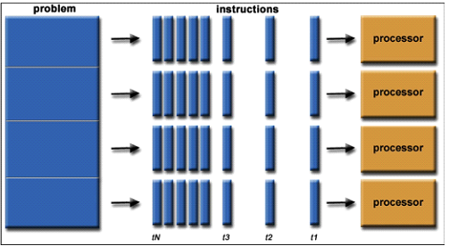

### Arquitetura de armazenamento e processamento paralelo

- O HDFS é um serviço rodando em todas as máquinas do cluster, sendo um NameNode para gerenciar o cluster e os dataNodes que fazem o trabalho de armazenamento propriamente dito

- O MapReduce também é um serviço rodando em todas as máquinas do cluster, sendo um Job Tracker para gerenciar o processamento e os Task Trackers que fazem o trabalho de processamento

- O Job Tracker consulta o NameNode a fim de saber a localização dos blocos de dados nas máquinas do cluster

- Os task trackers se comunicam com os DataNodes para obter os dados do disco, executar o processamento e então retornar o resultado ao Job Tracker

- Essa arquitetura permite armazenar e processar grandes quantidades de dados e assim extrair valor do Big Data atraves da análise de dados

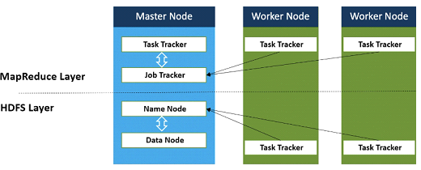

### Soluções de armazenamento e processamento Paralelo

Na nuvem: 

- Azure HDInsight
- Amazon EMR

- Databricks foi a mesma equipe que desenvolveu o SPARK para criar lakehouse plataform

----------
## Cloud Computing:

- A computação em nuvem é a entrega de serviços de computação incluindo servidores, armazenamento, bancos de dados, rede, software, análise e inteligência 

- a nuvem oferece recursos flexíveis, inovação e economia de escala

- Normalmente, pagamos apenas pelos serviços em nuvem que usamos, ajudando a reduzir os custos operacionais, operar a infraestrutura de forma mais eficiente e escalar conforme as necessidades de negócios mudam

----------

## MLOps e DataOps:

### O QUE É MACHINE LEARNING?

- é uma sub-área da inteligência artificial ( IA ) e da ciência da computação que se concentra no uso de dados e algoritmos para imitar a forma como os humanos aprendem, melhorando gradativamente sua precisão

- o que fazemos em machine learning é alimentando por Big Data

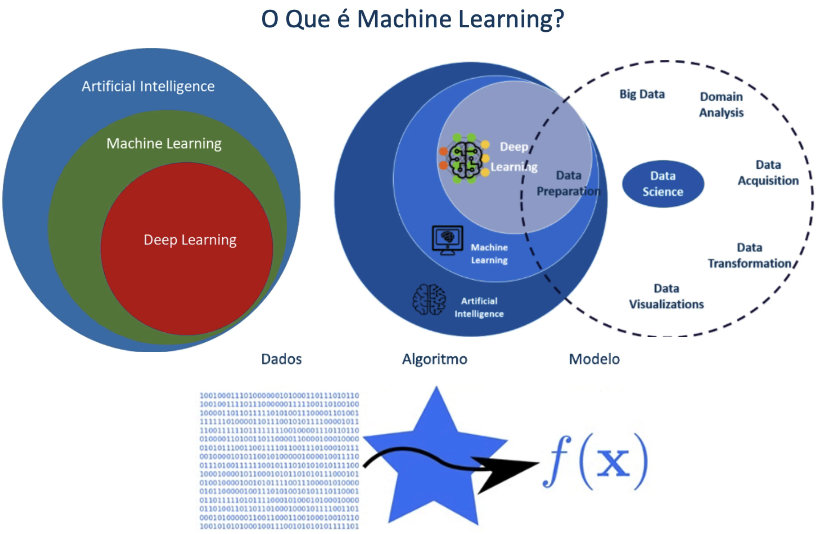

### O Pipeline de Machine Learning

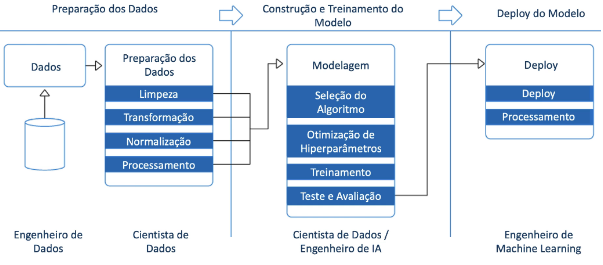

### O que é machine learning Ops?

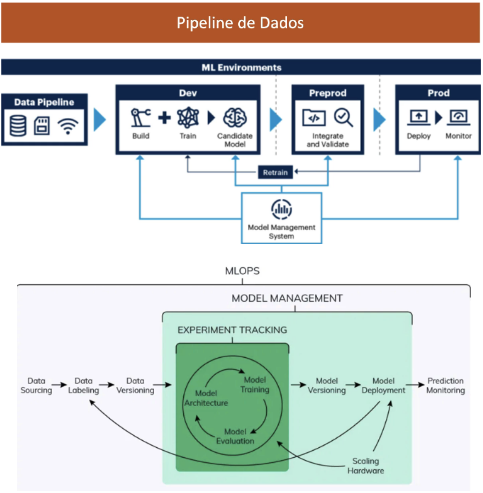

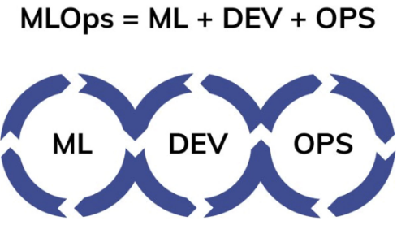

- MLOps é um conjunto de práticas para colaboração e comunicação entre cientistas de dados e profissionais de operações

- “a criação do processo de MLops é tarefa do eng de machine learning e a criação do modelo de machine learning é tarefa do cientista de dados”

- A aplicação dessas práticas aumenta a qualidade, simplifica o processo de gerenciamento e automatiza a implantação de modelos de aprendizado de máquina em ambientes de produção em grande escala. é mais fácil alinhas os modelos ás necessidades de negócios, bem como aos requisitos regulamentares

- MLOps visa unificar o desenvolvimento de sistemas de ML (dev) e a implantação de sistemas de ML (ops) para padronizar e agilizar a entrega contínua de modelos de alto desempenho em produção

### DevOps, MLOps, AIOps e DataOps

- MLOps = Operação do fluxo de trabalho em machine learning

- AIOps = Operação do fluxo de trabalho em IA

- DataOps = conceito mais recente que abrange toda a operação de dados de uma empresa

- DevOps 

- é uma abordagem para desenvolvimento de software que acelera o ciclo de vida de construção usando automação. O devOps se concentra na implantação contínua de software, aproveitando os recursos de TI sob demanda e automatizando a integração, o teste e a implantação de código. Essa fusão de desenvolvimento de software (‘dev’) e operações de TI (‘ops’) reduz o tempo de implantação, diminui o tempo de lançamento no mercado, minimiza defeitos e diminui o tempo necessário para resolver problemas
	
- Usando DevOps, empresas conseguiram reduzir o tempo do ciclo de lançamento de software de meses para literalmente segundos. Essa descoberta permitiu o crescimento e liderança em mercados emergentes e em ritmo acelerado. Empresas como Google, Amazon e muitas outras agora lançam software muitas vezes por dia. Ao melhorar a qualidade e o tempo de ciclo dos lançamentos de código, o DevOps merece muito crédito pelo sucesso dessas empresas

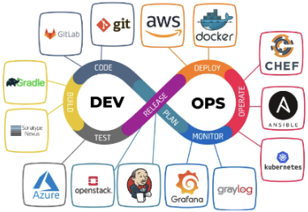

### DataOps ( Operação de Dados )

- é uma metodologia ágil e orientada a processos para desenvolver e entregar análises.

- DataOps fornece as ferramentas, processos e estruturas organizacionais para apoiar a empresa focada em dados.

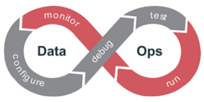

- DataOps é a capacidade de habilitar soluções, desenvolver produtos de dados e ativar dados para valor comercial em todas as camadas de tecnologia, da infraestrutura á experiência do usuário final.

- O objetivo do DataOps é agilizar o design, o desenvolvimento e a manutenção de aplicativos com base em dados e análise de dados. Busca melhorar a forma como os dados são gerenciados e os produtos são criados e coordenar essas melhorias com os objetivos do negócio.

- As equipes de DataOps também buscam orquestrar dados, ferramentas, código e ambientes do início ao fim, com o objetivo de fornecer resultados reproduzíveis.

- As equipes de DataOps tendem a ver os pipelines analíticos como análogos ás linhas de produção de uma fábrica, sendo que aqui a matéria-prima é o Big Data.

- Semelhante a um Engenheiro DevOps no campo de desenvolvimento de software, os
Engenheiros DataOps são profissionais técnicos que se concentram principalmente ou
exclusivamente no ciclo de vida de desenvolvimento e implantação, e não no produto em si.

- Mas os Engenheiros DataOps apoiam o ciclo de fornecimento e utilização de dados
definindo o processo e as tecnologias que outros usam para originar, transformar e utilizar dados. O Engenheiro DataOps tem um perfil mais amplo que o Engenheiro de Dados.

### BIG DATA X SMALL DATA

- Big data = grandes volumes de dados com muita variedade e gerados em alte velocidade

- Small data = Dados que estão disponíveis em quantidade mínima para compreensão huma
 PRINCIPAIS FERRAMENTAS DE MLOps

#### DVC 

https://dvc.org

- DVC, ou Data Version Control, é um sistema de controle de versão de código aberto para projetos de aprendizado de máquina. É uma ferramenta de experimentação que ajuda a definir o pipeline, independentemente da linguagem usada.

#### Pachyderm 

https://www.pachyderm.com/

- Pachyderm é uma plataforma que combina linhagem de dados com pipelines de ponta a ponta. Ele está disponível em três versões, Community Edition (código aberto, com capacidade de ser usado em qualquer lugar), Enterprise Edition (plataforma completa com versão controlada) e Hub Edition (ainda uma versão beta, combina características das duas versões anteriores).

#### Airflow

https://airflow.apache.org/

- Airflow é uma plataforma de código aberto que permite monitorar, agendar e gerenciar osfluxos de trabalho usando app web. Ele fornece uma visão sobre o status das tarefas concluídas e em andamento, juntamente com uma visão dos logs.

#### Neptune

https://neptune.ai/product

- O Neptune é um repositório de metadados desenvolvido para equipes de pesquisa e produção que realizam muitos experimentos. 

#### MLflow 

https://mlflow.org/

- MLflow é uma plataforma de código aberto que ajuda a gerenciar todo o ciclo de vida do aprendizado de máquina que inclui experimentação, reprodutibilidade, implantação e um registro de modelo central. O MLflow é adequado para indivíduos e equipes de qualquer tamanho. A ferramenta é independente de biblioteca. Você pode usá-lo com qualquer biblioteca de aprendizado de máquina e em qualquer linguagem de programação.

### PRINCIPAIS FERRAMENTAS DE DATAOps

#### DataKitchen
https://datakitchen.io/

- Uma das ferramentas DataOps mais populares, DataKitchen é a melhor para automatizar e coordenar pessoas, ambientes e ferramentas em análise de dados de toda a organização. O DataKitchen cuida de tudo - do teste à orquestração, ao desenvolvimento e à implantação. O DataKitchen permite que as organizações criem ambientes de trabalho em questão de minutos para que as equipes possam experimentar sem interromper os ciclos de produção. O pipeline de qualidade do DataKitchen é baseado em três seções principais; dados, produção e valor. É essencial entender que, com esta ferramenta, você pode acessar o pipeline com o código Python, transformá-lo via Linguagem SQL, projetar o modelo em R, visualizar na pasta de trabalho e obter relatórios no Tableau.

#### Genie

https://netflix.github.io/genie/

- Desenvolvida pela Netflix, essa ferramenta DataOps é um mecanismo de código aberto que oferece serviços de orquestração de trabalhos distribuídos. Essa ferramenta fornece APIs para desenvolvedores que desejam executar uma ampla variedade de trabalhos com Big Data, usando Hive, Hadoop, Presto e Spark. Genie também fornece APIs para gerenciamento de metadados em clusters de processamento distribuído.
.
#### Piper

https://www.piperr.io/

- Piper é um pacote de ferramentas de DataOps baseadas em aprendizado de máquina que permite que as organizações leiam dados de maneira mais suave e eficiente. Esta solução expõe os dados por meio de um conjunto de APIs que se integram facilmente aos ativos digitais da organização. 

#### Airflow

https://airflow.apache.org/

- Apache Airflow é uma plataforma de DataOps (e também MLOps) de código aberto que gerencia fluxos de trabalho complexos em qualquer organização, considerando os processos de dados como DAG (Directed Acyclic Graphs). Projetado pelo Airbnb para agendar e monitorar seus fluxos de trabalho, agora as empresas podem utilizar essa ferramenta de código aberto para gerenciar seu processo de dados no MacOS, Linux e Windows.

----------
## Dados como Serviço:

### DATA AS SERVICE (DaaS)

- DaaS é uma estratégia de gerenciamento de dados que visa alavancar os dados como um ativo de negócios para maior agilidade no processo de análise

- Faz parte das ofertas “as a service” que se tornaram cada vez mais populares desde a expansão da internet nos anos 1990, que começou com a introdução do Software as a Service (SaaS)

- Semelhante a outros modelos “como serviço”, o DaaS fornece uma maneira de gerenciar as grandes quantidades de dados que as organizações geram todos os dias e fornecer essas informações valiosas em todas a empresa para a tomada de decisões baseadas em dados

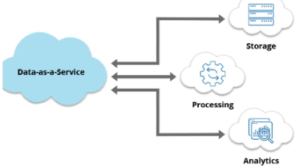

### ARQUITETURA DaaS

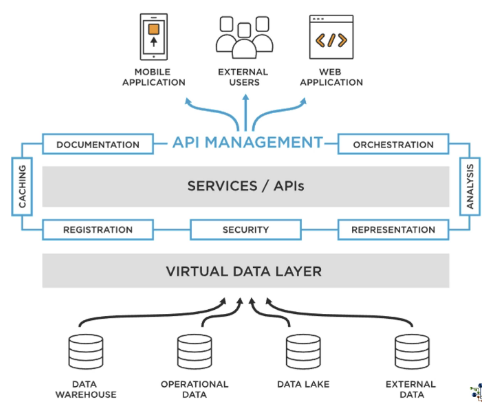

- A arquitetura DaaS (Data as  a Service) se concentra no provisionamento de dados de uma variedade de fontes sob demanda por meio do uso de APIs

- Projetado para simplificar o acesso aos dados, o DaaS oferece conjuntos de dados já tratados ou fluxos de dados para serem consumidos em uma variedade de formatos, geralmente unificados usando virtualização de dados

- Na verdade, uma arquitetura DaaS pode incluir uma variedade de tecnologias de gerenciamento de dados, incluindo virtualização de dados, serviços de dados, análise de autoatendimento (Self-Service Analytics) e catalogação de dados

### PRINCIPAIS BENEFÍCIOS DE DaaS

- Monetização de dados
- Redução de Custos
- Caminho mais rápido para inovação
- Agilidade no processo de decisão baseado em dados
- Menor risco no uso de dados
- Criação de uma cultura Data-Driven

### Arquiteturas Modernas de Big Data

- À medida que Big Data amadurece e ganha cada vez mais espaço nas empresas, novas
arquiteturas surgem com o objetivo de tornar o acesso aos dados mais fácil, eficiente, seguro e amplamente disponível.

- Como vimos nas aulas anteriores neste capítulo, uma tendência é tornar os dados
disponíveis como serviço e algumas arquiteturas modernas
de Big Data estão sendo propostas para este fim.

- As duas últimas tendências em arquiteturas de plataforma de dados emergentes são o
Data Lakehouse e o Data Mesh.

### Data LakeHouse

- Um Data Lakehouse é uma nova arquitetura de gerenciamento de dados que combina a flexibilidade, economia e escala de Data Lakes com o gerenciamento de dados e transações ACID (Atomicidade, Consistência, Isolamento, Durabilidade) de Data Warehouses, permitindo Business Intelligence (BI) e Machine Learning (ML) em todos dados armazenados em um único repositório. 

- Data Lakehouses são habilitados por um novo design de sistema aberto: implementação de estruturas de dados e recursos de gerenciamento de dados semelhantes aos de um Data Warehouse, diretamente no tipo de armazenamento de baixo custo usado para Data Lakes. Mesclá-los em um único sistema significa que as equipes de dados podem se mover mais rapidamente, pois podem usar os dados sem a necessidade de acessar vários sistemas. 
Os Data Lakehouses também garantem que as equipes tenham os dados mais completos e atualizados disponíveis para projetos de ciência de dados, aprendizado de máquina e análise de negócios. 

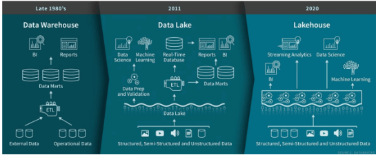

- O termo Data Lakehouse foi definido pela Databricks (plataforma que fornece infraestrutura para processamento de grandes volumes de dados).

- Abaixo o paper de pesquisa que originou o termo: Lakehouse: A New Generation of Open Platforms that Unify Data Warehousing and Advanced Analytics 

https://databricks.com/wp-content/uploads/2020/12/cidr_lakehouse.pdf

### Data Mesh

- Conforme definido pela primeira vez por Zhamak Dehghani, consultora da ThoughtWorks e a arquiteta original do termo, Data Mesh é um tipo de arquitetura de plataforma de dados que abrange a onipresença dos dados na empresa, permitindo um design orientado ao domínio e de autoatendimento. Data Mesh é amplamente considerado a próxima grande mudança arquitetônica em dados. 

- Data Mesh é uma nova abordagem para projetar e desenvolver arquiteturas de dados. Ao contrário de uma arquitetura centralizada e monolítica baseada em um Data Warehouse e/ou um Data Lake, Data Mesh é uma arquitetura de dados altamente descentralizada. 

- Data Mesh tenta resolver três desafios quando temos um Data Lake/Warehouse centralizado: 

- Falta de propriedade. Quem é o proprietário dos dados - a equipe da fonte de dados ou a equipe de infraestrutura? 

- Falta de qualidade. A equipe de infraestrutura é responsável pela qualidade, mas não conhece bem os dados. 

- Escalonamento organizacional. O armazenamento central torna-se o gargalo, como no caso de um Data Lake/Warehouse empresarial. 

- O objetivo com Data Mesh é tratar os dados como um produto, com cada fonte tendo seu próprio gerente/proprietário de produto de dados (que fazem parte de uma equipe multifuncional de Engenheiros de Dados) e sendo seu próprio domínio claramente focado e com uma oferta autônoma, tornando-se os blocos de construção fundamentais de uma malha (Mesh), levando a uma arquitetura distribuída orientada por domínio. 

- Observe que, por motivos de desempenho, você pode ter um domínio que agrega dados de várias fontes. Cada domínio deve ser detectável, endereçável, autoexplicativo, seguro (governado por controle de acesso global), confiável e interoperável (governado por um padrão aberto). Cada domínio armazenará seus dados em um Data Lake e, em muitos casos, também terá uma cópia de alguns dos dados em um banco de dados relacional.

- Outro componente do Data Mesh é a infraestrutura de dados como plataforma, que fornece armazenamento, pipeline, catálogo de dados e controle de acesso aos domínios. A ideia principal é evitar a duplicação de esforços. Isso permitirá que cada equipe de produto de dados crie seus produtos de dados rapidamente. 

- Vale ressaltar que Data Mesh ainda é uma tendência e sua implementação tem diversos desafios técnicos. Mas toda tecnologia de sucesso um dia foi uma tendência. Como dizia Bill Gates, fundador da Microsoft: O segredo do sucesso em tecnologia está em reconhecer o potencial de uma tendência no futuro e chegar lá primeiro.

### Data Mesh Como Paradigma de Arquitetura de Dados

- Data Mesh é um paradigma arquitetônico e organizacional que desafia a antiga suposição de que devemos centralizar os dados para usá-los, ter todos os dados em um só lugar ou ter os dados gerenciados por uma equipe de dados centralizada para agregar valor. 

- Para o Big Data fomentar a inovação, sua propriedade deve ser federada entre os proprietários de dados que são responsáveis por fornecer seus dados como produtos (com o suporte de uma plataforma de dados de autoatendimento para abstrair a complexidade técnica envolvida em servir produtos de dados). Também devemos adotar uma nova forma de governança federada por meio da automação para permitir a interoperabilidade de produtos de dados orientados a domínio. A descentralização, junto com a interoperabilidade e o foco na experiência dos consumidores de dados, são fundamentais para a democratização da inovação usando dados.

- Se uma organização tem muitos domínios com vários sistemas e equipes gerando dados ou um conjunto diversificado de casos de uso e padrões de acesso orientados a dados, o uso de Data Mesh pode ser uma opção viável. A implementação de Data Mesh requer investimento na construção de uma plataforma de dados de autoatendimento e adoção de uma mudança organizacional para domínios a fim assumir a propriedade de longo prazo dos produtos de dados, bem como uma estrutura de incentivos que recompensa domínios que servem e utilizam dados como um produto.

- Data Mesh marca uma mudança bem-vinda de paradigma arquitetônico e organizacional em como gerenciamos Big Data. O paradigma é baseado em quatro princípios: 

(1) Descentralização orientada ao domínio da propriedade e arquitetura de dados; 
(2) Dados orientados ao domínio servidos como um produto; 
(3) Infraestrutura de dados de autoatendimento como uma plataforma para habilitar equipes de dados autônomas e orientadas para o domínio; 
(4) Governança federada para permitir ecossistemas e interoperabilidade. 

- Há ainda uma grande lacuna de ferramentas comerciais para acelerar a implementação de Data Mesh e hoje o que vemos é a implementação de blocos isolados que então podem ser conectados criando assim uma grande malha de dados e tornando esse tipo de arquitetura uma realidade. Teremos ainda muita evolução e novas ferramentas surgindo nos próximos anos. 

- Arquitetos de Dados, Engenheiros de Dados e Engenheiros DataOps são os profissionais que provavelmente participarão de projetos para implementar esse tipo de arquitetura. 

### Soluções Comerciais

- Vemos atualmente ocorrer com as arquiteturas modernas de Big Data, o mesmo fenômeno que ocorreu cerca de 10 anos atrás com o próprio Big Data: uma explosão de soluções comerciais que facilitam a implementação das arquiteturas. Aqui vão algumas dicas. 

- Para o Data Lakehouse, a solução mais comum é o Databricks. A DSA foi pioneira no Brasil ao trazer projetos de Databricks em nossos treinamentos e o último curso da Formação Engenheiro de Dados terá diversos novos projetos sobre a plataforma. Conheça o Databricks:  https://databricks.com/

- Data Mesh é um conceito de arquitetura e sua implementação pode envolver diversas tecnologias. Considerando o ambiente de Cloud Computing do Microsoft Azure, o Azure Purview seria seu ponto de partida para descobrir dados. Se você precisar fazer consultas entre domínios, também chamadas de consultas federadas, use o Synapse sem servidor com o Azure Virtual Network Peering se estiver consultando dados de contas de armazenamento (vinculando as contas de armazenamento em cada espaço de trabalho do Synapse). Se consultar dados de pools dedicados relacionais do Synapse, isso exigiria atualmente trabalho extra, como usar notebooks Synapse Spark, Databricks, Power BI ou fluxos de dados do Azure Data Factory para chamar vários bancos de dados hospedados em pools dedicados separados (mas há soluções mais fáceis). 

- As Formações Engenheiro de Dados e Arquiteto de Dados fornecem o conhecimento necessário para essas implementações. 

----------

## ETL - Extração, Transformação e Carga de Dados:

### Definindo ETL

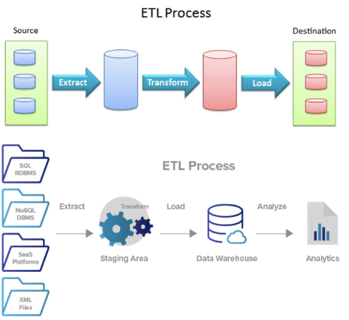

### ETL X ELT

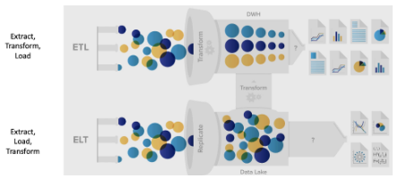

### Principais Soluções de ETL e ELT disponíveis no mercado

- Oracle Data Integrator
- PDI - Pentaho Enterprise Edition
- Apache NIFI - open source
- Apache Spark -  é um software de processamento de dados, podemos utilizar processos de etl nele
- Apache Airflow - agendar monitorar fluxos de trabalhos
- Azure Data Factory
- AWS GLUE
- AWS ATHENA - motor de execução de linguagem SQL
- PowerCenter

### DEMO ETL e BIG DATA

#### AWS GLUE

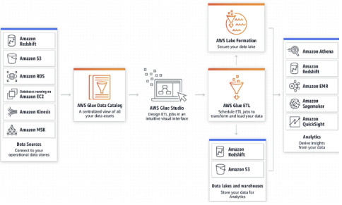

- crawler - vai até a fonte dados e descobre os formatos dos dados
- agora é preciso construir o formato ETL
- configurar gatilhos para definir a frequência que o ETL vai ser executado

----------

## O QUE É BIG DATA ANALYTICS 

- O valor do Big data é extraído quando se aplica uma técnica de análise de dados

### COMO AS EMPRESAS ESTÃO UTILIZANDO O BIG DATA?

- Manufatura ( fábricas ) através de dados gerados por sensores e IoT
- Finanças
- Saúde - Prontuário eletrônico
- Varejo

### CASOS DE USO DE BIG DATA ANALYTCS

#### Caesars Entertainment

- O novo ambiente reduziu o tempo de processamento de 6 horas para 45 minutos para posições-chave. Isso permitiu á caesars promover uma análise de dados mais rápida e exata, aprimorando a experiência de consumidor e fazendo com que a segurança atendesse os requisitos do setor de pagamentos com cartões

- A empresa agora processa mais de 3 milhões de registros por hora

#### Cerner

- A empresa de tecnologia para o setor de saúde construiu um hub de dados corporativos no CDH (Cloudera distribution) para criar uma visão mais compreensível de qualquer paciente, condição ou tendência

- A tecnologia ajuda a cerner e seus clientes a monitorarem mais de 1 milhão de pacientes diariamente

- Entre outras coisas, ela colabora na determinação mais exata da probabilidade de um paciente estar com infecção em sua corrente sanguínea

#### eHarmony

- O site de namoro online recentemente atualizou seu ambiente na nuvem, usando o CDH para analisar um volume massivo e variado de dados

- A tecnologia ajuda a eharmony a disponibilizar novas combinações a milhões de pessoas diariamente

- O novo ambiente cloud acomoda análises mais complexas, criando resultados mais personalizados e aumentando a chance de sucesso nos relacionamentos

#### MasterCard

- A empresa foi a primeira a implementar a distribuição CDH do hadoop após receber certificação PCI completa

- A companhia usou os servidores intel para integrar conjuntos de dados a outros ambientes já certificados

- A masterCard incentiva seus clientes a adotarem o sistema através do seu braço de serviços profissionais o masterCard Advisors

#### Farmlogs

- A companhia de software para gerenciamento de produções agrícolas usa analytics em tempo real rodando nos processadores intel xeon E5 para fornecer dados sobre colheita, condições de plantio e estado da vegetação para 20% das fazendas americanas

- A tecnologia ajuda os fazendeiros a aumentarem a produtividade de seus acres

#### Nippon Paint

- Uma das maiores fornecedoras de tinta da ásia usa os processadores intel xeon E7 v2 para compreender o comportamento de clientes, otimizar sua cadeia de suprimentos e melhorar suas campanhas de marketing.

- A nippon paint agora testa um novo sistema baseado no Hadoop para usufruir das ferramentas de ato desempenho e processar Big Data

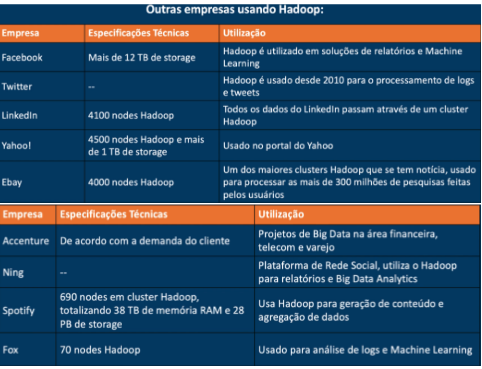

## COMO INICIAR UM PROJETO DE BIG DATA

1- Definição do Business Case
2- Planejamento do projeto
3- Definição dos requisitos técnicos
4- Criação de um total ‘Total Business Value Assessment’

### DEFINIÇÃO DE BUSINESS CASE

- definir um objetivo, escolher para onde vai, para decidir o melhor caminho. O que você quer alcançar ao final de um projeto?
  
- o business case vai definir qual o objetivo,em que direção o negócio está indo, quais os obstáculos, quais os principais interessados, identificar uma área problemática, quais os problemas e obstáculos não técnicos, o business case não é um documento técnico, qual a visão geral do projeto e para que vai implementa-lo.

- deve ser apresentado aos tomadores de decisão e então com o business case em mãos partir para a parte de planejamento de projeto

### PLANEJAMENTO DO PROJETO

- definição da documentação, escopo

- especificar as metas comerciais esperadas e métricas

- identificar as questões comerciais com a maior precisão possível, ele terá de gerar algum resultado comercial para poder começar o projeto

- determinar e quantificar os requisitos de negócios e definir como seria uma implementação bem sucedida de big data

- documentar os critérios de sucesso e certificar que cada objetivo comercial tenha um critério mensurável, os stakeholders devem claramente saber qual os objetivos a serem alcançados, alinhar expectativas

- desenvolva um orçamento TCO = total cost ownership

- definir uma linha de tempo com marcos de sucesso em 3 meses, 6 meses e 1 ano ( leva em torno de 7 a 9 meses em empresas ágeis )

- definição de requisitos técnicos, para definir orçamento e cronograma

### DEFINIÇÃO DOS REQUISITOS TÉCNICOS

- criar arquitetura do projeto, definir aquilo que será necessário para implementar uma estrutura de big data
  
- normalmente as empresas tem uma ferramenta de BI, quais requerimentos de hardware, rede, segurança
  
- começamos definindo os atributos necessários em bancos de dados, quais as possíveis fontes de dados ex: modelos preditivos para o marketing analytics
  
- se eu tenho um objetivo, posso definir minhas fontes de dados
  
- como mesclar e armazenar as diferentes fontes de dados: servidores web, logs…, buscar em tempo rea (streaming)l ou em cargas de bet ( 1 vez ao dia )

- quais ferramentas de análise utilizar, open source ou soluções proprietárias

- habilidades técnicas necessárias para trabalhar com esse ambiente

- data lake em nuvem ou on-premise

- definir ferramentas de relatórios e visualização ( própria(R ou python) ou open source

### CRIAÇÃO DE UM “TOTAL BUSINESS VALUE ASSESSMENT”

- etapa que a empresa trabalha o time to business ( quanto tempo levará até gerar resultados), normalmente leva 3 anos para esse projeto gerar resultado
- definir a facilidade de uso, escalabilidade, padrões ( ainda não existem um padrão técnico bem definido ), suporte e manutenção

----------

##

----------

##

----------