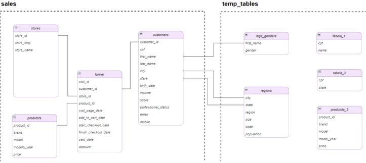
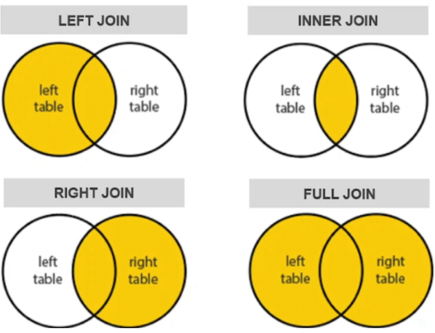
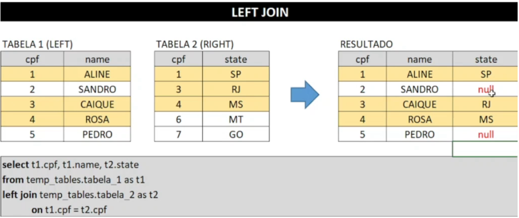
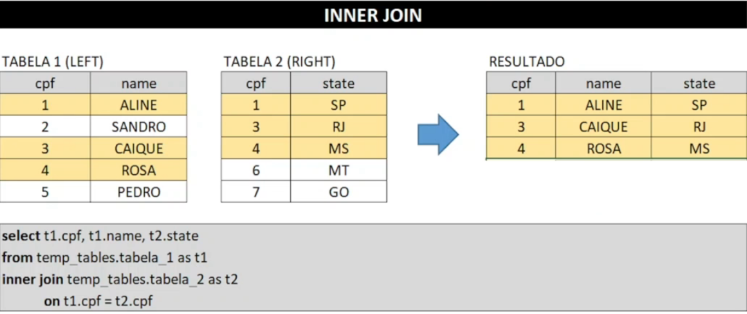
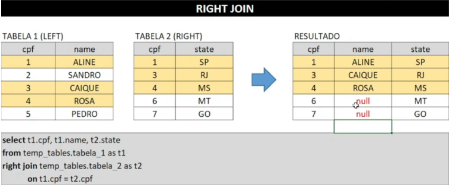
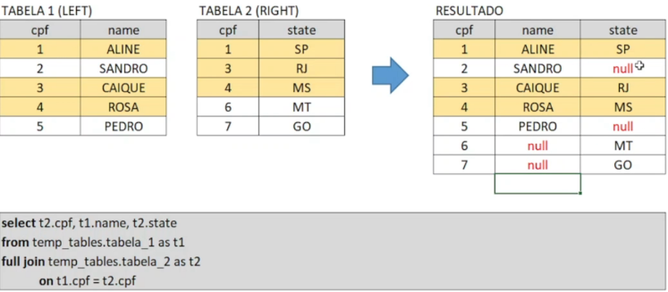
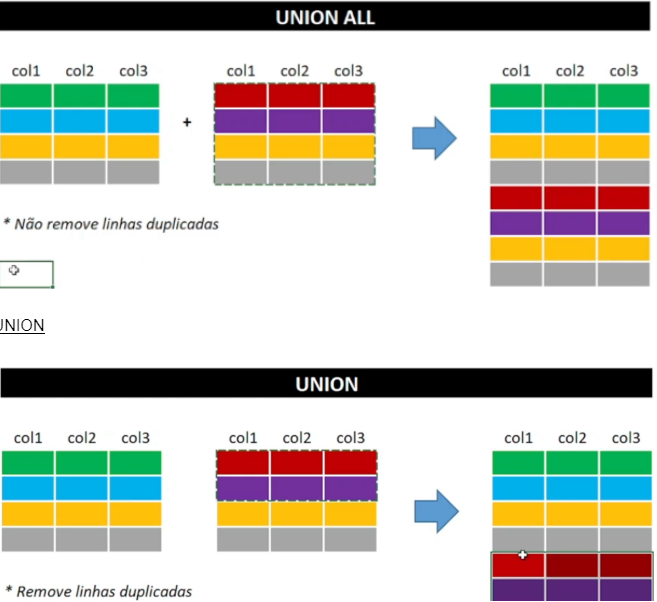

# Sumário


<details><summary><strong>Navegação</strong></summary>

1. [Configurações](#configurações)
2. [Comandos Básicos](#comandos-básicos)
3. [Operadores](#operadores)
4. [Funções agregadas + GROUP BY + HAVING](#funções-agregadas--group-by--having)
5. [Join](#join)
6. [Union](#union)
7. [Subqueries](#subqueries)
8. [Tratamento de dados](#tratamento-de-dados)
9. [Manipulação de tabelas](#manipulação-de-tabelas)

</details>

## Configurações

- Baixar e instalar o pgAdmin: software gráfico para administração do  PostgreSQL
- Baixar e instalar o PostgreSQL: Sistema gerenciador do banco de dados (SGBD) que possibilita a consulta aos dados com o uso da linguagem SQL
- Configurar o banco de dados: nós iremos rodar um script que cria todas as tabelas que serão utilizadas durante as aulas desse curso

### pgAdmin

- Ir até o site pgAdmin
- ir até downloads e selecionar por exemplo, windows (https://www.pgadmin.org/download/pgadmin-4-windows/)
- clicar em packages na próxima tela e escolher windows
- após clicar em packages, selecionar Download the installer e selecionar a versão do postgresql
- aguardar o download do pgAdmin + Postgresql

- dentro do pgAdmin tem o databases / postgres / schemas / public / tables
- que é o conteúdo que mais iremos trabalhar e query tools em cima do databases

### Configuração do Banco de dados

- nosso banco de dados vais er igual a esse diagrama
- diagrama é a representação gráfica das tabelas de  um banco de dados e comos elas se conectam
- utilizaremos o schema sales como principal e o temp_tables secundário



- no schema Sales temos 4 tabelas : stores, products, funnel e customers
- a funnel é a tabela principal
- ela mostra qual foi a ação tomada por cada cliente em cada visita
- para entender as caracteristicas relacionadas as compras dos clientes, utilizamos a funnel junto com a customers
- para entender as características dos produtos mais vendidos, linkamos a funnel junto com a products

### Criando estrutura no pgAdmin

- botão direito em Schemas
- create
- criar dois schemas com os nomes sales e temp_tables
- baixar o arquivo com o script
- abrir o query tools no canto superior esquerdo
- colar o script
- apertar f5 para rodar
- foi criado todas as tabelas e colunas do diagrama

---------

## Comandos Básicos:


### Comando SELECT

- comando mais utilizado, toda query começa com select
- serve para selecionar as colunas de tabelas

```
select coluna_1, coluna_2, coluna_3
from schema_1.tabela_1
```

#### Exemplo 1 : seleção de uma coluna de uma tabela

- liste os e-mails dos clientes da tabela sales.customers

```
select email
from sales.customers
```

- apos clicar para executar esse comando no query tools, ele vai fornecer todos os emails prontos para colocar em uma planilha excel

#### Exemplo 2 : selecionar mais de uma coluna de uma tabela

- Liste os emails e nomes dos clientes da tabela sales.customers

```
select email, first_name, last_name
from sales.customers
```

#### Exemplo 3: Seleção de todas as colunas de uma tabela

- liste todas as informações dos clientes da tabela sales.customers

```
select *
from sales.customers
```

#### Resumo:

- Comando usado para selecionar colunas de tabelas ( select )
- Quando selecionar mais de uma coluna, elas devem ser separadas por vírgula sem conter vírgula antes do comando FROM
- Pode-se utilizar o asterisco (*) para selecionar todas as colunas da tabela

### Comando DISTINCT

- serve para remover linhas duplicadas e mostrar apenas linhas distintas
- Muito usado na etapa de exploração de bases

```
select distinct coluna_1, coluna_2, coluna_3
from schema_1.tabela_1
```

#### Exemplo 1: Seleção de uma coluna sem Distinct

- liste as marcas de carro que constam na tabela products

```
select brand
from sales.products
```

retorna 333 resultados repetidos

#### Exemplo 2: Seleção de uma coluna com Distinct

- liste as marcas de carro distintas que constam na tabela products

```
select distinct brand
from sales.products
```

retorna 40 resultados sem repetição

#### Exemplo 3: Seleção de mais de uma coluna com distinct

- Liste as marcas e anos de modelo distintos que constam na tabela products

```
select distinct brand, model_year
from sales.products
```

encontrou todas as combinações distintas nessas 2 colunas

#### Resumo:

- Comando Distinct é usado para remover linhas duplicadas e mostrar apenas linhas distintas.
- Muito utilizado na etapa de exploração dos dados
- caso mais de uma coluna seja selecionada, o comando SELECT DISTINCT vai retornar todas as combinações distintas

### Comando WHERE

- Serve para filtrar as linhas da tabela de acordo com uma condição
- trabalhando com dados em forma de texto devemos utilizar aspas simples e CASE SENSITIVE

```
select coluna_1, coluna_2, coluna_3
from schema_1.tabela_1
where condição_x=true
```

simplificando:

- selecionar as colunas que desejamos trazer na seleção
- de qual tabela iremos trazer
- e qual a condição verdadeira para a linha aparecer na seleção

#### Exemplo 1: filtro com condição única

- Liste os emails dos clientes da nossa base que moram no estado de santa catarina

```
select email, state
from sales.customers
where state = ‘Santa catarina’
```

porém deu erro, precisamos ver como os dados estão inseridos:

```
select distinct state
from sales.customers
```

os dados estão abreviados e em uppercase, então mudamos a sintaxe

```
select email, state
from sales.customers
where state = ‘SC’
```

#### Exemplo 2 : Filtro com mais de uma condição

- Liste os emails dos clientes da nossa base que moram no estado de Santa Catarina ou Mato grosso do sul

```
select email, state
from sales.customers
where state = ‘SC’ or state = ‘MS’
```

#### Exemplo 3 : Filtro de condição com data

- liste os emails dos clientes da nossa base que moram no estado de santa catarina ou mato grosso do sul e que tem mais de 30 anos

verificar como estão os dados das datas

```
select distinct birth_date
from sales.customers
```

```
select email, state, birth_date
from sales.customers
where (state = ‘SC’ or state = ‘MS’) and birth_date < ‘1993-06-28’
```
ou

```
select email, state, birth_date
from sales.customers
where (state = ‘SC’ or state = ‘MS’) and birth_date < ‘19930628’
```

#### Resumo: 

- Commando utilizado para filtrar linhas de acordo com uma condição
- No PostgreSQL são utilizadas aspas simples para delimitar strings
- string = sequência de caracteres = texto
- pode-se combinar mais de uma condição utilizando os operadores lógicos
- No PostgreSQL as datas são escritas no formato ‘YYYY-MM-DD’ ou ‘YYYYMMDD’

### Comando ORDER BY

- serve para ordenar a seleção de acordo com uma regra definida pelo usuário

#### Exemplo 1: Ordenação de valores numéricos

- liste produtos da tabela products na ordem crescente com base no preço : 

```
select *
from sales.products
order by price
```

para fazer na ordem decrescente: 

```
select *
from sales.products
order by price desc
```

#### Exemplo 2: Ordenação de texto

- Liste os estados distintos da tabela customers na ordem crescente

```
select distinct state
from sales.customers
order by state
```

#### Resumo:

- Comando utilizado para ordenar a seleção de acordo com uma regra definida
- Por padrão o comando ordena na ordem crescente. Para mudar para decrescente devemos usar o Comando DESC
- No caso de strings a ordenação seguirá a ordem alfabética

### Comando LIMIT

- Serve para limitar o nº de linhas de consulta
- Muito utilizado na etapa de exploração de dados
- limit N (numero de linha)

#### Exemplo 1: Seleção das N primeiras linhas usando LIMIT

- liste as 10 primeiras linhas da tabela funnel

```
select *
from sales.funnel
limit 10
```

#### Exemplo 2:  Seleção das N primeiras linhas usando LIMIT e ORDER BY

- liste os 10 produtos mais caros da tabela products

```
select *
from sales.products
order by price desc
limit 10
```

#### Resumo:

- Comando utilizado para limitar o nº de linhas da consulta
- Muito utilizado na etapa de exploração dos dados
- Muito utilizado em conjunto com o comando ORDER BY quando o que importa são os TOP N.  Ex: “N pagamentos mais recentes”, “N produtos mais caros”

---------

## Operadores: 

### Operadores aritméticos

- Servem para executar operações matemáticas
- Muito utilizados para criar colunas calculadas

#### Exemplo 1 ; Criação de coluna calculada

- Crie uma coluna contendo a idade do cliente da tabela sales.customers

```
select *
from sales.customers
limit 10
```

criando coluna : 

```
select
	email,
	birth_date,
	(current_date - birth_date) / 365 as idade_do_cliente
from sales.customers
```

ou para colocar um nome específico na coluna, utilizando aspas duplas

```
select
	email,
	birth_date,
	(current_date - birth_date) / 365 as “idade do cliente”
from sales.customers
```

#### Exemplo 2: Utilização da coluna calculada nas queries

- Liste os 10 clientes mais novos da tabela customers

```
select
	email,
	birth_date,
	(current_date - birth_date) / 365 as “idade do cliente”
from sales.customers
order by “idade do cliente”
```

#### Exemplo 3: Criação de coluna calculada com strings

- Crie a coluna “nome_completo” contendo o nome completo do cliente

```
select
	first_name || ‘ ‘ || as nome_completo
from sales.customers
```

### Operadores de Comparação

- Servem para comparar dois valores retornando TRUE ou FALSE
- Muito utilizado em conjunto com a função WHERE para filtrar linhas de uma seleção
- Utilizados para criar colunas Flag que retornem TRUE ou FALSE

```
select
	customer_id,
	first_name,
	professional_status,
	(professional_status = ‘clt’) as cliente_clt
from sales.customers
```

### Operadores Lógicos

- usados para unir expressões simples em uma composta
- **AND**: verifica se duas comparações são simultaneamente verdadeiras
- **OR**: verifica quais valores estão dentro do range definido
- **BETWEEN**: verifica quais valores estão dentro do range definido
- **IN**: funciona com múltiplos ORs
- **LIKE e ILIKE** : comparam textos e são sempre utilizados em conjunto com o operador %, que funciona como um coringa, indicando que qualquer texto pode aparecer no lugar do campo
- **ILIKE**: ignora se o campo tem letras maiúsculas ou minúsculas na comparação
- **IS NULL**: verifica se o campo é nulo

#### Exemplo 1: Selecione veículos que custem entre 100k e 200k na tabela products

```
select *
from sales.products
where price >= 100000 and price <= 200000
```

ou

```
select *
from sales.products
where price between 100000 and 200000
```

#### Exemplo 2: Selecione veículos que custem abaixo de 100k ou acima de 200k

```
select *
from sales.products
where price < 100000 or price > 200000
```

ou

```
select *
from sales.products
where price not between 100000 and 200000
```

#### Exemplo 3: Uso do comando IN

- Selecionar produtos que sejam da marca HONDA, TOYOTA ou RENAULT

```
select *
from sales.products
where brand = ‘HONDA’ or brand = ‘TOYOTA’ or brand = ‘RENAULT’
```

ou 

```
select *
from sales.products
where brand in (‘HONDA’, ‘TOYOTA’, ‘RENAULT’)
```

#### Exemplo 4: Uso de comando LIKE (matchs imperfeitos)

– Selecione primeiros nomes distintos da tabela customers que começam com ANA

```
select distinct first_name
from sales.customers
where first_name = ‘ANA’
```

ou

```
select distinct first_name
from sales.customers
where first_name like ‘ANA’
```

- utilizando like com comando coringa %, vai listar nomes que terminam com ana

```
select distinct first_name
from sales.customers
where first_name like ‘%ANA’
```

#### Exemplo 5: Uso do comando ILIKE (ignora letras maiúsculas e minúsculas)

– Selecione os primeiros nomes distintos com iniciais ‘ana’

```
select distinct first_name
from sales.customers
where first_name like ‘ana%’
```

#### Exemplo 6: Uso do comando IS NULL

- Selecionar apenas as linhas que contém nulo no campo “population” na tabela temp_tables.regions

```
select *
from temp_tables.regions

select *
from temp_tables.regions
where population is null
```

---------

## Funções agregadas + GROUP BY + HAVING

### Funções Agregadas

- Servem para executar operações aritmética nos registros de uma coluna
- Funções agregadas não computam células vazias (NULL) como zero
- Na função COUNT() pode-se utilizar o asterisco (*) para contar os registros
- COUNT(DISTINCT ) irá contar apenas os valores exclusivos

### Tipos de Funções Agregadas

- **COUNT()**
- **SUM()**
- **MIN()**
- **MAX()**
- **AVG()**

#### Exemplo1 : Contagem de todas as linhas de uma tabela
  
- Conte todas as visitas realizadas ao site da empresa fictícia

```
select count(*)
from sales.funnel
```

- utilizar essa querry para fazer uma contagem de quantos dados têm e se necessário, utilizar o limit

#### Exemplo 2: Contagem das linhas de uma coluna

- Conte todos os pagamentos regstrados na tabela sales.funnel

```
select *
from sales.funnel
limit 10
```

```
select count(paid_date)
from sales.funnel
```

- essa segunda querry, conta quantos pagamentos foi feito, excluindo os NULL

#### Exemplo 3: Contagem distinta de uma coluna

- Conte todos os produtos distintos visitados em jan/21

```
select count(distinct product_id)
from sales.funnel
where visit_page_date between ‘2021-01-01’ and ‘2021-01-31’
```

#### Exemplo 4: Calcule o preço mínimo, máximo e médio dos productos da tabela products

```
select min(price), max(price), avg(price)
from sales.products
```

#### Exemplo 5: Informe qual é o veículo mais caro da tabela products

```
select max(price)
from sales.products
```

```
select *
from sales.products
where price = (select max(price) from sales.products)
```

### GROUP BY

- Serve para agrupar registros semelhantes de uma coluna
- Normalmente utilizado em conjunto com as funções de agregação
- Pode-se referenciar a coluna a ser agrupada pela sua posição ordinal
- (ex: GROUP BY 1,2,3 irá agrupar as 3 primeiras colunas da tabela)
- o GROUP BY sozinho funciona como um DISTINCT, eliminando linhas duplicadas

#### Exemplo 1: Contagem agrupada de uma coluna

- Calcule o nº de clientes da tabela customers por estado

```
select state, count (*) as contagem
from sales.customers
group by state
order by contagem desc
```

#### Exemplo 2: Contagem agrupada de várias colunas

- Calcule o nº de clientes por estado e status profissional

```
select state, professional_status,  count (*) as contagem
from sales.customers
group by state, professional_status
order by state, contagem desc
```

#### Exemplo 3: Seleção de valores distintos

- Selecione os estados distintos na tabela customers utilizando o group by

```
select distinct state
from sales.customers
```

esse código tem a mesma função desse:

```
select distinct state
from sales.customers
group by state
```

### HAVING

- Serve para filtrar linhas da seleção por uma coluna agrupada
- A função HAVING também pode filtrar colunas não agregadas
- Tem a mesma função do WHERE mas pode ser usado para filtrar os resultados das funções agregadas enquanto o WHERE possui essa limitação

#### Exemplo 1: Seleção com filtro no HAVING

- Calcule o nº de clientes por estado filtrando apenas estados acima de 100 clientes

```
select state, count(*)
from sales.customers
having count(*) > 100 and state <> ‘MG’
group by state
```

- where state <> ‘MG’ – essa linha de código não funciona em coluna agregadas

---------

## JOIN

### Tipos de JOINS



#### Exemplo 1: Utilize o LEFT JOIN para fazer join entre as tabelas

- temp_tables.tabela_1 e temp_tables.tabela_2

```
select * from temp_tables.tabela_1

select * from temp_tables.tabela_2


select t1.cpf, t1.name, t2.state
from temp_tables.tabela_1 as t1 left join temp_tables.tabela_2 as t2
on t1.cpf = t2.cpf
```





#### Exemplo 3: Utilize o RIGHT JOIN para fazer join entre as tabelas

- temp_tables.tabela_1 e temp_tables.tabela_2

```
select t1.cpf, t1.name, t2.state
from temp_tables.tabela_1 as t1
right join temp_tables.tabela_2 as t2
on t1.cpf = t2.cpf
```




#### Exemplo 4: Utilize o FULL JOIN para fazer join entre as tabelas

- temp_tables.tabela_1 e temp_tables.tabela_2

```
select t2.cpf, t1.name, t2.state
from temp_tables.tabela_1 as t1
full join temp_tables.tabela_2 as t2
on t1.cpf = t2.cpf
```




#### Exemplo 1: Identifique qual é o status profissional mais frequente nos clientes que compraram automóveis em nosso site

```
select  cus.professional_status,
	count (fun.paid_date) as pagamentos
from sales.funnel as fun
left join sales.customers as cus
on fun.customer_id = cus.customer_id
group by cus.professional_status
order by pagamentos desc
```


#### Exemplo 2: Identifique qual é o gênero mais frequente nos clientes que compraram automóveis no site. 

- utilizar a tabela temp_tabela.ibge_genders

```
select * from temp_tabela.ibge_genders limit 10

select ibge-gender, count(fun.paid_date)
from sales.funnel as fun
left join sales.customers as cus
on fun.customer_id = cus.customer_id
left join temp_tables.igbe_genders as ibge
on lower(cus.first_name) = ibge.first_name
group by ibge.gender
```

#### Exemplo 3: Identifique de quais regiões são os clientes que mais visitam o site

- utilizar a tabela temp_tables.regions

```
select * from sales.customers limit 10

select * from temp_tables.regions limit 10

from sales.funnel as fun
left join sales.customers as cus
	on fun.customer_id = cus.customer_id
left join temp_tables.regions as reg
	on lower(cus.city) = lower(reg.city)
	and lower(cus.state) = lower(reg.state)
group by reg.region
order by visitar desc
```

---------

## Union

### Comando UNION



#### Exemplo 1: união simples de duas tabelas

- Una a tabela sales.products com a tabela temp_tables.products_2

```
select * from sales.products
union all
select * from temp_tables.products_2
```

---------

## Subqueries

### TIPOS DE SUBQUERY

- Servem para consultar dados de outras onsultas

Tipos

- Subquery no WHERE
- Subquery com WITH
- Subquery no FROM
- Subquery no SELECT

#### Exemplo 1 : Subquery no WHERE

- Informe qual é o veiculo mais barato da tabela produtcs

```
select *
from sales.produtcs
where price = menor_preco

select min(price) from sales.products
```

alterando no where: 

```
select *
from sales.produtcs
where price = (select min(price) from sales.products)

select min(price) from sales.products
```

#### Exemplo 2 : Subquery no WITH

- Calcule a idade média dos cientes por status profissional

```
select 
professional_status,
avg(idade) as idade_media
from alguma_tabela
group by professional_status

select
	professional_status,
	(current_date - birth_date)/365 as idade
from sales.customers
```

- com with:

```
with alguma_tabela as (select
	professional_status,
	(current_date - birth_date)/365 as idade
from sales.customers
 )

select 
professional_status,
avg(idade) as idade_media
from alguma_tabela
group by professional_status
```

#### Exemplo 3: Subquery no FROM

- Calcule a média de idades dos clientes por status profissional

```
select
	professional_status,
	avg(idade) as idade_media
from (
		select
			professional_status,
			(current_date - birth_date)/365 as idade
		from sales.customers
	 ) as alguma_tabela
group by professional_status
```

#### Exemplo 4: Subquery no SELECT

- Na tabela sales.funnel crie uma coluna que informe o nº de visitas acumuladas  que a loja visitada recebeu até o momento

```
select
	fun.visit_id,
	fun.visit_page_date,
	sto.store_name,
	(
		select count(*)
		from sales.funnel as fun2
		where fun2.visit_page_date <= fun.visit_page_date
			and fun2.store_id = fun.store_id
	) as visitas_acumuladas
from sales.funnel as fun
left join sales.stores as sto
	on fun.store_id = sto.store_id
order by sto.store_name, fun.visit_page_date
```

#### Resumo 

(1) Servem para consultar dados de outras consultas.

(2) Para que as subqueries no WHERE e no SELECT funcionem, elas devem retornar apenas um único valor

(3) Não é recomendado utilizar subqueries diretamente dentro do FROM pois isso  dificulta a legibilidade da query.

(4) Subquery no select é muito pesada, pois ela faz checagem de cada linha,  mas as vezes temos de usar

---------

## Tratamento de Dados

### Tipos de Conversão

- Operador  : :
- CAST

#### Resumo

- O operador :: e o CAST() são funções utilizadas para converter um dado para a unidade desejada
- O operador :: é mais “Clean”, porém, em algumas ocasiões não funciona, sendo necessário utilizar a função CAST()

#### Exemplo 1 : Conversão de texto em data

- Corrija a query abaixo utilizando o operador : : 

```
select ‘2021-10-01’::date - ‘2021-02-01’::date
```

ou

```
select nome_coluna::date
from nome_tabela
```

#### Exemplo 2: Conversão de texto em número

- Corrija a query abaixo utilizando o operador :: 

```
select ‘100’ - ‘10’

select ‘100’::numeric - ‘10’::numeric
```

#### Exemplo 3: Conversão de número em texto

- Corrija a query abaixo utilizando o operador ::

```
select replace(112122, ‘1’, ‘A’)

select replace(112122::text, ‘1’, ‘A’)
```

#### Exemplo 4: Conversão de texto em data

- Corrija a query abaixo utilizando a função CAST

```
select cast(‘2021-10-01’ as date) - cast(‘2021-02-01’ as date)
```

### TRATAMENTO GERAL

#### Exemplo 1: Agrupamento de dados com CASE WHEN

- Calcule o n° de clientes que ganham abaixo de 5k, entre 5k e 10k, entre 10k e 15k e acima de 15k

```
with faixa_de_renda as (
	select
		income,
		case
			when income < 5000 then ‘0-5000’
			when income >= 5000 and income < 10000 then ‘5000-10000’
			when income >= 10000 and income < 15000 then ‘10000-15000’
			else ‘15000+’
			end as faixa_renda
		from sales.customers
)

select faixa_renda, count(*)
from faixa_de_renda
group by faixa_renda
```

#### Exemplo 2: Tratamento de dados nulos com COALESCE

- Crie uma coluna chamada populacao_ajustada na tabela temp_tables.regions e preencha com os dados da coluna population, mas caso esse campo estiver nulo, preencha com a população média (geral) das cidades do Brasil

```
select 
	*,
	case
		when population is not null then population
		else (select avg(population) from temp_tables.regions)
		end as populacao_ajustada

from temp_tables.regions
where population is null
```

- ou utilizando o coalesce

```
select 
	*,
	coalesce(population, (select avg(population) from temp_tables.regions)) as populacao_ajustada

from temp_tables.regions
```

#### Resumo

- CASE WHEN é o comando utilizado para criar respostas específicas para diferentes condições e é muito utilizado para fazer agrupamento de dados

- COALESCE é o comando utilizado para preeencher campos nulos com o primeiro valor não nulo de uma sequência de valores

#### TRATAMENTO DE TEXTO

TIPOS : 

- **LOWER()**
- **UPPER()**
- **TRIM()**
- **REPLACE()**

#### Exemplo 1: Corrija o primeiro elemento das queries abaixo utilizando os comandos de tratamento de texto para que o resultado seja sempre TRUE

```
select upper(‘São Paulo’) = ‘SÃO PAULO’

select lower(‘São Paulo’) = ‘são paulo’

select trim(‘SÃO PAULO        ‘) = ‘SÃO PAULO’

select replace(‘SAO PAULO’, ‘SAO’, ‘SÃO’) = ‘SÃO PAULO)
```

- sintaxe do replace = 1º a palavra, 2º a palavra que deseja substituir, 3º a nova que deseja

#### Resumo

- UPPER() é utilizado para transformar todo texto em letras maiúsculas
- LOWER() é utilizado para transformar todo texto em letras minúsculas
- TRIM() é utilizado para remover todo os espaços das extremidades de um texto
- REPLACE() é utilizado para substituir uma string por outra string

### TRATAMENTO DE DATAS

- **INTERVAL**
- **DATE_TRUNC**
- **EXTRACT**
- **DATEDIFF**

#### Exemplo 1: Soma de datas utilizando INTERVAL

- Calcule a data de hoje mais 10 unidades (dias, semanas, meses, horas)

```
select current_date + 10

select current_date + interval ‘10 weeks’

select (current_date + interval ‘10 weeks’)::date

select (current_date + interval ‘10 months’)::date

select (current_date + interval ‘10 hours’)
```

#### Exemplo 2: Truncagem de datas utilizando DATE_TRUNC

- Calcule quantas visitas ocorreram por mês no site da empresa

```
select visit_page_date, count(*)
from sales.funnel
group by visit_page_date
order by visit_page_date desc

select
	date_trunc(‘month’, visit_page_date)::date as visit_page_month,
	count(*)
from sales.funnel
group by visit_page_month
order by visit_page_month desc
```

#### Exemplo 3: Extração de unidades de uma data utilizando EXTRACT

- Calcule qual é o dia da semana que mais recebe visitas ao site

```
select
	current_date,
	extract(‘dow’ from current_date)
dow = day of week, domingo = 0
select
	extract(‘dow’ from visit_page_date) as dia_da_semana
	count(*)
from sales.funnel
group by dia_da_semana
order by dia_da_semana
```

#### Exemplo 4: Diferença entre datas com o operador de subtração (-)

- Calcule a diferença entre hoje e ‘2018-06-01’, em dias, semanas, meses e anos.

```
select (current_date - ‘2018-06-01’)

select (current_date - ‘2018-06-01’)/7

select (current_date - ‘2018-06-01’)/30

select (current_date - ‘2018-06-01’)/365
```

ou

```
select datediff(‘weeks’, ‘2018-06-01’, current_date)
```

Resumo

- O comando INTERVAL é utilizado para somar datas na unidade desejada. Caso a unidade não seja informada, o SQL irá entender que a soma foi feita em dias.
- O comando DATE_TRUNC é utilizado para truncar uma data no início do período
- O comando EXTRACT é utilizado para extrair unidades de uma data / timestamp
- O cálculo da diferença entre datas com o operador de subtração (-) retorna valores em dias. Para calcular a diferença entra datas em outra unidade é necessário fazer uma transformação de unidades (ou criar uma função para isso)

### FUNÇÕES

- Servem para criar comandos personalizados de scripts usados recorrentemente.

#### Exemplo 1: Crie uma função chamada DATEDIFF para calcular a diferença entre duas datas em dias, semanas, meses, anos

```
select datediff(‘weeks’, ‘2018-06-01’, current_date)

create function datediff(unidade varchar, data_inicial date, data_final date)
returns integer
language sql

as

$$
	select 
		case
		when unidade in (‘d’, ‘day’, ‘days’) then (data_final - data_inicial)
		when unidade in (‘w’, ‘week’, ‘weeks’) then (data_final - data_inicial) / 7
		when unidade in (‘m’, ‘month’, ‘months’) then (data_final - data_inicial) / 30
		when unidade in (‘y’, ‘year’, ‘years’) then (data_final - data_inicial) / 365
		end as diferenca

$$

select datediff(‘day’, ‘2021-02-04’, current_date)
```

#### Exemplo 2: Delete a função DATEDIFF criada no exercício anterior

```
drop function datediff
```

#### Resumo

- Para criar funções, utiliza-se o comando CREATE FUNCTION
- Para que o comando funcione é obrigatório informar (a) quais as unidades dos INPUTS (b) quais as unidades dos OUTPUTS e © em qual linguagem a função será escrita
- O script da função deve estar delimitado por $$  $$
- Para deletar uma função utiliza-se o comando DROP FUNCTION

---------

## Manipulação de Tabelas


### Tabelas - Criação e Deleção


#### Resumo

- Para criar tabelas a partir de uma query basta escrever a query normalmente e colocar o comando INTO antes do FROM informando o schema e o nome da tabela a ser criada
- Para criar tabelas a partir do zero é necessário criar uma tabela vazia com o comando CREATE TABLE , informar que valores serão inseridos com o comando INSERT INTO seguido do nome das colunas, Inserir os valores manualmente em forma de lista após o comando VALUES
- Para deletar uma tabela utiliza-se o comando DROP TABLE

#### Exemplo 1: Criação de tabela a partir de uma query

- crie uma tabela chamada customers_age com o id e a idade dos clientes, chame-a de temp_tables.customers_age

```
select
	customer_id,
	datediff(‘years’, birth_date, current_date) idade_cliente
	into temp_tables.customers_age
from sales.customers

select *
from temp_tables.customers_age
```

#### Exemplo 2: Criação de tabela a partir do zero

- crie uma tabela com a tradução dos status profissionais dos clientes
chame-a de temp_tables.profissoes 

```
select distinct professional_status
from sales.customers

create table temp_tables.profissoes (
	professional_status varchar,
	status_profissional varchar
)

insert into temp_tables.profissoes
(professional_status, status_profissional)

values
(‘freelancer’, ‘freelancer’),
(‘retired’, ‘aposentado’),
(‘clt’, ‘clt’),
(‘self_employed’, ‘autônomo’),
(‘other’, ‘outro’),
(‘businessman’, ‘empresário’),
(‘civil_servantt’, ‘funcionário público’),
(‘student’, ‘estudante’)

select * from temp_tables.profissoes
```

#### Exemplo 3: Deleção de tabelas

- delete a tabela temp_tables.profissoes

```
drop table temp_tables.profissoes
```

### Linhas - Inserção, Atualização e Deleção

#### Resumo

- Para inserir linhas em uma tabela é necessário informar que valores serão inseridos com o comando INSERT INTO seguido do nome da tabela e nome das colunas, inserir os valores manualmente em forma de lista após o comando VALUES
- Para atualizar as linhas de uma tabela é necessário informar qual tabela será atualizada com o comando UPDATE, informar qual o novo valor com o comando SET, delimitar qual linha será modificada utilizando o filtro WHERE
- Para deletar linhas de uma tabela é necessário informar de qual tabela as linhas serão deletadas com o comando DELETE FROM, delimitar qual linha será deletada utilizando o filtro WHERE

#### Exemplo 1: Inserção de linhas

- Insira os status ‘desempregado’ e ‘estagiário’ na temp_table.profissoes

```
select * from temp_tables.profissoes

insert into temp_tables.profissoes
(professional_status, status_profissional)

values
(‘unemployed’, ‘desempregado’),
(‘trainee’, ‘estagiário’)
```

#### Exemplo 2: Atualizações de linhas

- corrija a tradução de ‘estagiário’ de ‘trainee’ para ‘intern’

```
update temp_tables.profissoes
set professional_status = ‘intern’
where status_professional = ‘estagiário’
```

#### Exemplo 3: Deleção de linhas

- Delete as linhas dos status ‘desempregado’ e ‘estagiário’

```
delete from temp_tables.profissoes
where status_profissional = ‘desempregado’
or status_profissional = ‘estagiário’
```

### Colunas- Inserção, atualização e deleção

#### Resumo

- Para fazer qualquer modificação nas colunas de uma tabela utiliza-se o comando ALTER TABLE seguido do nome da tabela
- Para adicionar colunas utiliza-se o comando ADD seguido do nome da coluna e da unidade da nova coluna
- Para mudar tipo de unidade de uma coluna utiliza-se o comando ALTER COLUMN
- Para renomear uma coluna utiliza-se o comando RENAME COLUMN
- Para deletar uma coluna utiliza-se o comando DROP COLUMN

#### Exemplo 1: Inserção de colunas

- Insira uma coluna na tabela sales.customers com a idade do cliente

```
alter table sales.customers
add customer_age int

select * from sales.customers limit 10

update sales.customers
set customer_age = datediff(‘years’, birth_date, current_date)
where true
```

#### Exemplo 2: Alteração do tipo de uma coluna

- Altere o tipo da coluna customer_age de inteiro para varchar

```
alter table sales.customers
alter column customer_age type varchar

select * from sales.customers
```

#### Exemplo 3: Alteração do nome da coluna

- Renomeie o nome da coluna ‘customer_age’ para ‘age’

```
alter table sales.customers
rename column customer_age to age
```

#### Exemplo 4: Deleção de coluna

- Delete a coluna age

```
alter table sales.customers
drop column age
```

--------
