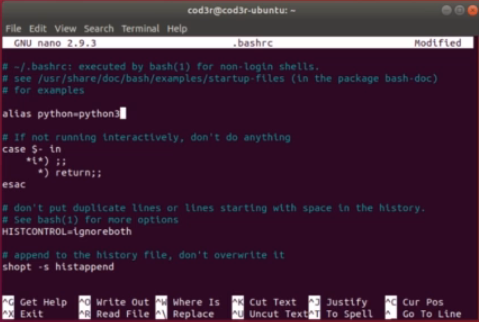
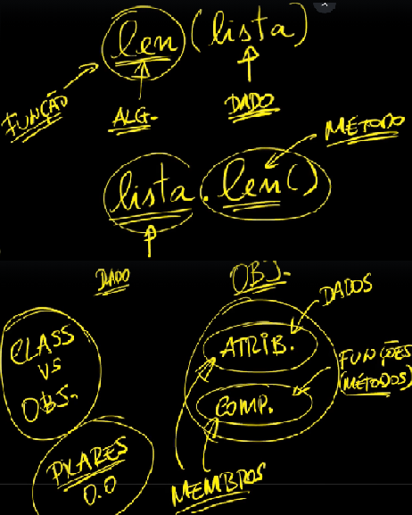
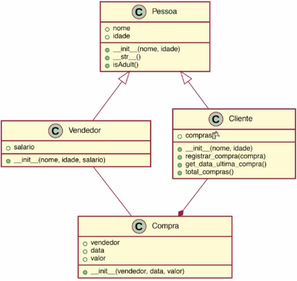

**Sumário**

[Retornar](https://github.com/lucasbergamo/Compass_UOL_data_engineering)

<details><summary><strong>Navegação</strong></summary>

- [Configuração do ambiente Python:](#configuração-do-ambiente-python)
  - [Windows: Instalação Python + Anaconda](#windows-instalação-python--anaconda)
  - [Linux: Instalação Python + Anaconda](#linux-instalação-python--anaconda)
- [Executado Código Python](#executado-código-python)
  - [Executado Código no interpretador](#executado-código-no-interpretador)
  - [Executando Código no Jupyter](#executando-código-no-jupyter)
  - [Executando Código no Vscode](#executando-código-no-vscode)
- [Fundamentos Python](#fundamentos-python)
  - [Primeiro Programa](#primeiro-programa)
  - [Tipos Básicos](#tipos-básicos)
  - [Variáveis](#variáveis)
  - [Comentários](#comentários)
  - [Operadores Aritméticos](#operadores-aritméticos)
    - [Desafio Operadores Aritméticos](#desafio-operadores-aritméticos)
  - [Operadores Relacionais](#operadores-relacionais)
  - [Operadores de Atribuição](#operadores-de-atribuição)
  - [Operadores Lógicos](#operadores-lógicos)
    - [Desafio Operadores Lógicos](#desafio-operadores-lógicos)
  - [Operadores Unários](#operadores-unários)
  - [Operadores Ternários](#operadores-ternários)
  - [Mais Operadores (Membro / Identidade)](#mais-operadores-membro--identidade)
  - [Builtins](#builtins)
  - [Conversão de Tipos](#conversão-de-tipos)
  - [Coerção Automática](#coerção-automática)
  - [Números](#números)
    - [Decimal](#decimal)
  - [Strings](#strings)
  - [Listas (arrays)](#listas-arrays)
  - [Tuplas](#tuplas)
  - [Dicionários](#dicionários)
  - [Conjuntos](#conjuntos)
  - [Interpolação](#interpolação)
- [Estruturas de Controle](#estruturas-de-controle)
  - [IF ELSE](#if-else)
  - [WHILE](#while)
  - [FOR](#for)
  - [BREAK / CONTINUE](#break--continue)
  - [SWITCH](#switch)
  - [Match - Case](#match---case)
    - [Simulando SWITCH #01](#simulando-switch-01)
    - [Simulando SWITCH #02](#simulando-switch-02)
  - [FOR SEM ELSE](#for-sem-else)
  - [Desafio Usando SET](#desafio-usando-set)
- [Manipulação de Arquivos](#manipulação-de-arquivos)
  - [Criando arquivo CSV](#criando-arquivo-csv)
  - [Leitura Básica](#leitura-básica)
  - [Leitura Stream](#leitura-stream)
  - [Try Finally](#try-finally)
  - [leitura com bloco WITH](#leitura-com-bloco-with)
  - [Escrevendo arquivo](#escrevendo-arquivo)
  - [Leitura com Módulo CSV](#leitura-com-módulo-csv)
  - [Desafio CSV do IBGE](#desafio-csv-do-ibge)
- [Comprehension](#comprehension)
  - [List Comprehension](#list-comprehension)
  - [Generators](#generators)
  - [Dict Comprehension](#dict-comprehension)
  - [Simulando Switch](#simulando-switch)
- [Funções](#funções)
  - [Tipos de Parâmetros](#tipos-de-parâmetros)
  - [Parâmetros Opcionais](#parâmetros-opcionais)
  - [Parâmetros Nomeados](#parâmetros-nomeados)
  - [Packing e Unpacking](#packing-e-unpacking)
  - [Callable](#callable)
  - [Parâmetros Opcionais \& (Un)Packing](#parâmetros-opcionais--unpacking)
  - [Callable com (Un)Packing](#callable-com-unpacking)
  - [Todos Parâmetros](#todos-parâmetros)
  - [Callable Object](#callable-object)
  - [Problema Paramêtro Padrão Mutável](#problema-paramêtro-padrão-mutável)
  - [Decorator](#decorator)
  - [Desafio Gerador HTML](#desafio-gerador-html)
- [Pacotes](#pacotes)
- [Programação Orientada a Objetos](#programação-orientada-a-objetos)
  - [Classe vs Objeto](#classe-vs-objeto)
  - [Pilares da Orientação ao Objeto](#pilares-da-orientação-ao-objeto)
  - [Membros](#membros)
  - [Constructor](#constructor)
  - [Desafio Classe Carro](#desafio-classe-carro)
  - [Classe tarefa](#classe-tarefa)
  - [Desafio POO](#desafio-poo)
- [Gerenciamento de Pacotes](#gerenciamento-de-pacotes)
- [Isolamento de  ambientes](#isolamento-de--ambientes)

</details>

---

## Configuração do ambiente Python:

### Windows: Instalação Python + Anaconda

1. Baixar [Python](https://www.python.org/downloads/).
   - Clicar para executar
   - Add python.exe to PATH

2. Baixar [Vscode](https://code.visualstudio.com/download).
   - baixar a extensão CodeRunner
   - baixar a extensão Python
   - Comando Ctrl + Alt + N, executar o código
   - Comando Ctrl + Alt + M, parar a execução do código
   - Criar um arquivo e selecionar a linguagem desejada para rodar código sem salvar, mantém na memória do computador, não precisa salvar para ver atulizações.

3. Baixar [Anaconda](https://www.anaconda.com/download).
   - Clicar para Executar
   - Add Anaconda3 to my PATH
   - Registrar anaconda3 as my default python
   - Abrir Anaconda Navigator

- Abrir o Jupyter Notebook (editor)
- Ir até onde deseja criar o arquivo e clicar em New (Python 3)
- Help - Keyboard Shortcuts

### Linux: Instalação Python + Anaconda

1. Python já vem instalado no Linux
2. ```$python3 --version```
3. ```sudo nano .bashrc```
4. na primeira opção colocar: ```alias python=python3```


   
   - ```$source .bashrc```, ele lê o arquivo novamente após as alterações
   - ```$python --version```
6. pip = Gerenciador de pacotes do python
   - ```$pip --version```
   - ```$sudo apt install python-pip```
   - ```$sudo apt-get isntall python3-pip```
   - ```$sudo nano .bashrc```
   - ```alias pip=pip3```
   - ```$source .bashrc```

instalar o pylint

- ```python -m pip install -U "pylint<2.06" --user```

---

## Executado Código Python


### Executado Código no interpretador

- Digitar na linha de comando
- ```$python```
- ```$help()```
- math
- para sair da página do math = q
- para sair do modo help = quit
- para sair do interpretador de python = Ctrl + D ou quit().
- ```$help(print)``` = vai abrir o help na página do print

### Executando Código no Jupyter

- após digitar o código:
- **alt + enter** = executa e cria uma nova linha abaixo
- se a cor estiver verde = escrita, azul = comando

   * no modo comando : 
     - **dd** = deleta a linha
     - **a** = cria uma nota antes 
     - **b** = cria uma nota depois
     - **l** = mostra linhas
     - **1** = muda para formato markdown com 1 asterisco
     - **n** = entra no markdown
     - **y** = sai do markdown

### Executando Código no Vscode

- ir em configurações do vscode e procurar **flake8enable**
- baixar a extensão do jupyter
- **#%%** = cria uma nova célula igual no jupyter notebook

---


## Fundamentos Python


### Primeiro Programa

Não utilizar **;** no final da sentença em python


- Não Funciona: 
``` 
print ('Primeiro programa')
      1
       + 2
```
- Funciona : 
```
print ('Primeiro programa')
      1 \
       + 2
```

### Tipos Básicos

```
print(True)
print(False)
print(1.2 + 1)
print('Você é ' + 3 * 'muito ' + 'Legal.')
print([1, 2, 3]) = lista
print({'nome': 'Pedro', 'idade': 22}) = dicionário
print(None)
```
True
False
2.2
Você é muito muito muito Legal.
[1,2,3]
{'nome': 'Pedro', 'idade': 22}
none

- numa lista você acessa os valores a partir do índice
- no dicionário você acessa os valores a partir de uma chave(nome único)

### Variáveis

```
a = 10
b = 5.2
print(a + b)
```
15.2

```
a = 'Agora eu sou uma string!'
b = 5.2

print (a)
print(a + b)
```

Agora eu sou uma string!
error (é preciso que o dev decida se vai fazer uma concatenação ou uma soma)


### Comentários

- No jupyter utilizar Ctrl + / para comentar a linha
- Comentários de múltiplas linhas igual no Markdown

```
# Minhas Variáveis
salario = 3450.45
despesas = 2456.2

print(salario - depesas)
print('Fim') #comentário aqui também vale!
```

994.25
Fim


### Operadores Aritméticos

```
print(2 + 3)
print(4 - 7)
print(2 * 5.3)
print(9.4 / 3)
print(9.4 // 3) #Mesmo operando um número float, o // retorna um núemro inteiro
print(2 ** 8)
print(10 % 3)
```
5
-3
10.6
3.1333333333333333
3.0
256
1

```
a = 12
b = a
print(a + b)
```
24

```
x = 7
y = 5

++x
y--
```

#### Desafio Operadores Aritméticos

- Qual o percentual da despesa em relação ao salário?

```
salario = 3450.45
despesas = 2456.2
porcentual_despesas = despesas * 100 // salario 
# ou (despesas // salario) * 100
print('As despesas equivalem:', porcentual_despesas,'% do Salário')

```

### Operadores Relacionais

- Booleans (True or False)

```
3 > 4 = False
4 >= 3 = False
1 < 2 = True
3 <= 1 = False
3 != 2 = True
3 == 3 = True
2 == '2' = False ( No javascript é verdadeiro, o == do pyhton se equivale a === do js)
```

### Operadores de Atribuição

- '=' atribui valor

```
a = 3
a = a + 7
print(a)

a += 5
print(a)

a -= 3
print(a)

a *= 2
print(a)

a /= 4
print(a)

a %= 4
print(a)

a **= 8
print(a)

a //= 127
print(a)
```
a = 10
a = 15
a = 12
a = 24
a = 6.0
a = 2.0
a = 256
a = 2.0
- Quando fazemos a += 5, é igual: a = a + 5

### Operadores Lógicos

- pode operar em cima de resultados, expressões e valores

**Tabela Verdade do AND**
- True and True = True
- True and False = False
- False and True = False
- False and False = False

```
7 != 3 and 2 > 3

```
False

**Tabela Verdade do OR**
- True or True = True
- True or False = True
- False or True = True
- False or False = False

**Tabela de verdade do XOR**
- True != True = False
- True != False = True
- False != True = True
- False != False = False

**Operador de Negação (Unário)**
- not True
- not False

- not 0 = vai dar True pois o 0 é falso
- not 1 = false utilizando qualquer outro número, pois apenas o 0 é falso
- not not 1 = True pois nega a negação
- not true = False
- not False = True

==Cuidado (Operadores Bit-a-Bit)==

- True & True
- False | True
- True ^ False

- And Bit-aBit
3 = 11
2 = 10
_ = 10
3 & 2

- Or Bit-a-Bit
3 = 11
2 = 10
_ = 11
3 | 2

- XOR Bit-a-Bit
3 = 11
2 = 10
_ = 01
3 ^ 2


- ==Um pouco da realidade== : O usuário bateu a meta ou não, se o saldo estiver positivo e o que sobrou no mês foi mais de 20% do salario, ele bateu a meta

```
saldo = 1000
salario = 4000
despesas = 2967

meta = saldo > 0 and salario - despesas >= 0.2 * salario
print(meta)
```
ou

```
saldo_positivo = saldo > 0
despesas_controladas = salario - despesas >= 0.2 * salario

meta = saldo_positivo and despesas_controladas
print(meta)
```

#### Desafio Operadores Lógicos

- Se a pessoa conseguir trabalhar 2 vez na semana, ela compra uma tv de 50 polegas
- Se a pessoa conseguir trabalhar apenas 1 dia na semana compra uma tv de 32 polegadas
- Se a pessoa comprar a tv de 32 ou 50 polegadas, ela toma sorvete
- se a pessoa não trabalhar na semana, ela não compra tv e logo não toma sorvete e permanece mais saudável.

terça = v ou f
quinta = v ou f

2 v = 50 polegadas
1 v = 32 polegadas

2 v e 1 v = tomar sorvete

f ou f = vai ter mais saúde, pois não vai tomar sorvete

**Meu código** :

- Errei na validação da compra da televisão ao utilizar OR, pois retornava true para tv_32 ao comprar a tv_50, o professor utiliza o != para negação entre elas

```
trabalho_terca = False
trabalho_quinta = True

tv_50 = trabalho_terca and trabalho_quinta

tv_32 = trabalho_terca or trabalho_quinta

tomar_sorvete = tv_50 or tv_32

nao_trabalhou = not tomar_sorvete

print(tv_50)
print (tv_32)
print(tomar_sorvete)
print(nao_trabalhou)
```

**Resolução Professor**

```
trabalho_terca = False
trabalho_quinta = True

tv_50 = trabalho_terca and trabalho_quinta
sorvete = trabalho_terca or trabalho_quinta
tv_32 = trabalho_terca != trabalho_quinta #xor
mais_saudavel = not sorvete

print("Tv50={} Tv32{} Sorvete={} Saudável ={}"
      .format(tv_50, tv_32, sorvete, mais_saudavel))
```

==Método Format==

"{0}, {2}, {1}".format(1, False, 'resultado') podemos utilizar a ordem de índices nas chaves para selecionar a informação contida nas aspas

retorna : 1, 'resultado', False

### Operadores Unários

- a++ = a += 1 ; 
- a-- = a -= 1;

```
a = 3
a += 1
a += 5
print(a)
```

### Operadores Ternários

```
esta_chovendo = True

print('Hoje estou com as roupas ' + ('secas.', 'molhadas.')[esta_chuvendo])
```

**Sendo True, seleciona a opção mais próxima da sentença [esta_chovendo]**

- ou

```
esta_chovendo = True

print('Hoje estou com as roupas ' + ('molhadas.'if esta_chuvendo else 'secas.'))
```
**Lê-se, se estou com as roupas molhadas, esta_chovendo, se não estão molhadas, estão secas.**


### Mais Operadores (Membro / Identidade)

- Operador de Membro

```
lista = [1, 2, 3, 'Ana', 'Carla]

2 in lista
'ana' not in lista
```
True
False

- Operador de Identidade

```
x = 3
y = x
z = 3

x is y
x is z
x is not z
```

True
True
False

```
lista_a = [1, 2, 3]
list_b = lista_a
lista_c = [1,2 ,3]

lista_a is lista_b
lista_b is lista_c
lista_a is not lista_c
```

True
False
True

### Builtins

- Representa o escopo Global do python
- se o nome ```__builtins__``` for sobrescrito, acarreta problemas no python
- ```dir(__builtins__)``` mostra tudo que está presente no builtins

- Type(1)

```
__builtins__.type('Fala Galera!')

__builtins__.print(10 / 3)

dir()
```

### Conversão de Tipos

- o explícito é melhor que o implícito, o python não tenta adivinhar nada

```
a = 2
b = '3'

print(type(a))
print(type(b))

print(a + int(b))
print(str(a) + b)
print(2 + int('2 legal'))
```
class 'int'
class 'str'

5
23
error

- o int() transforma o b de string para número
- o str() transforma o a de número para string

### Coerção Automática

- mesmo o resultado sendo inteiro, ele faz uma conversão automática para float

```
10 / 2
10 // 3
2 + True
2 + False
```

5.0
3
3
2


### Números

- dir(int)
- dir(float)

- Quando um inteiro(int) opera com um Float, sempre vai resultar em um Float

```
a = 5
b = 2.5

a / b
a + b
a * b

type(a)
type(b)
type(a-b)

b.is_integer()
5.0.is_integer()

int.__add__(2,3)
```

2.0
7.5
12.5

int
float
float

False
True

5

#### Decimal

```
1.1 + 2.2
Decimal(1.1) + Decimal(2.2)

from decimal import Decimal, getcontext
Decimal(1) / Decimal(7)

getcontext().prec = 4
Decimal(1) / Decimal(7)

Decimal.max(Decimal(1), Decimal(7))     -  retorna o maior valor


```

3.3000000000000003
3.300

'0.1428571428571428571428571429'

Decimal('0.1429')

Decimal('7')

### Strings

- a string tem todas suas letras indexadas, com o índice começando em zero
- A string é imutável, nunca será modificada, outra é criada ao formatar para uppercase, por exemplo.

```
dir(str)
nome = 'Lucas Bergamo'

nome
nome[0]
nome[0] = 'P'


'Dias D'Avila'
"Dias D'Avila" == 'Dias D\'Avila'       -  a \ funciona como um scaping
```

'Lucas Bergamo'
'S'
error

error
True


```
nome = "Clara Dias"
nome[0]
nome[6]
nome[-4] - a contagem começa do final com -1, o zero sempre será o primeiro caractere da string
nome[6:] - dois pontos indica a partir de onde deve começar, até o final
nome[-4:]
nome[:5]
nome[0:5]
nome[::-1] - Inverte a string
```
'Clara Dias'
'C'
'D'
'D'
'Dias'
'Dias'
'Clara'
'Clara'
'saiD aralC'

```
numeros = '1234567890'

numeros
numeros[::]
numeros[::2] - retorna os indices 0,2,4,6,8:'1234567890', começando no índice 0
numeros[1::2]

numeros[::-1]
numeros[::-2]
```
'1234567890'
'1234567890'
'13579'
'24680'

'0987654321'
'08642'


**in, not in, len, .lower, .upper, .split**

- in = contém
- not in = não contém
- len() = tamanho da str
- .lower = minúsculo
- .upper = maiúsculo
- .split = repartir  ou quebrar a str

```
frase = 'Python é uma linguagem excelente'

'py' in frase
'Py' in frase

'py' not in frase
'ing' in frase

len(frase)     -  retorna a quantidade de caracteres na str, lenght
frase.lower()    - Transforma a frase em letra minúscula
frase.upper()   - Transforma os índices em letra maiúscula
'py' in frase.lower()
frase = frase.upper() - agora a frase maiúscula foi atribuida a Str original


frase.split() - quebra a frase nos espaços
frase.split('a') - quebra a partir da letra a
frase.split('e') - quebra a partir da letra e
```

False
True

True
True

32
'python é uma linguagem excelente'
True

['Python', 'é', 'uma', 'linguagem', 'excelente']
['Python é um', ' lingu', 'gem excelente']
['Python é uma linguag', 'm ', 'xc', 'l', 'nt', '']

- [Métodos Mágicos](https://python-course.eu/oop/magic-methods.php)


### Listas (arrays)

- lista em python pode ser mutável, dinâmica e heterogênea
- append, remove, reverse. alteram a lista
- utilizar listas de forma homogênea

```
lista = []
type(lista)
dir(lista)
```
list

- Adicionar Elementos: ```lista.append(ana)```
- Verificar tamanho da lista: ```len(lista)```
- Remover item da lista: ```lista.remove(ana)```, remove o item e não o índice
- inverter ordem da lista ```lista.reverse()```
- Informa o index ou índice do item: ```lista.index()```


```
lista = [1, 5, 'Rebeca', 'Guilherme', 3.1415]

lista.index('Guilherme')
1 in lista
'Rebeca' in lista
'Pedro not in lista'
lista[-1]
lista[0]
```
3
True
True
True
3.1415
1

```
lista = ['Ana', 'Lia', 'Rui', 'Paulo', 'Dani']

lista[1:3]
lista[1:-1]
lista[1:]
lista[:-1]   - vai do indice 0 até o -1 sem incluir o -1
lista[:]
lista[::2]
lista[::-1]
del lista[2]
del lista[1:]
```

['Lia, 'Rui']
['Lia', 'Rui', 'Paulo']
['Lia', 'Rui', 'Paulo', 'Dani']
['Ana', 'Lia', 'Rui', 'Paulo']
['Ana', 'Lia', 'Rui', 'Paulo', 'Dani']
['Ana', 'Rui', 'Dani']
['Dani', 'Paulo', 'Rui', 'Lia', 'Ana']
['Ana', 'Lia', 'Paulo', 'Dani']
['Ana']

### Tuplas

- a tupla diferente da lista, não pode ser modificada
- mostra quantos elementos tem = ```cores.count('Azul')```

```
tupla = tuple()
tupla = ()

type(tupla)
tupla = ('Um',)
tupla[0]

cores = ('verde', 'amarelo', 'azul', 'branco')

cores.count('Azul')
```

tuple
'Um'

1

### Dicionários

- o dicionário é chave-valor
- utiliza par de chaves {}
- indexação feita por string
- .pop() = lê o valor e retira do dicionário

```
pessoa = {'nome': 'Prof(a). Ana', 'idade': 38, 'cursos': ['ingles', 'Portugues']}

type(pessoa)
len(pessoa)

pessoa.keys()
pessoa.values()
pessoa.items()
pessoa.get(idade)
pessoa.get('tags', []) - caso não encontre o 'get', ele retorna um colchete vazio
```
dict
3

dict_keys(['nome', 'idade', 'cursos'])
dict_values(['Prof(a). Ana', 38, ['ingles', 'Portugues']])
dict_items([('nome', 'Prof(a). Ana'), ('idade', 38), ('cursos', ['ingles', 'Portugues'])])
38

```
pessoa = {'nome': 'Prof.Alberto', 'idade': 43, 'cursos': ['react', 'python']}

pessoa['idade'] = 44     - atribui um novo valor para idade
pessoa['cursos'].append('Angular')

pessoa.pop('idade') -  pop lê o valor e já retira do dicionário
pessoa.update({'idade': 40, 'Sexo': 'M'})

pessoa

del pessoa['cursos'] - apaga cursos 
pessoa.clear()   - apaga tudo 
```

{'nome': 'Prof.Alberto', 'cursos': ['react', 'python', 'Angular'], 'idade': 40, 'Sexo': 'M'}


### Conjuntos

- o dicionário é chave-valor, conjunto é apenas valor
- 


```
a = {1, 2, 3}

type(a)

a = set('cod3r')
print(a)
a = set('coddd3r')
print(a)

print('3' in a, 4 not in a)
print(3 in a, 4 not in a)

{1, 2, 3} == {3, 2, 1, 3} - verdadeiro, pois nos conjuntos não importa a ordem e repetição é cancelada
```

set

{'r', 'd', 'c', 'o', '3'}
{'r', 'd', 'c', 'o', '3'}

True, True
False, True

True

```
c1 = {1, 2}
c2 = {2, 3}

c1.union(c2) - cria um teceiro conjunto com a união do c1 e c2
c1.intersection(c2) - itens comuns aos dois conjuntos
c1.update(c2) - atualiza o conjunto 1 a partir do c2

c2 <= c1  - c2 é subconjunto de c1? o c2 está contido no c1?
c1 => c2 - c1 é superconjunto do c2?

{1, 2, 3} - {2} - Só funciona a diferença - , mostra apenas os que diferem um do outro
{1, 2, 3} -= {3} - remove o 3
```

{1, 2, 3}
{2}
{1, 2, 3}

True
True

{1, 3}
{1, 2}

### Interpolação

- significa substituir valores dentro da string
- existem 4 tipos
- interpola os valores dentro de chaves {}


**mais antiga**

```
nome, idade = 'Ana', 30          - podemos criar mais de uma variável na mesma linha

print('Nome: %s Idade: %d' % (nome, idade)) - %s = substituir valors string , %d = substituir valores inteiros, %f = substituir valores float

print('Nome: %s Idade: %.2f' % (nome, idade)) - %.2f = arredonda pra 2 casas o float

```

Nome: Ana Idade: 30

Nome: Ana Idade: 30.99


**Versão recomendada pra Python < 3.6**

```
nome, idade = 'Ana', 30

print('Nome: {0} Idade: {1}'.format(nome, idade)) - no format o primeiro item é o indice 0
```

Nome: Ana Idade: 30


**Versão recomendada para Python >= 3.6**

```
nome, idade = 'Ana', 30

print(f'Nome: {nome} Idade: {idade} {2 ** 8 + 1}')

```

Nome: Ana Idade: 30 257


```
from string import Template

nome, idade = 'Ana', 30

s = Template('Nome: $n Idade: $i')

print(s.substitute(n=nome, i=idade))
```


## Estruturas de Controle


### IF ELSE

```
38 in range(18, 65)
18 in range(18, 65)
64 in range(18, 65)
65 in range(18, 65)
```
True
True
True
False

[Ex1](/Sprint-3/cursoPython/if_else1.py)
[Ex2](/Sprint-3/cursoPython/if_else2.py)


### WHILE

- utilizado em quantidade indeterminada de repetições

[Ex1](/Sprint-3/cursoPython/while_1.py)


### FOR

- utilizado em quantidade determinada de repetições

[Ex1](/Sprint-3/cursoPython/for_1.py)
[Ex2](/Sprint-3/cursoPython/for_2.py)
[Ex3](/Sprint-3/cursoPython/for_3.py)
[Ex4](/Sprint-3/cursoPython/for_4.py)


### BREAK / CONTINUE

```
for x in range(1, 11):
    if x % 2 == 0:
        continue
    print(x)
```

```
for x in range(1, 11):
    if x == 5:
        break
    print(x)
```

### SWITCH

[Ex1](/Sprint-3/cursoPython/switch_1.py)
[Ex2](/Sprint-3/cursoPython/switch_2.py)


### Match - Case

essa estrutura não existia na linguagem até a gravação do curso. 

No entanto, a partir da versão 3.10 do Python foi introduzida na linguagem uma nova estrutura de controle 

que tem o comportamento da estrutura switch: a estrutura match case

A sintaxe básica dessa estrutura é a seguinte:

**match valor:** 

```
    case <padrao_1>:
        <codigo_caso_padrao_1>
	  case <padrao_2>:
        <codigo_caso_padrao_2>
		case <padrao_3>:
        <codigo_caso_padrao_3>
    case _:
        <codigo_caso_nenhum_padrao_definido>
```
Essa estrutura irá comparar um valor com vários valores diferentes (a documentação trás o termo padrão) 

e executará o código correspondente ao valor da variável que está sendo usada na comparação. 

Para facilitar o entendimento, deixamos abaixo os exemplos das duas últimas aulas refeitos com a estrutura match case


#### Simulando SWITCH #01

```
def get_dia_semana(dia):
    match dia:
        case 1:
            return 'Domingo'
        case 2:
            return 'Segunda'
        case 3:
            return 'Terça'
        case 4:
            return 'Quarta'
        case 5:
            return 'Quinta'
        case 6:
            return 'Sexta'
        case 7:
            return 'Sabado'
        case _:
            return '** inválido **'
            
 
if __name__ == '__main__':
    for dia in range(0, 9):
        print(f'{dia}: {get_dia_semana(dia)}')
```

#### Simulando SWITCH #02

```
def get_tipo_dia(dia):
    match dia:
        case 2 | 3 | 4 | 5 | 6 :
            return 'Dia de semana'
        case 1 | 7:
            return 'Fim de semana'
        case _:
            return '** inválido **'
            
 
if __name__ == '__main__':
    for dia in range(0, 9):
        print(f'{dia}: {get_tipo_dia(dia)}')
```

### FOR SEM ELSE

[Ex1](/Sprint-3/cursoPython/for_sem_else.py)
[Ex2](/Sprint-3/cursoPython/for_com_else.py)


### Desafio Usando SET

[Ex1](/Sprint-3/cursoPython/desafio_set.py)


## Manipulação de Arquivos


### Criando arquivo CSV

[Ex1](/Sprint-3/cursoPython/manipulacaoArquivos/pessoas_1.csv)


### Leitura Básica

[Ex1](/Sprint-3/cursoPython/manipulacaoArquivos/io_v1_2.py)


### Leitura Stream

[Ex1](/Sprint-3/cursoPython/manipulacaoArquivos/io_v2_2.py)
[Ex1](/Sprint-3/cursoPython/manipulacaoArquivos/io_v3_3.py)


### Try Finally

[Ex1](/Sprint-3/cursoPython/manipulacaoArquivos/io_v4_4.py)


### leitura com bloco WITH

[Ex1](/Sprint-3/cursoPython/manipulacaoArquivos/io_v5_5.py)


### Escrevendo arquivo

[Ex1](/Sprint-3/cursoPython/manipulacaoArquivos/io_v6_6.py)

### Leitura com Módulo CSV

[Ex1](/Sprint-3/cursoPython/manipulacaoArquivos/io_csv.py)


### Desafio CSV do IBGE

[Ex1](/Sprint-3/cursoPython/manipulacaoArquivos/io_desafio_csv.py)


## Comprehension


### List Comprehension

[Ex1](/Sprint-3/cursoPython/list_comprehension/comprehension_v1.py)


### Generators

[Ex1](/Sprint-3/cursoPython/list_comprehension/comprehension_v2.py)


### Dict Comprehension

[Ex1](/Sprint-3/cursoPython/list_comprehension/comprehension_v2.py)


### Simulando Switch

[Ex1](/Sprint-3/cursoPython/list_comprehension/switch_3.py)


## Funções

### Tipos de Parâmetros

dois tipos de parâmetros:
- Posicional
- Nomeado

- *args -> gera uma tupla
- **kwargs - gera um dicionário

### Parâmetros Opcionais

[Ex1](/Sprint-3/cursoPython/funcoes/gerador_html_v1.py)

### Parâmetros Nomeados

[Ex1](/Sprint-3/cursoPython/funcoes/gerador_html_v2.py)


### Packing e Unpacking

[Ex1](/Sprint-3/cursoPython/funcoes/unpacking.py)
[Ex2](/Sprint-3/cursoPython/funcoes/gerador_html_v3.py)


### Callable

[Ex1](/Sprint-3/cursoPython/funcoes/prog_funcional_spoiler.py)


### Parâmetros Opcionais & (Un)Packing

[Ex1](/Sprint-3/cursoPython/funcoes/packing_nomeado.py)
[Ex2](/Sprint-3/cursoPython/funcoes/unpacking_nomeado.py)
[Ex3](/Sprint-3/cursoPython/funcoes/gerador_html_v5.py)


### Callable com (Un)Packing

[Ex1](/Sprint-3/cursoPython/funcoes/callable_packing.py)
[Ex2](/Sprint-3/cursoPython/funcoes/callable_packing_nomeado.py)

### Todos Parâmetros

[Ex1](/Sprint-3/cursoPython/funcoes/todos_parametros.py)


### Callable Object

[Ex1](/Sprint-3/cursoPython/funcoes/callable_object.py)


### Problema Paramêtro Padrão Mutável

[Ex1](/Sprint-3/cursoPython/funcoes/problema_arg_padrao_mutavel.py)


### Decorator

[Ex1](/Sprint-3/cursoPython/funcoes/decorator_1.py)


### Desafio Gerador HTML

[Ex1](/Sprint-3/cursoPython/funcoes/desafio_html.py)

## Pacotes

- [Função em outro pacote](/Sprint-3/cursoPython/pacotes/pacote_v1.py)
- [Momento de execução do código](/Sprint-3/cursoPython/pacotes/pacote_v2.py)
- [Módulo com mesmo nome](/Sprint-3/cursoPython/pacotes/pacote_v3.py)
- [Importação direta de funções](/Sprint-3/cursoPython/pacotes/pacote_v4.py)
- [Pacote Como Façade](/Sprint-3/cursoPython/pacotes/pacote_v5.py)
- [Desafio Pacote](/Sprint-3/cursoPython/pacotes/desafio_package.py)

## Programação Orientada a Objetos

- transformar demandas reais e abstrair para transformar em código.

- Objeto agrupa dados e comportamento

função = add(lista, item)
objeto = lista.add(item)



### Classe vs Objeto

- classe = molde, um unico molde pode criar n instâncias 
(estrutura de dados personalizados) no python tem alguns que ja vem como padrão(set, list, tuple, dict, int, str...)

- objeto = instância criada a partir do molde

exemplo: 

classe: dia, mês, ano
objeto: objetos terão três 'espaços' dia, mês e ano

class dia,mês, ano
objeto1 = 2, 3, 2020
objeto2 = 7, 8, 2022
objeto3 = 1, 6, 1999

### Pilares da Orientação ao Objeto

- Herança =  civic é um(a) carro, reuso de código
- Polimorfismo
- Encapsulamento
- Abstração

### Membros

[Ex1](./cursoPython/poo/data_v1.py)

### Constructor

- sempre que ver algo que termina com (), é uma função ou método
- só permite um construtor
- a partir do construtor é criado as instâncias do objeto

[Ex1](./cursoPython/poo/data_v2.py)

### Desafio Classe Carro

[Ex1](./cursoPython/poo/desafio_carro.py)


### Classe tarefa

[Classe tarefa](./cursoPython/poo/todo_v1.py)
[Classe Projeto](./cursoPython/poo/todo_v2.py)
[Método __iter__](./cursoPython/poo/todo_v3.py)
[Implementação do Vencimento](./cursoPython/poo/todo_v4.py)
[Herança](./cursoPython/poo/todo_v5.py)
[Métodos Privados](./cursoPython/poo/todo_v6.py)
[Sobrecarga de operador](./cursoPython/poo/todo_v7.py)
[Tratamento de exceções](./cursoPython/poo/todo_v8.py)

### Desafio POO

[Desafio](./cursoPython/poo/)




## Gerenciamento de Pacotes

[Ex1](./cursoPython/)

## Isolamento de  ambientes

[Ex1](./cursoPython/)
