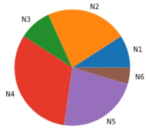

**Sumário**

[Retornar](https://github.com/lucasbergamo/Compass_UOL_data_engineering)

<details><summary><strong>Navegação</strong></summary>

- [Introdução](#introdução)
  - [Importância da estatística para Data Science](#importância-da-estatística-para-data-science)
  - [Introdução a estatística - História](#introdução-a-estatística---história)
  - [Python e seus projetos](#python-e-seus-projetos)
  - [Ambiente para aplicações](#ambiente-para-aplicações)
  - [Bibliotecas Python para análises estatísticas](#bibliotecas-python-para-análises-estatísticas)
- [Python - Visão Geral](#python---visão-geral)
  - [Import de bibliotecas](#import-de-bibliotecas)
  - [Tipos de variáveis](#tipos-de-variáveis)
  - [Operações matemáticas Python](#operações-matemáticas-python)
  - [Comparações e operações booleanas](#comparações-e-operações-booleanas)
  - [Condicionais em Python](#condicionais-em-python)
  - [Listas no Python](#listas-no-python)
  - [Tuplas no Python](#tuplas-no-python)
  - [Strings no Python](#strings-no-python)
  - [Dicionários no python](#dicionários-no-python)
  - [Conjuntos em Python](#conjuntos-em-python)
  - [Funções no Python](#funções-no-python)
  - [Loops com Python](#loops-com-python)
- [Fundamentos da estatística](#fundamentos-da-estatística)
  - [A ciência estatística](#a-ciência-estatística)
  - [Aleatoriedade](#aleatoriedade)
  - [População e amostra](#população-e-amostra)
  - [Medidas Observadas e variáveis](#medidas-observadas-e-variáveis)
  - [Obtendo amostras com Python](#obtendo-amostras-com-python)
- [Representações Gráficas](#representações-gráficas)
  - [Por que utilizar gráficos?](#por-que-utilizar-gráficos)
  - [Gráficos de Barras e Colunas](#gráficos-de-barras-e-colunas)
  - [Gráfico de Setores (Pizza)](#gráfico-de-setores-pizza)
  - [Gráficos de Linhas (Cronológicas)](#gráficos-de-linhas-cronológicas)
  - [Histogramas](#histogramas)
- [Introdução MTC](#introdução-mtc)
  - [Média aritmética](#média-aritmética)


</details>

## Introdução

**"In god we trust. All other, bring data".**

- A estatística é dividida em:
  - **Descritiva** = coleta, análise, representação, interpretação de dados
  - Probabilística = criar modelos para representar dados
  - Inferencial = através de amostrar cria referências do todo


- __Neste curso iremos aprender:__
  - A importância da estatística nos dias atuais
  - Como utilizar o Python na nuvem - grátis
  - Principais bibliotecas para trabalhar com estatísticas no Python
  - Fundamentos da estatística
  - Representações gráficas
  - Medidas de tendência central
  - Medidas de dispersão
  - Medidas de assimetria
  - Fazer boxplots
  - Aplicações em Data Science

### Importância da estatística para Data Science

* Advento do Big data
  - Big data
  - Internet das coisas - IoT
  - Criptomoedas


- Análise de dados
  - Dados precisam ser analisados e compreendidos para gerar valor.


* 4Vs do Big Data
  - Volume
  - Velocidade
  - Variedade
  - Veracidade


- Dados (metadados) => Informações => Conhecimentos => Sabedoria


### Introdução a estatística - História

* O uso da estatística surgiu no egito;
  
- A palavra estatística deriva da palavra latina status (estado);
  
* Primeiros estudos para compilação de **dados** e gráficos que descrevem **aspectos** do **estado**;
  
- Em **1662**, John Graunt publicou informações a cerca de nascimentos e mortes;
  
* As famílias os governos e a empresa se apoiavam nos dados estatísticos;
  
- Estatística é uma ciência da matemática aplicada que fornece métodos para **coletar, descrever, analisar, apresentar e interpretar** dados, para a utilização dos mesmos na tomada de **decisões**
  
* A estatística serve para :
  - Coletar
  - Apresentar
  - Interpretar (conjunto de dados)

- Curiosidade move os estudos estatísticos: Por quê?


O termo estatística possui mais de um sentido:
  - No **singular**: teoria estatística é o método no qual os dados são analisados;
  - No **Plural**: refere-se ás estatísticas descritivas que são medidas obtidas dos dados em estudo;

### Python e seus projetos

[Python Software Foundation](https://pypi.org);
- bibliotecas, projetos...


### Ambiente para aplicações

- iremos utilizar o [**google colab**](https://colab.research.google.com/) para trabalhar com python na nuvem;
- Ao digitar qualquer metódo no colab assim: ```?plt.plot()``` podemos verificar tudo que pode ser utilizado por esse método
- clicar em conectar;
- extensão .ipynb (igual ao jupyter notebook);
- tipo code e tipo text (markdown);

### Bibliotecas Python para análises estatísticas

- [**NumPy**](https://www.numpy.org/)
- [**RPy**](https://rpy.sourceforge.net/) conexão entre **python** e **R**
- [**Scipy**](https://www.scipy.org/) 
- [**PyChem**](https://pychem.sourceforge.net/)
- [**Pandas**](https://pandas.pydata.org/) semelhante ao excel usando python
- [**Matplotlib**](https://matplotlib.org/) 
- [**Seaborn**](https://seaborn.pydata.org/) geração de gráficos


## Python - Visão Geral

### Import de bibliotecas

- biblioteca math

```
import math

math.sqrt(25)
```

- importando apenas o sqrt(quadrado)
```
from math import sqrt

sqrt(9)
```

- importando vários metodos: sqrt, cos, log10
```
from math import sqrt, cos, log10

log10(5)
```

- importando Numpy

```
import numpy as np
# ao colocar np. e apertar tab, podemos ver tudo oq tem nessa biblioteca

np.array([23,4,6])
```

### Tipos de variáveis

- Função **Built-in** ja é carregada quando instalamos o python

```
type(2)
int
```

```
type(2.0)
float
```

```
type('python')
str
```

```
type(True)
bool
```

```
type(None)
NoneType
```

```
isinstance(2.0, int)
False

isinstance(2, int)
True

isinstance(4.0, (int, float, bool))
True
```

- Converter tipos de variáveis

```float(2)```
2.0

```int(7.9)```
7

```str(7.5)```
'7.5'

```bool(5)```
True

```bool(0) # sempre que o bool for 0 será false```
False

### Operações matemáticas Python

```5 + 3```
8

```9 - 5```
4

```7 * 8```
56

```2 ** 5```
32

```4 / 5```
0.8

```7 % 2 # se um número for % 2 e retornar 1 é impar```
1

```10 // 4 # retorna apenas a parte inteira (int)```
2

### Comparações e operações booleanas

```7 > 2```
True

```5 >= 2```
True

```6 != 8```
True

```5 != 5```
False

```5 != 5.0```
False

```5.1 != 5.0```
True

```4 > 2 and 3 < 9```
True

```9 > 10 and 3 < 9```
False

```9 > 10 or 3 < 9```
True

```not False```
True

```not 5! = 5```
True


### Condicionais em Python

```
x = 7

if x > 0:
    print('Verdadeiro')
```

```
x = 7

if x > 0:
    print('Verdadeiro')
else:
    print('Falso')
```

```
x = 7

if x > 0:
    print('Verdadeiro')
elif x == 0:
    print('Igual a zero')
elif x < 0:
    print('Menor que zero')
else:
    print('Indefinido')
```

```
x = 10

if x > 0:
    print('Maior que zero')
elif x == 0:
    print('Igual a zero')
else:
    print('Menor que zero')
```

### Listas no Python

```
lista = []

lista2 = list()

carros = ['Clio', 'Gol', 'Celta']
carros[0]

carros.append('Fox') # adiciona uma str na lista

carros.remove('Gol') # remove pelo nome

carros.pop(1) # remove pelo índice

len(carros) # retorna quantos objetos tem na lista

carros.count('Meriva') # faz a contagem de quantos 'meriva' possui na lista

carros.index('Gol') # mostra em que posição partindo do índice está o objeto
```

- Listas podem conter todos os tipos de objetos como: números, outras listas, dicionários, valores lógicos 

**Slicing**

```
carros = ['Clio', 'Gol', 'Celta', 'Fox']

carros[0:3] # pega do índice 0 até o 3( se quiser até o indice 3 tem que colocar 4)

carros[:3] # se não especificar, começa em 0

carros[-1] # pega o último valor
```

### Tuplas no Python

- Tuplas são listas imutáveis
- Podemos apenas utilizar Count e Index

```
lista = [2,3,4,5]

tu = tuple(lista) # transformando a lista em tupla
```

### Strings no Python

```
s = str(77) # transforma 77 em string '77'

t = 'O python é uma excelente linguagem de programação!'

len(t) # informa que a str possui 50 caracteres contando com espaçamentos

t[-6:]

t.upper() # transforma todos os caracteres em upper case

t.find('excelente') # diz que inicia pela índice 15

g = t.split(' ') # g agora é uma lista separando por espaço
```

### Dicionários no python

- lista = []
- tupla = ()
- dicionario = {} # usado para armazenar dados

* Dicionário serve para adicionar dados com chave/valor

```dic1 = {'A':1, 'B':2, 'C':3, 'D':4}```
{'A': 1, 'B': 2, 'C': 3, 'D': 4}

```dic2 = dict(A=1, B=2, C=77)```
{'A': 1, 'B': 2, 'C': 77}

```len(dic2)``` # chave / valor representa 1 elemento
3

```dic2.keys()```
dict_keys(['A', 'B', 'C'])

```dic2.values()```
dict_values([1, 2, 77])

### Conjuntos em Python

- Conjunto são uteis quando ja temos listas, tuplas
- E precisamos fazer operações de interseção, adição, diferença... entre elas

```lista = [1,2,3,4,5]```

```c = set(lista)``` # a lista foi transformada em conjuntos

```type(c)```
set

```c.add(55)```
{1, 2, 3, 4, 5, 55}

```c1 = set([1,2,3,4])``` # para criar um conjunto, precisamos delimitar com [] ou ()
{1, 2, 3, 4}

```c2 = set((1,2,88))```
{1, 2, 88}

```c1.intersection(c2)``` # elementos em comum entre esses dois conjuntos
{1, 2}

```c1.union(c2)```
{1, 2, 3, 4, 88}

```8 in c1```
False

```2 in c1```
True

### Funções no Python

```
def soma(a,b):
    return a+b

soma(5, 8)
```

```
def subtrair(a,b):
    sub = a - b
    return sub

subtrair(5,8)
```

```
def nomeIdade(nome, idade):
  return(f'O nome é: {nome}, e a idade é: {str(idade)}')
print(nomeIdade('Lucas', 26))

nomeIdade('maria', 20)
```

### Loops com Python

- Estruturas de repetição

```v = range(20)``` cria uma lista 

```
lista = [2, 4, 6, 8, 10]

for j in lista:
  print(j)
```

```
for i in range(1,10)
  print(i)
```

```
vv = range(5, 10)

for i in (vv)
  print(i)
```

```
g = [1, 5.6, 'Python']

for k in g:
  print(k)
```

```
k = 0

while k < 10:
  print(k)
  k = k + 1
#ou
  k += 1
```

## Fundamentos da estatística


### A ciência estatística


### Aleatoriedade

* Fenômenos aleatórios
  - Mundo VUCA (Volatile, Uncertain, Complex, Ambiguous)
  - Incertezas da vida
  - Muitos riscos
  - A natureza não é como pensava Albert Einstein ( Deus não joga dados com o universo)
  - Nossa intuição não lida adequadamente com as estatísticas
  - Se você respirar profundamente, há mais de 99% de chance de inalar uma molécula que tenha sido exalada no último suspiro de César
  - Nossa intuição não lida adequadamente com as estatísticas
  - Em classes de 25 alunos, há mais de 50% de chance de dois alunos terem a mesma data de aniversário

- Em ciência nada pode ser definitivamente provado, em tudo existe incertezas e riscos;
- Tudo que é ciência pertence ao ramo da certeza ( por isso pouca atenção é dada a incerteza) - Edgar Morin

### População e amostra

- Após a obtenção dos dados precisamos fazer duas perguntas:
  - Qual é a minha população?
  - Qual é a minha amostra?
* **POPULAÇÃO**: São todos os elementos - indivíduos, itens ou objetos - cuja as características estejam sendo estudadas.
* **CENSO**: é um conjunto de **caracteristicas** obtidas de todos os membros da população
* **AMOSTRA**: Ela é uma parte coletada a partir da população

Pesquisas eleitorais:
  - Examina uma amostra a partir disso infere informações a respeito da população

Linha de produção
  - Produção de lâmpadas

Nível de contaminação

- Como garantir que uma amostra represente o mais fiel possível a população?
  - Coleta mais aleatória possível

* Qual deve ser o tamanho mínimo da amostra?
  - Pelo menos 30 


### Medidas Observadas e variáveis

- Dados -> Informações -> Conhecimento

* dado != informação

- Dados: valores coletados através de observação ou medição.
* Informação: dados que são transformados em fatos relevantes e usados para um propósito específico

- Dados sem contexto não nos dizem nada!

* Produção de dados:
  
  - Dados Primários : 
    * Prós: Confiabilidade, Qualidade, Controle
    * Contras: Alto custo, Demanda tempo, Equipe grande
  
    * Coletados por quem faz a análise
    * Confiáveis
    * Possuem maior controle
  
  * Dados secundários :
    - Prós: Baixo custo, Rápido, Diversidade
    - Contra: Falta de controle, Dados inadequados, Fontes não confiáveis
   
    - Coletados por terceiros
    - Não confiáveis
    - Não possuem muito controle


**Observação:** é uma ocorrência de um item de dados específico que é gravada sobre uma unidade de dados

**Variável:** é a característica de interesse que é medida em cada elemento da amostra ou população. Seus valores variam de elemento para elemento. As variáveis podem ter valores numéricos ou não numéricos


### Obtendo amostras com Python

- Função Random
- também temos na biblioteca numpy

```import random```
```import numpy as np```


- Gerar um número aleatório entre 0 e 1

```
x = random.random()
print(x)
``` 

- Lista aleatória com 100 itens entre 0 e 1

```
x = []
for i in range(100):
  x.append(random.random())
```

- seed serve para reproduzir os mesmos valores
```random.seed(777)```


```
nomes = ['Lucas', 'Marcos', 'Thiago', 'Roberto', 'Bianca', 'Erika']

random.choice(nomes) # escolhe um item aleatório da lista

random.shuffle(nomes) # Muda aleatoriamente os índices da lista

random.sample(nomes, 3) # extrai 3 valores aleatórios da lista
```

```np.random()```

## Representações Gráficas

### Por que utilizar gráficos?

- Um gráfico vale por milhões/bilhões/trilhões de dados;
- Em geral, gráficos são melhores do que tabelas;
- Distribuição de frequência
- Gráficos servem para:
  - Representar fenômenos
  - Refletir padrões gerais
  - Facilita a interpretação
  - Resume Informações
* Gráficos evidenciam:
  - Tendências
  - Ocorrencias ocasionais (Outliers)
  - Valores mínimos e máximos
  - Ordens de grandezas dos fenômenos observados

- Todo gráfico:
  - Simplicidade
  - Clareza
  - Veracidade

* Perguntas que devemos fazer:
  * Realmente um gráfico é a melhor opção?
  * Qual é o público alvo?
  * Para que o gráfico?
  * Que tipo de gráfico devemos utilizar?
  * Como apresentar o gráfico?
  * Dimensões ideias de um gráfico

### Gráficos de Barras e Colunas

- Servem para variáveis **Qualitativas**
- Formado por retângulos horizontais de larguras (intensidade do atributo) iguais;
* Objetivos:
  - Comparar **grandezas** entre **categorias**;
  - **Categorias** com **designações** extensas;


* Gráficos de Colunas

- Servem para variáveis qualitativas
- Diferem dos de barras por te retângulos verticais
- Objetivos
  - Comparar grandezas entre categorias
  - Categorias com designações breves


**Gráficos de Barras/Colunas com Python**

- Utilizaremos duas bibliotecas: **matplotlib** e **seaborn**

```import matplotlib.pyplot as plt```
```import seaborn as sns```

```y = [2, 5, 2, 7, 5, 1]```
```x = ['N1', 'N2', 'N3', 'N4', 'N5', 'N6']```
```x2 = ['Variável Um', 'Variável Dois', 'Variável Três', 'Variável Quatro', 'Variável Cinco', 'Variável Seis']```

- Utilizando Matplotlib

```plt.barh(x2, y, color='b')``` # o H significa colunas horizontais, de cor Azul
```plt.xlabel('Variável eixo X', size=24)``` # adiciona um label no eixo x de tamanho24
```plt.ylabel('Variável eixo Y', size=20)``` # adiciona um label no eixo y de tamanho20


```plt.bar(x, y, color='g')``` # o bar default é vertical, escolhemos cor verde
```plt.xlabel('Variável eixo X', size=24)``` # adiciona um label no eixo x de tamanho24
```plt.ylabel('Variável eixo Y', size=20)``` # adiciona um label no eixo y de tamanho20


- Utilizando SeaBorn

```sns.barplot(x, y)```


### Gráfico de Setores (Pizza)

- Eles dividem um círculo em setores proporcionais às frequências observadas nas categorias

* Indicados:
  - Para comparar valor da categoria especifica com o total
  - N° de categorias pequenas ( 6, 7, 8)


**Gráfico de Setores (Pizza) em Python**

```import matplotlib.pyplot as plt```
```import seaborn as sns```

```y = [2, 5, 2, 7, 5, 1]```
```x = ['N1', 'N2', 'N3', 'N4', 'N5', 'N6']```
```x2 = ['Variável Um', 'Variável Dois', 'Variável Três', 'Variável Quatro', 'Variável Cinco', 'Variável Seis']```

correspondência entre tamanhos dos setores e categorias
```plt.pie(y, labels = x, radius = 2)``` 
```plt.show()``` # para mostrar o gráfico sem os textos da fragmentação



### Gráficos de Linhas (Cronológicas)

- Também conhecidos por gráficos de séries cronológicas
- Indicados para representar séries temporais


**Gráficos de Linhas (Cronológicas) em Python**

```import matplotlib.pyplot as plt```

```y = [6, 8, 3, 1, 9]```
```x1 = [1, 2, 3, 4, 5]```
```x = ['seg', 'ter', 'qua', 'qui', 'sex']```

- se colocarmos um '*' após o y, ele não mostra as linhas 
- e se colocar '*-g' ele determina os pontos * com linhas - na cor verde 'g'
- ```plt.plot(x1, y, '*-g')``` 

```plt.plot(x1, y)``` 
```plt.plot(x, y)``` 
```plt.xlabel('Eixo X', size=20)```
```plt.ylabel('Eixo Y', size=20)```
```plt.title('Título do gráfico', size=20)```
```plt.show()```


### Histogramas

- Colunas justapostas para representar distribuição de frequência em dados
- No eixo horizontal X temos os limites das classes de agrupamento (**bins**)
- o eixo Y no histograma sempre representará a frequência
- Geralmente são dados com medidas contínuas


**Histogramas com Python**

```import matplotlib.pyplot as plt```
```import numpy as np```

- randn = distribuição normal(**Gaussiana**)
```x = np.random.randn(1000)```

```plt.hist(x)```

```plt.xlabel('Eixo X')```
```plt.ylabel('Eixo Y')```


- bins deve ser escolhido para definir melhor a distribuição dos dados
  ```plt.hist(x, bins = 4)```

## Introdução MTC

- São chamados MTC por indicarem um ponto em torno do qual se concentram os dados
- Medicas descritivas para resumir dados;
- Se calculadas a partir de dados populacionais **Parâmetros**
- Se calculadas a partir de dados amostrais temos **Estimadores** ou **Estatísticas**

* Estatísticas (no plural)
  - Média
  - Moda
  - Mediana
  - Percentis

- Notação das estatísticas


### Média aritmética

- A média aritmética (x) é a soma de todos os valores observados da variável dividida pelo número total de observações
- Geometricamente é o centro de gravidade que representa o ponto de equilíbro de um conjunto de dados

