**Sumário**

[Retornar](https://github.com/lucasbergamo/Compass_UOL_data_engineering)

<strong>Navegação</strong>

- [Conceitos de nuvem e aws](#conceitos-de-nuvem-e-aws)
  - [O que é computação em nuvem?](#o-que-é-computação-em-nuvem)
  - [Por que os clientes escolhem a AWS](#por-que-os-clientes-escolhem-a-aws)
  - [Variedade de serviços](#variedade-de-serviços)
  - [Produtos e serviços da AWS](#produtos-e-serviços-da-aws)
  - [Biblioteca de soluções da AWS](#biblioteca-de-soluções-da-aws)
  - [Recursos do AWS Marketplace](#recursos-do-aws-marketplace)
  - [O que os clientes estão criando](#o-que-os-clientes-estão-criando)
  - [Facilitando a transformação digital](#facilitando-a-transformação-digital)
  - [Recursos para conceitos de nuvem e serviços da AWS](#recursos-para-conceitos-de-nuvem-e-serviços-da-aws)
- [Valor comercial da nuvem](#valor-comercial-da-nuvem)
  - [Valor comercial e benchmarking](#valor-comercial-e-benchmarking)
  - [AWS Cloud Value Framework: economia de custos](#aws-cloud-value-framework-economia-de-custos)
  - [AWS Cloud Value Framework: produtividade da equipe](#aws-cloud-value-framework-produtividade-da-equipe)
  - [AWS Cloud Value Framework: Resiliência operacional](#aws-cloud-value-framework-resiliência-operacional)
  - [AWS Cloud Value Framework: Agilidade empresarial](#aws-cloud-value-framework-agilidade-empresarial)
- [Como lidar com objeções á nuvem](#como-lidar-com-objeções-á-nuvem)
  - [Custo](#custo)
  - [Segurança, conformidade e privacidade](#segurança-conformidade-e-privacidade)
  - [Perda de controle ou visibilidade](#perda-de-controle-ou-visibilidade)
  - [Infraestrutura existente](#infraestrutura-existente)
  - [Déficit de habilidades](#déficit-de-habilidades)
  - [Atrelamento a fornecedor](#atrelamento-a-fornecedor)
  - [Sustentabilidade](#sustentabilidade)
- [Venda conjunta com a AWS](#venda-conjunta-com-a-aws)
  - [Fundamentos da venda conjunta](#fundamentos-da-venda-conjunta)
  - [Trabalhar com a AWS](#trabalhar-com-a-aws)
  - [Práticas recomendadas](#práticas-recomendadas)
  - [Programas de financiamento AWS Partner](#programas-de-financiamento-aws-partner)

## Conceitos de nuvem e aws

### O que é computação em nuvem?

**Computação em nuvem é a entrega de recursos de TI sob demanda pela Internet com pagamento conforme o uso.** Em vez de comprar e manter data centers e servidores físicos, você acessa os serviços de tecnologia conforme sua necessidade. 

**Graças a abstração da máquina física, podemos otimizar os dispositivos de modo muito mais fluido.**

**Tendências na evolução da computação**

O visual a seguir descreve as tendências na evolução da computação. Quanto mais alto você for nos níveis de abstração, mais o provedor de nuvem poderá agregar valor e descarregar atividades não estratégicas do consumidor. Para saber mais, escolha cada marcador numerado.

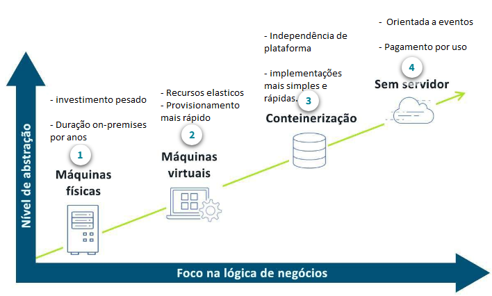

**Modelos de implantação de computação em nuvem**

Quando alguém fala na “nuvem” no contexto de uma nuvem compartilhada ou pública, está se referindo a uma infraestrutura sob demanda fornecida por uma empresa como a AWS. 

As organizações que usam a nuvem pública podem aproveitar outras soluções fornecidas por um provedor de serviços de nuvem, como uma ou qualquer combinação das seguintes opções:

- **Software como serviço (SaaS)**
- **Plataforma como serviço (PaaS)**
- **Infraestrutura como serviço (IaaS)**

**Padrões entre clientes da AWS**

Em relação ao caminho para a adoção da nuvem, cada cliente traça um roteiro diferente. Muitos fatores internos e externos influenciam o processo de tomada de decisões e determinam onde eles começam na jornada. 

As adoções nem sempre são lineares, e os clientes podem estar em qualquer uma das quatro fases diferentes (às vezes ao mesmo tempo). 

**Desenvolver e testar**

A primeira fase envolve o desenvolvimento de novos aplicativos ou migração de cargas de baixo risco para a nuvem. Essá é a "adoção inicial" da nuvem.

**Produção**

A próxima fase envolve a migração de cargas de trabalho de produção para a nuvem. Conforme as organizações avançam na jornada de adoção da nuvem, elas pode desenvolver e refinar sua política de governança.

**Essencial para a operação**

Cargas de trabalho essenciais para a operação são cargas de trabalho necessárias para o sucesso de qualquer negócio. Sejam processos front-end ou back-end, mover essas cargas de trabalho para a nuvem significa que uma organização está profundamente dedicada ao uso da nuvem.

**Integral**

Para alguns clientes, a última fase é a adoção completa da nuvem. Na adoção integral, os clientes procuram abandonar todo o débito técnico, deixar de lado os sistemas on-premises, acelerar a transformação digital e adotar uma estratégia de foco na nuvem.

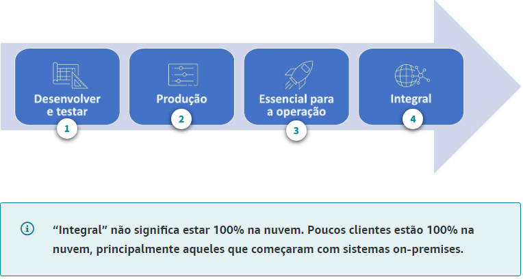

### Por que os clientes escolhem a AWS

Obsessão pelo cliente significa colocá-lo no centro e proporcionar a ele uma experiência do usuário atraente. Quando entendemos o problema do cliente e proporcionamos uma ótima experiência, isso gera valor para empresas.

A AWS oferece muitos benefícios aos clientes por meio de diversos serviços, metodologia de redução de custo e foco no crescimento e inovação do cliente. Todos esses benefícios são disponibilizados aos clientes em escala global, de modo que as empresas com presença internacional possam se beneficiar dos serviços da AWS.

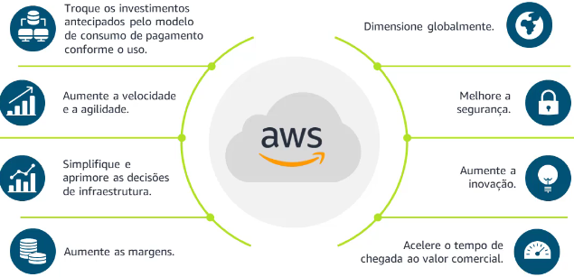

**O que diferencia a AWS**

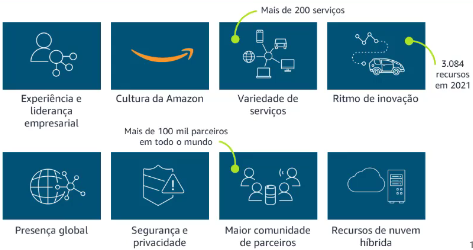

O Gartner é uma firma independente de pesquisa que produz relatórios anuais na forma de quadrantes mágicos, que avaliam o mercado em diferentes setores. Essa é uma forma imparcial de medir a posição da AWS no setor e identificar nossos concorrentes.

**Infraestrutura global altamente disponível**

As regiões AWS são compostas por várias Zonas de Disponibilidade para aumentar a disponibilidade, o dimensionamento e a tolerância a falhas. Aplicativos e dados são replicados em tempo real e consistentes nas diferentes zonas.

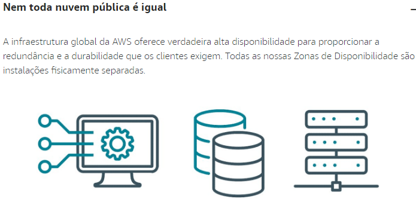

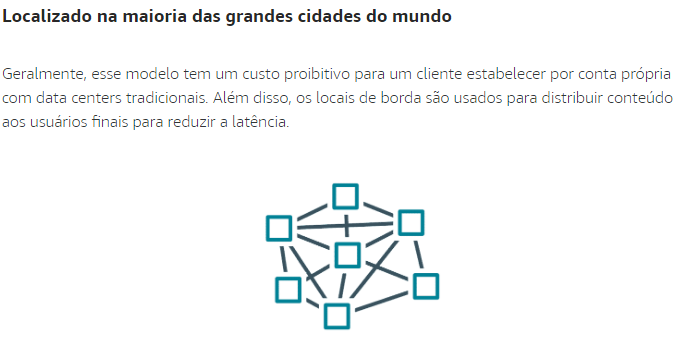

### Variedade de serviços

A variedade de serviços refere-se à ampla gama de produtos e serviços da AWS. A profundidade do serviço refere-se às muitas e crescentes funcionalidades desses serviços.

Um motivo que leva os clientes a migrar tão rapidamente para a nuvem é a vasta gama de serviços oferecidos, especialmente pela AWS. Cerca de 90% do que criamos é baseado no que é importante para clientes e parceiros segundo eles mesmos, e os demais 10% são invenções em nome do cliente. 

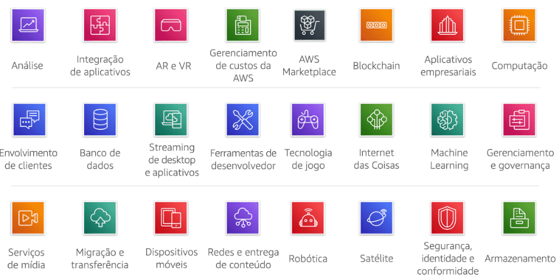

- A AWS oferece mais de 200 serviços, que variam de recursos de computação e armazenamento a Machine Learning (ML), análise e serviços de Internet das Coisas (IoT). A AWS continua inovando rapidamente, ampliando nossos serviços em nuvem para oferecer suporte a praticamente qualquer carga de trabalho de TI.

### Produtos e serviços da AWS

A AWS desacopla o cenário de TI, seja computação, armazenamento, redes ou outra coisa. O desacoplamento facilita a otimização. Use apenas o que você precisa quando precisar para **flexibilidade, elasticidade e agilidade, além de otimização de custo e desempenho.**

A AWS tem vários serviços de infraestrutura de componentes básicos nas categorias de computação, armazenamento, banco de dados, segurança, gerenciamento e redes. Os produtos e serviços da AWS oferecem aos clientes um alto grau de flexibilidade da arquitetura.  

- Amazon Elastic Compute cloud (EC2) = serviço mais fundamental da AWS

* Sob demanda = Pague pela capacidade computacional por segundo sem compromissos de longo prazo.
* Instâncias reservadas = Faça um compromisso de 1 ou 3 anos para um desconto significativo. Ideal para cargas de trabalho de estado fixo
* Instâncias spot = Capacidade sobressalente do EC2, melhor para cargas de trabalho tolerantes a falhas, flexíveis e stateless

* Cenário de TI desacoplado para maior **flexibilidade, elasticidade, agilidade e otimização de custos**

**Computação**

O Amazon Elastic Compute Cloud (Amazon EC2) oferece computação segura e dimensionável aos clientes. Os clientes podem escolher o processador, o armazenamento, a redes e o SO de acordo com as exigências da carga de trabalho. Entre os casos de uso estão aplicativos empresariais, computação de alto desempenho (HPC) e ML. Veja mais informações em https://aws.amazon.com/ec2/.

**Armazenamento**

Com o armazenamento na nuvem da AWS, os clientes acessam rapidamente o objeto, o arquivo ou o armazenamento em bloco, sem o complexo planejamento de capacidade. Entre os casos de uso comum estão **data lakes, backup e restauração, arquivo e desenvolvimento de aplicativos modernos**. Veja mais informações em https://aws.amazon.com/products/storage/.

**Banco de dados**

A AWS oferece bancos de dados com propósito específico para cargas de trabalho empresariais essenciais, que entregam aos clientes alta disponibilidade, confiabilidade e segurança. Os mecanismos de banco de dados incluem estes tipos: relacional, chave-valor, documentos, na memória, gráficos, séries temporais e livros contábeis. Veja mais informações em https://aws.amazon.com/free/database.

**Segurança**

Com os serviços de segurança da AWS, os clientes podem automatizar tarefas manuais como proteção de dados, gerenciamento de identidade e acesso, proteção de rede e aplicativo, resposta a incidentes e relatórios de conformidade. Veja mais informações em https://aws.amazon.com/security/.

**Gerenciamento**

Com os serviços de gerenciamento e governança da AWS, os clientes podem provisionar e operar seus ambientes para obter agilidade de negócios e controle de governança. Os casos de uso comuns incluem gerenciamento centralizado, nuvem, gerenciamento financeiro e conformidade automatizada. Para mais informações, consulte https://aws.amazon.com/products/management-and-governance/.

**Redes**

Com os serviços de redes e entrega de conteúdo da AWS, os clientes podem executar toda carga de trabalho em uma rede global, segura e confiável. Alguns casos de uso comum são: simplificar a execução de recursos, conectar infraestrutura híbrida e fornecer aplicativos mais rapidamente com redes Edge. Veja mais informações em https://aws.amazon.com/products/networking/.

- Os parceiros da AWS também oferecem soluções nessas categorias, algumas das quais disponíveis no AWS Marketplace.

### Biblioteca de soluções da AWS

As soluções da AWS são implementações de referência técnica verificadas que ajudam os clientes a solucionar problemas comuns e criar mais rapidamente. 

- Soluções por setor: 
    - Publicidade e marketing
    - Bens de consumo embalados
    - Varejo
    - Mídia e entretenimento

* Soluções por tecnologia
  - Análise
  - BlockChain
  - Computação e redes
  - Bancos de dados

Essas soluções ajudam os clientes a solucionar problemas comuns e criar mais rapidamente com a AWS. Todas as soluções da AWS são avaliadas por arquitetos da AWS e desenvolvidas para oferecer efetividade, confiabilidade, segurança e economia operacional. Cada solução contém arquitetura detalhada, um guia de implantação e instruções para implantação automatizada e manual. Quando aplicável, elas integram totalmente as ofertas de parceiros para oferecer a solução mais completa ao cliente. 

### Recursos do AWS Marketplace

O AWS Marketplace é um catálogo digital que ajuda os clientes a descobrir, adquirir, licenciar, provisionar e governar softwares de terceiros. Os clientes também podem conhecer e comprar serviços profissionais para configurar, implantar e gerenciar softwares de terceiros. 

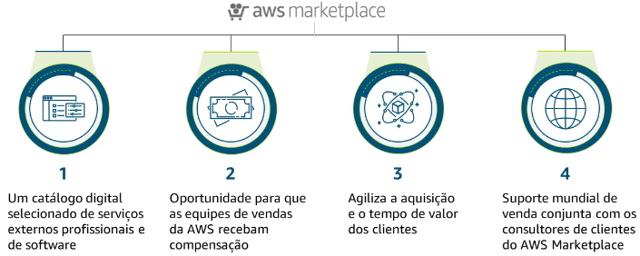

**Eficiência e preferências:**
  - Milhares de soluções, prontas para execução no console do Amazon EC2
  - Implantação rápida e simples

**Aquisições e aprovisionamento simplificados:**
  - Recursos que facilitam modelos de consumo flexível e contrato, como ofertas privadas, que veremos mais adiante
  - Simplificação da cobrança, com todas as compras do AWS Marketplace em uma conta consolidada

Outro benefício (para os clientes com um contrato do AWS Enterprise Discount Program) é que parte de todas as compras feitas no AWS Marketplace ajuda a reduzir o compromisso de gasto.

### O que os clientes estão criando

Ao conversar com clientes que estão migrando para a AWS, é importante entender bem os principais benefícios. Também é importante poder explicar nossos principais diferenciais, conhecer a infraestrutura global e saber o que os clientes estão criando. Para saber mais, expanda cada uma das seis categorias.

**Backup e restauração**

- Sem interrupções
- Ponto de partida simples
- Integrado a todos os principais fornecedores

Muitos clientes começam de maneira simples, com uma “migração apenas” do armazenamento. Eles procuram cargas de trabalho que não exijam uma migração iminente de aplicativos e iniciam sua jornada para a nuvem apenas movendo dados. A área de backup e restauração é um ponto de partida simples porque tem impacto relativamente baixo nos processos de TI atuais e quase todos os principais fornecedores de software de backup oferecem integração direta com o Amazon Simple Storage Service (Amazon S3). 

**Arquivo e conformidade**

- Fluxos de trabalho de Mídia
- Substituição de fitas
- Setor público, serviços financeiros, saúde e ciências biológicas

Os clientes com grandes arquivos de dados para retenção de longo prazo ou conformidade regulatória também estão migrando rapidamente para a AWS, pois sabem que a infraestrutura de fitas on-premises é cara e não é confiável. Ao migrar esses dados para a AWS, eles economizam muito dinheiro e têm acesso aos dados quando necessário, graças à constante validação e verificação de fixação que realizamos.

**Diretórios iniciais**

- Simples de mover
- Menos sucetível a latência
- Redução significativa do custo

Os diretórios iniciais são outra migração de armazenamento que traz importantes reduções de custo com impacto mínimo sobre os processos. O gerenciamento dos servidores de arquivos e dos sistemas de armazenamento conectado a rede (NAS) que atuam como diretórios iniciais gera custos administrativos e complexidade. O Amazon FSx oferece um sistema de arquivo Windows nativo, totalmente gerenciado, para os clientes compartilharem os diretórios iniciais com os usuários finais.

**Data lakes**

- Diversas ferramentas de analytics
- Base para inteligência artificial (IA) e machine learning (ML)
- Criado para dados de streaming
- Visualização de dados

Os dados são tão valiosos quanto as informações que seus clientes podem obter deles. Com os data lakes, eles podem usar serviços nativos da AWS ou de parceiros para executar análises de Big Data, inteligência artificial (IA), ML, HPC e processamento de mídia, a fim de gerar informações com conjuntos de dados não estruturados. O data lake pode servir como um repositório central de dados, independentemente de origem ou formato. Com ele, os clientes podem eliminar os silos de dados, que inerentemente podem obscurecer os dados e limitar seu valor.

**Aplicativos modernos**

- Armazenamento persistente para contêineres
- Sem servidor

Com a AWS e nossos parceiros, você decide a forma e o ritmo da migração dos aplicativos. Por exemplo, você pode escolher uma migração mais conservadora, com pouca ou nenhuma mudança no aplicativo, chamada de re-hospedagem ou lift-and-shift. Ou pode escolher uma migração muito mais transformadora para alcançar todo o potencial da nuvem. Isso é chamado de refatorar ou refazer arquitetura. Quanto mais modernizar com a AWS, mais você vai reduzir custos, adquirir eficiência, anular o débito técnico, melhorar a agilidade e a automação e liberar recursos para a inovação.

**Aplicativos essenciais para os negócios**

- Integrado aos principais fornecedores
- Infraestrutura totalmente gerenciada
- Migrações lift-and-shift

Um dos conjuntos mais comuns de cargas de trabalho que os clientes querem trazer para a AWS são os aplicativos essenciais para os negócios. Por exemplo, soluções de planejamento de recursos empresariais (ERP), bancos de dados e sistemas de gerenciamento de conteúdo (CMS) para sites. Geralmente, eles querem apenas fazer lift-and-shift dos aplicativos para a nuvem sem grandes alterações imediatas. A AWS oferece vários serviços para possibilitar essas migrações lift-and-shift e ajudar os clientes a economizar no processo.

### Facilitando a transformação digital

**Modernização de aplicativos em geral**

Os clientes estão passando por uma grande mudança, uma evolução da arquitetura. Eles estão mudando de um aplicativo monolítico para microsserviços menores e independentes. Os microsserviços são serviços mínimos de função implantados separadamente, mas podem interagir juntos para alcançar um caso de uso mais amplo. Esses aplicativos se tornam mais simples de criar e manter, pois são menores e mais gerenciáveis. 

* Quando dividimos um sistema em partes menores, podemos fazer atividades complexas em grande escala.

Algumas limitações dos aplicativos monolíticos:
- Dimensionamento difícil
- Incapacidade de lidar com falhas de componentes
- Processo de implantação lento
- Opções limitadas

A AWS oferece uma plataforma completa para microsserviços. Ela oferece as peças fundamentais para auxiliar no desenvolvimento de microsserviços com serviços de computação, armazenamento, banco de dados, redes, sistema de mensagens, registro e monitoramento e DevOps.

**Qualquer aplicativo em qualquer escala**

Seja qual for a agência, a organização ou a instituição, os clientes querem ser mais ágeis para inovar e reagir às mudanças mais rapidamente. Os aplicativos necessários nas organizações de hoje são muito diferentes daqueles do passado. Os clientes precisam dimensionar rapidamente para possivelmente milhões de usuários, ter disponibilidade global, gerenciar petabytes (ou exabytes) de dados e responder em milissegundos. Eles são chamados de aplicativos modernos e podem ser construídos por clientes ou adquiridos por meio de parceiros. Veja os benefícios comerciais e as características dos aplicativos modernos na tabela abaixo. 

__Benefícios comerciais:__
- Melhore o retorno do investimento e reduza o custo total de propriedade
- Aumenta a eficiência dos desenvolvedores
- Aumenta a agilidade empresarial

__Características dos aplicativos modernos:__
- Dimensionamento para milhões de usuários
- Disponibilidade global
- Responde em milissegundos, Lida com petabytes de dados

**Transformação digital: além da infraestrutura**

Um exemplo da transformação digital em ação é a maneira como ML está trazendo melhores experiências para os clientes, operações comerciais mais eficientes e decisões mais rápidas e precisas. 

Com o aumento do poder computacional e a proliferação dos dados, o ML deixou de ser algo secundário para se tornar o principal diferencial de empresas e organizações em vários setores. Segundo previsão do Gartner, o valor comercial derivado da IA deve alcançar USD 3,9 trilhões em 2022. 

A IA e o ML oferecem valor aos clientes em várias Linhas de Negócios. Conversem com seus clientes para descobrir como o ML pode ajudá-los a alcançar objetivos comerciais.

- 89% Dos projetos de deep learning na nuvem são executados na AWS.
- 85% Dos projetos do TensorFlow na nuvem são executados na AWS.
- Centenas De algoritmos e modelos estão no AWS Marketplace.
- Até 10 vezes De aumento na produtividade dos cientistas de dados, em estimativa.

### Recursos para conceitos de nuvem e serviços da AWS

Esta seção fornece uma lista de recursos que você pode usar para aprofundar seu conhecimento dos conceitos apresentados neste módulo.

ARTIGOS/DOCUMENTOS:

- Tipos de computação em nuvem: https://aws.amazon.com/types-of-cloud-computing/
- Estudos de caso de soluções da AWS: https://aws.amazon.com/solutions/case-studies/engie/
- Estudos de caso de soluções da AWS-SNCF: https://aws.amazon.com/solutions/case-studies/SNCF/
- Relatório Gartner 2021: https://aws.amazon.com/resources/analyst-reports/gartner-mq-cips-2021

## Valor comercial da nuvem

### Valor comercial e benchmarking

**O que é valor comercial?**

O conceito de valor comercial ajuda a determinar a integridade e o bem-estar de um negócio no longo prazo, incluindo, mas não se limitando ao seu valor econômico. Pode aparecer como custos reduzidos, recursos liberados, tempo de inatividade reduzido e tomada de decisão aprimorada. O AWS Cloud Value Framework fornece orientação sobre como fazer isso e mostra as diferentes áreas de valor comercial que os clientes perceberam ao migrar para a AWS.  

**Cloud Value Framework**

O AWS Cloud Economics desenvolveu o Cloud Value Framework como uma estrutura conceitual destinada a criar um caso de negócio abrangente para a adoção da nuvem e ajuda a articular o valor da adoção da nuvem. Ele faz isso medindo e rastreando o progresso dos clientes que migraram para a AWS em relação a quatro pilares principais de valor:

- _Economia de custo_
- _Produtividade da equipe_
- _Resiliência operacional_
- _Agilidade empresarial_

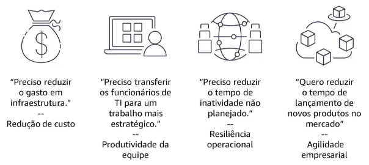

A maioria dos clientes começa sua jornada para a nuvem com foco na economia de custos. No entanto, eles normalmente veem os benefícios mais a longo prazo nos outros pilares. Neste módulo, aprofundamos cada um dos quatro pilares e como eles contribuem para o valor da nuvem. 

__"O valor comercial é entender o que impulsiona a adoção da nuvem, por que isso é importante para os clientes e os resultados tangíveis que as empresas podem alcançar."__

**O que são testes comparativos de valor?**

Uma maneira de quantificar uma projeção de valor comercial de forma eficiente é por meio do benchmarking de valor. O benchmarking nos ajuda a informar os clientes sobre o que seus colegas estão fazendo de maneira objetiva e orientada por dados. O benchmarking quantifica os resultados reais do cliente por meio de:

- Estudos de pesquisa encomendados em grandes populações de clientes da AWS
- Entrevistas deep dive e pesquisas individualizadas com clientes após a migração

### AWS Cloud Value Framework: economia de custos

**Economia de custo**

Conforme avançam na jornada para a nuvem, os clientes costumam pensar na redução de custos de duas maneiras:

- Manter ou reduzir o gasto total com a AWS, independentemente do uso
- Deixar que os custos aumentem em resposta ao aumento da demanda

* O primeiro passo é reduzir o grande custo físico de on-premises e reduzir o custo variável

- Observação: o primeiro ano não mostra uma redução porque é a linha de base para medir os anos posteriores.

- As organizações veem a economia de custos como reduções nos gastos com TI e gastos com infraestrutura. As reduções de custos podem continuar à medida que os clientes migram para serviços adicionais da nuvem AWS.

Com o tempo, a nuvem AWS oferece redução de custos por meio de otimização adicional.

### AWS Cloud Value Framework: produtividade da equipe

**Produtividade da equipe**

A produtividade do pessoal é a melhoria da eficiência por função numa base tarefa a tarefa. Isso significa tornar a equipe mais produtiva, reduzindo ou eliminando o tempo gasto em tarefas desnecessárias na nuvem. 

- Menos tempo é gasto em tarefas táticas.
- Mais tempo é gasto em tarefas estratégicas.

Após a migração para a AWS, as organizações obtêm maior produtividade da equipe em muitas áreas da empresa, incluindo capacidade de gerenciamento administrativo, foco no trabalho estratégico e capacidade de se concentrar no desenvolvimento de novos recursos.

Vejamos um exemplo para um administrador de servidor. As tarefas que um administrador de servidor realiza com hardware on-premises. Após a migração para a AWS, tarefas como reparo de hardware e planejamento de servidor podem ser reduzidas ou eliminadas totalmente, o que libera capacidade para que a equipe se dedique a trabalhos mais estratégicos. Neste exemplo, estamos vendo um subconjunto das tarefas que um administrador de servidor realizaria. As responsabilidades dos administradores de servidor variam de acordo com a organização. Além das tarefas, indicamos também a redução comum de tempo gasto na tarefa, com base nos resultados de outros clientes da AWS.

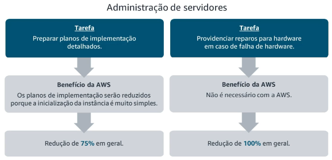

### AWS Cloud Value Framework: Resiliência operacional

**Resiliência operacional**

O valor comercial que a nuvem gera na forma de resiliência inclui:__maior disponibilidade do sistema, latência reduzida, maior alcance de SLA e melhor segurança.__ 

* Para as empresas, isso significa __aumento da disponibilidade, melhoria da segurança e redução das interrupções não planejadas.__ Essas variáveis têm implicações financeiras significativas, mas pode ser difícil quantificá-las. Eles também exigem alguma compreensão do custo de paralisações não planejadas e interrupções de serviço.

* A resiliência operacional é importante porque o custo do tempo de inatividade e das violações de segurança pode ser alto, conforme mostrado no gráfico. Analistas, como a IDC, dizem que interrupções críticas de aplicativos podem ter um impacto de bilhões de dólares nas organizações anualmente. Esses números destacam a importância de criar conscientização do cliente. 

### AWS Cloud Value Framework: Agilidade empresarial

**Agilidade empresarial**

Agilidade refere-se à capacidade de responder de forma rápida e eficaz a mudanças nas condições de negócios ou eventos de negócios inovadores. Ter sucesso em um setor ou mercado digitalmente competitivo depende muito da agilidade no desenvolvimento de produtos. 

A agilidade empresarial permite mais experimentação, o que aumenta o ritmo da inovação. Conforme aumenta a inovação, diminui o risco de falhas de alto custo em estágios posteriores. 

Aqui estão alguns benefícios adicionais da agilidade nos negócios:

- Simplifique o design de requisitos usando soluções operacionais integradas (por exemplo, scaling e segurança). Forneça produtos nativos da nuvem usando centenas de soluções da AWS e de terceiros.
- Aumente a velocidade de criação e teste por meio de integração contínua e pipelines de entrega. Reduza o custo da experimentação ativando ou desligando serviços rapidamente.
- Reduza o custo de manutenção e simplifique as operações com a AWS fornecendo serviços de infraestrutura de TI e opções de serviços gerenciados da AWS ou de terceiros.
- Elimine o tempo de espera de implantação com desenvolvimento automatizado de aplicativos e batches de implantação menores.

## Como lidar com objeções á nuvem

**Objeções à nuvem**

Quando você trabalha com clientes, geralmente encontra objeções que eles desejam abordar de uma maneira que construa confiança e conscientização. 

1. _Custo_
2. _Segurança, conformidade e privacidade_
3. _Perda de controle ou visibilidade_
4. _Infraestrutura Existente_
5. _Déficit de habilidades_
6. _Atrelamento a fornecedor_
7. _Sustentabilidade_

_"Para oferecer a solução apropriada ao seu cliente, é essencial entender os desafios e as preocupações subjacentes."_

### Custo

**Otimização de custos da AWS**

- _“A nuvem é muito cara”_

- _"Não podemos arcar com o custo da migração para a nuvem"_

Temos ferramentas e metodologias para ajudar a criar um caso de negócio e projetar a redução de custos da migração para a AWS. A mudança para a nuvem oferece benefícios adicionais que também podem ajudar a aumentar as margens ao mesmo tempo em que agrega valor comercial além de meras considerações financeiras. Por exemplo, produtividade da equipe, resiliência operacional e agilidade empresarial.

**Maneiras de otimizar para economizar dinheiro dos clientes**

1. **Escolher o modelo certo de preços**

- A AWS oferece opções de pagamento conforme o uso para mais de 200 serviços em nuvem. Os clientes podem economizar quando se comprometem com um serviço ou categoria de serviço da AWS por períodos de um ou três anos.
- Isso é chamado de _Saving Plans_, que oferece economia de custos quando o cliente se compromete com o uso específic(USD por hora). Os clientes recebem descontos baseados em volume á medida que o uso aumenta.

2. **Combinar a capacidade com a demanda**

- A AWS está expandindo seus serviços para apoiar basicamente qualquer tipo de carga de trabalho na nuvem. Ela conta com mais de 200 serviços repletos de recursos. Além da ampla variedade de serviços, a AWS possui funcionalidade profunda em cada um, oferecendo aos clientes os serviços certos para as cargas de trabalho certas.

3. **Implementar processos para identificar desperdício de recursos**

- No passado, as organizações tinham de escolher entre inovar mais rápido e manter o controle sobre os custos. A AWS oferece vários serviços de gerenciamento e governança, de modo que os clientes não precisam escolher entre inovação e controle: eles podem ter ambos. Isso inclui serviços como o Amazon _CloudWatch_, que oferece informações práticas aos clientes para otimizar o uso de recursos.

__"O clientes estão migrando para uma abordagem de nuvem híbrida para complementar sua presença atual em data centers. Isso os ajuda a crescer e a pagar apenas pelos recursos usados, sem pagar pela capacidade máxima. Também existem programas de recompra de hardware e incentivos financeiros para compensar o custo da migração para a AWS."__

### Segurança, conformidade e privacidade

- _“Vamos manter a privacidade dos dados?”_

Em relação à segurança dos dados, a AWS foi projetada para ser um dos ambientes de computação em nuvem mais flexíveis e seguros atualmente disponíveis. 

A infraestrutura central da AWS foi criada para satisfazer aos requisitos de segurança militares, de bancos globais e de outras organizações que lidam com informações altamente protegidas. 

- **Ferramentas de segurança na nuvem:** a AWS tem mais de 500 serviços e recursos de segurança, conformidade e governança. 
- **Padrões e certificações de conformidade:** a AWS é compatível com 98 padrões de segurança e certificações de conformidade. 
- **Criptografia de dados:** todos os 117 serviços da AWS que armazenam dados do cliente oferecem o recurso de criptografia. 

* Na AWS, a segurança é a nossa principal prioridade.
* O procedimento de segurança é maior do que em ambientes legados.
* Os clientes herdam todos os benefícios da nossa experiência.
* Nossa segurança é validada com os mais rigorosos frameworks de garantia externos.

Algumas das organizações mais preocupadas com segurança, sejam agências governamentais públicas ou entidades privadas, escolhem a AWS para melhorar seu procedimento de segurança. Por exemplo, setores de saúde, bancos, legal e farmacêutico. 

Os clientes decidem onde armazenar os dados e quem tem acesso a eles. Como a AWS cria e opera as próprias regiões, os clientes podem usar todos os serviços da AWS para processar os dados pessoais armazenados neles em suas contas da AWS, em conformidade com regulamentos como RGPD.

**Criptografia**

Os clientes da AWS podem criptografar seu conteúdo como parte de um processo de segurança padronizado para conteúdo altamente sigiloso. A AWS oferece ferramentas para os clientes criptografarem os dados em movimento ou em repouso, e eles podem escolher várias soluções de segurança externas compatíveis. O conteúdo criptografado não tem utilidade sem as chaves de descriptografia aplicáveis.

**Agências governamentais**

Uma indicação do nosso compromisso em termos de segurança é a grande quantidade de agências governamentais, forças armadas, bancos internacionais e outros setores altamente regulados que usam nossos serviços. 

__Lei de Esclarecimento do Uso Legítimo de Dados no Exterior (CLOUD)__

- Fornece um mecanismo limitado para agências de aplicação da lei dos EUA ao solicitar dados
- Cria proteções adicionais para conteúdo na nuvem
- Não afeta os serviços da AWS ou como operamos nossos negócios

Para mais informações, visite https://aws.amazon.com/compliance/cloud-act/.

__Regulamento Geral de Proteção de Dados (RGPD)__

- Uma lei europeia de privacidade
- Alinha as leis de proteção de dados em toda a União Europeia (UE)
- Aplica-se a todas as organizações estabelecidas na UE e a qualquer organização que processe dados pessoais de indivíduos da UE

Para mais informações, consulte https://aws.amazon.com/compliance/gdpr-center/.

**Modelo de responsabilidade compartilhada**

Escolher o provedor de nuvem mais seguro não traz segurança e conformidade automaticamente. Segurança e conformidade são responsabilidades compartilhadas. 

**A AWS é responsável pela segurança da nuvem**, o que significa que é responsável pelas medidas de segurança implementadas e operadas. A AWS é responsável pela proteção da infraestrutura global que executa todos os serviços oferecidos na nuvem AWS. Essa é nossa prioridade número um. A AWS também é responsável pelas configurações de segurança de seus produtos de serviços gerenciados. 

**Os clientes são responsáveis pela segurança na nuvem**, ou seja, mantêm o controle da segurança que implementam para proteger seu próprio conteúdo, plataforma, aplicativos, sistemas e redes, da mesma maneira que eles fariam em um data center local. A responsabilidade do cliente será determinada pelo AWS Cloud Services selecionados por ele.

### Perda de controle ou visibilidade

- _“Como vocês impedem a exposição acidental de dados sigilosos?”_

**Visibilidade, governança e controle**

A perda de controle não é apenas uma questão de segurança. Ela também está relacionada à aparente perda de visibilidade, porque o cliente não pode ver nem tocar na infraestrutura. 

Os clientes da nuvem têm mais visibilidade e controle do que nunca, com ferramentas centralizadas de monitoramento e governança como **AWS Cost Explorer, AWS Security Hub, Amazon CloudWatch, AWS Config e AWS Organizations**. É possível aplicar até 50 rótulos a cada servidor. Esses rótulos alimentam painéis centralizados para visualização e controle. Por exemplo, agora cada desenvolvedor pode ver diretamente como suas decisões de design afetam o faturamento.

- Digamos que você tenha um cliente preocupado com a exposição de dados sigilosos ao usar buckets do S3:

__Comece com o compromisso global__

A AWS oferece diversos recursos e serviços que ajudam a evitar erros de configuração. Com o **AWS CloudTrail**, os clientes podem registrar, monitorar continuamente e reter a atividade da conta em toda a sua infraestrutura da AWS. 

Isso simplifica a análise de segurança, o rastreamento de alterações de recursos e a solução de problemas. 

__Como o compromisso é cumprido__

O serviço de segurança **Amazon Macie** usa Machine Learning para ajudar os clientes a evitar a perda de dados por meio da automação da descoberta, da classificação e da proteção de dados sigilosos na AWS. O serviço totalmente gerenciado procura continuamente anomalias na atividade de acesso aos dados.

Ele gera alertas detalhados quando identifica riscos de acesso não autorizado ou vazamentos de dados acidentais, como dados sigilosos disponibilizados acidentalmente por um cliente para disponibilidade externa.

- A AWS e nossos parceiros trabalhamos com os clientes para entender suas necessidades de proteção de dados e oferecer um amplo conjunto de serviços e ferramentas. Oferecemos medidas técnicas, operacionais e contratuais necessárias para proteger os dados do cliente. 

- Com a AWS, os clientes gerenciam os controles de privacidade de seus dados, controlam como os dados são usados, quem tem acesso a eles e como são criptografados. Sustentamos esses recursos com um ambiente de computação em nuvem flexível e seguro.

### Infraestrutura existente

- _“Investimos pesadamente em nossa infraestrutura on-premises.”_

A maioria dos clientes da AWS opera infraestruturas híbridas, com uma parte em data centers on-premises tradicionais e outras partes na nuvem. A migração para a AWS não significa mover tudo e abandonar o investimento atual. Trata-se de otimizar e simplificar sua infraestrutura, o que significa que eles migram para a nuvem apenas o que faz sentido.

- Essa abordagem híbrida é possível porque a AWS tem uma oferta muito ampla de soluções de nuvem híbrida, que inclui Amazon Virtual Private Cloud (Amazon VPC), AWS Direct Connect e AWS Storage Gateway.

**Exemplo 1: VMware**

Um exemplo de solução híbrida é o VMware Cloud on AWS. Muitos de nossos clientes investiram muito no software VMware para gerenciar a infraestrutura on-premises e querem usar as mesmas ferramentas para gerenciar a infraestrutura na AWS. Trabalhamos com a VMware para criar uma oferta exclusiva, o VMware Cloud on AWS, um serviço com criação, operação e suporte conjuntos com a VMware. Com o VMware Cloud on AWS, os clientes usam o software e as ferramentas VMware que eles já têm para aproveitar a presença global e a variedade de serviços da AWS sem alterações.

**Exemplo 2: “Nossos servidores funcionam com capacidade ideal.”**

Segundo um estudo da 451 Research, a taxa média de uso de servidores é de 18%. Isso significa que uma quantidade significativa de capacidade não é usada. A AWS tem uma vantagem estrutural decorrente de seu design organizacional. A AWS alinha as instalações do data center e as equipes de TI, a experiência em engenharia e o hardware personalizado com um modelo de negócios em nuvem que impulsiona o uso do servidor muito mais do que os data centers on-premises.

**Exemplo 3: “Somos uma Loja Microsoft”.**

Dos servidores Windows, cinquenta e sete por cento são executados na AWS. Também temos ótimos programas de incentivo, como Windows Rapid Migration Program (WRMP) e avaliações de licenciamento, para facilitar a transição.

### Déficit de habilidades

- _“Nossa equipe não tem as habilidades de nuvem necessárias para dar suporte a este projeto.”_

Quando vocês ouvem essa objeção dos clientes, é uma oportunidade para posicionar o valor dos AWS Partners para acelerar o tempo de obtenção de valor do cliente com as soluções da AWS.

**Reconheça a questão**

Sua resposta a essa objeção varia de acordo com o modelo e a especialização da empresa. Para parceiros de serviços, é uma ótima oportunidade de mostrar sucessos específicos por solução ou segmento.

**Avaliar o preparo**

Antes da migração para a nuvem, recomendamos fazer uma avaliação de preparação para identificar quais são as habilidades em falta e como superar isso.

**Atenuar as lacunas de habilidades**

Há várias abordagens que ajudam a mitigar esse problema:

- Para reduzir o déficit, escolha uma estratégia de migração dentro da zona de conforto e das capacidades da organização. Migração não é sinônimo de modernização. Os clientes podem escolher opções de nuvem mais familiares.
- Preencher a lacuna internamente com a qualificação da equipe.
- Preencha a lacuna externamente. AWS Partners ajudam a resolver o déficit enquanto o cliente capacita a equipe. Os clientes também podem delegar o trabalho pesado operacional aos parceiros ou à AWS Managed Services (AMS), para que sua equipe possa se dedicar a tarefas relacionadas aos negócios e com valor agregado.

### Atrelamento a fornecedor

- _“Se migrarmos para a nuvem, vamos ficar dependentes de um fornecedor de plataforma e suas ofertas.”_

O termo “atrelamento” é enganoso. Devemos falar sobre troca de custos. A troca de custos sempre existiu ao longo da história da TI.

A liberdade de mudar para outro provedor é comumente conhecida como **reversibilidade:**

- A troca de custos é um compromisso entre o custo inicial e o custo futuro de transferência.
- Do ponto de vista técnico, a AWS oferece muitos serviços baseados em soluções de código aberto que possibilitam não ficar “bloqueado” a uma tecnologia e que proporcionam aos clientes a melhor reversibilidade possível. 
- A nuvem AWS tem menor atrelamento porque usa o modelo de pagamento conforme o uso. Os clientes escolhem e controlam o ritmo da migração para a nuvem. 

### Sustentabilidade

- _“A AWS pode ajudar a melhorar o uso sustentável do nosso ambiente de TI?”_

* A AWS oferece conhecimento e ferramentas para organizações de todos os tamanhos e de todos os setores construírem e implementarem soluções que cumpram suas metas de sustentabilidade.

* Segundo um estudo do IDC de 2018, quase todas as organizações usam a AWS, ao menos parcialmente, como ambiente novo para a expansão da TI e dos negócios, ou seja, para aplicativos e serviços novos.

* Organizações estão implementando práticas de sustentabilidade em todas as operações.  

__Medição e relatórios de carbono:__
- Transforme os processos de negócios em toda a cadeia de suprimentos em equivalente de carbono para comparar, gerenciar e relatar o progresso da sustentabilidade com precisão.

__Gerenciamento sustentável de prédios:__
- Entenda as emissões de carbono de suas operações de prédios para identificar áreas de eficiência energética e redução de carbono.

__Embalagens sustentáveis:__
- Reduza o desperdício de embalagens, o custo com transporte e as emissões de carbono utilizando análise de dados e ML.

Em 2019, a AWS encomendou um relatório sobre emissões de carbono na nuvem em comparação com data centers empresariais comuns. Descobriu-se que a AWS é significativamente mais eficiente em termos de energia e tem uma pegada de carbono significativamente menor do que a maioria dos data centers dos EUA.

A infraestrutura da AWS é 3,6 vezes mais eficiente em termos de energia do que a média dos data centers empresariais dos EUA pesquisados. E a AWS executa as mesmas tarefas com uma pegada de carbono 88% menor

Como controlamos todas as regiões e a cadeia de suprimento, podemos lançar rapidamente melhorias de eficiência em todo o mundo. 

- Sessenta e um por cento podem ser atribuídos a servidores mais eficientes e maior uso dos servidores.
- Onze por cento podem ser atribuídos a instalações de data center mais eficientes.
- Dezessete por cento podem ser atribuídos à redução do consumo de eletricidade e ao uso renovável da energia.

## Venda conjunta com a AWS

### Fundamentos da venda conjunta

**O que é a venda conjunta?**

__A venda conjunta com a AWS é uma dinâmica de vendas em que a AWS e AWS Partners trabalham em conjunto em uma oportunidade do cliente.__ As equipes de vendas da AWS querem trabalhar com AWS Partners para agilizar o tempo de entrega de valor aos clientes por meio de soluções especializadas, conhecimento do setor e modelos flexíveis de engajamento.

**Por que os parceiros vendem em conjunto com a AWS?**

Há três motivos principais pelos quais os parceiros optam por trabalhar com a AWS:

- Aumentar a receita: os parceiros podem descobrir novas oportunidades de vendas, ajudar a gerar mais receita, acelerar negócios e conquistar clientes juntos.
- Melhorar os relacionamentos com clientes: os parceiros podem trabalhar com a AWS para fornecer as melhores soluções aos clientes, compartilhar dados sobre ganhos comprovados e ajudar a fechar negócios.
- Ganhar incentivos financeiros: os parceiros podem liberar o acesso a financiamento, descontos e créditos de treinamento à medida que você se aprofunda e compartilha oportunidades com a AWS.

**Como os parceiros vendem em conjunto com a AWS?**

Os parceiros interagem com a AWS por meio do programa APN Customer Engagements (ACE) para se conectar e colaborar com segurança com a AWS durante todo o ciclo de vida das vendas.

Cada AWS Partner, independentemente de onde você esteja em sua jornada de parceiro, pode começar a obter valor do ACE hoje. Para saber mais sobre como você pode interagir por meio do ACE

1. Compartilhar oportunidades e vender em conjunto com a equipe de vendas AWS
2. Cultivar relacionamentos com a equipe de vendas da AWS
3. Demonstrar seu valor aos clientes e á AWS
4. Qualificar-se para indicações da AWS
5. Ajudar a aumentar a receita

**Princípios de envolvimento do AWS Partner**

Cultivar relações efetivas e de confiança com os parceiros é a base da AWS Partner Network. Nosso contato com os parceiros é baseado nos Princípios de Engajamento do AWS Partner. 

Na AWS, acreditamos que os parceiros são essenciais para nosso êxito e o sucesso de nossos clientes. Desde a fundação da AWS Partner Network, os Princípios de Engajamento do AWS Partner serviram como valores e práticas recomendadas para o trabalho diário com nossos parceiros. 

**Segurança**

Segurança é a maior prioridade na AWS. Respeitamos e protegemos a privacidade de nossos clientes e parceiros e obtemos o consentimento de ambos antes de compartilhar qualquer informação particular. Não compartilhamos informações confidenciais dos parceiros com outros parceiros nem usamos dados de oportunidades de vendas para competir com seus produtos e serviços.

**Obsessão pelo cliente**

Os clientes sempre estão em primeiro lugar para a AWS e para os parceiros. Fazemos recomendações com base no que é mais adequado para o cliente, quer seja uma oferta da AWS ou uma solução de um parceiro. Quando os clientes optam por uma solução de um parceiro em vez de uma oferta da AWS, escutamos e respeitamos a decisão deles.

**Obsessão pelo parceiro**

A AWS usa ferramentas personalizadas para agilizar o processo de parceria e garantir que as informações compartilhadas entre a AWS e os nossos parceiros sejam privadas, seguras e exatas para oferecer com rapidez aos clientes exatamente aquilo de que eles precisam. Quando colaboramos com um AWS Partner em uma oportunidade de lead, nos comunicamos com frequência, estabelecemos expectativas claras e divulgamos quaisquer mudanças em tempo hábil.

**Somente as informações**

Adotamos uma abordagem baseada em fatos quando recomendamos soluções aos clientes. Quando trabalhamos com os parceiros para gerar recomendações para nossos clientes compartilhados, comparamos factualmente as soluções dos parceiros com base em informações disponíveis ao público em geral e em informações fornecidas pelos próprios parceiros. Respeitamos as decisões dos clientes e trabalhamos para oferecer total apoio a eles, independentemente da solução que escolherem.

### Trabalhar com a AWS

**Com quem os parceiros trabalham na AWS?**

Existem muitas equipes diferentes da AWS que fazem interface com os parceiros, e o arranjo exato será diferente de acordo com a organização.

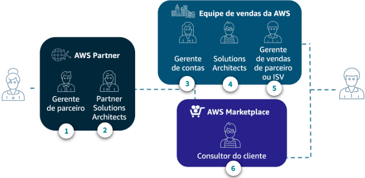

**Mais sobre o AWS Marketplace**

A equipe do AWS Marketplace ajuda os parceiros a incluir produtos e serviços no Marketplace e ajuda os clientes a encontrar soluções. Falem com o alliance lead ou gerente do AWS Partner para saber como incluir sua solução no AWS Marketplace. 

O AWS Marketplace é um catálogo digital que ajuda os clientes a descobrir, adquirir, licenciar, provisionar e governar softwares de terceiros. Os clientes também podem conhecer e comprar serviços profissionais para configurar, implantar e gerenciar softwares de terceiros. Os clientes podem utilizar um contrato atual da AWS para comprar soluções e serviços no Marketplace. 

Outros recursos incluem:
- Oportunidade para as equipes de vendas da AWS receberem compensação
- A aquisição mais rápida para os clientes fornece tempo para valor
- Suporte de venda conjunta em todo o mundo com consultores de clientes do AWS Marketplace

**Segmentação de clientes**

A AWS organiza sua equipe de vendas com base em características comuns dos clientes finais, agrupados em comercial ou setor público. Em cada um desses segmentos, as contas dos clientes são consideradas Envolvidas ou Greenfield com base no fato de a conta estar no início de sua adoção da nuvem AWS ou mais avançada.

Dentro de cada um desses segmentos, as contas de clientes são consideradas Envolvidas ou Greenfield.

__Segmentos comerciais__

- O segmento de negócios **nativos digitais (DNB)** inclui as empresas voltadas ao consumidor que sejam nascidas na nuvem e tecnologicamente experientes, por natureza. Esses clientes operam em um modelo B2C (Business-to-Consumer) e seu principal modo de negócios é on-line. Geralmente, os DNBs são organizações altamente centralizadas que desenvolvem aplicativos em nuvem, embora possam ter alguma dívida técnica (legada ou por meio de aquisições). Normalmente, os DNBs têm migrações pequenas ou médias. 
- O segmento de suporte **empresarial (ENT)** consiste nas empresas de maior potencial em todo o mundo. Esse segmento inclui clientes com o maior gasto total aproveitável no próximo período de 3 a 5 anos, além de grandes e médias empresas. Geralmente, o segmento é representado por empresas tradicionais com grandes investimentos legados em tecnologia. Elas hospedam uma parte significativa de aplicativos e dados on-premises, em data centers de colocation ou em um híbrido dos dois. Eles têm uma necessidade significativa de modernizar suas plataformas de tecnologia, aplicativos e modelos operacionais.
- O segmento de **provedor independente de software (ISV)** inclui organizações que desenvolvem, mantêm e vendem software. Essas organizações operam em um modelo business-to-business (B2B). Vendas, serviços de suporte e serviços de manutenção de licenças de software perpétuas ou por assinatura geram 50% ou mais de sua receita.
- O segmento de **startup** é baseado em contas que são afiliadas a um investidor-anjo, universidade, aceleradora, incubadora, capital de risco ou outra organização de programa de startup ou ativação e têm menos de 15 anos. Esse segmento inclui todas as empresas que uma origem dos dados de startup externa identificou como tendo recebido financiamento ou estando afiliada a uma das organizações listadas.  
- O segmento de **pequenas e médias empresas (SMB)** consiste em todos os clientes que não estão incluídos nos outros segmentos, incluindo revendedores. Os revendedores são clientes que assinaram um contrato de revendedor. Eles aceleram a adoção do cliente expandindo o alcance aos clientes finais.

__Segmentos do setor público__

- **Governo:** mais de 7.500 agências governamentais nos níveis local, estadual e federal usam a AWS hoje, incluindo agências civis e de inteligência. Essas entidades usam a AWS para fornecer soluções dimensionáveis e econômicas que atendem aos rigorosos padrões de segurança e conformidade necessários para cargas de trabalho regulamentadas, por exemplo, Federal Risk and Authorization Management Program (FedRAMP) e Federal Information Processing Standards (FIPS).
- **Educação:** este bucket inclui ensino superior, como faculdades e universidades, distritos escolares públicos, escolas particulares e empresas de EdTech. O foco das instituições desses grupos pode ser a modernização e a virtualização das experiências de aprendizado para aumentar a participação dos alunos, ou aumentar a agilidade e a disponibilidade dos sistemas que apoiam os alunos e os professores no campus ou em um distrito escolar, tudo com custos menores. As organizações de EdTech estão acelerando o desenvolvimento de soluções de tecnologia dimensionáveis e seguras que oferecem suporte a alunos e educadores com a AWS.
- **Organizações sem fins lucrativos:** dezenas de milhares de organizações sem fins lucrativos e não governamentais em todo o mundo usam a AWS para aumentar seu impacto e avançar nas metas da missão. Essas organizações usam a AWS para melhorar o desempenho de sites voltados a doadores, aprimorar práticas de dados por meio de bancos de dados gerenciados e análises, promover pesquisas por meio de machine learning ou melhorar o monitoramento remoto com a Internet das Coisas (IoT).
- **Saúde:** as organizações de saúde do setor público usam a AWS para analisar seus dados, melhorar o atendimento ao paciente nas comunidades que atendem e capacitar as equipes. Desde a personalização da experiência de paciente aos veteranos até a aceleração de descobertas científicas, a AWS está ajudando a modernizar o setor de saúde governamental.

### Práticas recomendadas

**Articular valor exclusivo**

Ao apresentar a uma equipe de vendas da AWS, o parceiro deve explicar de forma simples como a solução da sua empresa agrega valor ao cliente e funciona com as ofertas da AWS. Recomendamos não posicionar que sua empresa pode fazer tudo com as equipes de vendas da AWS. Os parceiros devem ser específicos e focar no que realmente diferencia sua oferta.

1. __Soluções comprovadas do AWS Partner__

Os parceiros devem destacar o que sua empresa vende com a AWS e em que eles obtiveram sucesso. Isso pode incluir soluções de software ou serviços empacotadas como ofertas ou itens do AWS Marketplace. Se sua empresa revende serviços da AWS, é importante destacar o valor agregado para o cliente.

2. __Conhecimento em segmento ou setor__

As equipes de vendas da AWS são organizadas por segmentos de clientes. Os parceiros podem destacar como suas soluções atendem às necessidades de um determinado tipo de cliente ou setor.

3. __Referências dos clientes, vitórias, estudos de caso__

Os parceiros podem reforçar soluções comprovadas compartilhando sucessos, incluindo referências de clientes, vitórias ou estudos de caso.

4. __Relacionamento com clientes no território__

Para conquistar a confiança da equipe de vendas da AWS, informe as relações com clientes importantes da sua empresa.

"Quando os parceiros estão interagindo com o departamento de equipes de vendas da AWS em uma oportunidade, queremos que eles demonstrem como a solução aborda um resultado pretendido para o cliente. 

Na AWS, chamamos isso de **trabalho reverso**.

As equipes de vendas da AWS fazem recomendações com base no que é mais adequado para o cliente, seja uma oferta da AWS ou uma solução de parceiro. Alinhar soluções aos resultados do cliente conquista a confiança com as equipes de vendas da AWS e com nossos clientes."

**Apropriar-se da oportunidade**

Quando os parceiros estão trabalhando com equipes de vendas da AWS em uma oportunidade, eles devem criar confiança fazendo o seguinte:

1. __Crie uma oportunidade e compartilhem-na no ACE__ para fazer a venda conjunta com a AWS. Parte disso é saber quando a oportunidade está pronta para compartilhamento. 

2. __Comuniquem frequentemente__ o status da oportunidade no programa ACE. Se houver acordo mútuo para isso, adicione a equipe da AWS como remetente nas comunicações com o cliente por e-mail sobre oportunidades de venda conjunta. Além disso, peça à equipe da AWS para participar de ligações ou reuniões com o cliente. 

3. __Peça ajuda__ à equipe da AWS, incluindo suporte técnico ou do programa. Saber quando pedir ajuda é algo sempre valorizado na AWS.

Se a AWS descobrir uma oportunidade com um cliente que possa ser atendida por sua oferta de parceiro, ela poderá compartilhá-la com você pelo ACE.

**Quando enviar uma oportunidade ao APN (ACE)**

Oportunidades de parceiros são mantidas com os mesmos critérios das oportunidades que são qualificadas pelas equipes de vendas da AWS. Aqui está uma visão geral do que torna uma oportunidade pronta versus não pronta.

* _Preparado_:
    * Consetimento do cliente
    * Parceiro originado e liderado
    * Status ativo e data de fechamento desejada
    * Novo negócio da AWS
    * Limpar descrição do projeto

- _Não preparado_:
  - Status lançado (ganho) ou fechado
  - Prospectar, liderar ou solicitar apresentações de contas
  - Faltam detalhes
  - Oportunidade duplicada

**O que pedir às equipes da AWS**

Aqui estão alguns exemplos das melhores perguntas quando os parceiros interagem com as equipes de vendas da AWS e alguns exemplos do que evitar perguntar. Para ler os exemplos, escolha a guia apropriada.

* _O que pedir_:
  * **Alinhamento com stakeholders do cliente:** a solução proposta está alinhada aos objetivos do cliente? Os parceiros podem envolver a equipe de vendas da AWS de clientes em comum para alinhar iniciativas, soluções e contatos estratégicos do cliente.
  * **Recomendação de aquisição:** existe algum benefício financeiro para o cliente comprar esta solução diretamente da AWS? Por exemplo, comprar software ou serviços por meio do AWS Marketplace.
  * **Financiamento da oportunidade:** Existem programas de financiamento da AWS aplicáveis que acelerariam essa oportunidade? 
  * **Design de solução técnica:** Sua solução se encaixa na arquitetura do cliente? O solutions architect da AWS ajuda os parceiros a validar uma abordagem ou solução técnica.

- _O que não pedir_:
    - A orientação geral é que a AWS não compartilha nem identifica o nome ou outros dados dos clientes com AWS Partners, a menos que tenham permissão do cliente. Exemplos disso incluem:
    - **Informações confidenciais:** quando o cliente gasta com a AWS? Quais serviços da AWS o cliente usa? 
    - **Listas da conta:** Quais clientes estão em seu território?
    - **Apresentações frias:** Você pode me apresentar…? Pedir apresentações frias às equipes da AWS com base apenas em uma declaração genérica de valor.

### Programas de financiamento AWS Partner

Programas de financiamento para parceiros

Os programas de financiamento de AWS Partner ajudam os clientes a reduzir o custo de avaliar e migrar para a AWS. Os programas incentivam os clientes a trabalhar com AWS Partners diferenciados, pois espera-se que a participação do parceiro acelere o ritmo de adoção da AWS e minimize o risco. 

Os programas podem oferecer:
1. financiamento monetário para diminuir o custo dos serviços ao cliente ou 
2. créditos promocionais da AWS para compensar o uso da AWS em um projeto. Em alguns casos, o programa pode fornecer ambas as opções.

Os possíveis casos de uso do cliente incluem o seguinte:

1. Prova de conceito : "Quero testar, experimentar"
2. Financiamento para perceiros do Migration Acceleration Program: "Quero migrar e modernizar"
3. Programa de migração de cargas de trabalho de ISVs: "Quero migrar para uma solução SaaS"

**Oportunidades de financiamento**

A AWS oferece financiamento para acelerar vários estágios do desenvolvimento comercial dos AWS Partners, incluindo capacitação técnica, de vendas e de marketing. Os benefícios de financiamento de AWS Partner ajudam os parceiros a criar um modelo comercial sustentável e expandir suas operações na AWS conforme criam, comercializam e vendem com a AWS.

1. **Provas de conceito (POCs)**

Para os clientes que ainda não se comprometeram totalmente a adotar a AWS e querem testar, há o financiamento de Prova de Conceito. A POC serve para determinar a viabilidade da solução da AWS e verificar que a solução funcionará como planejado. A expectativa é que o cliente vai se comprometer a usar a AWS para a migração ou outro serviço caso a POC tenha êxito.   
- Para novos clientes, as POCs podem ajudar a demonstrar a viabilidade e os benefícios da AWS Cloud.
- Para clientes existentes, as POCs podem ajudar a aumentar a utilização da AWS otimizando as soluções atuais e introduzindo novos produtos da AWS quando aplicável.
- Uma POC pode ser aplicável a clientes existentes quando eles desejam dinamizar uma solução existente ou nova para a nuvem AWS.

Qualificação: AWS Partners em um estágio validado ou superior no caminho do parceiro de software, serviços ou hardware

2. **Migration Acceleration Program (MAP)**

Para os clientes que querem migrar ou modernizar, o AWS Migration Acceleration Program (MAP) é um programa estratégico que apoia os AWS Partners com migrações para a AWS Cloud por meio de metodologia comprovada, ferramenta e incentivos. 

O MAP auxilia os AWS Partners em cada fase da jornada de migração do cliente: avaliar, mobilizar, migrar e modernizar. Este visual mostra quais são as três fases e como o financiamento de parceiros do MAP auxilia em cada uma. 

* A fase Avaliar
    - pode incluir a descoberta das cargas de trabalho de origem do cliente, análise de custo que compara a permanência no ambiente atual com o custo estimado da AWS, recomendação do padrão de migração/modernização ou um caso de negócio para motivar a decisão de migrar ou modernizar. 
    - Uma avaliação bem-sucedida pode criar um evento atraente para o cliente avançar para a fase Mobilizar ou Migrar e Modernizar.
    - Nessa fase, o financiamento é usado para compensar o custo de um caso de negócio entregue por um AWS Partner.

- Fase Mobilizar
    * Pode incluir planejamento, preparação e capacitação do cliente para sua migração ou modernização para a AWS e pode incluir experiência de migração piloto para a AWS. 
    * Nesta fase, a AWS pode coinvestir com o cliente nos serviços profissionais de um AWS Partner para impulsionar a prontidão, o planejamento e a experiência de migração do cliente para a AWS.
    * Após a conclusão da fase de Mobilização, o objetivo é o acordo do cliente para migrar ou modernizar seu ambiente na AWS. 
  
* Fases Migrar e modernizar
    - Pode incluir a execução do projeto de migração ou modernização do cliente. Um compromisso concluído com sucesso inclui a conclusão oportuna das entregas esperadas, a realização da receita recorrente anual (ARR) esperada pós-migração, a realização do cliente dos objetivos de negócios pretendidos e pode levar à identificação de cargas de trabalho de migração adicionais ou oportunidades de modernização em nome do cliente. 
    - Nesta fase, o financiamento da AWS pode ser usado para compensar o custo dos serviços profissionais do AWS Partner ou os Créditos promocionais da AWS.

Elegibilidade do parceiro: O MAP Partner Funding está disponível para AWS Migration Competency Partners ou AWS Partners com casos de uso relevantes, competências de carga de trabalho ou designações de entrega de serviços.

3. **Programa de migração da carga de trabalho do ISV (ISV WMP)**

Para os clientes que querem migrar para uma solução SaaS, o Programa de migração de cargas de trabalho de ISVs da AWS (ISV WMP) trabalha com os parceiros de software da AWS para criar um recurso repetível de migração e estratégia de lançamento no mercado, promovendo migrações em escala do cliente para suas ofertas de nuvem. O programa oferece orientação técnica prescritiva e automação para o processo de migração e financiamento para ajudar a mitigar os custos.

Os créditos são fornecidos ao AWS Software Partner para criar uma oferta WMP personalizada para o cliente final que está migrando para uma solução SaaS. O ISV WMP oferece um caminho pronto de migração para os clientes, avaliando suas cargas de trabalho on-premises para a nuvem.

Qualificação do parceiro: AWS Partner com estágio Validated ou superior no caminho de parceiros de software

**Portal de financiamento de parceiros**

O Portal de Financiamento de AWS Partner (APFP) é uma ferramenta de autoatendimento para que AWS Partners solicitem e gerenciem todos os seus benefícios de financiamento na forma de dinheiro ou créditos promocionais da AWS, a fim de apoiar suas atividades de criação, comercialização e venda. Disponível na Central AWS Partner, a ferramenta oferece aos parceiros acesso ao autoenvio de solicitações de financiamento, com transparência de status, notificações aprimoradas e visibilidade de relatórios.

"Os programas disponíveis, a qualificação do parceiro e o valor do financiamento variam e estão sujeitos à aprovação da AWS. Sempre discuta os benefícios de financiamento disponíveis para sua oportunidade com seu AWS Partner ou equipe de vendas da AWS antes de apresentar ao seu cliente. 

- Para a qualificação do parceiro, converse com o Alliance Lead de sua empresa ou com o AWS Partner Manager sobre o AWS Migration Acceleration Program, o Programa de competência da AWS e o Programa de Prestação de Serviços da AWS.
- Para financiamento específico da oportunidade, converse com seu AWS Partner ou gerente de vendas de ISV.

Para saber mais sobre requisitos, benefícios, ferramentas e práticas recomendadas:

Realize o curso Migration Ambassador Foundations. Depois do curso, vocês também podem fazer a avaliação para ganhar o distintivo de Migration Ambassador Foundations."

