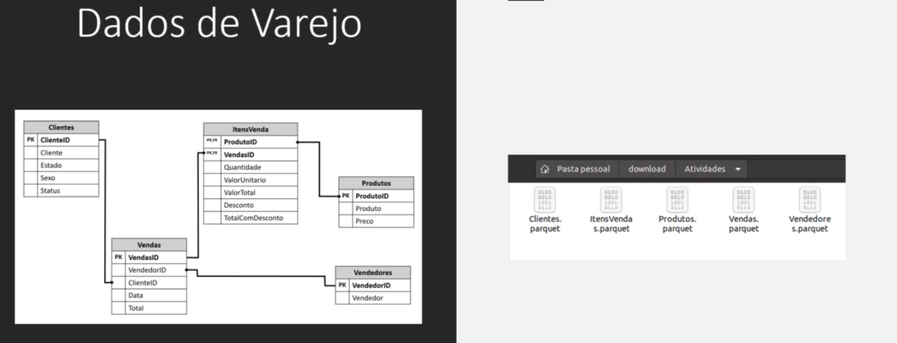
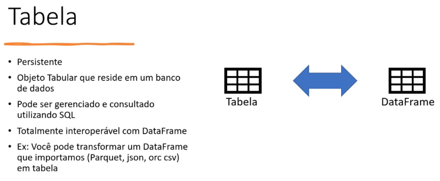
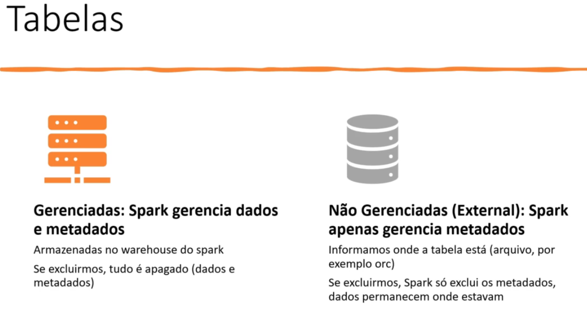

**Sumário**

[Retornar](https://github.com/lucasbergamo/Compass_UOL_data_engineering)

<details><summary><strong>Navegação</strong></summary>

- [Introdução ao Spark](#introdução-ao-spark)
  - [Cluster](#cluster)
  - [Spark Vs Python, R ou Banco de dados](#spark-vs-python-r-ou-banco-de-dados)
- [Arquitetura e Componentes](#arquitetura-e-componentes)
  - [Spark SQL](#spark-sql)
  - [Streaming: Spark Structures Streaming](#streaming-spark-structures-streaming)
  - [Grafos acíclicos dirigidos](#grafos-acíclicos-dirigidos)
  - [Tungsten](#tungsten)
  - [Elementos](#elementos)
  - [Transformações e Ações](#transformações-e-ações)
  - [Componentes](#componentes)
  - [SparkContext e SparkSession](#sparkcontext-e-sparksession)
  - [Formatos de Big Data](#formatos-de-big-data)
  - [Instalação spark WSL](#instalação-spark-wsl)
  - [Bibliotecas adicionais](#bibliotecas-adicionais)
  - [Rodando Exemplos](#rodando-exemplos)
  - [Baixando dados do exemplo](#baixando-dados-do-exemplo)
  - [Putty com SSH](#putty-com-ssh)
- [DataFrames e RDDs](#dataframes-e-rdds)
  - [RDD](#rdd)
  - [Data Frames](#data-frames)
    - [Lazy Evaluation](#lazy-evaluation)
    - [Tipos de Dados Suportados pelo DF](#tipos-de-dados-suportados-pelo-df)
    - [Schema](#schema)
  - [Criando DataFrames SEM definição de Schema](#criando-dataframes-sem-definição-de-schema)
  - [Criando DataFrames COM definição de Schema pelo spark](#criando-dataframes-com-definição-de-schema-pelo-spark)
  - [Ferramentas para filtrar dados usando condição lógica](#ferramentas-para-filtrar-dados-usando-condição-lógica)
  - [Renomear as Colunas criadas automaticamente pelo SPARK](#renomear-as-colunas-criadas-automaticamente-pelo-spark)
  - [Principais ações e Transformações](#principais-ações-e-transformações)
    - [Ordenando as vendas por ordem crescente (orderBy)](#ordenando-as-vendas-por-ordem-crescente-orderby)
    - [Agrupando as vendas por cidade (groupBy)](#agrupando-as-vendas-por-cidade-groupby)
    - [Adicionando Filtros](#adicionando-filtros)
  - [Exportando dados](#exportando-dados)
  - [Importando Dados](#importando-dados)
    - [Importando dados informando o schema](#importando-dados-informando-o-schema)
  - [Atividades Do yourself](#atividades-do-yourself)
- [Spark SQL](#spark-sql-1)
  - [Banco de dados e tabelas](#banco-de-dados-e-tabelas)


</details>

```git reset HEAD~```

## Introdução ao Spark

- Ferramenta de Processamenbto de Dados (Não é Data Storage)
- O spark é uma ferramenta de processamento que pode ser utilizada em um Cluster
- A principal característa é operar utilizando memória
- Distribuído em um Cluster
- Veloz
- Escalável
- Dados em HDFS ou Cloud
- Particionamento


### Cluster

- é uma rede de computadores que operam sobre o mesmo objetivo e dividem o processamento
- O escalonamento é horizontal, ao invés de vertical. pois não é preciso adicionar máquinas


**Replicação e tolerância a falha**

- Dados são copiados entre os nós do cluster. Isso traz o benefício de, entre outras coisas, tolerância a falhas.


**Particionamento de dados**

- Alta disponibilidade e performance

### Spark Vs Python, R ou Banco de dados

- Spark tem arquitetura voltada a processar dados!
  - Melhor performance, porém:
    - Não substitui Python
    - Não substitui SQL ou um SGBDR

## Arquitetura e Componentes


### Spark SQL

- Permite ler dados tabulares de várias fontes (CSV, Json, Parquet, ORC ...)
- Pode usar sintaxe SQL

### Streaming: Spark Structures Streaming

- É capaz de processar Dados estruturados
- Consegue detectar e processar novos registros adicionados ao final da tabela


### Grafos acíclicos dirigidos

- Spark constrói __Gráficos acíclicos dirigidos__, é dessa forma que ele processa os dados
- __Grafo__ é uma estrutura de dados composto por __Vértices__ e __Arestas__, as Arestas ligam esses vértices 


- **Acíclicos** = Não tem ciclo
- **Dirigidos** = Tem uma direção


### Tungsten

- É o motor de execução do spark
- Tem foco na otimização da CPU


### Elementos

- SparkSession: Seção
- Aplication: Programa


### Transformações e Ações

- Um __data frame__ é uma estrutura de dados imutável: Traz tolerância a falhas
- Uma __transformação__ gera um novo data frame
- O processamento de transformações de fato só ocorre quando há uma __ação__: __Lazy Evaluation__


- Lista de Transformações e ações


**Transformações: Narrow e Wide**

* **NARROW**
- Os dados necessários estão em uma mesma partição

* **WIDE**
- Os dados necessários estão em mais de uma partição


### Componentes

- Job: Tarefa que tem que ser executada
- Stage: Divisão do job
- Task: Menor unidade de trabalho. Uma por núcleo e por partição


### SparkContext e SparkSession

- SparkContext = Conexão transparente com o Cluster
  
- SparkSession = Acesso ao SparkContext

**Como Funciona?**

- Você pode rodar script Spark no Shell(pyspark), o spark cria uma sessão automaticamente chamada spark

- Se criar uma aplicação spark(aplicativo .py), você precisa criar este objeto:

```
spark = (SparSession
        .builder 
        .appName("Meuapp") 
        .getOrCreate())

```


### Formatos de Big Data


**Open source:**
- __Parquet__ = colunar, padrão do spark
- __Avro__ = Linha
- __Apache ORC__ = Colunar, padrão do Hive

**Ao utilizar, escolher:**
  - Muitos atributos e mais escrita = utilizar __LINHA__
  - Menos atributos e mais leitura = Utilizar __COLUNA__

**Qual escolher?**
  - Em geral __ORC__ é mais eficiente na criação(escrita) e na compressão
  - __Parquet__ tem melhor performance na consulta(leitura)
  - O ideal é fazer um __benchmark__

  
* Armazéns de dados modernos tendem a armazenar dados em formatos "desacoplados" de ferramentas e abertos
* Formatos binários,compactados
* suportam schema (colunas e linhas)
* Podem ser particionados entre discos: Redundância e Paralelismo


### Instalação spark WSL

- Ubunto na vm ou wsl
- ```sudo apt update``` ```sudo apt -y upgrade``` atualizar
- java ```sudo apt install curl mlocate default-jdk -y```

- spark download na pasta raiz```sudo wget https://dlcdn.apache.org/spark/spark-3.5.0/spark-3.5.0-bin-hadoop3.tgz```
- ```sudo tar xvf spark-3.5.0-bin-hadoop3.tgz``` extrair o spark
- mover a pasta para local "padrão" dos softwares no linux ```sudo mv spark-3.5.0-bin-hadoop3/ /opt/spark```

- ```sudo nano ~/.bashrc```


- colocar nas últimas linhas : 
- ```export SPARK_HOME=/opt/spark```
- ```export PATH=$PATH:$SPARK_HOME/bin:$SPARK_HOME/sbin```
- atualizar o arquivo ```source ~/.bashrc``` só funciona se fizer isso
- ```sudo service ssh start```
- ```start-master.sh``` iniciando o nó do spark standalone
- localhost:8080 = o spark já está rodando
- ```/opt/spark/sbin/start-slave.sh spark://localhost:7077```
- ```spark-shell``` módulo padrão do spark em scala
- ```pyspark``` módulo que iremos utilizar em python

esses comandos servem para padronizar o perfil do usuário, esse método foi retidado do youtube
- ```echo "export SPARK_HOME=/opt/spark" >> ~/.profile```
- ```echo "export PATH=$PATH:/opt/spark/bin:/opt/spark/sbin" >> ~/.profile```
- ```echo "export PYSPARK_PYTHON=/usr/bin/python3" >> ~/.profile```
- ```source ~/.profile``` => para carregar as variaveis criadas


### Bibliotecas adicionais

bibliotecas essenciais para sessão de machine learning

- ```sudo apt install python3-pip```
- ```pip install numpy```
- ```pip install pandas```

### Rodando Exemplos

verificando as pastas do spark
```cd /opt/spark```
sbin é a pasta administrativa do python

- rodando o "hello world" do big data
- deve estar na pasta do arquivo para executar
- o run é para iniciar o java
```run-example SparkPi```
```run-example JavaWordCount kern.log```

### Baixando dados do exemplo

precisamos acessar a home

```cd ~```

```wget www.datascientist.com.br/bigdata/download.zip```
```sudo apt install unzip```
```unzip download.zip```


### Putty com SSH

habilitar a área de transferência na maquina virtual para transferir arquivos entre o host e o wsl.
acessaremos a maquina virtual a partir de um console no windows

- instalar o ssh no terminal do linux
  ```sudo apt update``` ```sudo apt install openssh-server```

- configurar portas da maquina virtual:
- desligar a maquina virtual. redes -> adaptador1 -> avançado -> redirecionamento de portas -> adicionar rule1(Qualquer nome) protocolo(tpc) (ip hospedeiro 127.0.0.1) porta hospedeiro(22) porta do convidado(22)


## DataFrames e RDDs

**RDD - Resilient Distributed Datasets** pois os dados são destribuidos no cluster

- Estrutura básica de baixo nível
- Dados "imutáveis", distribuidos pelo cluster
- Em memória
- Pode ser persistido em disco
- Tolerante a falhas
- Operações sobre um RDD Criam um novo RDD

RDD = 
- Estrutura de baixo nível
- Complexo e verboso
- Otimização difícil pelo Spark


Estruturas de mais alto nível no spark são o Dataset e Dataframe

- Semelhante a uma tabela de banco de dados
- Compatível com objetos Dataframe do R e Python

Dataset = disponível apenas em java e scala e não em R e Python

Vamos estudar RDD, porém a prioridade será o DataFrame

### RDD

é a estrutura fundamental (básica), de mais baixo nível do spark mas utilizaremos o **Dataframe** que é a melhor para dados tabulares e a tecnologia mais recente.


* __Vamos criar uma RDD__

- ```pyspark```
- ```numeros = sc.parallelize([1,2,3,4,5,6,7,8,9,10])``` variavel numeros usando metodo parallelize com uma lista de numeros.
- ```numeros.take(5)```mostra os primeiros 5 elementos
- agora podemos executar tantos ações como transformações nesse rdd
- ```numeros.top(5)``` mostra os 5 ultimos numeros
- ```numeros.collect()``` mostra tudo que tem dentro dessa variável, não recomendado utilizar pois o arquivo pode ser muito grande.
- ```numeros.count()```
- ```numeros.mean()``` média
- ```numeros.sum()```
- ```numeros.max()```
- ```numeros.min()```
- ```numeros.stdev()``` desvio padrão dos números

- podemos aplicar um filtro, um **filtro** é uma transformação, só pode ver o resultado após chamar a ação

```filtro = numeros.filter(lambda filtro: filtro > 2)```
```filtro.collect()```

- gerar amostra com a probabilidade do número fazer parte da amostra de 50%

```amostra = numeros.sample(True,0.5,1)```
```amostra.collect()```

- **map** = função lambda para todos os elementos do rdd

```mapa = numeros.map(lambda mapa: mapa * 2)```
```mapa.collect()```

- fazer uma união

```numeros2 = sc.parallelize([6,7,8,9,10])```
```uniao = numeros.union(numeros2)```
```uniao.collect()```

- ver os elementos em comum entre essas 2 variáveis

```interseccao = numeros.intersection(numeros2)```
```interseccao.collect()```

- diferença entre os 2 conjuntos

```subtrai = numeros.subtract(numeros2)``` elementos que tem no numeros mas não tem no numeros2
```subtrai.collect()```

- numero cartesiano

```cartesiano = numeros.cartesian(numeros2)```
```cartesiano.collect()```

```cartesiano.countByValue()``` - conta qauntas vezes cada valor aparece

- 

```compras = sc.parallelize([(1,200),(2,300),(3,120),(4,250),(5,78)])``` - temos o primeiro parênteses da **função**, o colchetes da **lista** e o segundo parênteses da **tupla**. e os itens dentro da tupla, estão em chave-valor, separados por vírgula.

```chaves = compras.keys()```
```chaves.collect()```
```[1,2,3,4,5]```

```valores = compras.values()```
```valores.collect()```
```[200, 300, 120, 250, 78]```

```compras.countByKey()```
```{1: 1, 2: 1, 3: 1, 4: 1, 5: 1}``` Indica que cada chave, teve apenas 1 recorrência nas compras

```soma = compras.mapValues(lambda soma + 1)```
```soma.collect()```
```[(1,201),(2,301),(3,121),(4,251),(5,79)]```

- 

```debitos = sc.parallelize([(1,20), (2,300)])```
```resultado = compras.join(debitos)```
```resultado.collect()```
```[(2, (300, 300)),(1, (200, 20))]``` a key 2 agora tem 2 valores de 300 para pagar 


```semDebito = compras.subtractByKey(debitos)```
```semDebito.collect()```
```[(4, 250), (3, 120), (5, 78)]```

### Data Frames

- Tabelas com linhas e colunas
- Imutáveis
- Com Schema conhecido
- Linhagem preservada
- Colunas podem ter tipos diferentes
- Existem análises comuns: Agrupar, ordenar, filtrar
- Spark pode otimizar estas analises através de planos de execução


#### Lazy Evaluation

- O processamento de transformação de fato só ocorre quando há uma Ação: Lazy Evaluation.


#### Tipos de Dados Suportados pelo DF

tipos:

- ByteType
- ShortType 
- IntegerType
- LongType
- FloatType
- DoubleType
- DecimalType
- StringType
- BinaryType
- BooleanType
- TimestampType
- DataType
- ArrayType
- MapType
- StructType
- StructField


#### Schema

- Você pode deixar para o spark inferir a partir dos dados
- Ou você pode definir o Schema
- Definir tem vantagens:
  - Tipo correto
  - Sem overhead


### Criando DataFrames SEM definição de Schema

- Sem Schema

```pyspark```
```from pyspark.sql import SparkSession``` imports essenciais
```df1 = spark.createDataFrame([("Lucas",25),("Clara",23),("Dani", 24)])``` criar nosso data frame, utilizando uma lista e passando 3 pares de valor e cada par de valor vai ter um nome e idade.
```df1.show()```


- vamos utilizar uma variável para o schema e outra para os dados
```schema = "Id INT, Nome STRING"```
```dados = [[1, "Lucas"], [2, "Clara"]]```
```df2 = spark.createDataFrame(dados, schema)```
```df2.show()```


- vamos utilizar a função de soma para uma agregação

```from pyspark.sql.functions import sum```
```schema2 = "Produtos STRING, Vendas INT"```
```vendas = [["Caneta",10], ["Lápis",20], ["Caneta",40]]```
```df3 = spark.createDataFrame(vendas, schema2)```
```df3.show()```
```df3.show(1)``` mostra apenas caneta - 10


- e se quisermos agregar o total de vendas por produto
  
```agrupado = df3.groupBy("Podutos").agg(sum("Vendas"))``` agrupando por produtos, usando a função SUM para somar as vendas e agrupando por produtos
```agrupado.show()``` agrupado agora é um novo data frame

- ou em vez de utilizar uma variável, pode ser diretamente:

```df3.groupBy("Podutos").agg(sum("Vendas")).show()```

- verificar apenas uma coluna

```df3.select("Produtos").show()```
```df3.select("Produtos", "Vendas").show()```
```df3.select("Vendas", "Produtos").show()```

- Podemos usar o **select** para criar expressões(qualquer tipo de cálculo) para utilizar em apenas uma coluna, por exemplo. Iremos calcular o percentual dessas vendas.

```from pyspark.sql.functions import expr```
```Porcentagem = expr("Vendas * 0.2")```- tentei colocar em uma variável
```df3.select("Produtos", "Vendas", expr("Vendas * 0.2")).show()``` 20% das vendas
```vinte_porcento = df3.select("Produtos", "Vendas", expr("Vendas * 0.2"))```
```vinte_porcento.show()```

- Verificando Schemas

```df3.schema```

- Verificando Colunas

```df3.columns```


### Criando DataFrames COM definição de Schema pelo spark


* Importando arquivo e definindo Schema
  
```from pyspark.sql.types import *```
```arqschema = "id INT, nome STRING, status STRING, cidade STRING, vendas INT, data STRING"``` 
Nesse método utilizaremos data como string.

- Agora vamos fazer a importação do arquivo

```despachantes = spark.read.csv("/home/hadoop/download/despachantes.csv", header=False, schema = arqschema)``` 
- indicar o caminho do arquivo, o header=False significa que não tem cabeçalho e o schema passando a variável que criamos.
```despachantes.show()``` 


* Importando arquivo e __Deixando o Spark definir o Schema__

```desp_autoschema = spark.read.load("/home/hadoop/download/despachantes.csv", header=False, format="csv", sep=",", inferSchema=True)``` 
- o format agora serve para indicar o formato do arquivo, pois agora é utilizado o load.
- o sep"," indica para separar por vírgula, se for um arquivo do exe por exemplo, virá ;.
- e o inferSchema=True, indica para o spark criar o schema automaticamente.

```desp_autoschema.show()```

- agora vamos checar se o spark acertou nos valores os schemas(INT, STRING ...)

```despachantes.schema```
```desp_autoschema.schema```


### Ferramentas para filtrar dados usando condição lógica

```from pyspark.sql import functions as Func```

- Obter o Df cujas vendas sejam maior que 20

```despachantes.select("id", "nome", "vendas").where(Func.col("vendas") > 20).show()```

- Obter o Df cujas vendas sejam maior que 20 e menor que 40

```despachantes.select("id", "nome", "vendas").where((Func.col("vendas") > 20) & (Func.col("vendas") < 40)).show()```


### Renomear as Colunas criadas automaticamente pelo SPARK

__Você não consegue alterar nada no dataframe pois ele é um objeto imutável__

- Renomeando colunas, ao renomear, estamos na verdade criando outro data frame

```novodf = despachantes.withColumnRenamed("nome", "nomes")```
```novodf.columns```

- Vamos alterar o tipo da coluna data em despachantes, de STRING para DATA, Para isso precisamos criar um novo DataFrame pois ele é imutável.

```from pyspark.sql.functions import *```
```from pyspark.sql import functions as Func```

```despachantes2 = despachantes.withColumn("data2", to_timestamp(Func.col("data"), "yyyy-MM-dd"))``` - criação da coluna data2

```despachantes2.schema```

```despachantes2.select(year("data")).distinct().show()```

```despachantes2.select("nome", year("data")).orderBy("nome").show()```

```despachantes2.select("data").groupBy(year("data")).count().show()```

```despachantes2.select(Func.sum("vendas")).show()```


### Principais ações e Transformações

 - ação take que vai retornar os dados em forma de lista

 ```despachantes.take(1)```

 ```despachantes.collect()```

 - são comandos herdados do RDD

 ```despachantes.count()``` retorna o número de linhas

#### Ordenando as vendas por ordem crescente (orderBy)

qualquer ordenação funciona na ordem crescente

 ```despachantes.show()```
 ```despachantes.orderBy("vendas").show()```

 ordenação na forma decrescente

 ```despachantes.orderBy(Func.col("vendas").desc()).show()```

 Ordenar por mais de uma coluna, cidade decrescente e ordenar por valor de vendas

 ```despachantes.orderBy(Func.col("cidade").desc(), Func.col("vendas").desc()).show()```


#### Agrupando as vendas por cidade (groupBy)


```despachantes.groupBy("cidade").agg(sum("vendas")).show()```


- agora vamos utilizar o orderBy pela coluna de vendas

```despachantes.groupBy("cidade").agg(sum("vendas")).orderBy(Func.col("sum(vendas)").desc()).show()```

colocamos o nome da coluna sum(vendas), para agregação


#### Adicionando Filtros

filtrar apenas o despanchante = deolinda vilela


```despachantes.filter(Func.col("nome") == "Deolinda Vilela").show()```


### Exportando dados

Salvar o Dataframe em disco : parquet, json, csv e orc.

1. Vamos persistir o Df despachantes em parquet (é o formato padrão)
  
```despachantes.write.format("parquet").save("/home/hadoop/dfimportparquet")```

2. Vamos persistir o Df despachantes em CSV

```despachantes.write.format("csv").save("/home/hadoop/dfimportcsv")```

3. Vamos persistir o Df despachantes em Json

```despachantes.write.format("json").save("/home/hadoop/dfimportjson")```

4. Vamos persistir o Df despachantes em ORC

```despachantes.write.format("orc").save("/home/hadoop/dfimportorc")```


### Importando Dados

- vamos navegar até a pasta do arquivo:

```cd /home/hadoop/dfimportcsv```

- vamos alterar o nome do arquivo:

```mv part-00000-120cbde0-84d7-45cb-8805-4859d31b23e6-c000.csv despachantes.csv```

* Faremos a mesma coisa nos arquivos json, orc e parquet

```cd /home/hadoop/dfimportparquet```
```cd /home/hadoop/dfimportjson```
```cd /home/hadoop/dfimportorc```

```mv part-00000-76b30cad-dfb3-4ba7-a592-e924fc1fcd89-c000.snappy.parquet despachantes.parquet```
```mv part-00000-e8113525-b661-4c7a-a646-3d624079a450-c000.json despachantes.json```
```mv part-00000-cfd6ddb0-2308-4551-917c-f8e077fdab3e-c000.snappy.orc despachantes.orc```


- **agora traremos o arquivo parquet para o spark como uma variável**

```par = spark.read.format("parquet").load("/home/hadoop/dfimportparquet/despachantes.parquet")```

```par.show()```
```par.schema``` o formato parquet armazena o schema dos dados

- **agora traremos o arquivo csv para o spark como uma variável**

```csv = spark.read.format("csv").load("/home/hadoop/dfimportcsv/despachantes.csv")```

```csv.show()``` não preserva o schema, muda os nomes dos índices
```csv.schema```

- **agora traremos o arquivo orc para o spark como uma variável**

```orc = spark.read.format("orc").load("/home/hadoop/dfimportorc/despachantes.orc")```

```orc.show()``` preserva a ordem de colunas
```orc.schema``` type vendas virou INT

- **agora traremos o arquivo Json para o spark como uma variável**

```json = spark.read.format("json").load("/home/hadoop/dfimportjson/despachantes.json")```

```json.show()``` alterou a ordem dos campos
```json.schema``` o Type de vendas foi alterado para LongType


#### Importando dados informando o schema

```arqschema = "id INT, nome STRING, status STRING, cidade STRING, vendas INT, data STRING"``` 

```cs2 = spark.read.format("csv").load("/home/hadoop/dfimportcsv/despachantes.csv", schema=arqschema)```

```cs2.show()```


### Atividades Do yourself




- ClientID -> Cliente -> Estado -> Sexo -> Status (Silver, Gold ou Platinum)
- 250 clientes cadastrados com 3 status

- VendedorID -> Vendedor (10 vendedores)

- ProdutoID -> produto -> preco (10 produtos)

- VendasID -> VendedorID -> ClienteID -> Data -> Total (400 vendas)

- ProdutoID -> VendasID -> Quantidade -> ValorUnitario -> Valortotal -> Desconto -> TotalcomDesconto


1. Crie uma consulta que mostre, nesta ordem, Nome, Estados e Status
2. Crie uma consulta que mostre apenas os clientes do Status "platinum" e "gold"
3. Demonstre quando cada status de clientes representa em vendas?

- Resolva com DataFrames
- Faça joins se necessários (3. entre clientes e vendas)
- utilizaremos apenas 2 tabelas agora (clientes e vendas)


1. Consulta 1:

- importando funções sql

```from pyspark.sql import functions as Func```
```from pyspark.sql.functions import *```

- Vamos procurar o diretório onde ficam os arquivos clientes e vendas, importar para um Dataframe usando uma variável e como está em parquet, não precisaremos indicar o schema

```clientes = spark.read.format("parquet").load("/home/hadoop/download/Atividades/Clientes.parquet")```

```vendas = spark.read.format("parquet").load("/home/hadoop/download/Atividades/Vendas.parquet")```


- ```resultado1 = clientes.select("Cliente", "Estado", "Status").show()```


2. Consulta 2: 

```resultados2 = clientes.select("Cliente", "Status").where(Func.col("Status").isin("Gold", "Platinum")).show()```

ou

```resultados2 = clientes.select("*").where((Func.col("Status") =="Gold") | (Func.col("Status") == "Platinum")).show()```


3. Consulta 3:

Demonstre quando cada status de clientes representa em vendas?

- Criei um novo DF contendo clientes e vendas pelo ClienteID
```status_vendas = vendas.join(clientes, "ClienteID", "inner")```

- Agora criei outro DF contendo apenas o select do Total e Status
```status_vendas2 = status_vendas.select("Total", "Status")```

- Agora vou agrupar pelo status e realizar a soma de todos os totais, ordenando pelo total decrescente
  
```status_vendas2.groupBy("Status").agg(sum("Total")).orderBy(Func.col("sum(Total)").desc()).show()```

- Porém o número vem com muitas casas decimais, vamos adicionar um round()

```resultado3 = status_vendas2.groupBy("Status").agg(round(sum("Total"), 2)).orderBy(Func.col("sum(Total)").desc()).show()```

ou 

```resultado3 = status_vendas2.groupBy("Status").agg(round(sum("Total"), 0).alias("sum(Total)")).orderBy(Func.col("sum(Total)").desc()).show()```

Ou colocando em uma variável adicionando um novo nome ao sum Total

```resultado3 = status_vendas2.groupBy("Status").agg(round(sum("Total"), 0).alias("Soma Total")).orderBy("Soma Total", ascending=False)```


- Método do professor:
  
por padrão é o inner, por isso não especificou
```from pyspark.sql.function import sum as SUM```

```vendas.join(clientes, vendas.ClienteID == clientes.ClienteID).groupBy(clientes.Status).agg(SUM("Total")).orderBy(Func.col("sum(Total)").desc()).show()```

- **ao criar uma variável com .show() ela não salva, apenas executa**


## Spark SQL

- Utiliza o Metastore do Hive
- Não é preciso ter o Hive instalado para usar o Spark

metastore é o local onde os metadados de definições de bancos de dados, tabelas, types. ficam armazenados no metastore






**Views**


### Banco de dados e tabelas