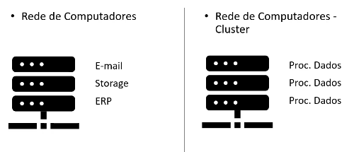
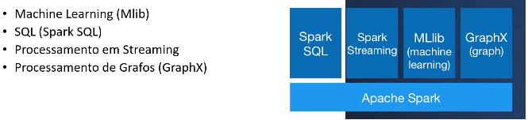
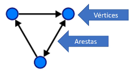
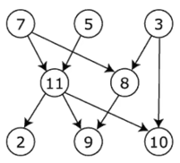
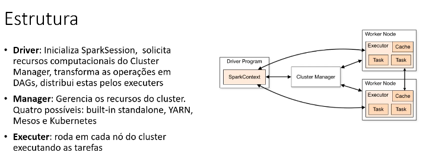
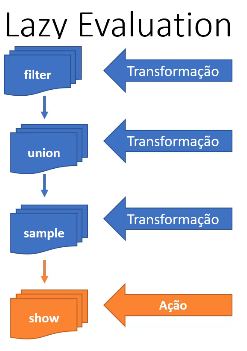
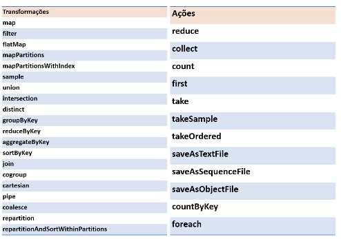
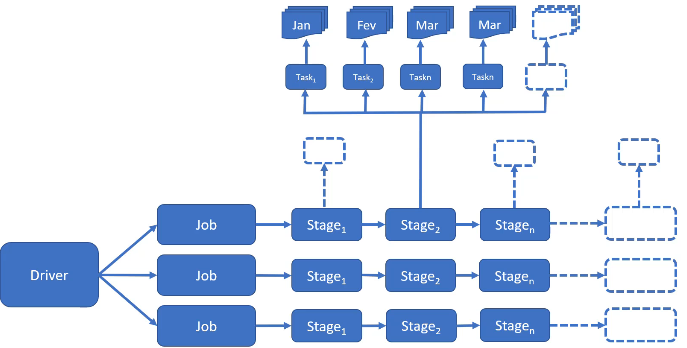
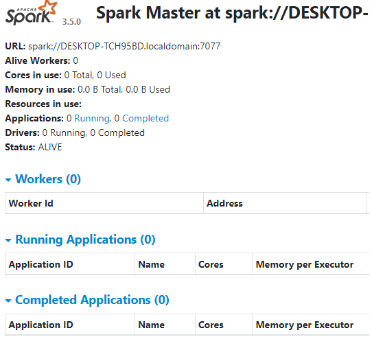
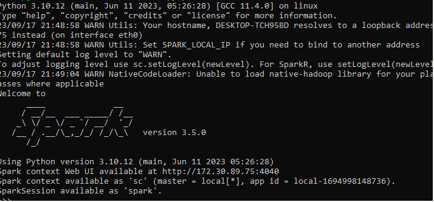

**Sumário**

[Retornar](https://github.com/lucasbergamo/Compass_UOL_data_engineering)

<details><summary><strong>Navegação</strong></summary>

- [Introdução ao Spark](#introdução-ao-spark)
  - [Cluster](#cluster)


</details>

```git reset HEAD~```

## Introdução ao Spark

- Ferramenta de Processamenbto de Dados (Não é Data Storage)
- O spark é uma ferramenta de processamento que pode ser utilizada em um Cluster
- A principal característa é operar utilizando memória
- Distribuído em um Cluster
- Veloz
- Escalável
- Dados em HDFS ou Cloud
- Particionamento


### Cluster

- é uma rede de computadores que operam sobre o mesmo objetivo e dividem o processamento
- O escalonamento é horizontal, ao invés de vertical. pois não é preciso adicionar máquinas




**Replicação e tolerância a falha**

- Dados são copiados entre os nós do cluster. Isso traz o benefício de, entre outras coisas, tolerância a falhas.


**Particionamento de dados**

- Alta disponibilidade e performance

### Spark Vs Python, R ou Banco de dados

- Spark tem arquitetura voltada a processar dados!
  - Melhor performance, porém:
    - Não substitui Python
    - Não substitui SQL ou um SGBDR

## Arquitetura e Componentes




### Spark SQL

- Permite ler dados tabulares de várias fontes (CSV, Json, Parquet, ORC ...)
- Pode usar sintaxe SQL

### Streaming: Spark Structures Streaming

- É capaz de processar Dados estruturados
- Consegue detectar e processar novos registros adicionados ao final da tabela


### Grafos acíclicos dirigidos

- Spark constrói __Gráficos acíclicos dirigidos__, é dessa forma que ele processa os dados
- __Grafo__ é uma estrutura de dados composto por __Vértices__ e __Arestas__, as Arestas ligam esses vértices 



- **Acíclicos** = Não tem ciclo
- **Dirigidos** = Tem uma direção



### Tungsten

- É o motor de execução do spark
- Tem foco na otimização da CPU




### Elementos

- SparkSession: Seção
- Aplication: Programa


### Transformações e Ações

- Um __data frame__ é uma estrutura de dados imutável: Traz tolerância a falhas
- Uma __transformação__ gera um novo data frame
- O processamento de transformações de fato só ocorre quando há uma __ação__: __Lazy Evaluation__



- Lista de Transformações e ações




**Transformações: Narrow e Wide**

* **NARROW**
- Os dados necessários estão em uma mesma partição

* **WIDE**
- Os dados necessários estão em mais de uma partição


### Componentes

- Job: Tarefa que tem que ser executada
- Stage: Divisão do job
- Task: Menor unidade de trabalho. Uma por núcleo e por partição




### SparkContext e SparkSession

- SparkContext = Conexão transparente com o Cluster
  
- SparkSession = Acesso ao SparkContext

**Como Funciona?**

- Você pode rodar script Spark no Shell(pyspark), o spark cria uma sessão automaticamente chamada spark

- Se criar uma aplicação spark(aplicativo .py), você precisa criar este objeto:

```
spark = (SparSession
        .builder 
        .appName("Meuapp) 
        .getOrCreate())

```


### Formatos de Big Data


**Open source:**
- __Parquet__ = colunar, padrão do spark
- __Avro__ = Linha
- __Apache ORC__ = Colunar, padrão do Hive

**Ao utilizar, escolher:**
  - Muitos atributos e mais escrita = utilizar __LINHA__
  - Menos atributos e mais leitura = Utilizar __COLUNA__

**Qual escolher?**
  - Em geral __ORC__ é mais eficiente na criação(escrita) e na compressão
  - __Parquet__ tem melhor performance na consulta(leitura)
  - O ideal é fazer um __benchmark__

  
* Armazéns de dados modernos tendem a armazenar dados em formatos "desacoplados" de ferramentas e abertos
* Formatos binários,compactados
* suportam schema (colunas e linhas)
* Podem ser particionados entre discos: Redundância e Paralelismo


### Instalação spark WSL

- Ubunto na vm ou wsl
- ```sudo apt update``` ```sudo apt -y upgrade``` atualizar
- java ```sudo apt install curl mlocate default-jdk -y```

- spark download na pasta raiz```sudo wget https://dlcdn.apache.org/spark/spark-3.5.0/spark-3.5.0-bin-hadoop3.tgz```
- ```sudo tar xvf spark-3.5.0-bin-hadoop3.tgz``` extrair o spark
- mover a pasta para local "padrão" dos softwares no linux ```sudo mv spark-3.5.0-bin-hadoop3/ /opt/spark```

- ```sudo nano ~/.bashrc```


- colocar nas últimas linhas : 
- ```export SPARK_HOME=/opt/spark```
- ```export PATH=$PATH:$SPARK_HOME/bin:$SPARK_HOME/sbin```
- atualizar o arquivo ```source ~/.bashrc``` só funciona se fizer isso
- ```sudo service ssh start```
- ```start-master.sh``` iniciando o nó do spark standalone
- localhost:8080 = o spark já está rodando
- ```/opt/spark/sbin/start-slave.sh spark://localhost:7077```
- ```spark-shell``` módulo padrão do spark em scala
- ```pyspark``` módulo que iremos utilizar em python

esses comandos servem para padronizar o perfil do usuário, esse método foi retidado do youtube
- ```echo "export SPARK_HOME=/opt/spark" >> ~/.profile```
- ```echo "export PATH=$PATH:/opt/spark/bin:/opt/spark/sbin" >> ~/.profile```
- ```echo "export PYSPARK_PYTHON=/usr/bin/python3" >> ~/.profile```
- ```source ~/.profile``` => para carregar as variaveis criadas







### Bibliotecas adicionais

bibliotecas essenciais para sessão de machine learning

- ```sudo apt install python3-pip```
- ```pip install numpy```
- ```pip install pandas```

### Rodando Exemplos

verificando as pastas do spark
```cd /opt/spark```
sbin é a pasta administrativa do python

- rodando o "hello world" do big data
- deve estar na pasta do arquivo para executar
- o run é para iniciar o java
```run-example SparkPi```
```run-example JavaWordCount kern.log```

### Baixando dados do exemplo

precisamos acessar a home

```cd ~```

```wget www.datascientist.com.br/bigdata/download.zip```
```sudo apt install unzip```
```unzip download.zip```


### Putty com SSH

habilitar a área de transferência na maquina virtual para transferir arquivos entre o host e o wsl.
acessaremos a maquina virtual a partir de um console no windows

- instalar o ssh no terminal do linux
  ```sudo apt update``` ```sudo apt install openssh-server```

- configurar portas da maquina virtual:
- desligar a maquina virtual. redes -> adaptador1 -> avançado -> redirecionamento de portas -> adicionar rule1(Qualquer nome) protocolo(tpc) (ip hospedeiro 127.0.0.1) porta hospedeiro(22) porta do convidado(22)


## DataFrames e RDDs

**RDD - Resilient Distributed Datasets** pois os dados são destribuidos no cluster

- Estrutura básica de baixo nível
- Dados "imutáveis", distribuidos pelo cluster
- Em memória
- Pode ser persistido em disco
- Tolerante a falhas
- Operações sobre um RDD Criam um novo RDD

RDD = 
- Estrutura de baixo nível
- Complexo e verboso
- Otimização difícil pelo Spark


Estruturas de mais alto nível no spark são o Dataset e Dataframe

- Semelhante a uma tabela de banco de dados
- Compatível com objetos Dataframe do R e Python

Dataset = disponível apenas em java e scala e não em R e Python

Vamos estudar RDD, porém a prioridade será o DataFrame

### RDD

é a estrutura fundamental (básica) do spark mas utilizaremos o Dataframe que é a melhor para dados tabulares e a tecnologia mais recente.

- Vamos criar uma RDD

```pyspark```
```numeros = sc.parallelize([1,2,3,4,5,6,7,8,9,10])```
variavel numero usando metodo parallelize com uma lista de numeros
```numeros.take(5)```tras os primeiros 5 elementos
agora podemos executar tantos ações como transformações nesse rdd
```numeros.top(5)``` chama os 5 ultimos numeros
```numeros.collect()``` motra tudo que tem dentro dessa variável, não recomendado utilizar pois o arquivo pode ser muito grande
```numeros.count()```
```numeros.mean()``` média
```numeros.sum()```
```numeros.max()```
```numeros.min()```
```numeros.stdev()``` desvio padrão dos números

podemos aplicar um filtro, um filtro é uma transformação, só pode ver o resultado após chamar a ação

```filtro = numeros.filter(lambda: filtro > 2)```
```filtro.collect()```

gerar amostra

```amostra = numeros.sample(True,0.5,1)```
```amostra.collect()```

map = função lambda para todos os elementos do rdd

```mapa = numeros.map(lambda mapa: mapa * 2)```
```mapa.collect()```

```numeros2 = sc.parallelize([6,7,8,9,10])```

fazer uma união

```uniao = numeros.union(numeros2)```
```uniao.collect()```

ver os elementos em comum entre essas 2 variáveis

```interseccao = numeros.intersection(numeros2)```
```interseccao.collect()```

diferença entre os 2 conjuntos

```subtrai = numeros.subtract(numeros2)```
```subtrai.collect()```

numero cartesiano

```cartesiano = numeros.cartesian(numeros2)```
```cartesiano.collect()```

```cartesiano.countByValue()```
