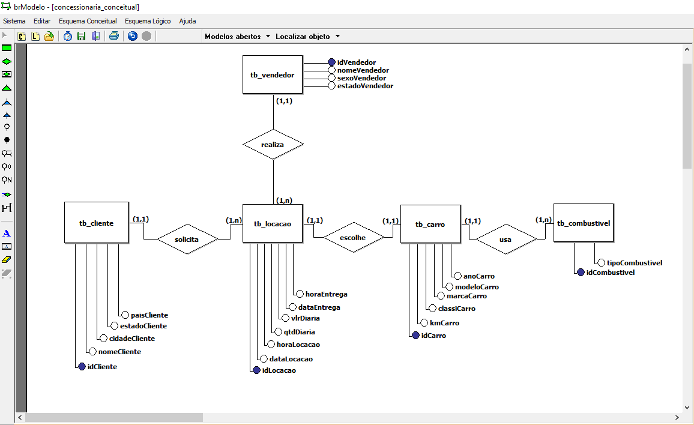

- Iniciei o Dbeaver e surgiu uma nova atualização para o formato .SqLite
- e serviu exatamente para rodar o arquivo da tarefa
- vizualizei o diagrama para entender sua modelagem de dados
- atributo simples ou composto, monovalorados, multivalorados ou derivados(idade vem de data de nascimento)
- utilziar a chave cpf, para identificar de forma única uma entidade, valores associados a esse atributo são distintos pois só pode haver 1 cpf por pessoa.
- existe relacionamento entre entidades? qual seria essa cardialidade?
- para iniciar podemos começar com um modelo conceitual, usando alta abstração
- utilizaremos qual diagrama? entidade e relacionamento ou diagrama de classes?
- relacionamentos N:N precisamos criar uma consulta
- relacionamentos 1:n, colocamos a PK da entidade 1 na entidade N

1. criei um modelo conceitual, utilizando o brmodelo para entender o que precisava ser feito

2. criei as entidades, atributos e relações

3. agora vou adicionar as cardinalidades

- um cliente pode ter uma ou várias locações(1,n) e uma locação só pode ter um cliente por vez (1,1)
- um vendedor pode ter nenhuma ou várias locações realizadas (0,n) e uma locação só pode ser atribuida a apenas um vendedor por vez (1,1)
- um carro pode ter apenas uma locação por vez (1,1) e uma locação pode ter um ou vários  carros por vez (1,n)
- um carro utiliza apenas um combustivel por vez (1,1) e o combustivel pode ser usado em um ou vários carros (1,n)

