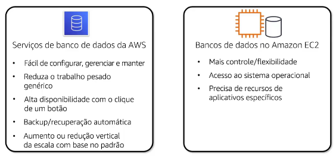
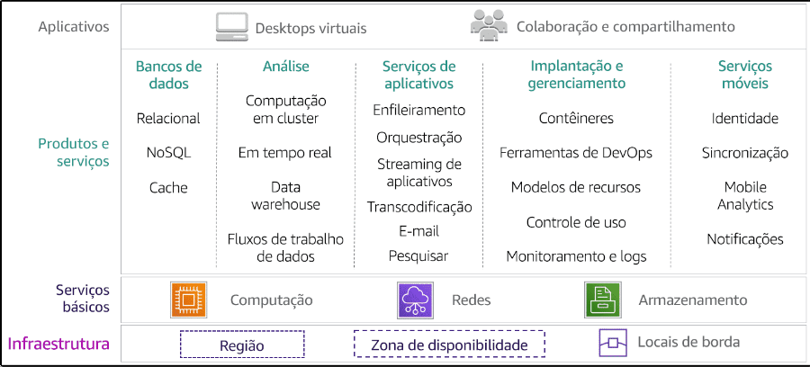
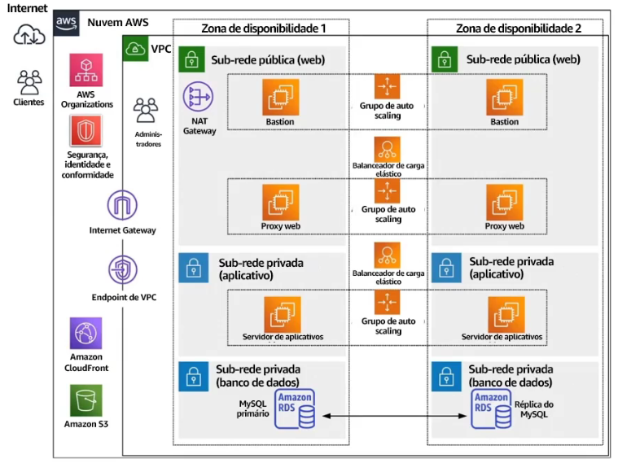
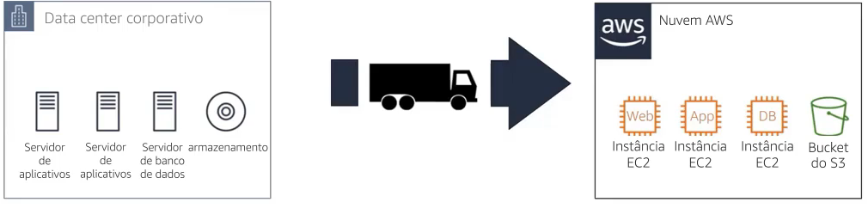
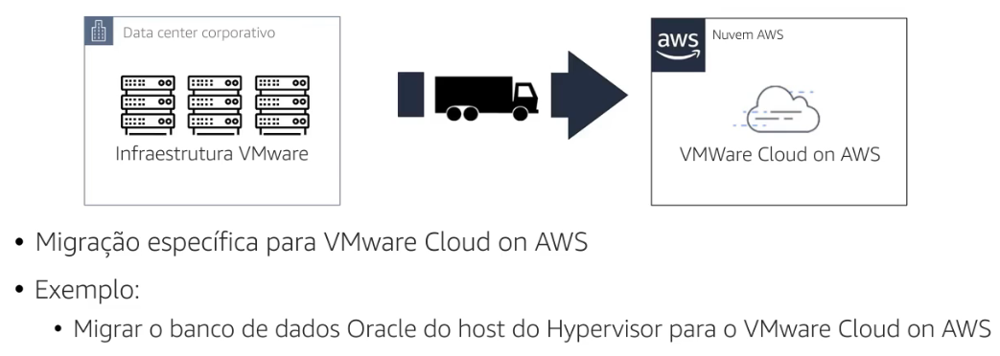
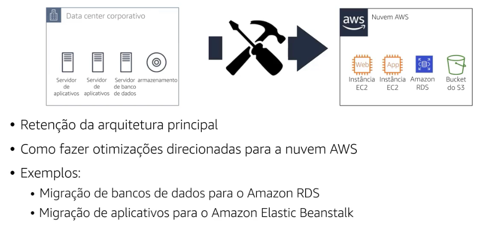
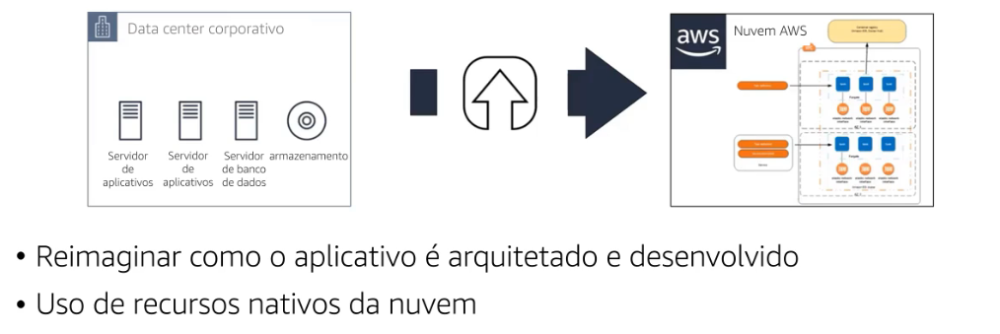
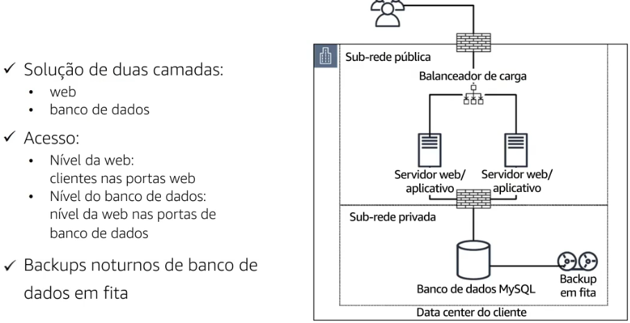
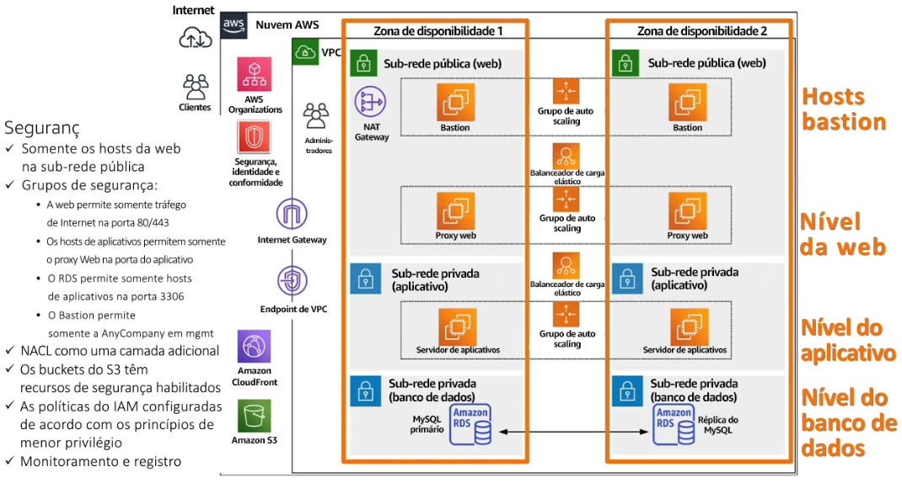

**Sumário**

[Retornar](https://github.com/lucasbergamo/Compass_UOL_data_engineering)

<strong>Navegação</strong>

- [Tecnologias essenciais da AWS](#tecnologias-essenciais-da-aws)
  - [Benefícios da computação em nuvem](#benefícios-da-computação-em-nuvem)
  - [Infraestrutura Global da AWS](#infraestrutura-global-da-aws)
  - [Tecnologias essenciais: computação](#tecnologias-essenciais-computação)
  - [Tecnologias essenciais: armazenamento](#tecnologias-essenciais-armazenamento)
  - [Tecnologias essenciais: bancos de dados](#tecnologias-essenciais-bancos-de-dados)
  - [Tecnologias essenciais: redes](#tecnologias-essenciais-redes)
  - [Tecnologias essenciais: segurança](#tecnologias-essenciais-segurança)
- [De Serviços a Soluções](#de-serviços-a-soluções)
  - [Projeto da solução](#projeto-da-solução)
  - [Estratégias de Migração](#estratégias-de-migração)
  - [Práticas recomendadas de arquitetura na nuvem](#práticas-recomendadas-de-arquitetura-na-nuvem)
  - [O AWS Well-Architected Framework](#o-aws-well-architected-framework)
  - [AWS Cloud Adoption Framework (CAF)](#aws-cloud-adoption-framework-caf)
  - [Solução proposta](#solução-proposta)
- [Apresentação Das Soluções da AWS aos Clientes](#apresentação-das-soluções-da-aws-aos-clientes)
  - [Práticas recomendadas de reunião de clientes](#práticas-recomendadas-de-reunião-de-clientes)

## Tecnologias essenciais da AWS

### Benefícios da computação em nuvem
A computação em nuvem é a entrega sob demanda de poder computacional, banco de dados, armazenamento, aplicativos e outros recursos de TI pela internet com preço e pagamento conforme o uso

Benefícios:
- agilidade
- elasticidade
- economia de custo
- Implantação global em questão de minutos

A disposição:
- Computação
- armazenamento
- banco de dados
- ferramentas do desenvolvedor
- dispositivos móveis
- redes
- análise
- IoT
- Segurança
- ferramentas de gerenciamento
- aplicativos empresariais

### Infraestrutura Global da AWS

- São disponibilizados em vários locais no mundo todo, chamados de regiões AWS
- Cada região é projetada para ser compeltamente isolada das outras regiões
- Isso proporciona a maior tolerância a falhas
- As regiões são isoladas entre si e não são replicadas entre outras regiões automaticamente
- Dentro das regiões, existem zonas de disponibilidade - AZs
- Cada AZ é totalmente isolada de outras AZs dentro da região, num raio de 100km
- Todas AZs dentro de uma região são interconectadas por meio de fibra totalmente redundante de baixa latência
- Zonas de Wavelength é utilizado para 5G
- Aws Direct Connect vincula sua rede diretamente á AWS, ignorando a internet para oferecer melhor desempenho
- Aws CloudFront é um serviço web que acelera a distribuição de seu conteúdo web estático e dinâmico para os usuários, ele fornece conteúdo por meio de pontos de presença em todo o mundo na forma de locais de borda e caches de edge regionais

### Tecnologias essenciais: computação

- __Amazon EC2__ = capacidade computacional redimensionável, sendo possível escolher processador, armazenamento, rede, sistema operacional e modelo de compra. Personalizar AMIs para instalação de software
  * Benefícios:
    * Elasticidade
    * Controle completo (acesso root ou adm)
    * Flexibilidade (podemos escolher toda config das instâncias)
    * Integrado (com os mais de 200 serviços da AWS)
    * Confiável (por estar dentro dos data centers da AWS)
    * Seguro
    * Econômico (baixa taxa pela grande capacidade computacional)
    * Fácil

As Instâncias (computadores) são divididos em cinco categorias:
* General purpose(mac, T, M, A / nano, micro, small, medium, large, xlarge)
* Compute Optimized = aplicativos vinculados a computação, processadores de alta performance
* Memory Optimized = desempenho rápido para cargas de trabalho que processam grandes conjuntos de dados na memória
* Accelerated Computing = usam aceleradores de hardware ou processadores de código para executar funções, como cálculos de número de ponto flutuante, processamento de gráficos ou correspondência de padro~es de dados
* Storage Optimized = alto acesso sequencial de leitura e gravação a conjunto de dados muito grandes no armazenamento local
  
- __Amazon EC2 Auto Scaling__ = Aumente ou reduza o número de instâncias EC2, criando gartilhos para aumentar ou diminuir automaticamente o número de instâncias, aumentando a integridade e a disponibilidade dos aplicativos
  * Ajusta automaticamente a capacidade dos recursos
  * Defina onde o EC2 auto scaling implanta recursos (AZs)
  * Especifique a VPC e Sub-redes
  * on-demand, spot ou ambas (defini capacidades miníma, desejada e máxima)
- __Elastic Load Balance__ = distribui automaticamente o tráfego de entrada dos aplicativos em diversos destinos, como instâncias do Amazon EC2, contêineres, endereços IP e funções Lambda.
  * ele aceita o tráfego de entrada de clientes e roteia solicitações para seus destinos registrados(instâncias ec2) em uma ou mais AZs
  * Aumenta a disponibilidade e tolerância a falhas
  * Configure Health checks
  * Descarregamento de criptografia e descriptografia
  * Application Load Balancer(camada do aplicativo) = Projetados especialmente para aplicativos Web com tráfego HTTP e HTTPS
  * Network Load Balancer(camada de rede) = são mais resilientes a picos repentinos de tráfego
  * Gateway Load Balancer(Dispositivos virtuais de terceiros) = encaminham o tráfego a dispositivos virtuais de fornecedores externos(AWS marketplace)

- __Amazon Elastic Container Service (ECS)__ = é um serviço de gerenciamento de contêineres de alta capacidade de dimensionamento e performance que aceita contêineres do Docker e permite que os clientes executem facilmente aplicativos em um cluster gerenciado de instâncias EC2 ou **AWS Fargate** = é um mecanismo de computação serverless com pagamento conforme o uso compatível com o ECS e EKS
  
- __Amazon Elastic Kubernetes Service (EKS)__ = é um serviço gerenciado de kubernetes que executa aplicativos na nuvem ou on-premise. ele permite a execução de aplicativos Kubernetes no Amazon EC2 e no AWS Fargate. O EKS gerencia automaticamente a disponibilidade e escalabilidade dos nós do ambiente de gerenciamento do Kubernetes, que são responsáveis por agendar contêineres, armazenar dados de cluster e outras tarefas principais.
  
- __AWS Lambda__ = é um serviço computacional que executa código sem a necessidade de provisionar ou gerenciar servidores, por exemplo o upload de uma imagem, atividade dentro do aplicativo, clique no site ou saída de um dispositivo conectado. Ele é chamado de Serveless

### Tecnologias essenciais: armazenamento

sempre que um servidor é criado, é preciso armazenar os dados que serão acessados pelo servidor

- __Amazon Elastic Block Store (EBS)__ = Armazenamento persistente em nível de bloco. É como um disco rígido para instâncias do EC2, podendo criar partições nele, formata-lo e inicializar seus sistemas operacionais
  * O tamanho do EBS varia de 1 Gigabyte até 16 Terabytes
  * Persistente independentemente da instância
  * o EBS pode ser anexado a uma EC2, onde o EBS é utilizado como um disco rígido
  * normalmente formatando-o com o sistema de arquivos preferido
  * Replicação automática dentro da AZs
  * Pode ser anexado a qualquer instância na mesma AZs
  * Um volume EBS pode ser utilizado em apenas uma instância EC2 por vez, exceto no uso de vários anexos com volume de SSD de IOPS
  * Uma instância EC2 pode conter vários EBS nela
  * Quando um EC2 é encerrado o EBS mantém os dados intactos
  * Permite Snapshots pontuais(point-in-time) para incrementos de GiB que são armazenados no S3 ( podendo ser usados como ponto inicial para novos volumes EBS)
  * O mesmo SnapShot pode ser utilizado para criar quantos volumes você quiser
  * E os snapshots podem ser copiados para outras regiões da AWS, para expansão geográfica, migração de data centers e recuperação de desastres
- __Amazon S3__ = Armazenamento de objetos durável e dimensionável. é o armazenamento da internet que foi projetado para facilitar a computação em escala na web para desenvolvedores, sendo possível armazenar e recuperar qualquer quantidade de dados, a qualquer momento e de qualquer lugar na web
  * Podem ser armazenados Inúmeros Objetos em um Bucket
  * Obejetos podem ter até 5 terabytes de tamanho
  * Possui 11 noves de durabilidade, para cada dez milhões de objetos armazenados, apenas um objeto pode ser perdido a cada 10 mil anos
  * Possui quatro noves de disponibilidade
  * O s3 é usado para criação de Data Lakes, Análise de big data e Inteligência artificial, Machine Learning e Computação de alto desempenho HPC
  * Criação de Backup de dados e serviços de Armazenamento para outros
  * Hospedagem de aplicativos com serviços de implementação, instalação e gerenciamento de aplicativos web
  * Hospedagem de mídia, crie uma infraestrutura redundante, escalável e altamente disponível para hospedar vídeos, fotos ou músicas com recursos de upload e download
  * Entrega de Software, hospede seus aplicativos de software para que os clientes possam baixá-los
  
  - __S3 Standard__ = dados ativos, acessados com frequência, baixa latência e alta transferência, adequado para grande variedade de casos de uso
  - __S3 Standard-infrequent acess(IA)__ = dados acessados com menos frequência, mas que exigem rapidez quando necessário. tem um preço menor de armazenamento e recuperação por Giga, em relação ao Standard. Ideal para armazenamento ao longo prazo, backups e armazenamento de dados para arquivos de recuperação de desastres
  - __S3 One Zone - IA__ = também é para dados acessados com menos frequência, armazena dados em apenas uma AZ, ela resulta em 99,5% de disponibilidade. Custa menos que a S3 standard-IA. É ideal para clientes que não precisam de disponibilidade e da resiliência das categorias S3 Standard ou S3 standard IA. é uma ótima opção para armazenar cópias de backup secundárias de dados on-premises ou que possam ser recriados com facilidade.
  - __S3 Glacier__ = seguro e durável de baixo custo para arquivamento de dados, fornece 3 opções de recuperação: 
    - _S3 glacier instant retrieval_
    - _S3 glacier flexible retrieval_
    - _S3 glacier deep archive_
  essas opções varias de alguns minutos a horas, elas podem susbstituir o armazenamento em fitas para aplicativos de mídia e entretenimento, além de ajudar com os parâmetros de conformidade em organizações com regulamentações muito rigorosas, como as áreas de saúde, ciências da vida e serviços financeiros

  **S3 intelligent-Tiering** = move automaticamente os objetos entre camadas com base em padrões de acesso

* __Amazon S3 Glacier__ = Arquivamento e backup de dados. Fornece armazenamento seguro e durável para arquivamento e backup de dados, ele permite que a empresa retenha dados por meses, anos ou décadas com facilidade e economia
* __Amzon Storage Gateway__ = Integra armazenamento na nuvem com cargas de trabalho local. Permite integração fácil e segura entre o ambiente de TI on-premise da empresa e a infraesrtutura de armazenamento da AWS para que grandes quantidades de dados possam ser transferidas para dentro e fora da nuvem AWS
* __Amazon Elastic File System (EFS)__ = Armazenamento de arquivo para instâncias do EC2. É um serviço de armazenamento de arquivos com uma interface simples para criar e configurar sistemas de arquivos. A capacidade de armazenamento elástica aumenta ou diminui automaticamente a medida que arquivos são adicionados e removidos
* __Amazon FSx__ = Armazenamento de arquivos para sistemas de arquivo amplamente usados. É totalmente gerenciado desenvolvido em quatro sistemas de arquivos amplamente usados: NetApp ONTAP, OpenZFS, Windows File Server e Lustre. A escolha é baseada na familiaridade com um determinado sistema de arquivos, desempenho, recursos de gerenciamento de dados com os requesitos da carga de trabalho

### Tecnologias essenciais: bancos de dados

gerenciamento de bancos de dados, backups, gerenciamento de patches e replicação, permitindo que os clientes se ocupem com tarefas de desenvolvimento

* __Amazon Relational Database Sercive (RDS)__ = é um serviço de banco de dados relacional gerenciado com uma opção de seis populares mecanismos de banco de dados. Incluindo *Amazon Aurora, PostgreSQL, MySQL, MariaDB, Oracle Database e SQL Server.* Capacidade econômica e redimensionável

- O RDS inclui Backups automatizados, Snapshots de banco de dados e substituição automática de hosts

* __Amazon DynamoDB__ = banco de dados NoSQL que fornece desempenho inferior a 10 milisegundos em qualquer escala, pode gerar métricas de desempenho.

* __Amazon Elastic Cache__ = Recuperação rápida e gerenciada de informações. É um serviço de cache que facilita implantar, operar e dimensionar um cache em memória na nuvem, melhora o desempenho de aplicativos web, permitindo o cliente recuperar informações de um sistema de cache em memória rápido e gerenciado

Os serviços de banco de dados da AWS são fáceis de configurar, gerenciar e manter do que executar software de banco de dados diretamente no EC2. mas ao executar software de banco de dados no ec2, o cliente terá mais flexibilidade, controle e opções.

### Tecnologias essenciais: redes

- **Amazon Virtual Private Cloud (VPC)** = Crie uma rede virtual na nuvem, fornece recursos avançados de segurança, como __grupos de segurança e listas de controle de acesso á rede__.

O Elastic Load Balance trabalha com a Amazon VPC para disponibilizar sólidos recursos de rede e segurança.

**Sub-rede** = Um intervalo de endereços de IP em uma VPC, podendo executar recursos aws em uma sub-rede específicada. _Sub-redes públicas_ podem ser usadas para recursos que devem ser conectados a internet e uma _Sub-rede privada_ para recursos que não serão conectados á internet

- **Grupos de segurança** = Controle o acesso a instâncias. _Tráfego de controle no nível da instância EC2_, que atuam como firewalls virtuais operando no nível de instâncias (computadores). Cada EC2 pode conter até cinco grupos de segurança, e cada EC2 em uma sub-rede na VPC poderá ser atribuída a um conjunto diferente de grupos de segurança

**Logs de Fluxo** = Captura informações de fluxo de rede para uma VPC, sub-rede ou interface de rede e as armazenam no __AWS CloudWatch Logs__

**Firewalls baseados em host**= firewalls do sistema operacional ou de terceiros, que os clientes podem utilizar por conta própia que proporcionam tabelas de IP e Firewall do Windows, que podem fornecer inspeção profunda de pacotes ou proteção contra ameaças de rede, esse tipo funciona bem para arquiteturas de aplicativos altamente distribuiídos e dimensionáveis

- **Listas de controle de acesso de rede (NACL)** = _Tráfego de controle no nível da sub-rede_. Controle do acesso ás sub-redes. O tráfego de rede que pode ser permitido ou negado que entra e sai dentro de uma VPC, através da NACL

- **Amazon Route 53** = Direcione usuários finais para aplicativos de internet. É umserviço de DNS altamente dimensionável que direciona os usuários finais para aplicativos de internet ao converter nomes legíveis, em endereços de IP numéricos

### Tecnologias essenciais: segurança

* Um dos conceitos mais importantes a entender.
* A AWS é projetada para ajudar a desenvolver uma infraestrutura segura, resiliente, eficiente e de alto desempenho para os aplicativos.

- Benefícios de herança do data center e da arquitetura de rede da AWS
- Semelhante aos data centers locais, sem manutenção de instalações e hardware
- Pode ser facilmente automatizado
- Herda todas as práticas recomendadas da AWS

**Serviços de segurança, identidade e conformidade**

são divididos nas seguintes categorias:
* IAM
* Detecção
* Proteção da Infraestrutura
* Proteção de dados
* Resposta a incidentes
* Conformidade

- __Identity and Access Management__ = permite que os clientes gerencie com segurança identidades, recursos e permissões em grande escala. Os serviços de proteção de rede e aplicativos permitem aplicar políticas de segurança refinadas em pontos de controle de rede na organização. __AWS IAM, AWS Single Sign-on, AWS Organizations, AWS Resource Access Manager, AWS Directory Service, AmazonCognito__.

- __Detecção__ = __Amazon GuardDuty, Amazon Inspector, AWS CloudTrail, AWS Security Hub, AWS Config, AWS IoT Device Defender__.

- __Proteção de infraestrutura__ = Ajudam a inspecionar e filtrar o tráfego para evitar o acesso não autorizado a recursos nos limites dos níveis de host, rede e aplicativo. Identifica ameaças por meio de monitoramento contínuo da atividade da rede e do comportamento da conta no ambiente nuvem. __AWS Network Firewall, AWS Shield, AWS WAF, AWS Firewall Manager__.

- __Proteção de dados__ = é essencial para a segurança, serviços que protegem dados, contas e cargas de trabalho contra acesso não autorizado. Fornecem criptografia, gerenciamento de chaves e detecção de ameaças que monitoram e protegem continuamente as contas e cargas de trabalho. __Amazon Macie, AWS CloudHSM, AWS Secrets Manager, AWS KMS, AWS Certificate Manager__.
  
- __resposta a incidentes__ = __Amazon Detective, CloudEndure Disaster Recovery__.
  
- __Conformidade__ = Fornece uma visão abrangente do statusde conformidade de uma organização e monitora continuamente o ambiente, usando verificações de conformidade automatizadas com base nas práticas recomendadas da AWS e nos padrões do setor na organização. __AWS Artifact, AWS Audit MAnager__.

**Modelo de responsabilidade compartilhada da AWS**

- **Cliente** = _Clientes e parceiros da APN_ são responsáveis pela Segurança **NA** nuvem.
  - Dados do cliente.
  - Plataforma, aplicativos, IAM.
  - Configuração do sistema operacional, da rede e do firewall.
  - Criptografia e autenticação de integridade dos dados do cliente.
  - Criptografia do servidor (sistema de arquivos e dados)
  - Proteção do tráfego da rede (criptografia/integridade/identidade)

* __AWS__ = Responsável pela Segurança **DA** nuvem.
  * Computação, Armazenamento, Banco de dados, Redes.
  * Infraestrutura global da AWS.
  * Regiões, Zonas de disponibilidade e Locais de Borda.

__Amazon Identity and Acess Management (IAM)__ = Ao usar o IAM, você pode criar e gerenciar usuários e grupos da AWS e usar permissões para conceder e negar o acesso aos recursos da AWS.

- Gerencie com segurança o acesso aos serviços da AWS.
- Controle de acesso minucioso para seus recursos da AWS (_limitação de usuários específicos a recursos ou ações específicas ou em momentos específicos do dia_).
- Autenticação Multifator
- A capacidade de analisar o acesso (para permitir acesso apenas aos serviços que estão sendo usados).
- Integração com diretórios corporativos (para permitir acesso federado a usuários em sistemas de identidade como o Microsoft Active Directory)

Os ambientes da AWS são continuamente auditados com certificações de órgãos de credenciamento em várias regiões e setores.

Os clientes podem aproveitas as ferramentas automatizadas para a geração de relatórios sobre o inventário de ativos e o acesso privilegiado.

**Compartilhamento de informações**

A AWS comunica a sua segurança e o ambiente de controle relevante para os clientes.

A AWS faz isso obtendo certificações do setor e atestados independentes de terceiros

- Compartilhamento de informações:
  - Certificações do setor.
  - Práticas de segurança e controle.
  - Relatórios de conformidade diretamente no NDA, conforme necessário.

* Programas de Garantia: Contrata órgãos externos de certificação e auditores independentes, para fornecer aos clientes informações importantes sobre as políticas, processos e controles estabelecidos e operados pela AWS
  - Certificações e declarações de conformidade são avaliadas por um auditor terceirizado independente.
  - Clientes permanecem responsáveis pela conformidade com as: Leis, Regulamentos e Privacidade
  - Alinhamentos e Frameoworks

**Resumo** 

- __AWS Management Console__ = interface gráfica da web para facilitar o gerenciamento da nuvem.
- __Command Line Interface (AWS CLI)__ = Acesso a serviços por meio de comandos.
- __Kits de Desenvolvimento de Software (SDKs)__ = Acesso a serviços em seu código.

Os usuários da AWS podem criar e gerenciar recursos na plataforma de três formas. Todas as três opções são criadas em uma interface de programação de aplicativo (API) comum, semelhante ao REST, que serve como base da AWS. 

O AWS Management Console fornece uma interface gráfica avançada para a maioria dos recursos oferecidos pela AWS. Ele facilita o gerenciamento de nuvem de todos os aspectos da conta da AWS do cliente, incluindo o monitoramento dos gastos mensais por serviço, o gerenciamento de credenciais de segurança ou até mesmo a configuração de novos usuários do IAM.

A AWS Command Line Interface (AWS CLI) fornece um conjunto de utilitários que podem ser executados por meio de um programa de comando no Linux, Mac ou Windows. A CLI é uma ferramenta de código aberto que fornece comandos para interagir com os serviços da AWS.

Os AWS software development kits (SDKs) são pacotes que dão acesso à AWS em uma variedade de linguagens de programação populares. A AWS gerencia a infraestrutura como código usando os SDKs e as APIs subjacentes a eles. Esses SDKs específicos da linguagem contêm APIs com as quais os clientes podem incorporar a grande variedade de serviços de nuvem AWS em seu código sem escrever as funções por conta própria.

A AWS oferece um amplo conjunto de produtos e serviços baseados na nuvem, incluindo computação, armazenamento, bancos de dados, análises, redes, dispositivos móveis, ferramentas do desenvolvedor, ferramentas de gerenciamento, Internet das Coisas (IoT), segurança e aplicativos empresariais. Esses serviços ajudam as empresas a se moverem mais rapidamente, reduzirem custos de TI e ajustarem o dimensionamento. As maiores empresas e startups confiam na AWS como base para uma grande variedade de cargas de trabalho, como: aplicativos web e móveis, desenvolvimento de jogos, processamento de dados, data warehousing, armazenamento, arquivamento e muito mais.

## De Serviços a Soluções

### Projeto da solução 

- __Machine Learning__ = Crie usando serviços e plataformas avançadas e o mais amplo suporte a estruturas de machine learning em qualquer lugar.
- __Análise e data lakes__ = Armazene, categorize e analise todos os dados com segurança em um único repositório centralizado.
- __Internet das coisas__ = Um sistema de dispositivos presentes em todos os lugares que conecta o mundo físico á nuvem
- __Computação sem servidor__ = Crie e execute aplicativos e serviços em servless.
- __Contêineres__ = Empacote e implante aplicativos leves que oferecem um ambiente de software consistente e portátil para executar e dimensionar aplicativos, com facilidade em qualquer lugar
- __Aplicativos Empresariais__ = permite criar usando um conjunto consolidado de serviço desenvolvido especificamente para cumprir requesitos de segurança, conformidade, privacidade e governança de grandes empresas.
- __Armazenamento__ = opções resilientes e econômicas para backup, recuperação de desastres e arquivamento de dados em escala de petabytes.
- __Carga de trabalho no Windows__ = capacidade computacional flexível e dimensionável para aplicativos Microsoft. Gerencie e proteja as cargas de trabalho do windows com facilidade.

### Estratégias de Migração

Migração de cargas de trabalho para a nivem AWS

São sete abordagens comuns para migrar arquiteturas para a nuvem:
  - **Re-hospedar(lift and shift)**
  - **Realocar(lift and shift no nível do Hypervisor)**
  - **Redefinir a plataforma**
  - **Refatorar**
  - **Retirar**
  - **Reter**
  - **Recomprar**

__Re-hospedar(lift and shift)__

Para clientes que possuem aplicativo hospedado em on-premises, a abordagem mais comum é **re-hospedar** o aplicativo, **"Lift and Shift"** de um aplicativo em servidor para a nuvem.

- Os servidores são migrados para instâncias EC2
- As configurações de rede são recriadas usando _VPCs, sub-redes, grupos de segurança, internet e gateways de VPN_...
- Esta é uma recriação funcional da rede on-premises hospedada apenas na AWS
- Ganhando agilidade para implementar rapidamente mais recursos conforme necessário (Deploy)
- Modelo de pagamento conforme o uso
- Economia de custos significativos como executar serviços de teste e geração de relatórios durante determinados momentos.
- Automatização com ferramentas como o AWS Application Migration Service. O cliente também pode escolher realizar a migração manualmente.
- Mais fácil otimizar e reprojetar aplicativos após a migração

__Realocar(lift and shift no nível do Hipervisor)__

A realocação é o mesmo que a redefinição da hospedagem, mas acontece no nível do hipervisor.

- Essa migração move a estrutura para a nuvem sem comprar novo hardware, reescrever aplicativos ou modificar operações existentes.
- No entanto , esse cenário é específico do **VMware Cloud on AWS**.

**VMware Cloud on AWS** = oferece suporte á compatibilidade de máquinas virtuais e portabilidade de cargas de trabalho entre um ambiente on-premise e a AWS.

- As tecnologias do Vmware Cloud Foundation podem ser usadas para data centers on-premises ao migrar a infraestrutura para o Vmware Clound on AWS.
- Um exemplo de realocação é migrar o hipervisor que hospeda um banco de dados oracle para o VMware Cloud on AWS.

__Redefinir a plataforma(lift, tinker and shift)__

Redefinir a plataforma é semelhante á re-hospedar, porque a arquitetura principal do aplicativo não está sendo alterada

- O objetivo é fazer otimizações de nuvem direcionadas, como mudar para uma solução gerenciada, como o RDS, ou migrar seu aplicativo para uma plataforma totalmente gerenciada como o Amazon Elastic Beanstalk.
- Ela também pode envolver a otimização da infraestrutura

__Refatorar(modernizar)__

- Refatorar significa reinventar
- Reimaginar como o aplicativo é arquitetado e desenvolvido
- Uso de recursos nativos da nuvem

Costuma ser orientada pela forte necessidade que a empresa tem de adicionar recursos, dimensionamento ou desempenho que, de outra forma, seriam difíceis de obter no ambiente on-premise do aplicativo

Exemplos disso incluem alterar uma estrutura de banco de dados de um banco de dados hospedado no EC2 ou de um banco de dados-padrão do RDS para o Amazon Aurora, ou alterar uma arquitetura de aplicativo monolítico para um design mais orientado por serviços para usar tecnologias modernas, como contêineres ou sem servidor, como o AWS Lambda.

**Outras estratégias de Migração**

- __Retirar__
  - Desativação de aplicativos inúteis
  - Que reduzem a velocidade, o gerenciamento e a segurança (reduzindo a quantidade de arquitetura a migrar, manter e proteger).

* __Reter/Revisitar__
  * Manter determinados aplicativos on-premises (normalmente por motivos técnicos ou financeiros, como um aplicativo atualizado recentemente)
  * O cliente deve migrar apenas o que faz sentido para os negócios

- __Recomprar__
  - Mover fluxos de trabalho para software como serviço (SaaS).
  - Quando querem ter manutenção zero e o produto fornece conectividade moderna com dados, processamento em nuvem e outros aplicativos de linha de negócios.
  - A SalesForce pode oferecer um CRM fundamentalmente melhor do que os aplicativos on-premises.

### Práticas recomendadas de arquitetura na nuvem

Vejamos alguns princípios-chaves a serem considerados ao projetar uma solução, que siga as práticas recomendadas de arquitetura.

1. __Faça um design à prova de falhas e nada vai falhar.__
   - Evitar pontos únicos de falha
   - Várias instâncias
   - Várias zonas de disponibilidade
   - Separe um único servidor em vários aplicativos em camadas
   - Para o Amazon RDS, use o recurso Multi-AZ

2. __Crie segurança em cada camada.__
   - Criptografe dados em repouso e em trânsito
   - Aplique o princípio de menor privilégio no IAM
   - Crie um firewall robusto implementando grupos de segurança e listas de controle de acesso à rede (NACL)
   - Considere recursos e serviços avançados de segurança, como o _Amazon Inspector, Amazon GuardDuty e AWS Shield_.

3. __Aproveite diferentes opções de armazenamento.__
   - Por exemplo: em vez de hospedar todo o seu conteúdo da web usando os volumes EBS de hosts da Web, **Considere mover ativos estáticos da web para o Amazon S3**, 
   - Isso também permitirá a capacidade de usar o _Amazon CloudFront_ para permitir a escalabilidade global do seu conteúdo estático da web.
   - Você também pode transferir o estado da sessão da web do seu host para um banco de dados NoSQL separado, como o Amazon DynamoDB. Isso permitirá que você aumente ou reduza verticalmente sem perder informações da sessão, quando esse scaling horizontal acontecer. Isso também torna a camada da web stateless para facilitar o scaling
   - Use o ElastiCache para armazenar resultados comuns de consultar de banco de dados,o que diminuirá a carga na camada do banco de dados.

4. __Implementar a elasticidade__
   - Implemente políticas de Auto Scaling, com seus padrões específicos de acesso ao aplicativo em mente.
   - Arquitetura resiliênte para reinicializar e relançar.
   - Use serviços gerenciados como o Amazon S3 e o Amazon DynamoDB

5. __Pense paralelo__
   - Dimensione horizontalmente, não verticalmente.
   - Desacople a computação dos dados de estado e sessão para ajudar com scaling e disponibilidade.
   - Use balanceadores de carga elásticos para distribuir a carga (Elastic Load Balance).
   - Dimensione corretamente sua infrestrutura de acordo com a carga de trabalho para obter o melhor equilíbrio entre custo e desempenho.

6. __O acoplamento fraco liberta você__
   - Quando os serviços são acoplados fracamente, eles podem ser dimensionados e tolerantes a falhas e são independentes um do outro.
   - Quanto mais fraco for o acolamento dos serviços, maior será o dimensionamento.
   - Em vez de um único fluxo de trabalho ordenado, use várias filas.
   - serviços para solucionar as principaos áreas de funcionalidade no seu aplicativo, Use o Amazon Simple Queue Service e o Simple Notification Service (SQS e SNS)
   - Aproveite os serviços existentes, em vez de escrever vários serviços por conta própia, Eles podem ajudá-lo com e-mail, filas, transcodificação, pesquisa, bancos de dados, monitoramento e métricas

7. __Não tema restrições__
   -  Repense restrições arquitetônicas tradicionais.
   -  Precisa de mais RAM? Instale mais RAM!
   -  Se precisar de mais operações de entrada/saída por segundo, ou IOPS, para um banco de dados, uma solução tradicional é retrabalhar meticulosamente um esquema para aumentar o IOPS;
   -  Novamente, considere dimensionar horizontalmente espalhando a carga.
   -  Considere a criação de uma réplica de leitura para o banco de dados e a modificação do aplicativo para separa a leitura do banco de dados das gravações.
   -  Utilize a abordagem "rip and replace", basta desativar todo componente e ativar uma substituição totalmente funcional

### O AWS Well-Architected Framework

Ele foi projetado para ajudar os clientes a criar uma infraestrutura mais segura, de alto desempenho, resiliente, sustentável e eficiente possível de modo nativo na nuvem.

- Fornece uma abordagem sistemática para avaliar e implementar arquiteturas
- Além disso a Well-Architected Tool disponível no console AWS, ajuda a analisar o estado das cargas de trabalho e as compara com as práticas recomendadas de arquitetura da AWS mais recentes
  
- Possui **seis** pilares:
  
    * **Excelência operacional** = se concentra em executar e monitorar sistemas para entregar valor empresarial. Principais tópicos incluem: gerenciamento e automação de alterações, resposta a eventos e definição de padrões para gerenciar com êxito as operações diárias.
    * **Segurança** = tem como foco a proteção de informações e sistemas. Principais tópicos incluem: confidencialidade e integridade de dados, identificação e gerenciamento de quem pode fazer o quê com o gerenciamento de privilégios, proteção de sistemas e estabelecimento de controles para detectar eventos de segurança.
    * **Confiabilidade** = foco a capacidade de evitar e se recuperar rapidamente das falhas para atender a demanda comercial e de clientes. Principais tópicos incluem: elementos fundamentais sobre configuração, requisitos entre projetos, planejamento de recuperação e como lidamos com as mudanças.
    * **Eficiência de desempenho** = se concentra no uso eficiente de recursos de TI e computação. Os principais tópicos incluem: Seleção dos tipos e dos tamanhos certos dos recursos, tomando como base os requisitos de carga de trabalho, o monitoramento do desempenho e a tomada de decisões fundamentadas para manter a eficiência à medida que as necessidades comerciais evoluem
    * **Otimização de custos** = tem o objetivo de evitar gastos desnecessários. Principais tópicos incluem compreensão e controle de onde o dinheiro está sendo gasto, seleção do número certo e mais adequado dos tipos de recurso, análise dos gastos ao longo do tempo e scaling para atender às necessidades de negócios sem gastar excessivamente.
    * **Sustentabilidade** = Se concentra em minimizar os impactos ambientais de execução das cargas de trabalho em nuvem. Os principais tópicos incluem um modelo de responsabilidade compartilhada para a sustentabilidade, compreensão do impacto e maximização da utilização para diminuir os recursos necessários e reduzir os impactos posteriores.

 A AWS identificou quatro práticas recomendadas principais em otimização de custos:

- __Dimensionamento correto de instâncias__
O dimensionamento correto é o processo de avaliar os recursos implantados e buscar oportunidades de redução sempre que possível. Por exemplo, se uma instância de aplicativo estiver subutilizando consistentemente sua RAM e CPU, alternar para uma instância menor poderá oferecer economias significativas enquanto mantém o mesmo desempenho.

- __Aumento da elasticidade do aplicativo__
Um exemplo é usar o auto scaling para garantir que o número correto de instâncias esteja disponível para lidar com a carga de trabalho de um aplicativo. Aumentar a quantidade durante a demanda alta e reduzi-la durante a demanda baixa.

- __Escolha do modelo correto de preço__
Um exemplo é usar instâncias reservadas para cargas de trabalho que precisam ser executadas a maior parte ou o tempo todo, como ambientes de produção. Isso pode ter um impacto significativo na economia em comparação com o modelo sob demanda; em alguns casos, até 75 por cento.

- __Otimização do armazenamento__
Um exemplo é a classe de armazenamento S3 Intelligent-Tiering, projetada para otimizar os custos ao mover os dados automaticamente para a camada de armazenamento mais econômica.

### AWS Cloud Adoption Framework (CAF)

- Migrar para a nuvem é um processo.
- A migração bem-sucedida para a nuvem requer conhecimento especializado.
- Aproveitar diferentes perspectivas.
- Garantir que você tenha o talento certo.
- A equipe de serviços profissionais da AWS criou o AWS CAF.
- A AWS CAF permite uma migração para a AWS sem problemas.

O AWS CAF oferece consultoria às organizações para permitir uma migração sem problemas para a AWS. O AWS CAF estrutura as orientações em _Seis_ áreas de foco chamadas _Perspectivas_.

* Recursos de negócios:
  * __Perspectivas de negócios__:
    * Garantir que a TI se alinhe às necessidades dos negócios. 
    * Cria um caso de negócios robusto para a adoção da nuvem.
    * Garantir o alinhamento dos negócios com a TI.
    * Funções comuns incluem: Gerentes de negócios e Financeiros, Responsáveis pelo orçamento e Stakeholders estratégicos.
  * __Pessoas__: 
    * Apoiar a estratégia de gerenciamento de alterações.
    * Avaliar estruturas organizacionais e funções.
    * Avaliar novas habilidades e requisitos de processo.
    * Identificar pontos para melhorias.
    * Priorizar o treinamento.
    * Funções comuns: Recursos humanos, Pessoal e Gerentes de pessoas
  * __Governança__:
    * Foco em habilidades e processos.
    * Garantir que os valores comerciais sejam maximizados e os riscos sejam minimizados.
    * Atualizar as habilidades e os processos da equipe.
    * Mensurar os investimentos em nuvem para avaliar os resultados de negócios.
    * Funções comuns: Chief Information Officer (CIO), gerentes de programas, arquitetos empresariais, analistas de negócios e gerentes de portifólio.

- Recursos Técnicos: 
  - __Perspectivas de plataforma__: 
    - Implementar novas soluções na nuvem.
    - Migrar cargas de trabalho on-premises para a nuvem.
    - Compreender e comunicar a estrutura dos sistemas de TI e as relações entre eles.
    - Descrever a arquitetura do ambiente de estado de destino em detalhes.
    - Funções comuns: diretor de tecnologia (CTO), gerentes de TI e arquitetos de soluções.
  - __Segurança__: 
    - Atender aos objetivos de segurança para visibilidade, auditabilidade controle e agilidade.
    - Estruturar a seleção e implementação de controles de segurança.
    - Funções comuns: diretor de informação(CISO), os gerentes de segurança de TI e os analistas de seguranças de TI.
  - __Operações__:
    - Habilitar, executar, usar, operar e recuperar cargas de trabalho de TI.
    - Definir como os negócios são conduzidos.
    - Alinhar e apoiar as operações de negócios.
    - Definir os procedimentos operacionais atuais.
    - Funções comuns: Gerentes de TI e gerentes de suporte de TI

__Plano de ação__: 
- Descobrir defasagens em habilidades e processos.
- Usar as entradas como base para criar o plano de ação da AWS CAF.
- Orientar o gerenciamento de alterações de uma organização.
- Manter-se no caminho certo para alcançar os resultados desejados.

**Outros recursos do projeto da solução**

- AWS Costumer Success = recurso essencial para encontrar casos de uso, que ajudam a inspirar o projeto da solução com diferentes tipos, tamanhos e áreas de soluções.
- AWS Solution Space = oferece ajuda de implementação, para os clientes.
- AWS Quick Starts = desenvolvido para ajudar a ajustar e acelerar uma solução projetada. Cada quickstart contém o aws cloud formation que automatiza a implantação.

### Solução proposta

- Arquitetura atual:

- Solução proposta na AWS:

## Apresentação Das Soluções da AWS aos Clientes

- Apresentação das práticas recomendadas?
- Superando as objeções?
- abordagens diferentes para diferentes reuniões?

As conversas voltadas para o cliente se enquadram em três categorias distintas, com base em marcos típicos do ciclo de vendas.

1. __A descoberta__ é a reunião de coleta de informações para ajudar você a compreender os desafios dos clientes.
   
2. Depois que todas as informações necessárias que identificam as metas e os pontos problemáticos do cliente forem coletadas, você se reunirá com o cliente novamente para __apresentar suas descobertas e propor uma ou mais soluções da AWS.__ Na verdade, isso pode acabar se tornando várias reuniões, dependendo da necessidade de ajustes na solução.

3. Assim que o cliente concordar com uma solução em potencial, você perguntará se ele gostaria de __avançar com uma prova de conceito (POC),__ na qual avaliará a solução em seu próprio ambiente.

**Práticas recomendadas de descoberta**

O objetivo da descoberta é compreender os desafios dos negócios do cliente.

- __Pesquise os negócios do cliente__: (modelo de negócio, declarações de visão e missão, produtos e serviços e equipe de liderança ou principais stakeholders, missões filantrópicas ou prêmios) saber o que é importante para o cliente para estabelecer credibilidade e fundamentos comuns.
- __Determine o segmento de mercado__: identificar leis ou regulamentos exclusivos através do segmento de mercado do cliente, que podem ser fatores na criação de uma solução para eles. hospitais têm regulamentações a informação protegida de saúde enquanto os clientes do governo rem regulamentações muito específicas de segurança e conformidade.
- __Identifique tendências do setor__: que podem ser motivadoras para o seu cliente.
- __Identifique concorrentes do cliente__: para fornecer uam vantagem ou desvantagem competitiva
### Práticas recomendadas de reunião de clientes

