**Sumário**

[Retornar](https://github.com/lucasbergamo/Compass_UOL_data_engineering)

<strong>Navegação</strong>

- [Introdução a soluções de avaliação de dados](#introdução-a-soluções-de-avaliação-de-dados)
  - [Análise de dados e soluções de avaliação de dados](#análise-de-dados-e-soluções-de-avaliação-de-dados)
  - [Benefícios da análise de dados em grande escala](#benefícios-da-análise-de-dados-em-grande-escala)
  - [Componentes de uma solução de avaliação de dados](#componentes-de-uma-solução-de-avaliação-de-dados)
  - [Introdução aos desafios de análise de dados](#introdução-aos-desafios-de-análise-de-dados)
  - [Planejamento de uma solução de avaliação de dados](#planejamento-de-uma-solução-de-avaliação-de-dados)
- [Volume: armazenamento de dados](#volume-armazenamento-de-dados)
  - [introdução ao Amazon S3](#introdução-ao-amazon-s3)
  - [Conceitos do Amazon S3](#conceitos-do-amazon-s3)
    - [Acesso ao conteúdo](#acesso-ao-conteúdo)
    - [Soluções de avaliação de dados no Amazon S3](#soluções-de-avaliação-de-dados-no-amazon-s3)
  - [introdução a data lakes](#introdução-a-data-lakes)
    - [Data Lake](#data-lake)
      - [Benefícios do data lakes](#benefícios-do-data-lakes)
      - [Comos podemos criar nosso Data Lake?](#comos-podemos-criar-nosso-data-lake)
      - [Benefícios de um data lake na AWS](#benefícios-de-um-data-lake-na-aws)
      - [Amazon EMR e data lakes](#amazon-emr-e-data-lakes)
      - [Preparação do data lake](#preparação-do-data-lake)
  - [introdução aos métodos de armazenamento de dados](#introdução-aos-métodos-de-armazenamento-de-dados)
    - [Data Warehouse](#data-warehouse)
      - [Data warehousing tradicional: vantagens e desvantagens](#data-warehousing-tradicional-vantagens-e-desvantagens)
      - [Amazon Redshift](#amazon-redshift)
      - [Comparação entre data warehouses e data lakes](#comparação-entre-data-warehouses-e-data-lakes)
        - [ANÁLISE DE UM DATA WAREHOUSE](#análise-de-um-data-warehouse)
        - [ANÁLISE DE UM DATA LAKE](#análise-de-um-data-lake)
        - [AWS: DATA LAKES E ANÁLISES](#aws-data-lakes-e-análises)
      - [Armazenamento de dados em GRANDE escala](#armazenamento-de-dados-em-grande-escala)
      - [Apache Hadoop](#apache-hadoop)
        - [Benefícios do uso do Apache Hadoop](#benefícios-do-uso-do-apache-hadoop)
        - [Implementação do Hadoop com o Amazon EMR](#implementação-do-hadoop-com-o-amazon-emr)
        - [HDFS](#hdfs)
        - [Componentes da arquitetura do HDFS](#componentes-da-arquitetura-do-hdfs)
        - [Amazon EMR](#amazon-emr)
      - [Amazon EMRFS](#amazon-emrfs)
- [Velocidade: processamento de dados](#velocidade-processamento-de-dados)
  - [O problema de velocidade](#o-problema-de-velocidade)
  - [introdução aos métodos de processamento de dados DataSet](#introdução-aos-métodos-de-processamento-de-dados-dataset)
    - [Processamento em Batch](#processamento-em-batch)
    - [Processamento em Stream](#processamento-em-stream)
    - [Características da velocidade de processamento de dados](#características-da-velocidade-de-processamento-de-dados)
      - [Atributos do processamento em batch e em stream](#atributos-do-processamento-em-batch-e-em-stream)
      - [Desafios de velocidade](#desafios-de-velocidade)
  - [introdução ao processamento de dados em batch](#introdução-ao-processamento-de-dados-em-batch)
    - [Processamento de dados em batch com o Amazon EMR e o Apache Hadoop](#processamento-de-dados-em-batch-com-o-amazon-emr-e-o-apache-hadoop)
    - [Exploração do Apache Hadoop](#exploração-do-apache-hadoop)
    - [Arquitetura de processamento em batch](#arquitetura-de-processamento-em-batch)
    - [Casos de uso de processamento em batch](#casos-de-uso-de-processamento-em-batch)
  - [introdução ao processamento de dados de stream](#introdução-ao-processamento-de-dados-de-stream)
    - [Processamento de big data em stream](#processamento-de-big-data-em-stream)
    - [Benefícios do processamento em stream](#benefícios-do-processamento-em-stream)
    - [Processamento de dados em stream com o Amazon Kinesis](#processamento-de-dados-em-stream-com-o-amazon-kinesis)
    - [Arquitetura de processamento em stream](#arquitetura-de-processamento-em-stream)
    - [Arquitetura de processamento combinado](#arquitetura-de-processamento-combinado)
    - [Casos de uso de processamento em stream](#casos-de-uso-de-processamento-em-stream)
- [Variedade: estruturas e tipos de dados](#variedade-estruturas-e-tipos-de-dados)
  - [introdução ao armazenamento de dados de origem](#introdução-ao-armazenamento-de-dados-de-origem)
  - [Tipos de origem de dados](#tipos-de-origem-de-dados)
    - [DADOS ESTRUTURADOS (SQL)](#dados-estruturados-sql)
    - [DADOS SEMIESTRUTURADOS (NoSQL)](#dados-semiestruturados-nosql)
    - [DADOS NÃO ESTRUTURADOS](#dados-não-estruturados)
    - [Características da origem de dados](#características-da-origem-de-dados)
    - [Desafios da variedade](#desafios-da-variedade)
  - [introdução a datastores estruturados](#introdução-a-datastores-estruturados)
    - [Dados de arquivos de texto puro](#dados-de-arquivos-de-texto-puro)
    - [Bancos de dados relacionais](#bancos-de-dados-relacionais)
    - [Tipos de sistemas de informação](#tipos-de-sistemas-de-informação)
    - [Comparação entre OLTP e OLAP](#comparação-entre-oltp-e-olap)
    - [Indexação de dados colunares e baseada em linha](#indexação-de-dados-colunares-e-baseada-em-linha)
    - [Bancos de dados relacionais da AWS](#bancos-de-dados-relacionais-da-aws)
    - [Vantagens e desvantagens do banco de dados relacional](#vantagens-e-desvantagens-do-banco-de-dados-relacional)
    - [Preparação de dados relacionais para processamento de dados](#preparação-de-dados-relacionais-para-processamento-de-dados)
  - [introdução a datastores semiestruturados e não estruturados](#introdução-a-datastores-semiestruturados-e-não-estruturados)
    - [Bancos de dados não relacionais](#bancos-de-dados-não-relacionais)
      - [Armazenamentos de documentos](#armazenamentos-de-documentos)
      - [Armazenamentos de chave-valor](#armazenamentos-de-chave-valor)
    - [Alterações de Schema em bancos de dados relacionais e não relacionais](#alterações-de-schema-em-bancos-de-dados-relacionais-e-não-relacionais)
    - [Bancos de dados não relacionais da AWS](#bancos-de-dados-não-relacionais-da-aws)
    - [Bancos de dados de grafo](#bancos-de-dados-de-grafo)
      - [Noções básicas sobre relações de grafos](#noções-básicas-sobre-relações-de-grafos)
    - [Bancos de dados de grafo da AWS](#bancos-de-dados-de-grafo-da-aws)
    - [Vantagens e desvantagens do banco de dados não relacional](#vantagens-e-desvantagens-do-banco-de-dados-não-relacional)
    - [Comparação de bancos de dados relacionais e não relacionais](#comparação-de-bancos-de-dados-relacionais-e-não-relacionais)
    - [Resumo](#resumo)
- [Veracidade: limpeza e transformação](#veracidade-limpeza-e-transformação)
  - [O problema da veracidade](#o-problema-da-veracidade)
  - [compreensão da integridade dos dados](#compreensão-da-integridade-dos-dados)
    - [Definições](#definições)
  - [Identificação de problemas de integridade dos dados](#identificação-de-problemas-de-integridade-dos-dados)
  - [Esquemas de banco de dados](#esquemas-de-banco-de-dados)
  - [Esquema de informações](#esquema-de-informações)
    - [Resumo](#resumo-1)
  - [compreensão da consistência do banco de dados](#compreensão-da-consistência-do-banco-de-dados)
    - [ACID](#acid)
    - [Conformidade com o ACID](#conformidade-com-o-acid)
    - [BASE](#base)
    - [Conformidade com BASE](#conformidade-com-base)
    - [Transações do Amazon DynamoDB](#transações-do-amazon-dynamodb)
  - [introdução ao processo de ETL](#introdução-ao-processo-de-etl)
    - [Noções básicas sobre ETL](#noções-básicas-sobre-etl)
  - [Serviços AWS no processo de ETL](#serviços-aws-no-processo-de-etl)
  - [Transformação de dados - comparação entre o Amazon EMR e o AWS Glue](#transformação-de-dados---comparação-entre-o-amazon-emr-e-o-aws-glue)
    - [Por que fazer o processo de ETL?](#por-que-fazer-o-processo-de-etl)
    - [Resumo](#resumo-2)
- [Valor: relatórios e business intelligence](#valor-relatórios-e-business-intelligence)
  - [introdução à análise de dados](#introdução-à-análise-de-dados)
  - [Análise de informações](#análise-de-informações)
  - [Análise operacional](#análise-operacional)
    - [Benefícios da análise operacional](#benefícios-da-análise-operacional)
  - [Tipos de análise](#tipos-de-análise)
    - [Desafio de negócios](#desafio-de-negócios)
  - [Análise preditiva](#análise-preditiva)
    - [Desafio de negócios](#desafio-de-negócios-1)
  - [Análise cognitiva](#análise-cognitiva)
  - [Serviços analíticos e velocidade](#serviços-analíticos-e-velocidade)
  - [Soluções de avaliação de dados e serviços AWS](#soluções-de-avaliação-de-dados-e-serviços-aws)
    - [Resumo](#resumo-3)
  - [introdução à visualização de dados](#introdução-à-visualização-de-dados)
    - [Preparação de dados](#preparação-de-dados)
    - [O que há em um relatório?](#o-que-há-em-um-relatório)
    - [Práticas recomendadas para escrever relatórios](#práticas-recomendadas-para-escrever-relatórios)

## Introdução a soluções de avaliação de dados

como a aws pode te ajudar a planejar as soluções de Data Analytics

- de que tipo de solução de análise de dados a empresa precisa?
- como armazenar, processar, analisar e apresentar dados?
- como proceder desde a ingestão até a visualização?

### Análise de dados e soluções de avaliação de dados

__Avaliação__ é um exame detalhado de algo para entender sua natureza ou determinar suas características essenciais. __Avaliação de dados__ é o processo de compilar, processar e analisar dados para que você possa usá-los para tomar decisões.

__Análise__ é a avaliação sistemática de dados. __Análise de dados__ é o processo analítico específico sendo aplicado.

A análise de dados é vital para empresas de pequeno e grande porte. Os processos analíticos de dados são combinados para criar soluções de avaliação de dados, que ajudam as empresas a decidir onde e quando lançar novos produtos, quando oferecer descontos e quando comercializar em novas áreas. Sem os dados fornecidos por análise de dados, muitos responsáveis por tomar decisões se baseariam em intuição e pura sorte. 

À medida que as empresas começam a implementar soluções de avaliação de dados, surgem desafios. Esses desafios são baseados nas características dos dados e das análises necessárias para o caso de uso dessas empresas. No passado, esses desafios foram definidos como desafios de “big data”. Entretanto, no ambiente atual baseado na nuvem, esses desafios podem se aplicar a conjuntos de dados pequenos ou lentos quase tão frequentemente quanto a conjuntos de dados muito grandes e rápidos.

Este curso mostrará como identificar a solução de avaliação de dados que melhor atenda aos seus requisitos e como planejar e executar uma estratégia para implementá-la.

- __dados gerados por humanos__: (quando o usuário digita seus dados em sites ou aplicativos), é a maior e mais conhecida fonte de dados, incluem: e-mail, documentos, planilhas, imagens, dados armazenados em bancos de dados e muito mais.

- __dados gerados por computador__: são criados por aplicativos, sem instruções humanas diretas, geralmente resulta de uma combinação de entradas geradas por humanos ou informações adicionais coletadas por um sistema. Por exemplo: ao preencher um formulário

**Como o Big Data se encaixa nas soluções de análise de dados?**

_Big Data_ é o desafio de trabalhar com:
  - Conjunto de dados massivos
  - Velocidades Inacreditáveis
  - Informações rápidas

__Empresas que lutam por uma vantagem no mundo digital, reconhecem que é preciso aprender sobre seus clientes, e usar essas informações para atendê-los melhor.__

__Essas empresas precisam de uma solução para analisar seus dados, grande ou pequena, o processo de implementação é o mesmo.__

__As organizações usam soluções de análise de dados para extrair valor dos seus dados.__

### Benefícios da análise de dados em grande escala

- __Personalização do cliente__: Quais produtos devem ser mostrados ao cliente com base em seus hábitos de compra?
- __Detecção de fraudes__: Essa transação pendente é fraudulenta?
- __Detecção de ameaças à segurança__: Quais padrões de uso indicam possíveis riscos de segurança de agentes mal-intencionados?
- __Comportamento do usuário__: Com base em feeds de redes sociais, qual o nível de influência que essa pessoa tem? Que tipos de produtos ou serviços essas pessoas teriam interesse em promover?
- __Modelagens e previsões financeiras__: Quais tendências podem ser detectadas nesses terabytes de dados financeiros? Como isso pode ser usado para prever futuras mudanças de mercado?
- __Alerta em tempo real__: Qual é o problema e quem precisa ser notificado?

Soluções __eficazes__ de avaliação de dados exigem armazenamento e capacidade de avaliação de dados __praticamente em tempo real__, com __baixa latência__, gerando __retornos de alto valor__.

### Componentes de uma solução de avaliação de dados

Os dados são gerados de várias maneiras. A grande questão é onde colocar todos eles e como usá-los para extrair valor ou gerar vantagens competitivas. Os desafios identificados em muitas soluções de avaliação de dados podem ser resumidos por cinco desafios principais: __volume__, __velocidade__, __variedade__, __veracidade__ e __valor__.

Nem todas as organizações enfrentam desafios em todas as áreas. Algumas organizações têm dificuldades com a ingestão de grandes volumes de dados rapidamente. Outras têm dificuldade com o processamento de grandes volumes de dados para produzir novas informações preditivas. E ainda há outras com usuários que precisam executar avaliaçãos de dados detalhadas dinamicamente em conjuntos enormes de dados.

Uma solução de avaliação de dados tem muitos componentes. A análise realizada em cada um desses componentes pode exigir diferentes serviços e abordagens. 

Uma solução de avaliação de dados tem os seguintes componentes.

1. **Ingerir/Coletar dados brutos** = A coleta de dados brutos de transações, logs e dispositivos de IoT é um deesafio. Uma boa solução de avaliação de dados permite que os desenvolvedores façam a ingestão de uma grande __variedade__ de dados - estruturados, semiestruturados e não estruturados - a qualquer velocidade, do _batch ao stream_.

2. **Armazenar** = Uma boa solução de avaliação de dados deve oferecer armazenamento seguro, escalável e durável. Esse armazenamento deve incluir __datastores__ que possam armazenar dados estruturados, semiestruturados e não estruturados. Por exemplo, __Data Warehouses__ armazenam com eficiência dados analíticos estruturados, __Bancos de dados__ podem armazenar dados estruturados e semiestruturados, e __Data lakes__ podem armazenar os três tipos de dados.

3. **Processar / Analisar** = Primeiros os dados devem ser processados, transformando-os para torná-los mais consumíveis. Como parte do processamento, os dados também serão analisados. Isso geralmente significa classificar, agregar, unir e aplicar lógica de negócios para produzir conjuntos de dados analíticos significativos. A etapa final é carregar esse conjunto de dados analíticos em um novo local de armazenamento, como Data lake, Bancos de dados ou Data warehouse.

4. **Consumir / Visualizar** = Há duas maneiras de consumir dados:
   - Consultando ou usando ferramentas de business inteligente (BI). 
   - Uma consulta produz resultados excelentes para avaliação rápida por analistas de dados.
   - As ferramentas de BI produzem vizualizações agrupadas em relatórios e painéis para ajudar os usuários a explorar dados e determinar as melhores ações a serem executadas

* O componente de __coleta__ é onde os serviços montam dados de várias fontes.
* O componente de __armazenamento__ armazena dados em repositórios.
* O componente de __processamento__ é onde os serviços manipulam dados nas formas necessárias.
* O componente de __consumo__ é onde os dados são apresentados nos formatos necessários.

### Introdução aos desafios de análise de dados

5Vs = Volume, Variedade, Velocidade, Veracidade e Valor

Devido ao aumento de volume, velocidade, variedade, veracidade e valor dos dados, alguns desafios de gerenciamento de dados não podem ser resolvidos com soluções tradicionais de banco de dados e processamento. É aí que entram as soluções de avaliação de dados.

1. **Volume**: é a quantidade de dados que serão ingeridos pela solução ou em outras palavras, o tamanho total dos dados carregados. As soluções devem funcionar com eficiência em sistemas distribuìdos e ser facilmente expansíveis para acomodar picos de tráfego
2. **Velocidade**: Refere-se à rapidez com que os dados entram em uma solução. Muitas organizações agora exigem ingestão e processamento de dados quase em tempo real. A alta velocidade dos dados resulta em um tempo de análise mais curto do que o processamento de dados tradicional pode fornecer. As soluções devem ser capazes de gerenciar essa velocidade com eficiência. Os sistemas de processamento precisam conseguir retornar os resultados em um período aceitável
3. **Veracidade**: É o grau de precisão, exatidão e confiabilidade dos dados. As soluções devem ser capazes de identificar as falhas comuns nos dados e corrigi-las antes que os dados sejam armazenados. Isso é conhecido como limpeza de dados. Deve ser possível concluir esse processo dentro dos requesitos de tempo da solução, inclusive contando com as velocidades de processamento em tempo real. __Procedência__ = conhecer a cadeia de custódia desses dados, afirmando que eles não foram adulterados, a coleta de dados é fácil mas garantir a precisão e consistência é a parte mais difícil, que é a __Veracidade__.
4. **Valor**: É a capacidade de uma solução de extrair informações significativas dos dados armazenados e analisados. As soluções devem ser capazes de produzir a forma correta de resultados analíticos para informar os tomadores de decisões de negócios e stakeholders sobre informações, usando relatórios e painéis confiáveis.

### Planejamento de uma solução de avaliação de dados

As soluções de avaliação de dados incorporam várias formas de análise para armazenar, processar e visualizar dados. A primeira etapa do planejamento de uma solução de avaliação de dados é saber o que você precisa dessa solução.

1. **Conheça a origem dos dados**:

- A maioria dos dados ingeridos por soluções de avaliação de dados __provém de bancos de dados e armazenamentos de arquivos existentes on-premises__. O estado desses dados costuma exigir processamento mínimo na solução.

- __Os dados de streaming__ são uma fonte de dados de negócios cada vez mais popular. Essa fonte é menos estruturada. Pode ser necessário usar programas especializados para coletar os dados e aplicativos de processamento específicos para agregá-los e analisá-los corretamente quase em tempo real.

- __Conjuntos de dados públicos__ são outra fonte de dados para as empresas. Essa fonte conta com dados de censo, dados de saúde, dados populacionais e muitos outros conjuntos de dados que ajudam as empresas a compreender os dados sendo coletados sobre seus clientes. Pode ser necessário transformar esses dados para que contenham apenas aquilo de que a empresa precisa.

2. **Conheça as opções para processar seus dados**:

- Existem muitas soluções diferentes disponíveis para o processamento de dados. Não há uma abordagem única, que se encaixe em qualquer contexto. Você deve avaliar cuidadosamente os requisitos do seu negócio e identificar os serviços que combinarão para fornecer os resultados necessários. 

- ingerir/coletar -> armazenar -> processar/analisar -> consumir visualizar

3. **Saiba o que precisa aprender com seus dados**:

- É preciso estar preparado para aprender com seus dados, trabalhar com equipes internas para otimizar os esforços e ter disposição para experimentar. 

- É essencial identificar tendências, fazer correlações e administrar seus negócios da forma mais eficiente e rentável. É hora de colocar seus dados para funcionar.

## Volume: armazenamento de dados

"Quando as empresas têm __mais dados__ do que conseguem __processar e analisar__, elas têm um __problema de volume__."

- IoT = o relógio capta dados em tempo real do usuário, é processado e devolve apenas para ele, as informações geradas.

- Mídias sociais : de acordo com projeções até 2025 crescerá de 33 zetabytes para 175 zetabytes

**Crescimento exponencial de dados de negócios**

As empresas armazenam dados há décadas, isso não é novidade. O que mudou nos últimos anos foi a capacidade de analisar determinados tipos de dados.

Há três classificações amplas de tipos de origem dos dados:

1. __Dados estruturados__: São organizados e armazenados na forma de valores que são agrupados em linhas e colunas de uma tabela. Esse tipo de dado é o principal para aplicações transacionais. __Dados tabulares.__
2. __Dados semiestruturados(NoSQL)__: muitas vezes são armazenados em conjuntos de pares de chave-valor que são agrupados em elementos em um arquivo __CSV__, __JSON__ e __XML__. Exemplo seria a captação de movimentos que você faz no game online, o cache do navegador ou aplicativos de redes sociais que apagam suas publicações após um período
3. __Dados não estruturados__: não são estruturados de forma consistente, formado por arquivos, objetos. Alguns dados podem ter uma estrutura semelhante a dados semiestruturados, mas outros podem conter apenas metadados. Representa todo o resto que uma empresa coleta e gera, são dados intocados e pouco utilizados, pois não atendem as normas convencionais, eles exigem a criação de __tags__ e precisam ser catalogados para serem analisados. Exemplos: _imagens, e-mail, arq de texto, conteúdos de mídias sociais, mensagens de texto e vídeos._ 

- Apenas 10% de todos os dados coletados ou gerados pela empresa são estruturados. 
- Outros 10% de todos os dados coletados ou gerados pela empresa são semiestruturados.
- E os 80% são dados não estruturados 

**Os conjuntos de dados estão cada vez maiores e mais diversificados a cada dia.**

Plataformas modernas de gerenciamento de dados devem capturar dados de diversas fontes em velocidade e escala. Os dados precisam ser reunidos em repositórios gerenciáveis e centrais, dividindo os silos tradicionais. Os benefícios da coleta e avaliação de todos os dados de negócios devem superar os custos.

### introdução ao Amazon S3

As soluções de avaliação de dados podem ingerir dados de praticamente qualquer lugar. No entanto, quanto mais próximo os dados estiverem do sistema de processamento, melhor será o desempenho desse sistema. Na AWS, o __Amazon Simple Storage Service (Amazon S3)__ é o melhor lugar para armazenar todos os seus dados __semiestruturados__ e __não estruturados__.

É usado para Sites, apps mobile e data analytics.

- Escalável
- Durável
- Segurança
- Desempenho

- No S3 é possível separar a maneira como armazena os dados da maneira como os processa, isso é conhecido como: __Desacoplamento entre o Armazenamento e o Processamento__
- __Paralelização__: Execução de processos em paralelo, sem afetar negativamente os processos
- Local central para processoa analiticos, __pois elimina a necessidade de transferir arquivos para serem processados__, pois pode ser feito nele mesmo.

**NECESSIDADE DO CLIENTE**

Imagine uma empresa que implementou o __Amazon QuickSight__ como uma ferramenta de visualização de dados. __Quando essa ferramenta depende de dados armazenados fisicamente, latência pode ser adicionada ao processamento__. Essa latência pode se tornar um problema para os usuários. Outra preocupação comum é a capacidade de um usuário reunir os conjuntos de dados corretos para executar a análise necessária. O que pode ser feito para melhorar o acesso aos dados e reduzir a latência?

**A OPÇÃO AWS**

O Amazon S3 é o armazenamento para a internet. Esse serviço foi projetado para facilitar a computação em escala web para os desenvolvedores. O Amazon S3 fornece uma interface simples de serviços da web que pode ser usada para armazenar e recuperar qualquer quantidade de dados, a qualquer momento e a partir de qualquer lugar. O serviço concede acesso a todos os desenvolvedores à mesma infraestrutura altamente escalável, confiável, segura, rápida e econômica que a Amazon utiliza para executar sua própria rede global de sites. O serviço tem como objetivo maximizar os benefícios de escala e repassar esses benefícios para os desenvolvedores.

Os benefícios do Amazon S3 são:
  - Armazenamento de qualquer coisa;
  - Armazenamento seguro de objetos;
  - Acesso HTTP nativamente on-line;
  - Escalabilidade ilimitada; 
  - Durabilidade de 99,999999999%.

### Conceitos do Amazon S3

Para aproveitar ao máximo o Amazon S3, você precisa entender alguns conceitos simples. Em primeiro lugar, o Amazon S3 armazena dados como __objetos__ em __buckets__.

Um __objeto__ é composto por um arquivo e quaisquer metadados que descrevam esse arquivo. Para armazenar um objeto no Amazon S3, você faz o upload do arquivo que deseja armazenar no bucket. Ao fazer o upload de um arquivo, você pode definir permissões no objeto e adicionar metadados.

__Buckets__ são contêineres lógicos para objetos. Você pode ter um ou mais buckets em sua conta e controlar o acesso a cada um individualmente. Você controla quem pode criar, excluir e listar objetos no bucket. Você também pode visualizar logs de acesso do bucket e seus objetos e escolher a região geográfica onde o Amazon S3 armazenará o bucket e o respectivo conteúdo.

#### Acesso ao conteúdo

Depois que os objetos foram armazenados em um bucket do Amazon S3, eles recebem uma __chave de objeto__. Use isso, juntamente com o nome do bucket, para acessar o objeto.

Veja abaixo um exemplo de URL para um único objeto em um __bucket chamado doc__, com uma chave de objeto composta pelo prefixo __2006-03-01__ e o arquivo nomeado __AmazonS3.html__.

Uma __chave de objeto__ é um identificador exclusivo de um objeto em um bucket. _Como a combinação de um bucket, chave e ID de versão identifica exclusivamente cada objeto_, você pode considerar o Amazon S3 como um mapa de dados básico entre “bucket + chave + versão” e o próprio objeto. Cada objeto no Amazon S3 pode ser endereçado exclusivamente pela combinação de endpoint de serviço web, nome de bucket, da chave e, opcionalmente, a versão.

#### Soluções de avaliação de dados no Amazon S3

Há muitas vantagens em usar o Amazon S3 como plataforma de armazenamento para sua solução de avaliação de dados.

1. **Desacoplamento entre o armazenamento e o processamento de dados**

Com o Amazon S3, você pode armazenar de modo econômico todos os tipos de dados em seus respectivos formatos nativos. Em seguida, você pode executar quantos servidores virtuais forem necessários usando o __Amazon Elastic Compute Cloud (Amazon EC2)__ e usar as ferramentas analíticas da AWS para processar seus dados. Você pode otimizar suas instâncias do EC2 para fornecer as proporções corretas de CPU, memória e largura de banda para obter melhor desempenho.

Desacoplar seu processamento e armazenamento oferece muitos benefícios, incluindo a capacidade de processar e analisar os mesmos dados com diversas ferramentas.

2. **Arquitetura de dados centralizada**

O Amazon S3 facilita a criação de um ambiente multi-tenant em que muitos usuários podem trazer suas próprias ferramentas de análise de dados para um conjunto comum de dados. Isso melhora o custo e a governança de dados em relação às soluções tradicionais, que exigem que várias cópias de dados sejam distribuídas em múltiplas plataformas de processamento.

Embora isso possa exigir uma etapa adicional para carregar seus dados na ferramenta certa, ter o Amazon S3 como seu datastore central oferecerá ainda mais benefícios em relação às opções de armazenamento tradicionais.

3. **Integração com serviços AWS sem cluster e sem servidor**

Combine o Amazon S3 com outros serviços AWS para consultar e processar dados. _O Amazon S3 também se integra à computação sem servidor do AWS Lambda para executar código sem provisionar ou gerenciar servidores_. O _Amazon Athena_ pode consultar o Amazon S3 diretamente usando a linguagem de consulta estruturada (SQL), sem a necessidade de entrada de dados em um banco de dados relacional.

Com todos esses recursos, você paga apenas pela quantidade de dados processados ou pelo tempo de computação consumido.

4. **Interfaces de programação de aplicativo (APIs) padronizadas**

As APIs REST são interfaces de programação comumente usadas para interagir com arquivos no Amazon S3. As APIs RESTful do Amazon S3 são simples, fáceis de usar e compatíveis com a maioria dos principais provedor independente de software (ISV) terceirizados, incluindo o Apache Hadoop e outros fornecedores de ferramentas analíticas líderes do mercado. Isso permite que os clientes tragam as ferramentas que já conhecem e com as quais estão mais confortáveis para ajudá-los a executar análises em dados no Amazon S3.

### introdução a data lakes

Armazenar conteúdo empresarial sempre foi motivo de discórdia e, muitas vezes, de frustração em empresas de todos os tipos. O conteúdo deve ser armazenado em pastas? Devem ser usados prefixos e sufixos para identificar versões de arquivos? O conteúdo deve ser dividido por departamento ou especialidade? A lista é longa.

O problema decorre do fato de que muitas empresas começam a implementar sistemas de gerenciamento de documentos ou arquivos com boas intenções, mas não têm um planejamento ou uma infraestrutura disponível para manter a organização inicial de dados.

Por conta da extrema necessidade de organizar o volume cada vez maior de dados, os data lakes foram criados.

_"Um data lake é um __repositório centralizado__ que permite armazenar dados __estruturados__, __semiestruturados__ e __não estruturados__ em qualquer escala."_

#### Data Lake

1. __Movimentação de dados on-premises__ = Os DL, permitem que você __importe qualquer quantidade de dados__. Os dados são coletados de várias fontes e movidos para o data lake em seu formato original. Esse processo permite escalar para dados de __qualquer tamanho__, enquanto __economiza tempo__ com a definição de estruturas de dados, esquemas e transformações de dados
2. __Movimentação de dados em tempo real__ = Os data lakes permitem que você importe __qualquer quantidade de dados em tempo real__. Os dados podem ser coletados de várias origens de dados de fluxo e movidos para o data lake em seu formato original.
3. __Machine Learning__ = Os data lakes permitem ás organizações __gerir diferentes tipos de informações__, incluindo relatórios sobre __dados históricos__ e implementando __machine learning__ onde __os modelos__ são criados para prever os resultados prováveis e sugerir diversas ações prescritas para alcançar o resultado ideal.
4. __Análise__ = Os data lakes permitem que várias funções em sua organização, como cientistas de dados, desenvolvedores de dados e analistas de negócios, acessem dados com sua __escolha de ferramentas e frameworks analíticos__. Isso inclui __frameworks de código aberto__ como _Apache Hadoop_, _Presto_ e _Apache Spark_, e ofertas comerciais de __Data warehouse__ e provedores de __business intelligence__. Os data lakes permitem que você execute a parte analítica __sem precisar mover os dados para um__ sistema __analítico separado__

Os data lakes prometem armazenar todos os dados de uma empresa em um único repositório. Você pode aproveitar os data lakes para armazenar grandes volumes de dados em vez de manter esses dados em data warehouses. 

Os data lakes, como os criados no Amazon S3, geralmente têm custo inferior às soluções especializadas de armazenamento de big data. Dessa forma, você paga apenas pelas soluções especializadas ao usá-las para processamento e análise, e não para armazenamento de longo prazo. 

Sua extração, transformação e carregamento (ETL) e o processo analítico ainda podem acessar esses dados para análise. 

##### Benefícios do data lakes

- __Fonte única de confiança__ = Imponha a organização e a estrutura adequadas para todos os dados inseridos no data ake.
- __Armazene qualquer tipo de dados, independentemente da estrutura__ = Verifique se os dados nos DL são relevantes e sejam utilizados. Treine os usuários no acesso dos dados e defina políticas de retenção para garantir que os dados permaneçam atualizados.
- __Pode ser analisado usando inteligência artificial e machine learning__ = Não limite a análise ao estilo de DW típico. IA e ML oferecem informações significativas.

##### Comos podemos criar nosso Data Lake?

- Dados organizados dentro de buckets
- pode armazenar dados estruurados, não estruturados
- Conjunto de ferramentas para gerenciar data lakes

__Silo__ = quando empresas agrupam dados em vários locais separados. Esses silos raramente são gerenciados e mantidos pela mesma equipe.

- Fonte única e confiável de dados, é um conjunto de dados (DataLakes)
- Armazenamento em local centralizado sem necessidade de movimentação (Custa caro)

##### Benefícios de um data lake na AWS

- São uma solução __de armazenamento de dados econômica__. Você pode armazenar de forma durável uma quantidade quase ilimitada de dados usando o Amazon S3.
- Implemente a __segurança e a conformidade__ líderes do setor. A AWS usa rigorosos mecanismos de segurança, conformidade, privacidade e proteção de dados.
- Permite que você aproveite __muitas ferramentas diferentes de coleta e ingestão__ de dados para ingerir dados em seu data lake. Esses serviços incluem o Amazon Kinesis para dados de streaming e dispositivos AWS Snowball para grandes volumes de dados locais.
- Ajudam você a __categorizar e gerenciar seus dados__ de forma simples e eficiente. Use o AWS Glue para entender os dados dentro do seu data lake, prepará-los e carregá-los de forma confiável em datastores. Depois que o AWS Glue cataloga seus dados, eles são imediatamente pesquisáveis, podem ser consultados e estão disponíveis para processamento de ETL.
- Ajuda você a transformar dados em __informações significativas__. Utilize o poder dos serviços analíticos criados para finalidades específicas em vários casos de uso, como avaliação interativa, processamento de dados usando o Apache Spark e o Apache Hadoop, data warehousing, análise em tempo real, análise operacional, painéis e visualizações.

##### Amazon EMR e data lakes

As empresas começaram a perceber o poder dos data lakes. Elas podem colocar dados em um data lake e usar os frameworks de processamento distribuído de código aberto que preferirem, como os compatíveis com o Amazon EMR. O Apache Hadoop e o Spark são compatíveis com o Amazon EMR, que tem a capacidade de ajudar as empresas a implementar soluções de processamento de dados baseadas em data lakes do Amazon S3 de modo fácil, rápido e econômico.

##### Preparação do data lake

"Os cientistas de dados passam __60__% do tempo __fazendo a limpeza e organização de dados__ e __19% coletando conjuntos de dados.__"

A preparação de dados é uma tarefa enorme. Não há respostas fáceis quando se trata de limpeza, transformação e coleta de dados para seu data lake. No entanto, há serviços que podem automatizar muitos desses processos demorados.

A configuração e o gerenciamento de data lakes atualmente podem envolver muitas tarefas manuais, complicadas e demoradas. Esse trabalho inclui carregar os dados, monitorar os fluxos de dados, configurar partições para os dados e ajustar a criptografia. Você também pode precisar reorganizar dados, deduplicá-los, combinar registros vinculados e auditar dados ao longo do tempo.

**DESAFIO DE NEGÓCIOS**

Imagine uma empresa que tenha milhões de arquivos armazenados em várias soluções de armazenamento físico baseadas em servidor e anexadas à rede. A empresa tem dificuldade para navegar em todos os locais e oferecer aos usuários acesso rápido e confiável a esse conteúdo, tanto localmente quanto na nuvem.

**A OPÇÃO AWS**

As ferramentas tradicionais de armazenamento e análise de dados não conseguem mais fornecer a agilidade e a flexibilidade necessárias para gerar informações empresariais relevantes. É por isso que muitas organizações estão mudando para uma arquitetura de data lake.

Um data lake na AWS pode ajudar a:

- Coletar e armazenar qualquer tipo de dados, em qualquer escala e com baixo custo;
- Proteger os dados e evitar acesso não autorizado;
- Catalogar, pesquisar e encontrar os dados relevantes em um repositório central;
- Executar novos tipos de avaliação de dados com rapidez e facilidade;
- Usar um amplo conjunto de mecanismos analíticos para análise única, streaming em tempo real, análise preditiva, IA e machine learning.

**DESAFIO DE NEGÓCIOS**

Imagine uma empresa que tenha milhares de arquivos armazenados no Amazon S3. A empresa precisa de uma solução para automatizar tarefas comuns de preparação de dados e organizar os dados em um repositório seguro.

**A OPÇÃO AWS**

__AWS Lake Formation__ (atualmente em demonstração)

- O AWS Lake Formation facilita a configuração de um data lake seguro em dias. Um data lake é um repositório centralizado, seguro e com curadoria que armazena todos os seus dados, tanto em sua forma original como preparados para avaliação. Um data lake permite dividir os silos de dados e combinar diferentes tipos de estudos analíticos para obter informações e orientar melhor as decisões de negócios. O AWS Lake Formation está apenas em fase de demonstração.

- O AWS Lake Formation facilita a ingestão, limpeza, catalogação, transformação e proteção dos seus dados, além de disponibilizá-los para avaliação e machine learning. O Lake Formation oferece um console central no qual você pode descobrir origens dos dados, configurar trabalhos de transformação para mover dados para um data lake do Amazon S3, remover duplicações e combinar registros, catalogar dados para acesso por ferramentas analíticas, configurar políticas de segurança e acesso a dados e auditar e controlar o acesso dos serviços analíticos e de machine learning da AWS.

- O Lake Formation configura automaticamente os serviços AWS básicos para garantir a conformidade com suas políticas definidas. Se você configurou trabalhos de transformação que abrangem os serviços AWS, o Lake Formation configura os fluxos, centraliza a orquestração e permite que você monitore a execução dos trabalhos.

### introdução aos métodos de armazenamento de dados

Armazenamento é a base de qualquer solução de análise de dados.

importante lembrar que um data lake aumenta um data warehouse, mas não o substitui.

Qual é melhor: data warehouses ou data lakes? Nenhum e ambos. São soluções diferentes que podem ser usadas em conjunto para manter data warehouses existentes enquanto aproveitam ao máximo os benefícios dos data lakes.

A amazon recomenda:
- Para armazenar objeto : Amazon S3
- Para armazenar grande volumes de dados, SQL OU NOSQL : Data lake na aws
- Para realizar análises complexas com grandes quantidades de dados : DW no AmazonRedshift

__Prós, Serviços de armazenamento AWS__:
  - Recuperação de dados rápida e centralizada para análise e geração de relatórios.
  - Ajudando a tomar decisões melhores e mais rapidamente
  - Pode fazer consultas e análises em dados estruturados no DW e semi-estruturados no DL ao mesmo tempo.
  - é possível usar todo conteúdo do DL para machine learning e análise de dados em tempo real, para prever com precisão os resultados do futuro.

__Contras, serviços on-premise__:
  - Custo de hardware e software, manutenção, segurança e profissionais qualificados.
  - Não podem ser escalados para demandas imprevisíveis
  - Considerando a amplitude dos dados, é um limitação não possuir um DL

#### Data Warehouse

Um data warehouse é um __repositório central__ de dados estruturados de muitas origens de dados. Esses dados são __transformados__, __agregados__ e __preparados__ para relatórios e avaliaçãos de negócios.

  - DW são bancos de dados que armazenam dados transacionais em um formato que acomoda consultas grandes e complexas.
  - DW tem sido a espinha dorsal de business intelligence há decádas.
  - Um repositório central de dados estruturados proveninentes de muitas origens de dados
  - Antes de serem inseridos, os dados são __transformados__, __agregados__ e __preparados__
  - Esses dados são usados para __relatórios__, __análise de negócios__.

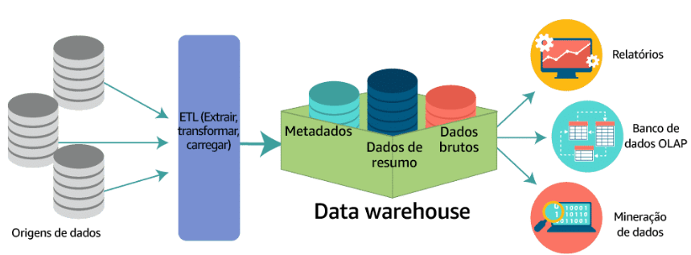

* Um data warehouse é um repositório central de informações provenientes de uma ou mais origens de dados. Os dados fluem para um data warehouse de sistemas transacionais, bancos de dados relacionais e outras fontes. Essas origens de dados podem incluir dados estruturados, semiestruturados e não estruturados. Essas origens de dados são transformadas em dados estruturados antes de serem armazenadas no data warehouse.

* Os dados são armazenados no data warehouse usando um esquema. Um esquema define como os dados são armazenados em tabelas, colunas e linhas. O esquema impõe restrições nos dados para garantir a integridade deles. O processo de transformação muitas vezes envolve as etapas necessárias para fazer com que os dados da fonte estejam em conformidade com o esquema. Após a primeira ingestão bem-sucedida de dados no data warehouse, o processo de ingestão e transformação dos dados pode continuar em um ritmo regular.

* Analistas de negócios, cientistas de dados e tomadores de decisão acessam os dados por ferramentas de business intelligence (BI), clientes SQL e outros aplicativos de análise. As empresas usam ferramentas de relatórios, painéis e análise para extrair informações dos dados, monitorar o desempenho dos negócios e corroborar a tomada de decisões. Essas ferramentas de relatórios, painéis e análises são alimentados por data warehouses, que armazenam dados com eficiência para minimizar a E/S e entregar resultados de consultas com velocidades altíssimas a centenas e milhares de usuários simultâneos.

* Um subconjunto de dados de um data warehouse é chamado de __data mart__. Os data marts __se concentram em apenas um assunto ou uma área funcional__. Um data warehouse pode conter todas as fontes relevantes para uma empresa, mas um data mart pode armazenar __apenas as fontes de um único departamento__. Como os data marts geralmente são uma cópia dos dados já contidos em um data warehouse, eles geralmente são __rápidos e simples de implementar__.

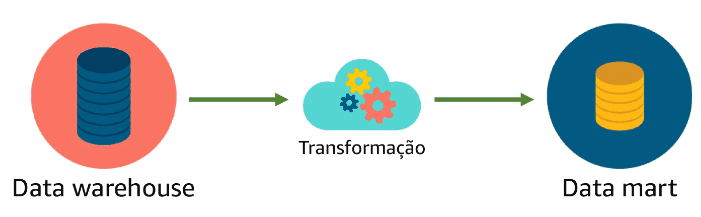

##### Data warehousing tradicional: vantagens e desvantagens

- Vantagens:
    - Rápida recuperação de dados
    - Conjuntos de dados com curadoria
    - Armazenamento centralizado
    - Melhor business intelligence

* Desvantagens:
    * Custo elevado para implementar
    * Manutenção pode ser desafiadora
    * Preocupação com segurança
    * Dificuldade de escalar para atender á demanda

##### Amazon Redshift

* O Amazon Redshift supera todos esses pontos negativos oferecendo um ambiente baseado na nuvem, escalável e seguro para seu data warehouse. É fácil configurar, implantar e gerenciar o Amazon Redshift, sendo que ele oferece desempenho até 10 vezes mais rápido do que outras soluções de data warehousing.

* Serviço de DW da AWS para implementação em minutos. Construído para armazenar e consultar até petabytes de dados.

**Amazon Redshift Spectrum** = Permite combinar seu Data Lake e Data Warehouse como se fossem uma única fonte de dados, sem precisar movimentar dados. Consultas limpas de todos os seus dados, è possível executar uma única consulta em exabytes de dados.

##### Comparação entre data warehouses e data lakes

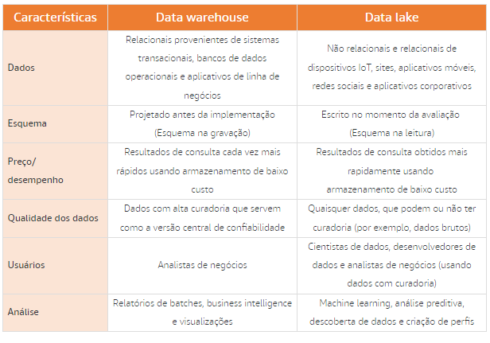

###### ANÁLISE DE UM DATA WAREHOUSE

Para que a avaliação seja mais eficaz, ela deve ser feita em dados que foram processados e limpos. Isso muitas vezes significa implementar uma operação de ETL para coletar, limpar e transformar os dados. Esses dados são então colocados em um data warehouse. É muito comum que dados de várias partes diferentes da organização sejam combinados em um único data warehouse.

O Amazon Redshift é uma solução de data warehousing especialmente projetada para cargas de trabalho de todos os tamanhos. O Amazon Redshift Spectrum ainda oferece a capacidade de consultar dados hospedados em um data lake do Amazon S3.

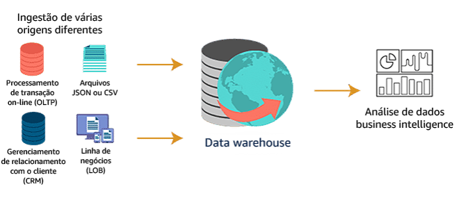

###### ANÁLISE DE UM DATA LAKE

Data lakes são a extensão dos data warehouses

- __Amazon S3__ = Serviço de DL da AWS

Os data lakes fornecem aos clientes um meio de incluir dados não estruturados e semiestruturados em sua análise. As consultas analíticas podem ser executadas em dados catalogados em um data lake. Isso amplia o alcance da análise para além dos limites de um único data warehouse.

As empresas podem armazenar com segurança dados provenientes de aplicativos e dispositivos em seu formato nativo, com alta disponibilidade, durabilidade, baixo custo e em qualquer escala. As empresas podem acessar e analisar dados facilmente de várias maneiras usando as ferramentas e os frameworks de sua escolha, com alto desempenho e de forma econômica, sem precisar mover grandes quantidades de dados entre sistemas de armazenamento e análise.

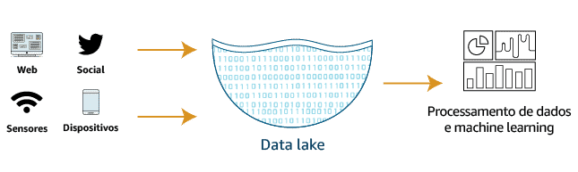

###### AWS: DATA LAKES E ANÁLISES

A AWS fornece um portfólio abrangente de serviços que permitem que os clientes criem seus data lakes na nuvem e analisem todos os seus dados com o mais amplo conjunto de estratégias analíticas, incluindo machine learning.

Como resultado, há mais organizações executando seus data lakes e análises na AWS do que em qualquer outro lugar.

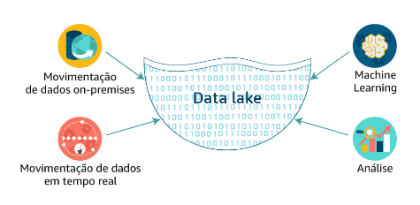

##### Armazenamento de dados em GRANDE escala

Discutimos várias recomendações para armazenar dados: 

- Ao armazenar objetos ou arquivos individuais, recomendamos o Amazon S3.
- Ao armazenar volumes massivos de dados, semiestruturados e não estruturados, recomendamos a criação de um data lake no Amazon S3.
- Ao armazenar grandes quantidades de dados estruturados para avaliaçãos complexas, recomendamos armazenar seus dados no Amazon Redshift.

Quando muitas pessoas pensam em trabalhar com um volume enorme de dados em constante movimentação, a primeira coisa que vem à mente é o Hadoop. Na AWS, os frameworks Hadoop são implementados usando o Amazon EMR e o AWS Glue. Esses serviços implementam o framework Hadoop para consumir, transformar, analisar e mover resultados para datastores analíticos.

##### Apache Hadoop

O Hadoop usa uma __arquitetura de processamento distribuído__, no qual uma tarefa é mapeada para um cluster de servidores convencionais para processamento. Cada bloco de trabalho distribuído aos servidores do cluster pode ser executado ou re-executado em qualquer um dos servidores. Os servidores do cluster usam frequentemente o __Hadoop Distributed File System (HDFS)__ para armazenar dados localmente para processamento. Os resultados da computação realizada pelos servidores são reduzidos a um único conjunto de saída. Um nó, designado como nó principal, controla a distribuição de tarefas e pode lidar automaticamente com falhas dos servidores.

- hadoop é um framework com diversas ferramentas para ETL
- hadoop não é um banco de dados
- não substitui sistemas de dados existentes
- também não é uma aplicação única

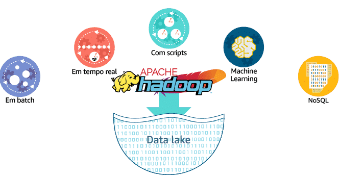

###### Benefícios do uso do Apache Hadoop

- __LIDA MELHOR COM A INCERTEZA__ = O Hadoop facilita a navegação de dados, descoberta e avaliação única de dados. Com o Hadoop, você pode compensar acontecimentos inesperados analisando grandes quantidades de dados rapidamente para formar uma resposta.

- __GERENCIA VARIEDADE DE DADOS__ = Diferente dos sistemas tradicionais de bancos de dados, o Hadoop pode processar dados estruturados, semiestruturados ou não estruturados. Isso inclui praticamente qualquer formato de dados disponível no momento.

Além de manipular nativamente muitos tipos de dados (como XML, CSV, texto, arquivos de log, objetos, SQL, JSON e binários), você pode usar o Hadoop para transformar dados em formatos que permitem melhor integração com seus conjuntos de dados existentes. Além disso, você pode armazenar dados com ou sem um esquema e executar operações de ETL em grande escala para transformar seus dados.

- __TEM AMPLA SELEÇÃO DE SOLUÇÕES__ = Como o Hadoop tem código aberto, vários projetos de ecossistema estão disponíveis para ajudar a analisar os vários tipos de dados que o Hadoop pode processar e analisar.

Esses projetos proporcionam uma flexibilidade enorme quando você está desenvolvendo soluções de análise de dados. Os frameworks de programação do Hadoop (como o Hive e o Pig) podem oferecer suporte a praticamente qualquer caso de uso de análise de dados para seus aplicativos.

- __VISA AO VOLUME E À VELOCIDADE__ = Graças à arquitetura distribuída do Hadoop, os clusters podem processar enormes quantidades de dados de maneira econômica. Adicionar mais recursos de processamento de dados é tão simples quanto adicionar mais servidores ao cluster (scaling horizontal).

###### Implementação do Hadoop com o Amazon EMR

O Amazon EMR é o serviço AWS que implementa frameworks Hadoop. O serviço fará a ingestão dos dados de praticamente qualquer tipo de origem a praticamente qualquer velocidade! O Amazon EMR consegue implementar dois sistemas de arquivos diferentes: HDFS ou Elastic MapReduce File System (EMRFS). Um sistema de arquivos é um conjunto de regras organizacionais que controlam como os arquivos são armazenados. 

Amazon EMR = grandes quantidades de dados + insights na mesma velocidade
  - realiza operações de ETL
  - Estrutura de trabalho gerenciada do Hadoop
  - não há necessidade de carregar os dados para o cluster (hadoop on-premises)

###### HDFS

Para lidar rapidamente com volumes enormes de dados, o sistema de processamento exigia uma maneira de distribuir a carga de leitura e gravação de arquivos em dezenas ou até centenas de servidores de alta capacidade. O HDFS é um __armazenamento distribuído__ que permite que os arquivos sejam lidos e gravados em clusters de servidores em paralelo. Isso reduz drasticamente a duração total de cada operação.

É útil compreender o funcionamento interno de um cluster do HDFS. Um cluster do HDFS consiste primariamente em um NameNode, que gerencia os metadados do sistema de arquivos, e DataNodes, que armazenam os dados reais.

###### Componentes da arquitetura do HDFS

1. 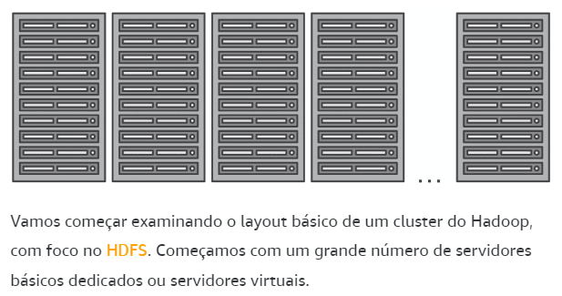
2. 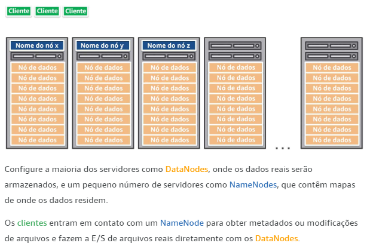
3. 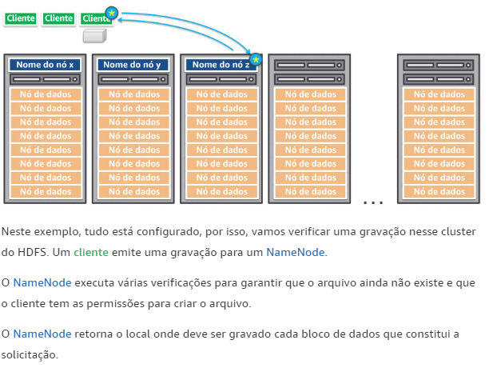
4. 
5. 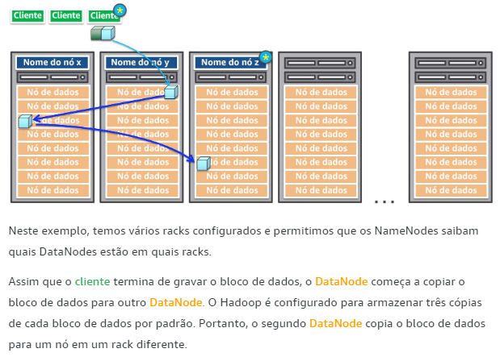
6. 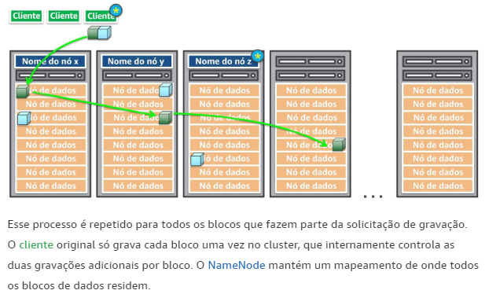

###### Amazon EMR 

é o serviço AWS que implementa frameworks Hadoop(Apache Spark e Hive). Um processo do Amazon EMR começa ingerindo dados de uma ou mais origens de dados e armazenando esses dados em um sistema de arquivos. Se estiver usando o HDFS, o sistema de arquivos será armazenado como um volume do Elastic Block Store. Esse volume de armazenamento no EMR é efêmero, o que significa que o armazenamento é de natureza temporária. Assim que os dados forem copiados para o volume do HDFS, a transformação e a avaliação dos dados serão executadas. Em seguida, os resultados são enviados para um datastore analítico, como um data lake do Amazon S3 ou um data warehouse do Amazon Redshift.

##### Amazon EMRFS

O Amazon EMR oferece uma alternativa ao HDFS: o EMR File System (EMRFS). O EMRFS pode ajudar a garantir que haja uma “fonte confiável” persistente para dados do HDFS armazenados no Amazon S3. Ao implementar o EMRFS, não é necessário copiar dados para o cluster antes de transformar e analisar os dados como no HDFS. O EMRFS pode catalogar dados em um data lake no Amazon S3. O tempo economizado eliminando a etapa de cópia pode melhorar drasticamente o desempenho do cluster.

## Velocidade: processamento de dados

"Quando as empresas __precisam de informações rápidas__ dos dados que estão coletando, mas os __sistemas__ implantados simplesmente __não conseguem atender às necessidades__, há um problema de __velocidade__."

### O problema de velocidade

A velocidade com que os dados são gerados é cada vez maior. E-mails, fotos, publicações do Twitter e do Facebook, arquivos de log e dispositivos IoT são exemplos de dados sendo gerados rapidamente e que devem ser coletados, processados, analisados e armazenados em alta velocidade. 

A coleta e o processamento de dados são combinados em um único conceito conhecido como processamento de dados.

O __processamento de dados__ significa a coleta e a manipulação de dados para produzir informações significativas. A coleta de dados é dividida em duas partes: 

- __Coleta de dados__: 
  - De várias fontes para armazenamento e avaliação de origem única

- __Processamento de dados__:
  - Formatação, organização e controle de dados.

### introdução aos métodos de processamento de dados DataSet

Podemos utilizar Streaming e Batch no mesmo DataSet.

O processamento de dados é essencial para qualquer sistema de dados. O processamento de dados define os métodos usados para coletar dados e apresentá-los a mecanismos analíticos ou de armazenamento.

Pode ser necessário realizar o processamento de dados somente uma vez por dia, disponibilizando os resultados na manhã seguinte, ou pode ser necessário executar o processamento e disponibilizar os resultados imediatamente. Essa variação na velocidade na qual o processamento de dados deve ocorrer pode ser dividida em quatro categorias.

#### Processamento em Batch

* Utilizado para obter insights profundos de análises complexas, como: Transações de cartão de crédito.

* Grandes intermitências de dados, esse processamento é executado em **datasets** como: _Logs de servidor, dados financeiros, relatórios de fraudes e clickstreams_.

* Normalmente usa uma única aplicação para coletar, processar e armazenar dados temporariamente, enquanto ele está sendo processado, a etapa final do processamento em batch, é o carregamento dos dados em armazenamento de dados para ser feita a análise.

* __Amazon EMR__ = utiliza ferramentas como Spark e Hive para executar processamento de dados complexos. Parte do processamento inclui fazer uma análise dos dados, em batch, todo o conjunto de dados é disponibilizado para consultas analíticas, permitindo análise altamente complexas.

* O Batch é comumente implementando nos casos de obtenção de insights profundos e análises avançadas.

* A latência de processamento em batch pode ser de minutos a horas, dependendo da complexidade do que está sendo executado.

* É preciso entender os requisitos de tamanho e velocidade do batch ajudará a selecionar os serviços adequados para sua solução de Data Analytics.

- __Programado (Agendado)__: Representa dados que são processados em um volume muito grande de forma programada regularmente. Por exemplo, uma vez por semana ou uma vez por dia. Em geral, é a mesma quantidade de dados com cada carga, tornando essas cargas de trabalho previsíveis.

- __Periódico__: É um batch de dados processado em momentos irregulares. Essas cargas de trabalho geralmente são executadas quando uma determinada quantidade de dados é coletada. Isso pode torná-las imprevisíveis e difíceis de planejar.

#### Processamento em Stream 

* Utilizado para obter insights iniciais e feedback em tempo real.

* Quando recebemos um sms após utilizar o cartão, é um alerta de prevenção de fraudes, provenientes de dados de um streaming.

* Pequenas intermitências de dados, Significa processar dados em um fluxo contínuo medido em **Kilobytes**.

* O stream é utilizado quando precisar de um **feedback em tempo real** ou **insights contínuos**.

* É executado em conjuntos de dados como: _sensor IoT, compras de comércio eletrônico, atividades de jogadores, Clickstreams ou informações de redes sociais._

* É utilizado vários serviços para Stream: para consumir fluxo constante de dados, processar e analisar o fluxo, carregar os dados em um datastore analítico, se necessário. Na AWS temos os serviços de : __Amazon kinesis Data Firehose__ e o __Amazon kinesis Data Streams__ que são utilizados para consumir e carregar o fluxo de dados em um datastore analíticos. O __Amazon kinesis Data Analytics__ pode ser usado para processar e analisar o fluxo de dados, permite que você possa consultar uma janela de tempo contínua de dados, por exemplo, dos últimos dois minutos.

* A latência em um sistema de processamento de streaming é de segundos a milissegundos.

- __Quase em tempo real__:  representa dados de streaming que são processados em __pequenos batchs individuais__. Os batchs são constantemente coletados e __processados em minutos__ após a geração dos dados.
  
- __Em tempo real__: representa dados de streaming que são processados em __batchs individuais muito pequenos__. Os batchs são constantemente coletados e __processados em milissegundos__ após a geração dos dados.

#### Características da velocidade de processamento de dados

A capacidade de um sistema processar dados dependerá muito dos requisitos exigidos dele. Escolher o sistema certo é essencial para uma implementação bem-sucedida. Abaixo estão as características das quatro velocidades de coleta e processamento de dados.

**COLETA DE DADOS**

- **Em batch**: a velocidade é muito previsível no processamento em batch. Isso equivale a altos picos de transferência de dados em intervalos programados.

- **Periódico**: a velocidade é menos previsível no processamento periódico. A perda de eventos programados pode sobrecarregar os sistemas e deve ser considerada.

- **Quase em tempo real**: a velocidade é uma grande preocupação no processamento quase em tempo real. Esses sistemas exigem que os dados sejam processados em minutos após a coleta inicial dos dados. Isso pode sobrecarregar bastante os sistemas de processamento e análise envolvidos.

- **Em tempo real**: a velocidade é a maior preocupação para sistemas de processamento em tempo real. As informações não podem levar minutos para serem processadas. Elas devem ser processadas em segundos para serem válidas e manterem sua utilidade.

**PROCESSAMENTO DE DADOS**

- **Batch e periódico**: após a coleta dos dados, o processamento pode ser feito em um ambiente controlado. Existe tempo para planejar os recursos apropriados.

- **Quase em tempo real e em tempo real**: a coleta de dados leva a uma necessidade imediata de processamento. Dependendo da complexidade do processamento (limpeza, depuração, curadoria), pode haver redução significativa da velocidade da solução. Planeje adequadamente.

Outra característica principal da velocidade dos dados é a aceleração de dados, o que significa a taxa na qual grandes coleções de dados podem ser ingeridas, processadas e analisadas. A aceleração de dados não é constante, ela vem em picos. Considere o Twitter como exemplo. Hashtags podem se tornar imensamente populares e aparecer centenas de vezes em apenas segundos, ou diminuir a velocidade para uma tag por hora. Isso é a aceleração de dados em ação. Seu sistema deve conseguir lidar de forma eficiente com o pico de centenas de tags por segundo e com a baixa demanda de uma tag por hora. 

##### Atributos do processamento em batch e em stream

A tabela a seguir destaca a diferença entre o processamento em batch e o processamento em stream: 

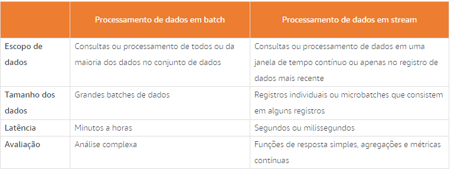

##### Desafios de velocidade

1. **Ingestão periódica de dados em velocidade com processamento em batch**

Imagine que uma rede de varejo esteja tentando analisar dados de ponto de venda (PDV) de suas franquias. As lojas estão localizadas em todo o mundo. Cada local transmite batches de dados para o data center central periodicamente durante todo o dia. O cliente prefere fazer a avaliação dos conjuntos de dados às 23h50 do fuso horário padrão oriental americano (Eastern Standard Time). Nesse momento, todos os conjuntos de dados devem ser rapidamente processados para que os relatórios possam ser gerados e entregues aos gerentes de filiais em todo o mundo o mais rápido possível. A coleta mais lenta de dados seguida por um requisito de processamento rápido é um desafio comum.

2. **Ingestão de dados de alta velocidade com processamento em tempo real**

Imagine uma empresa de mídia que toma decisões com base em dados de stream de cliques coletados de redes sociais. A quantidade total de dados produzidos por segundo é enorme. A coleta deve ser rápida o suficiente para reunir todos os dados sem perder nada. Uma vez coletados, esses dados devem ser processados com a mesma rapidez em um fluxo contínuo. A coleta rápida de dados seguida pelo processamento rápido de dados é um padrão comum da análise de streaming.

### introdução ao processamento de dados em batch

O processamento em batch geralmente é considerado um processo lento. Esse não é o caso. O processamento em batch deve consumir, de maneira rápida e eficiente, uma enorme quantidade de dados de uma só vez. Isso gera desafios que não existem com o processamento em stream.

O processamento de dados em batch oferece às empresas a capacidade de se aprofundarem nos dados coletados para produzir análise complexa que não pode ser obtida apenas usando a análise de streaming.

O processamento em batch é a execução de uma série de programas ou trabalhos em um ou mais computadores sem intervenção manual. Os dados são coletados em batches de maneira __assíncrona__. O batch é enviado a um sistema de processamento quando condições específicas são atendidas, como um horário específico do dia. Os resultados do trabalho de processamento são enviados a um local de armazenamento que pode ser consultado posteriormente, conforme necessário..

Os dados são coletados em batches -> São processados em registros -> Os registros são enviados para o armazenamento

- Priorização de trabalhos e alocação de recursos
- Um único batch pode haver milhões ou bilhões de registros.

#### Processamento de dados em batch com o Amazon EMR e o Apache Hadoop

Amazon EMR = desacoplamento entre o sistema de coleta e o sistema de processamento, isso é feito implementando duas estruturas de trabalho em comum: Hadoop ou Spark.

As organizações que precisam de soluções de big data estão trabalhando com dados em volume e velocidade tão altos que os ambientes tradicionais não conseguem atender às suas necessidades.

O Amazon EMR é um serviço gerenciado para a implantação de cargas de trabalho do Apache Hadoop. Além de executar o framework Apache Hadoop, você também pode executar outros frameworks distribuídos conhecidos, como Apache Spark, HBase, Presto e Flink no EMR. Você tem a vantagem adicional de poder interagir com dados em outros datastores da AWS, como o Amazon S3 e o Amazon DynamoDB. 

- __Hadoop rodando no EMR__ = Ele irá configurar um cluster de instâncias do EC2 para servir como uma única solução de armazenamento distribuído e processamento. Isso provê velocidade, tolerância a falhas e a habilidade de escalar separadamente as EC2 que coletam o dado, das intâncias que realizam o processamento. Ele consome e processa simultaneamente grandes volumes de dados, estruturados ou não, de diversas fontes. Análise mais profunda que qualquer sistema possa oferecer.
  
- __Spark rodando no EMR__ = A diferença pro hadoop, é que o Spark usa o armazenamento em cache na memória e a execução é otimizada para um performance mais rápida. As análises são primeiro realizadas filtrando os dados, depois agregando. O Spark evita gravar dados no armazenamento, preferindo manter os dados na memória o tempo todo.

- __tanto o Hadoop quanto o Spark__ = Oferecem processamento geral em batch, Análise de streaming, machine learning, Banco de dados de grafos e Consultas ad hoc.

Os Amazon EMR notebooks oferecem um ambiente de desenvolvimento e colaboração sem servidor para consultas únicas e avaliaçãos exploratórias. Você pode manipular os dados e gerar gráficos de dados usando ferramentas gráficas avançadas. Os Amazon EMR notebooks monitoram seus trabalhos e até ajudam você a depurar o código dos notebooks.

#### Exploração do Apache Hadoop

O Apache Hadoop é um sistema escalável de armazenamento e processamento de dados em batch. Ele usa hardware de servidor de commodity e fornece tolerância a falhas por meio de software. O Hadoop complementa os sistemas de dados existentes ao ingerir e processar simultaneamente grandes volumes de dados, estruturados ou não, de qualquer quantidade de fontes, o que permite uma avaliação mais profunda do que qualquer outro sistema pode oferecer. Esses resultados podem ser entregues a qualquer sistema empresarial existente para uso adicional, independentemente do Hadoop.

O Hadoop é uma plataforma que fornece módulos distintos:

- __Hadoop Common__

O Hadoop Common é o conjunto de utilitários e bibliotecas Java que oferecem suporte a outros módulos do Hadoop. Essas bibliotecas ajudam a abstrair o sistema de arquivos dos componentes de processamento. Esses arquivos e scripts Java são necessários para iniciar o Hadoop.

* __Hadoop Distributed File System (HDFS)__

O Hadoop Distributed File System (HDFS) é o sistema de arquivos distribuídos que armazena os dados em um ambiente de alta taxa de transferência de nós da comunidade. Essa arquitetura garante acesso aos dados do aplicativo com largura de banda agregada alta.

- __Hadoop YARN__

O Hadoop YARN é o framework de gerenciamento de recursos responsável por programar e executar trabalhos de processamento.

* __Hadoop MapReduce__

O Hadoop MapReduce é um sistema baseado em YARN que permite o processamento paralelo de grandes conjuntos de dados no cluster.

#### Arquitetura de processamento em batch

O processamento em batch pode ser feito de diferentes maneiras usando os serviços AWS. Na próxima arquitetura, usaremos os serviços a seguir.

- O __Amazon Simple Storage Service (Amazon S3)__ é um serviço de armazenamento de objetos que oferece escalabilidade, disponibilidade de dados, segurança e desempenho líderes do setor.

* O __AWS Lambda__ permite executar código sem provisionar ou gerenciar servidores. Você paga apenas pelo tempo de computação consumido, sem haver cobrança quando o código não está em execução.

- O __Amazon EMR__ fornece um framework Hadoop gerenciado que torna fácil, rápido e econômico processar grandes quantidades de dados em instâncias do Amazon EC2 dinamicamente escaláveis.

* O __AWS Glue__ é um serviço de extração, transformação e carregamento (ETL) totalmente gerenciado que facilita a preparação e carregamento de dados para a análise.

- O __Amazon Redshift__ é um data warehouse rápido e escalável que torna simples e econômica a análise de todos os seus dados no data warehouse e data lake.

* O diagrama de arquitetura abaixo descreve os componentes e o fluxo de dados de um sistema analítico básico de batches usando uma abordagem tradicional.

Essa abordagem usa o __Amazon S3__ para armazenar todos dados eventualmente processados, o __AWS Lambda__ para ETL intermediário em nível de arquivo usado a cada quatro horas para capturar quaisquer novos dados dentro do bucker no S3 e envia-los para o EMR, o __Amazon EMR__ para ETL agregado (trabalho pesado, transformação consolidada e mecanismo de carregamento) esse programa cria os lotes, os resultados serão enviados para o redshift e o __Amazon Redshift__ como hospedagem de dados em data warehouse necessários para geração de relatórios. 

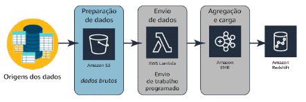

- O diagrama de arquitetura abaixo descreve o mesmo fluxo de dados acima, exigindo menos configuração. O AWS Glue para ETL agregado (trabalho pesado, transformação consolidada e mecanismo de carregamento).

O __AWS Glue__ É um serviço totalmente gerenciado que categoriza, limpa, enriquece e move dados de maneira confiável entre vários armazenamento de dados, O glue Simplifica e automatiza tarefas difíceis e demoradas de descoberta, conversão, mapeamento e agendamento de jobs de dados, ele simplifica o processamento de dados. Ao contrário do Amazon EMR, que requer gerenciamento e configuração de todos os componentes do serviço.

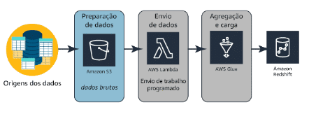

#### Casos de uso de processamento em batch

**Análise de logs**

O Amazon EMR pode ser usado para processar logs gerados por aplicativos móveis e da web. O serviço ajuda os clientes a transformar petabytes de dados não estruturados ou semiestruturados em informações úteis sobre seus aplicativos ou usuários. Nesses casos de uso, os logs geralmente são coletados em batches e agregados e analisados no final do dia para obter informações significativas.

**Visualização unificada de dados entre múltiplos datastores**

É possível usar o AWS Glue Data Catalog para descobrir e fazer pesquisas rapidamente em vários conjuntos de dados da AWS sem precisar migrar os dados. Quando eles são catalogados, são disponibilizados imediatamente para pesquisa e consulta usando o Amazon Athena, o Amazon EMR e o Amazon Redshift Spectrum.

**Análise preditiva**

O Apache Spark no EMR inclui o MLlib para algoritmos de machine learning escaláveis ou você pode usar suas próprias bibliotecas. Ao armazenar conjuntos de dados na memória, o Spark pode oferecer excelente desempenho para cargas de trabalho comuns de machine learning.

**Consultas em um data lake do Amazon S3**

Data lakes são uma maneira cada vez mais popular de armazenar e analisar dados estruturados e não estruturados. Se quiser criar seu próprio data lake personalizado do Amazon S3, o AWS Glue poderá disponibilizar todos os seus dados imediatamente para análise sem que seja necessário migrá-los.

### introdução ao processamento de dados de stream

O processamento de dados em stream é uma das áreas de processamento que mais cresce. O número de dispositivos coletando informações em tempo real está crescendo rapidamente. Isso impulsiona a necessidade por soluções de processamento que correspondam à velocidade da geração de dados.

O processamento de dados em stream oferece às empresas a capacidade de obter informações de seus dados em segundos após a coleta dos dados.

As empresas não podem mais se dar ao luxo de ignorar ou evitar grandes quantidades de dados que estão sendo enviados por meio de aplicativos web, compras de comércio eletrônico, atividades de jogadores em jogos virtuais e informações de redes sociais.

- __Produtor__: Dados são enviados constantemente para o serviço de streaming
- __Consumidor__: O fluxo é processado em registros
- __Os registros__ são enviados para o armazenamento.

#### Processamento de big data em stream

Há vários motivos para usar soluções de dados de streaming. Em um sistema de processamento em batch, o processamento é sempre assíncrono e o sistema de coleta e de processamento costumam ser agrupados. Com soluções de streaming, o sistema de coleta (produtor) e o sistema de processamento (consumidor) são sempre separados. Os dados de streaming usam o que chamamos de produtores de dados. Cada um desses produtores pode gravar seus dados no mesmo endpoint, permitindo que vários streams de dados sejam combinados em um único stream para processamento. Outra grande vantagem é a capacidade de preservar a ordem dos dados do cliente e a capacidade de executar o consumo paralelo de dados. Isso permite que múltiplos usuários trabalhem simultaneamente nos mesmos dados.

#### Benefícios do processamento em stream

- Desacoplar coleta e processamento
- Coletar vários fluxos juntos, permite que em um único endpoint, fazer com que os dados de vários stream diferentes, sejam combinados em um único stream de processamento.
- Preservar a ordem do cliente
- Consumir dados em paralelo, permite que vários consumidores trabalhem simultaneamente nos mesmos dados para criar aplicações paralelas.

#### Processamento de dados em stream com o Amazon Kinesis

No processamento em stream, você usa vários serviços: um serviço para ingerir o stream constante de dados, outro para processar e analisar o stream, e outro para carregar os dados em um datastore analítico, se necessário. O Amazon Kinesis atende a cada uma dessas necessidades e você pode usar cada serviço do Kinesis independentemente para criar uma solução de streaming ideal.

* __Amazon Kinesis Data Firehose__

O Amazon Kinesis Data Firehose é a maneira mais fácil de capturar, transformar e carregar streams de dados em datastores da AWS para análises quase em tempo real usando ferramentas existentes de business intelligence.

- __Amazon Kinesis Data Streams__

O Amazon Kinesis Data Streams permite criar aplicativos personalizados e em tempo real para processar streams de dados usando frameworks comuns de processamento de streams.

* __Amazon Kinesis Video Streams__

O Amazon Kinesis Video Streams facilita o streaming seguro de vídeos a partir de dispositivos conectados à AWS, onde podem ser usados para análise, machine learning (ML) e outros processamentos.

- __Amazon Kinesis Data Analytics__

O Amazon Kinesis Data Analytics é a maneira mais fácil de processar streams de dados em tempo real com SQL ou Java sem precisar aprender novas linguagens de programação ou frameworks de processamento.

#### Arquitetura de processamento em stream

Vários serviços estão envolvidos na arquitetura a seguir:

- O __Amazon Kinesis Data Firehose__ é a maneira mais fácil de capturar, transformar e carregar streams de dados em datastores da AWS para análises quase em tempo real usando ferramentas existentes de business intelligence.

* O __Amazon Kinesis Data Analytics__ é a maneira mais fácil de processar streams de dados em tempo real com SQL ou Java sem precisar aprender novas linguagens de programação ou frameworks de processamento.

- O __Amazon S3__ é um serviço de armazenamento de objetos que oferece escalabilidade, disponibilidade de dados, segurança e desempenho líderes do setor.

* O __Amazon Athena__ é um serviço de consultas interativas que facilita a análise de dados no Amazon S3 usando o SQL padrão. O Athena é sem servidor, portanto, não há infraestrutura para gerenciar e você paga apenas pelas consultas executadas.

- O __Amazon QuickSight__ é um serviço de business intelligence (BI) rápido e desenvolvido para a nuvem que facilita o fornecimento de informações a todos em sua organização.

Nessa arquitetura, os dados do sensor estão sendo coletados na forma de stream. Os dados de streaming estão sendo coletados dos dispositivos de sensor pelo __Amazon Kinesis Data Firehose__. Esse serviço é configurado para enviar os dados a serem processados usando o __Amazon Kinesis Data Analytics__. Esse serviço filtra os dados para registros relevantes e envia os dados para outro processo do Kinesis Data Firehose, que coloca os resultados em um bucket do __Amazon S3__ na camada de serviço.

Usando o __Amazon Athena__, os dados no bucket do Amazon S3 agora podem ser consultados para produzir painéis e relatórios detalhados usando o __Amazon QuickSight__.

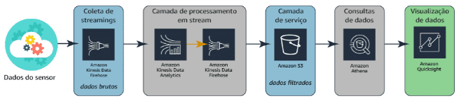

#### Arquitetura de processamento combinado

É importante lembrar que a análise de streaming é muito limitada. Devido ao tamanho de cada pacote de dados e à velocidade de movimentação dos dados, você está limitado à análise simples, como agregar e filtrar os dados. Devido a essa limitação, é comum que as empresas incorporem análise em batch para produzir informações mais profundas sobre os dados antes de produzir painéis e relatórios sobre os dados.

Na arquitetura a seguir, os dados de streaming são coletados pelo mesmo serviço __Amazon Kinesis Data Firehose__ visto na arquitetura acima. Porém, desta vez, os dados são colocados diretamente em um bucket do __Amazon S3__. Um processo separado carrega as configurações do dispositivo do usuário em um segundo bucket do Amazon S3. O __AWS Glue__ é usado, então, para combinar os dois datastores do Amazon S3 e transformá-los em um único conjunto de resultados, que é carregado em um terceiro bucket do Amazon S3 na camada de serviço.

Usando o __Amazon Athena__, os dados no terceiro bucket do Amazon S3 agora podem ser consultados. O __Amazon QuickSight__ pode ser usado para produzir painéis que incluem conteúdo do Amazon Athena e do primeiro bucket do Amazon S3 em que os dados brutos de streaming foram carregados. Isso permite que os negócios executem uma avaliação comparativa dos dados.

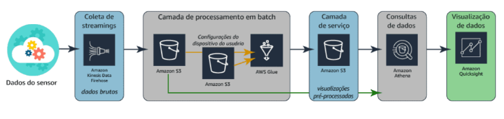

Agora que você viu as duas arquiteturas de forma independente, é hora de ver como elas trabalham juntas para formar uma solução completa.

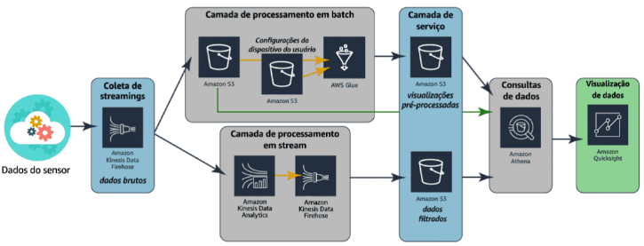

#### Casos de uso de processamento em stream

**Construir aplicativos de análise de vídeo**

Você pode usar o Amazon Kinesis para fazer streaming seguro de vídeo de dispositivos equipados com câmera em residências, escritórios, fábricas e lugares públicos para a AWS. Esses streams de vídeo podem ser usados para reprodução de vídeo, monitoramento de segurança, detecção de rostos, machine learning e outras análises. A integração desses dados aos seus aplicativos permite uma grande variedade de aprimoramentos de clientes e recursos de mineração de dados.

**Evoluir do processamento em batch para a análise em tempo real**

O Amazon Kinesis permite executar análises em tempo real de dados que antes eram analisados usando processamento em batch em data warehouses ou frameworks Hadoop. Os casos de uso mais comuns incluem data lakes, ciência de dados e machine learning. Você pode usar o Kinesis Data Firehose para carregar continuamente dados de streaming em data lakes do Amazon S3. Além disso, você pode atualizar modelos de machine learning com maior frequência assim que novos dados são disponibilizados, garantindo a precisão e a confiabilidade dos resultados.

**Analisar dados de dispositivos IoT**

Você pode usar o Amazon Kinesis para processar dados de streaming de dispositivos IoT, como aparelhos domésticos, sensores embutidos e conversores de TV (set-top boxes). Em seguida, use esses dados para enviar alertas em tempo real ou executar de forma programática outras ações quando um sensor exceder determinados limites operacionais. Use os nossos exemplos de códigos de análise de IoT para criar seu aplicativo, sem precisar começar do zero.

## Variedade: estruturas e tipos de dados

"Quando sua empresa fica __sobrecarregada__ pelo __grande número de origens dos dados__ para analisar e você __não consegue encontrar sistemas__ para fazer a análise, sabe que tem um problema de __variedade__."

### introdução ao armazenamento de dados de origem

Há indiscutivelmente tantos tipos diferentes de dados quanto pessoas. Essa ampla variedade rapidamente se torna um desafio para empresas que estão buscando diversidade em análise. Felizmente, os dados costumam ser classificados com base nos tipos de armazenamento usados.

Cada solução de avaliação de dados começa com uma origem dos dados. Uma origem dos dados pode ser praticamente qualquer coisa: uma pasta em um servidor de arquivos, um banco de dados, uma página web e até mesmo um dispositivo wearable podem ser considerados uma origem de dados. Em cada uma dessas origens, os dados são armazenados de forma específica. Algumas origens dos dados usam um esquema para organizar conteúdo e índices para melhorar o desempenho. Outras organizam dados de maneira mais flexível e são chamadas de sem esquema. Origens de dados sem esquema continuam usando índices para melhorar o desempenho. 

### Tipos de origem de dados

#### DADOS ESTRUTURADOS (SQL)

- Dados estruturados são armazenados em um __formato tabular__, muitas vezes em um sistema de gerenciamento de banco de dados (RDBMS).
- Esses dados são organizados com base em um __modelo de dados relacional__ que define e padroniza elementos de dados e a relação deles entre si, chamados de __Schema__. 
- Os dados são armazenados em linhas, com cada linha representando uma única instância de algo (por exemplo, um cliente). 
- Essas linhas são bem compreendidas devido ao esquema da tabela(Schema), que explica o que cada campo na tabela representa. 
- Dados estruturados são organizados em __linhas, colunas e tabelas.__  Isso facilita a consulta de dados estruturados.

- __Dados estruturados são fáceis de analisar, mas a estrutura é difícil de alterar.__

- São encontrados em um __banco de dados transacionais e analíticos__. Os transacionais enfrentam operações pesadas de gravação e atualização, enquanto os bancos de dados analíticos enfrentam operações pesadas de leitura intensa.

- __A desvantagem dos dados estruturados é a falta de flexibilidade__. Digamos que você decidiu que deseja acompanhar a idade dos seus clientes. Você deve reconfigurar o esquema para permitir esse novo dado e considerar todos os registros que não têm um valor para esse novo campo. Não é impossível, mas pode ser um processo muito demorado. __Porém a flexibilidade é ilimitada quando o desenvolvimento inicial é concluído.__

- Exemplos de aplicativos de dados estruturados incluem __Amazon RDS, Amazon Aurora, MySQL, MariaDB, PostgreSQL, Microsoft SQL Server e Oracle.__

#### DADOS SEMIESTRUTURADOS (NoSQL)

- Dados semiestruturados são armazenados na forma de elementos em um arquivo. Esses dados __são organizados com base nos elementos e atributos que os definem__. 
- Eles não estão em conformidade com modelos ou schema de dados. 
- Os dados semiestruturados são considerados como tendo uma __estrutura autodescritiva__. 
- Cada elemento é uma única instância de alguma coisa, como uma conversa. 
- Os atributos dentro de um elemento definem as características dessa conversa. Cada elemento de conversa pode monitorar atributos diferentes. 
- O própio arquivo informará como interpretar os dados dentro dele, a vantagem é que isso __permite que cada tabela ou arquivo tenha sua própia estrutura ou schema__. 
- Isso torna os dados semiestruturados __bastante flexíveis__ e capazes de escalar para atender às demandas dinâmicas de uma empresa com mais rapidez do que os dados estruturados.

- __Dados Semiestruturados são fáceis de gerar e altamente flexíveis, mas podem ser mais difíceis de analisar.__

- A diferença é a análise. ___Pode ser mais difícil analisar dados semiestruturados__ quando os analistas não conseguem prever quais atributos estarão presentes em um determinado conjunto de dados. __Também perde a capacidade de unir duas tabelas ou arquivos__.

- Exemplos de datastores semiestruturados são CSV, XML, JSON, Amazon DynamoDB, Amazon Neptune e Amazon ElastiCache.

#### DADOS NÃO ESTRUTURADOS

- Dados não estruturados são __armazenados na forma de arquivos__. 
- Esses dados não estão em conformidade com um modelo de dados predefinido __nem organizados de maneira predefinida__. 
- Dados não estruturados podem ser __PDFs e CSV__, arquivos de texto, fotografias, gravações de áudio ou até mesmo vídeos. 
- Dados não estruturados estão cheios de informações irrelevantes, o que significa que os arquivos precisam ser pré-processados para fazer avaliaçãos significativas.
- Isso pode ser feito de várias maneiras. Por exemplo, os serviços podem adicionar tags aos dados com base em regras definidas para os tipos de arquivos.
- Os dados também podem ser catalogados para deixá-los disponíveis a serviços de consulta.

- A análise é realizada nos __metadados__, armazenados para cada arquivo. É preciso pré-processar os arquivos para fazer uma análise significativa em dados não estruturados    

- Exemplos de dados não estruturados incluem e-mails, fotos, vídeos, dados de clickstream, Amazon S3 e Amazon Redshift Spectrum.

* __Dados estruturados__ são quentes, __imediatamente prontos__ para serem analisados. 
* __Dados semiestruturados__ são mornos. Alguns estarão prontos para uso e outros __podem precisar de limpeza__ ou pré-processamento.
* __Dados não estruturados__ são um oceano __congelado__, repleto de __tudo o que você precisa__, mas separado por todo tipo de __coisa de que você não precisa__.

#### Características da origem de dados

Estão surgindo novas ferramentas que ajudam as empresas a integrar e analisar todos os tipos de dados. Quando se trata de análise empresarial, os dados estruturados muitas vezes são melhores, pois estão muito bem formatados. As empresas começaram a perceber a necessidade de incluir dados semiestruturados e não estruturados em suas soluções de business intelligence.

Como discutido em uma lição anterior e mostrado no gráfico abaixo, a maioria dos dados que as empresas têm é do tipo não estruturado.

- __Dados estruturados__: 10%, dados tabulares.
- __Dados semiestruturados__: 10%, arquivos CSV, XML, JSON.
- __Dados não estruturados__: 80%, todo o restante.

A DB-Engines é uma organização que percorre a internet, coletando dados sobre o que os profissionais de dados estão questionando. A cada mês, a organização classifica os sistemas de gerenciamento de banco de dados de acordo com sua popularidade. Essa classificação é calculada com base em dados como número de menções em uma grande variedade de sites, Google Trends, discussões técnicas, número de ofertas de trabalho e outros fatores.

O gráfico de pizza a seguir mostra a porcentagem de conversas em fevereiro de 2019 relacionadas a cada tipo de banco de dados. Ao considerar o gráfico acima, mostrando a quantidade de dados não estruturados, é surpreendente que ainda gastamos tanto tempo fazendo perguntas e falando sobre bancos de dados relacionais.

#### Desafios da variedade

**Desafio de negócios**

Imagine um varejista que precisa combinar dados de seu sistema de ponto de venda (PDV) com dados de clickstreams de seu site. Ambos os sistemas produzem informações constantemente: o sistema PDV produz dados estruturados na forma de banco de dados, enquanto os dados de clickstream são gerados em arquivos XML semiestruturados. Essa empresa precisa encontrar uma maneira de processar esses dois tipos de dados diferentes de maneiras significativas para possibilitar correlações entre comentários de produtos on-line e vendas em lojas físicas.

### introdução a datastores estruturados

Os dados estruturados são classificados como dados armazenados em um banco de dados ou em um sistema de gerenciamento de banco de dados (DBMS). Um banco de dados é um conjunto estruturado de dados mantido em um computador, que pode ser acessado de várias maneiras. Um DBMS fornece estrutura aos dados, capacidade de manter os dados durante todo o ciclo de vida e capacidade de gerenciar interações com outros processos e sistemas. Diferentes sistemas de gerenciamento de banco de dados gerenciam a organização de dados de diferentes maneiras para atingir metas específicas, como avaliação complexa, navegação rápida de relacionamentos ou recuperação do estado da sessão.

#### Dados de arquivos de texto puro

Em geral, os dados de __arquivos de texto puro residem em uma planilha, em colunas e linhas__. Não possuem restrição quanto aos valores. Pode não parecer um banco de dados, mas ele atende a todos os requisitos básicos. Esse formato fornece uma base sólida para entender algumas das considerações ao escolher um DBMS.

#### Bancos de dados relacionais

- O armazenamento de arquivos de texto puro pode não atender às suas necessidades de armazenamento de dados estruturados. A próxima etapa lógica é migrar para uma solução mais robusta: um banco de dados relacional.

- Um processo conhecido como normalização ajuda uma empresa a transformar dados de arquivos de texto puro em um banco de dados relacional. A normalização é um conjunto de regras que funcionam juntas para reduzir a redundância, aumentar a confiabilidade e melhorar a consistência do armazenamento de dados.

- Um banco de dados relacional é criado para armazenar dados estruturados para que possam ser coletados, atualizados e consultados facilmente. Bancos de dados relacionais dependem de uma série de estruturas, chamadas de tabelas, para armazenar os dados coletados. Essas tabelas são navegadas usando a linguagem de consulta estruturada ou SQL.

- Logicamente, tabelas de banco de dados relacional agrupam dados com base em uma pessoa, um local, uma coisa ou um evento relacionado a esses dados. Esses agrupamentos são chamados de entidades. Cada entidade é armazenada como uma tabela. 

- __Uma coluna, conhecida como campo, é usada para descrever um atributo da entidade. Uma linha, conhecida como registro, na tabela representa uma única instância de uma entidade.__

- Pense em uma planilha, em que cada linha tem uma célula para cada coluna. Cada célula pode conter um valor. As regras dentro do esquema definem se o atributo é obrigatório ou opcional.

- As relações são criadas primeiramente garantindo que cada linha em uma tabela seja exclusiva. Isso é feito criando uma chave primária. Esse valor de chave primária pode ser usado para criar relações entre tabelas. Uma chave externa é um campo que usa os valores de uma chave primária em outra tabela para definir um registro na tabela atual. Essa ação é o que cria a relação. Alguns mecanismos de banco de dados podem impor essa relação para garantir que apenas os valores da chave primária possam ser usados na chave externa.

* __Vantagens__:
    * A conformidade com ACID(sistemas transacionais).
    * Os dados são facilmente armazenados, editados e recuperados usando uma linguagem SQL comum.
    * A estrutura pode ser aumentada verticalmente com rapidez.
    * Colete, atualize e consulte os dados rapidamente.

- __Desvantagens__
    - A dificuldade no armazenamento de dados não estruturados.
    - As consultas podem ficar lentas devido às complexas exigências de agrupamento.
    - O esquema pode dificultar o aumento da quantidade.

A imagem abaixo dá um exemplo de como você pode transformar dados de arquivos de texto puro em uma estrutura de dados relacional.

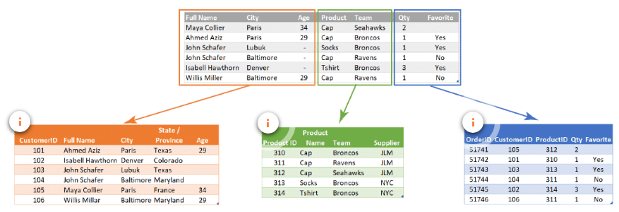

1. **Tabela de Clientes** = Criar uma tabela para os clientes é a primeira etapa. As colunas de nome completo, cidade e idade seriam todas incluídas nesta tabela. A tabela também precisa de uma chave primária. Neste exemplo, ela se chama CustomerID.
2. **Tabela de Produtos** = Criar uma tabela para os produtos é a próxima etapa. Há uma coluna para ProductID(a chave primária dessa tabela), nome do produto, equipe e fornecedor do produto.
3. **Tabela de Pedidos** = As duas últimas colunas dos dados do arquivo de texto puro original (Quantity e Favorite) são usadas em uma tabela que monitora os pedidos. Essa tabela é exclusiva, pois é usada para criar relações com outras duas tabelas. A chave primária da tabela de pedidos é OrderID. A tabela também contém os valores CustomerID e ProductID das outras duas tabelas. Essas duas colunas são conhecidas como chaves externas, pois cada uma delas é a chave primária de outra tabela. Isso é o que cria conexão entre as três tabelas. 

#### Tipos de sistemas de informação

- Há duas maneiras principais, conhecidas como sistemas de informação, de organizar dados em um banco de dados relacional. Os dados podem ser organizados para se concentrar no armazenamento de transações ou no processo de análise de transações.

- Os bancos de dados transacionais são chamados de bancos de dados de processamento de transações on-line (OLTP). Os dados coletados pelos bancos de dados OLTP geralmente alimentam outro tipo de banco de dados que se concentra na análise dos dados transacionais. Os bancos de dados de processamento analítico on-line (OLAP) coletam dados de sistemas OLTP com o objetivo de organizá-los para operações analíticas.

- Operações de escrita e leitura, usam os mesmos recursos, mas de maneiras diferentes e isso dificulta a otimização pra um ou outro.

- **Bancos de dados OLTP (bancos de dados operacionais)**

Bancos de dados de processamento de transações on-line (OLTP), geralmente chamados de __bancos de dados operacionais__, organizam logicamente os dados em __tabelas__, com foco principal na __velocidade da entrada de dados__. Esses bancos de dados são caracterizados por um grande número de operações de inserção(escrita), consulta(leitura), atualização e exclusão.

Todas as decisões sobre a organização de dados e o armazenamento de atributos se baseiam em garantir entrada e atualizações rápidas de dados. __A eficácia de um sistema OLTP geralmente é medida pelo número de transações por segundo.__

- **Bancos de dados OLAP (data warehouses)**

Bancos de dados de processamento analítico on-line (OLAP), geralmente chamados de __data warehouses__, organizam logicamente os dados em tabelas, com foco principal na __velocidade da recuperação de dados por meio de consultas__. Esses bancos de dados são caracterizados por um número relativamente baixo de operações de gravação e a falta de operações de atualização e exclusão.

Todas as decisões sobre a organização de dados e o armazenamento de atributos são baseadas nos tipos de consultas e em outras análises que serão feitas usando os dados. A eficácia de um sistema __OLAP geralmente é medida pelo tempo de resposta dos resultados da consulta__.

#### Comparação entre OLTP e OLAP

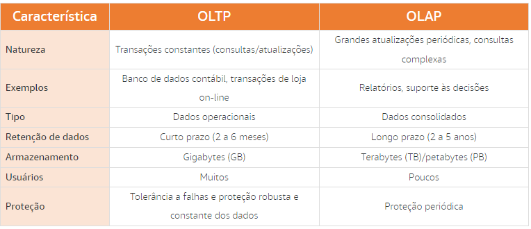

#### Indexação de dados colunares e baseada em linha

Os dados em um banco de dados devem ser indexados para permitir que uma consulta encontre rapidamente os dados necessários para produzir um resultado. __Os índices controlam a maneira como os dados são armazenados fisicamente no disco__. Eles agrupam fisicamente os registros em uma ordem previsível com base em chaves‑valores dentro da tabela. Isso tem um papel importante na velocidade e na eficiência das consultas.

O gráfico a seguir mostra um exemplo de como ter um índice pode aumentar a velocidade da consulta. Sem um índice, a consulta deve verificar 12.000 linhas para encontrar pedidos efetuados na data especificada. Quando a tabela é indexada por OrderDate, a consulta procura ou ignora diretamente o intervalo de pedidos efetuados na data especificada. Nenhum outro dado é verificado.

- Para bancos de dados OLTP ou OLAP usando indexação baseada em linha: Amazon RDS.
- Para bancos de dados OLAP usando indexação colunar: Amazon Redshift.

- baseada em linha

Em um __sistema OLTP__, as consultas mais comuns são chamadas de consultas de pesquisa. Essas consultas precisam retornar várias colunas de dados para cada registro correspondente. Os filtros nesses dados geralmente são baseados nas colunas de chave dessa tabela. Nesse tipo de sistema, você pode consultar para obter detalhes de uma ordem específica.

- dados colunares

Em um __sistema OLAP__, as consultas mais comuns são consultas agregadas. Essas consultas utilizam um grande número de linhas e as reduzem a uma única linha agregando os valores em uma ou mais colunas. Nesse tipo de sistema, você pode consultar para descobrir o número total de itens vendidos em uma data específica.

__Os sistemas OLTP e OLAP podem usar qualquer um dos métodos de indexação__. No entanto, há vantagens em escolher o método mais adequado para os tipos de consultas que serão executadas na maior parte do tempo.

A tabela a seguir detalha algumas das características de cada tipo de índice.

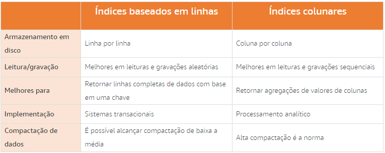

#### Bancos de dados relacionais da AWS

- **DESAFIO DE NEGÓCIOS 1**

Pode ser um grande desafio definir as opções certas quando se trata de migrar bancos de dados on-premises para a nuvem. Você deve examinar cuidadosamente suas opções para definir qual escolha será a melhor para seu aplicativo.

"Tenho um sistema PDV que precisa ser migrado para um DBMS relacional robusta na nuvem, O que devo usar?"

- **A OPÇÃO AWS**

Na AWS, o Amazon Relational Database Service (Amazon RDS) atende as necessidades de muitos sistemas de gerenciamento de banco de dados relacional diferentes. Ele é compatível com a maioria dos mecanismos de banco de dados mais conhecidos, incluindo Amazon Aurora, MySQL, PostgreSQL, MariaDB, Oracle e SQL Server.

O Amazon RDS facilita a configuração, operaração e scaling de um banco de dados relacional na nuvem. O serviço fornece capacidade econômica e redimensionável enquanto automatiza tarefas administrativas demoradas, como provisionamento de hardware, configuração de banco de dados, aplicação de patches e backups.

O Amazon RDS tem tudo o que você pode precisar para um banco de dados OLTP altamente eficiente. O serviço implementa a indexação baseada em linhas para alcançar o desempenho certo para cargas de trabalho transacionais.

- **DESAFIO DE NEGÓCIOS 2**

As solicitações analíticas podem sobrecarregar rapidamente um sistema transacional. Lembre-se de que um sistema transacional foi projetado para a velocidade de entrada de dados. Quando uma grande quantidade de consultas é executada no banco de dados, isso pode diminuir drasticamente as operações de inserção, atualização e exclusão.

"Tenho um banco de dados transacional sobrecarregado com solicitações de consulta. Preciso transferir todas as solicitações analíticas para um sistema baseado na?"

- **A OPÇÃO AWS**

O Amazon Redshift é um data warehouse rápido e dimensionável que permite analisar todos os dados de data warehouses e data lakes de forma simples e econômica. O Amazon Redshift oferece desempenho 10 vezes mais rápido que qualquer outro data warehouse por meio de machine learning, além da execução paralela de consultas em massa e armazenamento colunar em discos de alto desempenho. Você pode configurar e implantar um novo data warehouse em minutos e executar consultas em petabytes de dados no data warehouse do Amazon Redshift e exabytes de dados no data lake criado no Amazon S3.

O Amazon Redshift implementa a indexação colunar para obter o desempenho certo para cargas de trabalho analíticas.

#### Vantagens e desvantagens do banco de dados relacional

O principal benefício de um banco de dados relacional usando SQL é ser uma tecnologia comprovada amplamente adotada e compreendida. Há menos risco envolvido com um banco de dados relacional, especialmente devido à conformidade com ACID e a uma grande comunidade de especialistas na área. Há uma expectativa de latência transacional muito boa, especialmente em hardware adequadamente dimensionado, e bancos de dados relacionais são considerados perfeitos para o OLTP para conjuntos de dados relativamente pequenos.

Existem preocupações de escalabilidade com um banco de dados relacional. À medida que os conjuntos de dados crescem, a única maneira de manter o desempenho é aumentar as capacidades de hardware dos servidores que executam o aplicativo. Outro problema importante é o esquema fixo de bancos de dados relacionais. É difícil fazer alterações sem interrupções nas arquiteturas básicas de banco de dados, o que pode afetar os tempos de desenvolvimento de novas funcionalidades.

#### Preparação de dados relacionais para processamento de dados

Ao trabalhar com um banco de dados relacional, você deve prestar atenção em como os dados serão usados na solução de avaliação de dados. É muito comum executar vários tipos de análise nos mesmos dados. Os dados OLTP podem precisar ser transformados em um formato desnormalizado e colocados em um data warehouse ou data mart. Os dados OLAP podem não exigir nenhuma transformação. Pode até haver oportunidades para transformar dados em bancos de dados intermediários que podem ser usados como uma origem dos dados para outros processos analíticos.

### introdução a datastores semiestruturados e não estruturados

Os dados semiestruturados e não estruturados geralmente são armazenados em sistemas de banco de dados não relacionais, às vezes chamados de bancos de dados NoSQL. Esse termo pode causar um pouco de confusão. É importante lembrar que o SQL é uma maneira de consultar dados. Isso implica em uma estrutura precisa. Não relacional ou NoSQL não significa que os dados armazenados não podem ser consultados usando SQL. Uma maneira melhor de pensar nisso: não é apenas SQL.

#### Bancos de dados não relacionais

Bancos de dados não relacionais são criados para armazenar dados semiestruturados e não estruturados de uma forma que ofereça rápida coleta e recuperação. Existem várias categorias amplas de bancos de dados não relacionais e os dados são armazenados em cada um para atender a requisitos específicos. Por exemplo um carrinho de compras abandonado é um registro em um NoSQL e apenas esse registro é removido. E quando o cliente continua com a compra, esses dados podem ser passados para um banco de dados relacional, para um armazenamento persistente e análise

##### Armazenamentos de documentos

Os armazenamentos de documentos são um tipo de banco de dados não relacional que armazena dados semiestruturados e não estruturados na forma de arquivos. Esses arquivos variam em forma, geralmente são logs em formato JSON, BSON e XML. Os arquivos podem ser navegados usando várias linguagens, incluindo Python e Node.js.

Logicamente, os arquivos contêm dados armazenados como uma série de elementos. Cada elemento é uma instância de uma pessoa, local, coisa ou evento. Por exemplo, o armazenamento de documentos pode conter diversos arquivos de log de um conjunto de servidores. Esses arquivos de log podem conter os detalhes desse sistema sem se preocupar com o que os arquivos de log em outros sistemas contêm.

__Vantagens__:
- Flexibilidade;
- Não necessidade de planejar um tipo específico de dados ao criar um;
- Fáceis de dimensionar.

__Desvantagens__:
- Sacrifica a conformidade com ACID para ter flexibilidade;
- Não é possível consultar entre arquivos.

##### Armazenamentos de chave-valor

Bancos de dados de chave-valor são um tipo de banco de dados não relacional que armazena dados não estruturados na forma de pares de chave-valor.

Logicamente, os dados são armazenados em uma única tabela. Na tabela, os valores são associados a uma chave específica. Os valores são armazenados na forma de objetos binários grandes (BLOB) e não exigem um esquema predefinido. Os valores podem ser de praticamente qualquer tipo. Sem Schema fixo.

__Vantagens__: 
- Muito flexíveis;
- São capazes de lidar com uma grande variedade de tipos de dados;
- As chaves são vinculadas diretamente aos seus valores, sem precisar de indexação ou operações de agrupamento complexas;
- O conteúdo de uma chave pode ser facilmente copiado para outros sistemas sem reprogramar os dados.

__Desvantagens__: 
- É impossível consultar valores porque são armazenados como um BLOB único;
- É muito difícil atualizar ou editar o conteúdo de um valor;
- Nem todos os objetos são modelados facilmente como pares de chave-valor.

#### Alterações de Schema em bancos de dados relacionais e não relacionais 

Para entender a flexibilidade avançada em bancos de dados não relacionais, você precisa entender o que é necessário para fazer alterações na organização de dados entre objetos de bancos de dados relacionais e não relacionais.

1. **Esquemas de dados**

Um banco de dados relacional armazena dados na forma de tabelas que contêm linhas, conforme mostrado na imagem à esquerda. Neste exemplo, cada linha representa um único produto que pode ser vendido. Cada coluna armazena um atributo desse produto: o Product ID (ID do Produto), o Product Name (Nome do Produto), o Supplier (Fornecedor), o Price (Preço) e a Unit (Unidade). Observe que ambos os produtos têm uma entrada para cada atributo.

Um banco de dados não relacional armazena dados na forma de arquivos que contêm grupos de informações entre colchetes, conforme mostrado na imagem à direita. Neste exemplo, cada grupo de informações representa um único produto, os mesmos produtos que estão no exemplo à esquerda.

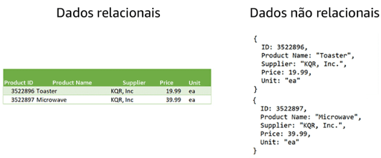

2. **Alterações de esquema em um banco de dados relacional**

As necessidades da empresa mudaram. Você precisa adicionar uma nova coluna para monitorar a classificação de cada produto. Nem todos os produtos já têm uma classificação, por isso, você precisa permitir que a coluna aceite valores NULL.

Para adicionar uma nova coluna à tabela, você precisa:

1. Executar um comando SQL para adicionar a coluna.
2. A tabela agora contém uma coluna vazia.
3. Preencher a nova coluna com um valor para cada registro existente.

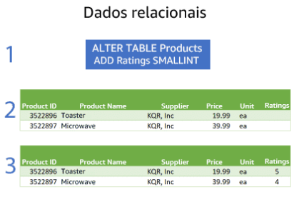

3. **Alterações de esquema em um banco de dados não relacional**

Quando o mesmo requisito é colocado em dados em um banco de dados não relacional, a solução é bem diferente. Basta adicionar os dados para esse registro.

Com um banco de dados não relacional, cada registro pode ter seu próprio conjunto de atributos. Essa flexibilidade é um dos maiores benefícios dos bancos de dados não relacionais.

#### Bancos de dados não relacionais da AWS

**DESAFIO DE NEGÓCIOS**

Muitas organizações estão percebendo a necessidade de uma solução de banco de dados que possa armazenar grandes quantidades de dados rapidamente. Uma das necessidades mais comuns é por bancos de dados que podem coletar rapidamente dados de carrinho de compras e eliminar rapidamente dados de carrinhos abandonados.

"Preciso coletar com rapidez dados do carrinho de compras do meu site. Preciso descartar com rapidez dados em carrinho abandonados. O que devo usar?"

**A OPÇÃO AWS**

O __Amazon DynamoDB__ é um banco de dados de __documentos__ e __chave-valor__ que fornece desempenho inferior a 10 milissegundos em qualquer escala. O serviço é um banco de dados totalmente gerenciado que opera em várias regiões e com vários mestres e conta com recursos integrados de segurança, backup e restauração, bem como armazenamento em cache na memória para aplicativos na escala da internet. O DynamoDB pode processar mais de 10 trilhões de solicitações por dia e oferecer suporte a picos de mais de 20 milhões de solicitações por segundo.

Mais de 100 mil clientes da AWS escolheram o DynamoDB como seu banco de dados de documentos e chave-valor para dispositivos móveis, web, jogos, tecnologia de publicidade (tecnologia de anúncios), IoT e outros aplicativos que precisam de acesso a dados de baixa latência em qualquer escala. Crie uma nova tabela para seu aplicativo e deixe que o DynamoDB se encarregue do resto.

#### Bancos de dados de grafo

Os bancos de dados de grafo são criados especificamente para armazenar qualquer tipo de dados: estruturados, semiestruturados ou não estruturados. O objetivo da organização em um banco de dados de grafo é navegar pelas relações. Os dados no banco de dados são consultados usando linguagens específicas associadas à ferramenta de software que você implementou.

Na AWS é utilizado o __Amazon Neptune__.

Logicamente, os dados são armazenados como um nó e as bordas armazenam informações sobre as relações entre os nós. Uma borda tem sempre um nó inicial, um nó final, um tipo e um direcionamento, o que possibilita a descrição de relações entre pais e filhos, ações, propriedades e assim por diante. Não há limite para o número e os tipos de relações que um nó pode ter.

__Vantagens__:
- Permitem a recuperação simples e rápida de estruturas hierárquicas complexas;
- Ótimos para mineração de big data em tempo real;
- Podem identificar rapidamente pontos de dados comuns entre nós;
- Ótimos para fazer recomendações relevantes e permitir a consulta rápida dessas relações.

__Desvantagens__:
- Não é possível armazenar adequadamente dados transacionais;
- Os analistas devem aprender novas linguagens para consultar os dados;
- A análise nos dados pode não ser tão eficiente quanto com outros tipos de bancos de dados.

##### Noções básicas sobre relações de grafos

Imagine que você quisesse examinar um produto ou recomendação social. No gráfico abaixo, observe Bill no canto superior direito. O gráfico mostra que Bill conhece Mary e Amit. Bancos de dados de grafo, como todos os outros, podem armazenar informações sobre várias entidades diferentes. As entidades são chamadas de nós em um banco de dados de grafo. Bill, Mary e Amit representam nós de clientes. Você também pode acompanhar o histórico de compras introduzindo nós de produto. Três clientes compraram esse produto.

Você pode ir além e acompanhar os interesses dos clientes, como o esporte favorito. Esse gráfico dá aos analistas a oportunidade de responder a muitas perguntas úteis. Myra, como cliente, pode estar interessada em quais produtos foram comprados por outros clientes que gostam de esportes. Mary pode estar interessada em saber sobre os outros clientes que seus amigos conhecem.

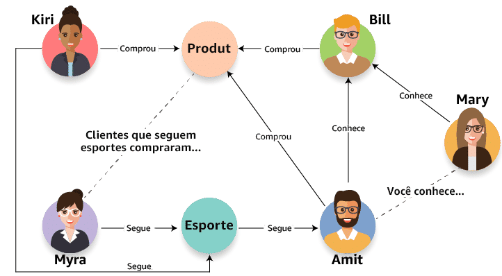

#### Bancos de dados de grafo da AWS

**DESAFIO DE NEGÓCIOS**

Imagine uma empresa que esteja trabalhando para desenvolver um aplicativo de comércio eletrônico especializado em detecção de fraudes. A empresa precisa de uma solução que possa fornecer detecção quase em tempo real de padrões definidos como suspeitos.

"Estou criando um aplicativo de detecção de fraudes e preciso de um banco de dados compatível com detecção de padrões conhecidos quase em tempo real para indicar atividades fraudulentas. O que devo usar?"

**A OPÇÃO AWS**

O __Amazon Neptune__ é um serviço de banco de dados de grafo rápido, confiável e totalmente gerenciado que facilita a criação e a execução de aplicativos que funcionam com conjuntos de dados altamente conectados.

O núcleo do Neptune é um mecanismo de banco de dados de grafo de alto desempenho e criado especificamente para armazenar bilhões de relações e consultar os grafos com latência de milissegundos.

#### Vantagens e desvantagens do banco de dados não relacional

Os bancos de dados não relacionais têm o principal benefício de ir além das limitações dos bancos de dados relacionais, especialmente por meio de esquemas dinâmicos, que oferecem aos DBAs a capacidade de atualizar esquemas em tempo real. Isso leva a ciclos de desenvolvimento mais rápidos e menos tempo de inatividade. Além disso, como os bancos de dados não relacionais podem ser implantados em servidores de commodities distribuídos em massa, esses bancos de dados têm uma vantagem em scaling e podem lidar com conjuntos de dados muito maiores.

A distribuição massiva tem uma desvantagem, na forma de “consistência eventual”, o que significa que os dados não são atualizados instantaneamente a cada alteração e, em vez disso, alcançam a atualização como uma tarefa em segundo plano. Embora seja aceitável em muitas circunstâncias, isso dificulta atingir a conformidade com ACID. Observe que o DynamoDB oferece suporte à conformidade com ACID.

Outra desvantagem é que os bancos de dados não relacionais não têm desempenho tão bom quanto os bancos de dados relacionais em aplicativos que exigem latência transacional extremamente baixa. Por fim, embora as plataformas não relacionais estejam evoluindo e crescendo constantemente, praticamente não há a mesma maturidade que as tecnologias relacionais ou o mesmo nível de especialização em campo.

#### Comparação de bancos de dados relacionais e não relacionais

Há muitos fatores que podem ajudar a definir qual tipo de banco de dados é melhor para um novo projeto ou programa que você esteja desenvolvendo. Veja a seguir as principais características dos três tipos de bancos de dados que abordamos.

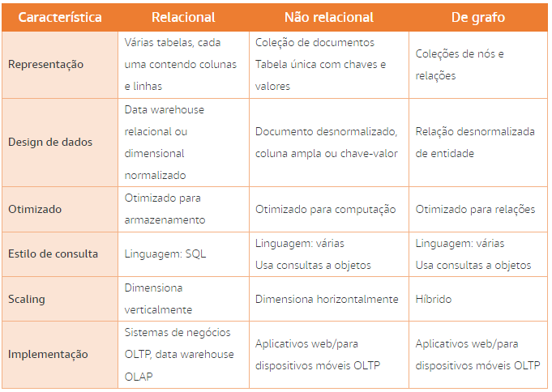

#### Resumo

- Um data warehouse multidimensional é mais adequado para um banco de dados relacional.
- Os arquivos de log são geralmente produzidos na forma de arquivos XML ou JSON, que são muito adequados para armazenamento em um banco de dados de documentos.
- Os dados coletados de sites de jogos on-line geralmente são muito rápidos em geração e temporários por natureza. Esses dados são adequados para um banco de dados de chave-valor.
- Os dados transacionais de um serviço de assinatura social podem ser armazenados em um banco de dados relacional, mas devido ao componente social, seriam mais adequados às vantagens obtidas usando um banco de dados de grafo.

* Os bancos de dados não relacionais são otimizados para computação e são bons em scaling horizontal. O design de dados para bancos de dados não relacionais é um documento desnormalizado, uma coluna ampla ou com base em chave-valor. Por fim, bancos de dados não relacionais são comumente usados para aplicativos móveis e web OLTP, mas não para sistemas de negócios OLTP.

## Veracidade: limpeza e transformação

"Quando se tem dados que __não são controlados__, provenientes de vários __sistemas diferentes__ e __não consegue fazer curadoria dos dados__ de maneiras significativas, você sabe que tem um problema de __veracidade__."

- __Curadoria__ é a ação ou o processo de selecionar, organizar e cuidar de itens em uma coleção.
- __Integridade dos dados__ é a manutenção e a garantia de precisão e consistência dos dados durante todo o seu ciclo de vida.
- __Veracidade dos dados__ é o grau em que os dados são exatos, precisos e confiáveis.

### O problema da veracidade

Os dados sofrem alterações ao longo do tempo. À medida que são transferidos de um processo para outro, e por um sistema e outro, há oportunidades para que a integridade dos dados seja afetada negativamente. Você deve garantir a manutenção de um alto nível de certeza de que os dados que está analisando são confiáveis.

A veracidade dos dados depende da integridade deles. Discutiremos os detalhes da integridade dos dados no próximo tópico.

### compreensão da integridade dos dados

Como o nome diz, a integridade dos dados tem a ver com garantir que seus dados sejam confiáveis. Eles têm integridade? Toda a cadeia de dados estava segura e sem comprometimento? Entender o ciclo de vida completo dos seus dados e saber como protegê-los com eficácia reforçará significativamente a integridade deles.

O gráfico a seguir exibe as etapas de um ciclo de vida dos dados e o que a integridade dos dados garante em cada fase.

Criação -> Agregação -> Armazenamento -> Acesso -> Compartilhamento
                                      -> Arquivamento

- __Criação__ = Nesta fase, a integridade dos dados significa garantir a sua precisão. Isso geralmente envolve auditorias de software.
- __Agregação__ = Considerando como um processo matemático, geralmente há poucos erros ao gerar os agregados. É a comparação de agregados que é complicada. Podem surgir problemas quando os indivíduos que criam os agregados deturpam o que está contido no agregado. Por exemplo, comparando o total de vendas no trimestre com o total de vendas do trimestre(somente pedidos enviados)
- __Armazenamento__ = Pode parecer o estágio mais estável de todos, mas os dados em repouso podem ser adulterados. Eles podem ser atualizados. A auditoria neste estágio é muito importante para garantir a integridade dos dados.
- __Arquivamento__ = Os dados acabarão chegando a um ponto em que perdem o valor imediato. Nesse momento, eles devem ser movidos para arquivamento. A segurança dos dados é o fator mais importante. Esses repositórios devem ter uma lista de acesso muito limitada a ser somente leitura.
- __Acesso__ = Os usuários empresariais conseguem seu primeiro acesso aos dados analíticos nesta etapa. Os sistemas devem ser somente leitura e auditados regularmente para detectar anomalias nos padrões de acesso.
- __Compartilhamento__ = Aqui a veracidade do seu sistema é testada. Os usuários empresariais geralmente sabem o que esperar dos relatórios que executam. Quando os números que eles estão vendo não correspondem ás suas expectativas, a veracidade dos dados é colocada em questão.

#### Definições

- __Limpeza de dados__ é o processo de detecção e correção de corrupções nos dados. Utiliza ETL
- __Integridade referencial__ é o processo para garantir que as restrições das relações da tabela sejam impostas.
- __Integridade do domínio__ é o processo para garantir que os dados inseridos em um campo correspondam ao tipo de dados definido para esse campo.
- __Integridade da entidade__ é o processo para garantir que os valores armazenados em um campo correspondam às restrições definidas para esse campo.

### Identificação de problemas de integridade dos dados

Como analista de dados, você pode ser chamado para executar verificações de integridade dos dados. Durante esse processo, você buscará fontes potenciais de problemas de integridade dos dados.

Os dados podem ser provenientes de fontes internas e externas. É altamente improvável que você possa ter influência sobre dados gerados fora da sua empresa. No entanto, dentro da sua empresa, você pode conseguir fazer recomendações sobre melhorias para as origens dos dados com as quais estará interagindo.

Quando alterar a maneira como os sistemas de origem ingerem dados não for uma opção, geralmente é responsabilidade do analista de dados determinar a integridade da origem dos dados em questão e fazer ajustes para considerar qualquer área em que essa fonte possa estar sem integridade.

- __Saiba qual deve ser a limpeza__

Antes de fazer qualquer outra coisa, você deve ter consenso sobre o resultado limpo. Algumas empresas consideram dados limpos os dados em seu formato bruto com regras empresariais aplicadas. Algumas empresas consideram dados limpos os dados que foram normalizados, agregados e tiveram substituições de valor aplicadas para regular todas as entradas. Esses são dois entendimentos muito diferentes de limpeza. Verifique qual é a sua meta.

* __Saiba de onde os erros vêm__

À medida que você encontrar erros nos dados, rastreie a origem provável. Isso ajudará a prever cargas de trabalho que terão problemas de integridade. Isso também ajudará você a justificar alterações no sistema que melhorariam a eficiência das operações de ETL.

- __Saiba quais são as alterações aceitáveis__

Sob uma perspectiva unicamente centrada em dados, inserir um zero em uma coluna vazia pode parecer uma decisão de limpeza de dados fácil, mas é preciso saber quais os efeitos dessa alteração. Da mesma maneira, combinar os números de inventário “Em pedido” e “Em estoque” nos relatórios mensais pode parecer inconsequente. No entanto, esses dados podem acabar nas mãos de um gerente de inventário que agora acredita que há um problema de perda de inventário. Esses são os pequenos detalhes que podem causar um impacto negativo enorme.

* __Saiba se os dados originais têm valor__

Em alguns sistemas, os dados originais não têm mais valor depois de terem sido transformados. No entanto, em dados altamente regulamentados ou dados altamente voláteis, é importante que tanto os dados originais quanto os dados transformados sejam mantidos no sistema de destino.

Por exemplo, em um sistema de jogos on-line, pode não haver valor em registrar cada mudança de direção que um jogador faz à medida que se move no mapa. O único valor importante é quando o participante entra ou sai das principais áreas do mapa. No entanto, em um aplicativo de serviços bancários, todos os detalhes de cada transação são vitais para a auditoria, embora o cliente possa apenas se preocupar em verificar se a transação teve sucesso ou não.

### Esquemas de banco de dados

Como discutimos, bancos de dados relacionais dependem de esquemas de banco de dados para organizar o conteúdo dentro do banco de dados e impor a integridade referencial e de domínio. Os programadores também usam esses esquemas ao escrever o software para interagir com o banco de dados.

- __ESQUEMAS DE DADOS__

Um esquema de dados é o conjunto de metadados usado pelo banco de dados para organizar objetos de dados e impor restrições de integridade. O esquema define os atributos do banco de dados, fornecendo as descrições de cada objeto e como ele interage com outros objetos no banco de dados. Um ou mais esquemas podem residir no mesmo banco de dados.

Há dois tipos de esquemas: lógico e físico.

* __ESQUEMAS LÓGICOS__

Os esquemas lógicos se concentram nas restrições a serem aplicadas aos dados no banco de dados. Isso inclui a organização de tabelas, visualizações e verificações de integridade.

Tabelas e exibições podem ser relacionadas entre si. O esquema define as informações de cada relação e como ela deve ser imposta. O esquema também pode fornecer integridade de domínio definindo restrições sobre os valores permitidos em campos específicos dentro da tabela que fornece integridade de domínio.

As verificações de integridade vêm em diferentes formas, mas o objetivo é garantir que quaisquer alterações feitas no banco de dados não resultem em perda de consistência de dados.

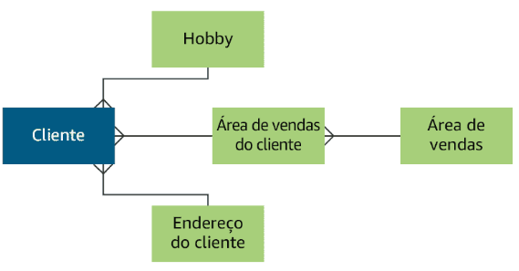

- __ESQUEMAS FÍSICOS__

Os esquemas físicos se concentram no armazenamento real de dados em disco ou em um repositório de nuvem. Esses esquemas têm detalhes sobre os arquivos, índices, tabelas particionadas, clusters e muito mais.

Em geral, os analistas podem usar esquemas físicos para calcular estimativas sobre o espaço de armazenamento necessário e o crescimento potencial do sistema. Esses esquemas também são importantes para a recuperação de desastres e o planejamento da infraestrutura.

### Esquema de informações

Você já imaginou como um DBMS gerencia todos os bancos de dados, tabelas e relações? A resposta está no esquema de informações. Um esquema de informações é um banco de dados de metadados que armazena informações sobre os objetos de dados em um banco de dados.

O Microsoft SQL Server chama seu esquema de informações de banco de dados mestre. A Oracle usa tabelas de __dicionário de dados e um registro de metadados__. O Apache Hadoop usa um metastore. Cada DBMS pode ter nomes diferentes para a estrutura de dados que armazena os metadados, mas a finalidade é a mesma: definir quais são todos os objetos no banco de dados e registrar informações vitais sobre eles. Esses bancos de dados armazenam informações como o nome e o tamanho de uma tabela, os índices na tabela e as restrições de dados na tabela. As configurações de segurança para usuários, ativos de dados externos e configurações de gerenciamento também podem ser incluídas.

Dadas as permissões apropriadas no banco de dados, você pode consultar o esquema de informações para saber mais sobre os objetos no banco de dados. Quando as consultas são executadas, essas informações são usadas para garantir a melhor otimização para a consulta. O esquema de informações também pode ser usado na manutenção do próprio banco de dados.

- As intâncias do Amazon RDS são configuradas com parâmetros e definições que já são adequados para o mecanismo e a classe selecionados.

#### Resumo

- A __integridade relacional__ garante que ambos os membros de uma relação permaneçam consistentes.
- A __integridade da entidade__ garante que os valores em um campo permaneçam consistentes.
- Um __esquema de informações__ é um banco de dados de metadados que contém informações sobre todos os objetos do banco de dados.
- Um __esquema lógico__ lista as restrições, relações e propriedades de tabelas e exibições em um banco de dados.

### compreensão da consistência do banco de dados

Para manter a veracidade nos dados armazenados, consistência é essencial. Quando dados são armazenados como arquivos, a consistência é controlada pelo aplicativo que está desenvolvendo os arquivos. Quando os dados são armazenados em um banco de dados, a consistência é responsabilidade do banco de dados que os armazena. Neste tópico, discutiremos os dois métodos implementados pelos bancos de dados: ACID e BASE.

#### ACID

__ACID__ é um acrônimo para **A**tomicidade, **C**onsistência, **I**solamento e **D**urabilidade. É um método para manter a consistência e a integridade em um banco de dados estruturado(relacional).

#### Conformidade com o ACID

ACID é o bastião de longa duração da integridade dos dados relacionais. Em um banco de dados como o Amazon RDS, uma sequência de instruções executadas em conjunto é chamada de transação. Milhões de transações podem ser executadas consecutivamente. Os dados e as restrições nesses dados são muito ativos em bancos de dados relacionais.

O objetivo de um banco de dados compatível com ACID é retornar a versão consistente e mais recente de todos os dados e garantir que os dados inseridos no sistema atendam a todas as regras e restrições atribuídas em todos os momentos. Esse processo introduz latência no sistema e deve ser considerada.

- **Atomicidade**

Ao executar uma transação em um banco de dados, a atomicidade garante que suas transações sejam bem-sucedidas por completo ou falhem por completo. Nenhuma declaração pode ser bem-sucedida sem as outras. Como muitas solicitações para um banco de dados são multifacetadas, essa interação é muito importante para evitar falhas no seu conjunto de dados.

Quando a atomicidade falha, os resultados podem ser problemáticos. Imagine uma operação definida para copiar todos os pedidos de uma tabela temporária para uma tabela permanente a cada 10 minutos. Se um único registro dentro dessa transação falhar, tudo o que o seguir também falhará. Isso deixa parte da operação bem-sucedida e parte com falha. Pode ser quase impossível identificar as partes que tiveram êxito e as partes que falharam

* **Consistência**

A consistência garante que todas as transações forneçam dados válidos para o banco de dados. Esses dados devem aderir a todas as regras e restrições definidas(constrains). Para que uma transação seja concluída com êxito, todas as declarações dentro dela devem ser válidas em relação a todas as restrições relevantes definidas no banco de dados. Se qualquer declaração única violar essas verificações, toda a transação será revertida e o banco de dados retornará ao estado anterior. A consistência também garante que as atualizações de dados estejam disponíveis somente quando todas as replicações também forem atualizadas.

- **Isolamento**

O isolamento garante que uma transação não possa interferir em outra transação simultânea. Os bancos de dados são locais ocupados. O isolamento garante que, quando várias transações solicitam os mesmos dados, existam regras em vigor garantindo que as operações não causem corrupção de dados e que todos os dados sejam disponibilizados de maneira ordenada.

* **Durabilidade**

A durabilidade dos dados tem a ver com garantir que suas alterações realmente se mantenham. Após a conclusão bem-sucedida de uma transação, a durabilidade garante que o resultado da transação seja permanente mesmo em caso de falha do sistema. Isso significa que todas as transações concluídas que resultam em um novo registro ou atualização em um registro existente serão gravadas em disco e não deixadas na memória.

Todas essas quatro propriedades trabalham em conjunto para impor a integridade em um banco de dados relacional. Muitas regulamentações exigem que as empresas implementem bancos de dados compatíveis com ACID. No entanto, em um mundo em que dados não estruturados, dados não relacionais e sistemas distribuídos estão ocupando percentagens cada vez maiores do consumo de dados de uma empresa, uma alternativa é necessária. 

#### BASE

__BASE__ é um acrônimo para **BA**sicamente disponível, e**S**tado flexível, **E**ventualmente consistente. É um método para manter a consistência e a integridade em um banco de dados estruturado ou semiestruturado. Em um sistema BASE a consistência completa é trocada por disponibilidade imediata, acontece tanto em acid quanto em base porém no base pode vir depois.

#### Conformidade com BASE

O BASE promove a integridade de dados em bancos de dados não relacionais, às vezes são chamados de bancos de dados NoSQL. Bancos de dados não relacionais, como o Amazon DynamoDB, ainda usam transações para processar solicitações. Esses bancos de dados são hiperativos e a principal preocupação é a disponibilidade dos dados em relação à consistência dos dados. Para garantir que os dados estejam altamente disponíveis, as alterações nos dados são disponibilizadas imediatamente na instância em que a alteração foi feita. No entanto, pode levar algum tempo para que essa alteração seja replicada em toda a frota de instâncias. O objetivo é que a alteração acabe sendo totalmente consistente em toda a frota. 

- **Basicamente disponível**

O BA permite que uma instância receba uma solicitação de alteração e disponibilize essa alteração imediatamente. O sistema sempre garantirá uma resposta para cada solicitação. No entanto, é possível que a resposta possa ser uma falha ou dados obsoletos se a alteração não tiver sido replicada em todos os nós. Em um sistema ACID, a alteração não seria disponibilizada até que todas as instâncias fossem consistentes. A consistência em um modelo BASE é trocada pela disponibilidade.

* **Estado flexível**

Em um sistema BASE, há tolerâncias para consistência parcial entre instâncias distribuídas. Por esse motivo, considera-se que os sistemas BASE estão em um estado flexível, também conhecido como estado alterável.

Em um sistema ACID, considera-se que o banco de dados está em um estado rígido porque os usuários não podem acessar dados que não são totalmente consistentes.

- **Consistência eventual**

Isso reforça as outras letras no acrônimo. Os dados estarão eventualmente consistentes. Em outras palavras, uma alteração será feita em cada cópia em algum momento. No entanto, os dados estarão disponíveis em qualquer estado durante a propagação da alteração.

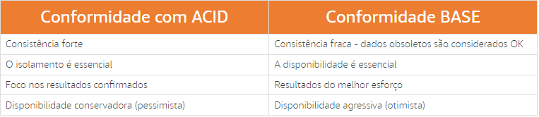

#### Transações do Amazon DynamoDB

Em novembro de 2018, a Amazon apresentou as transações do Amazon DynamoDB. Esse recurso implementa a conformidade com ACID em uma ou mais tabelas dentro de uma única conta e região AWS. Você pode usar transações ao criar aplicativos que exijam inserções, exclusões ou atualizações coordenadas de vários itens como parte de uma única operação empresarial lógica.

### introdução ao processo de ETL

Os dados de origem são confusos, estão em vários locais e raramente são desenvolvidos com o mesmo estilo de organização. Tentar entender essa confusão sem transformar os dados de origem é como tentar ouvir com clareza uma única voz em uma multidão. Você pode capturar partes da conversa, mas ela perderá contexto e validade rapidamente.

#### Noções básicas sobre ETL

Extração, transformação e carregamento (ETL) é o processo de coletar dados de origens brutas e transformá-los em um tipo comum. Esses novos dados são carregados em um local final para serem disponibilizados para avaliação e inspeção analíticas. Em ambientes modernos baseados na nuvem, geralmente nos referimos a esse processo como ELT (extração, transformação e carregamento). As etapas são simplesmente executadas em uma ordem diferente, mas o resultado é o mesmo.

1. **Extrair os dados**

A fase de extração desse processo é provavelmente a mais importante de todas as fases. Os dados necessários para a maioria das transformações de análise de dados provavelmente virão de vários locais e serão de vários tipos, como logs de transações, bancos de dados de produtos, origens de dados públicas ou fluxos de aplicativos.

Há quatro áreas principais para as quais você deve planejar.

1. Você deve identificar **onde** todos os dados de origem residem. Esses dados podem ser armazenados on-premises por sua empresa, mas também podem incluir dados encontrados on-line.
2. Você deve planejar cuidadosamente **quando** a extração ocorrerá devido ao possível impacto do processo de cópia no sistema de origem.
3. Você deve planejar **onde** os dados serão armazenados durante o processamento. Ele geralmente é chamado de local intermediário.
4. Você deve planejar **com que frequência** a extração deve ser repetida.
Depois de determinar de onde os dados vêm e o que deseja, você extrairá essas informações e as colocará em um local intermediário.

2. **Transformar os dados**

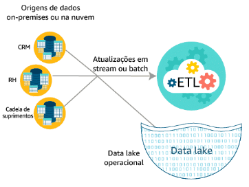

Transformar seus dados em um formato uniforme e consultável é realmente o centro do processo de ETL. Essa fase envolve o uso de uma série de regras e algoritmos para inserir os dados no formato final. A limpeza de dados também ocorre durante essa parte do processo.

As transformações podem ser básicas, como a limpeza de dados para atualizar formatos ou fazer substituições de dados. Pode ser a substituição de valores NULL por zero ou a substituição da palavra feminino pela letra F. Essas alterações aparentemente pequenas podem ter um grande impacto sobre a utilidade desses dados para analistas posteriormente, no processo de visualização.

As transformações também podem ser mais avançadas, incluindo a aplicação de regras empresariais aos dados para calcular novos valores. Filtragem, operações complexas de agrupamento, agregação de linhas, divisão de colunas e validação de dados são tipos muito comuns de transformações aplicadas nessa fase.

Os serviços do Amazon ETL podem até mesmo fazer uma transformação entre diferentes tipos de origens de dados, como transformar dados não relacionais em um formato de dados relacional ou transformar dados relacionais em arquivos JSON a serem armazenados em um data lake do Amazon S3.

Alguns dados já podem estar em seu estado final e podem passar para a próxima fase.

3. **Carregar os dados**

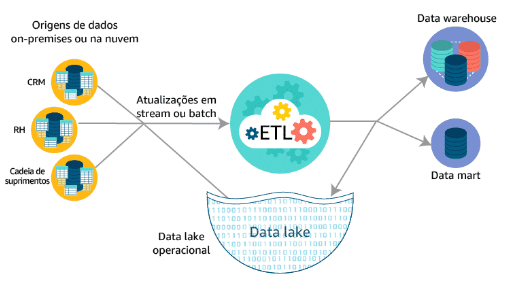

A fase final do processo de ETL é escolher um local para carregar os dados recém-transformados. As etapas de planejamento realizadas na fase de transformação ditam o formato que o datastore final terá. Esse formato pode ser um banco de dados, um data warehouse ou um data lake. Assim que o processo for concluído com êxito, os dados nesse local estarão prontos para serem analisados.

### Serviços AWS no processo de ETL

A AWS fornece serviços para cada fase do processo de ETL. Do armazenamento da origem dos dados aos relatórios, a AWS cobre todos os aspectos.

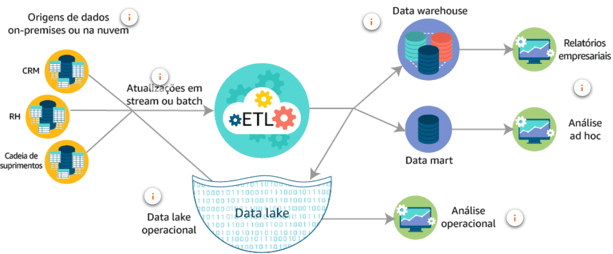

1. __Origens de dados on-premises ou na nuvem (armazenamento)__ = a AWS possui vários serviços para armazenar dados de origem: O __Amazon S3__ para dados baseados em arquivos, O __Amazon RDS__ para dados transacionais, O __Amazon Redshift__ para dados analíticos e O __Amazon DynamoDB__ para dados não relacionais.
   
2. __Atualizações em Stream ou Batch (ingestão de dados)__ = A AWS fornece várias formas de ingestão de dados para suas operações de ETL. Para dados de streaming, há o __Amazon Kinesis__. Para cargas de trabalho em Batches, há o __Amazon EMR__ e o __AWS Glue__.

3. __Data Lake Operacional__ = O amazon S3 é o serviço para armazenar dados em um data lake para uso em operações ETL.

4. __Análise Operacional(Relatórios)__ = Quando se trata de análise operacional, o __Amazon Elasticsearch Service__, em conjunto com o __Kibana__, proporciona a flexibilidade e o poder necessários para extrair informações até mesmo dos maiores conjuntos de dados. 

5. __Data Warehouse(Armazenamento de dados analíticos)__ = O __Amazon redshift__ é o serviço para criar e manter __DW e Data Marts__ na aws

6. __Relatórios empresariais(Relatórios e Painéis)__ = Há vários serviços AWS para geração de relatórios e painéis. Eles são o __Amazon Quicksight__ para painéis e o __Amazon Athena__ para consultas únicas.

### Transformação de dados - comparação entre o Amazon EMR e o AWS Glue

Quando se trata de executar o componente de transformação de dados do ETL, há duas opções na AWS: o Amazon EMR e o AWS Glue. Esses dois serviços fornecem resultados semelhantes, mas exigem diferentes quantidades de conhecimento e investimento de tempo.

O __Amazon EMR__ é uma abordagem mais prática para criar seu pipeline de dados. Esse serviço fornece uma plataforma robusta de coleta e processamento de dados. Para usar esse serviço, sua equipe deve ter sólido conhecimento técnico e know‑how. A vantagem dele é que você pode criar um pipeline personalizado para atender às suas necessidades de negócios. Além disso, os custos de infraestrutura podem ser menores do que executar a mesma carga de trabalho no AWS Glue.

O __AWS Glue__ é uma ferramenta de ETL gerenciada sem servidor que oferece uma experiência muito mais simplificada do que o Amazon EMR. Isso torna o serviço ideal para tarefas simples de ETL, mas você não terá tanta flexibilidade quanto teria com o Amazon EMR. Você também pode usar o AWS Glue como um metastore para seus dados transformados finais usando o AWS Glue Data Catalog. Esse catálogo é uma substituição de uma metastore do Hive.

Ao decidir com qual dessas ferramentas vai trabalhar, considere o final. Você prefere um pipeline de dados contínuo que exija pouca sobrecarga? Você precisa de processamento paralelo massivo de dados? Qual o nível de personalização de que sua solução de dados precisará?

#### Por que fazer o processo de ETL?

1. Para garantir que os dados tenham a exatidão, a precisão e a profundidade necessárias;
2. Para reunir dados de diferentes fontes e ter uma visão completa;
3. Para criar conjuntos de dados específicos com a finalidade de responder às principais perguntas de negócios.

#### Resumo

- Os serviços de ETL da AWS permitem transformar um tipo de origem de dados em um formato de armazenamento diferente, incluindo formatos de destino relacionais, não relacionais e baseados em arquivos.
- É fácil usar os serviços de ETL da AWS e você paga apenas pelo que usar.
- Esses serviços permitem que você use o Apache Hadoop, se estiver confortável com ele, ou vários outros frameworks e até mesmo o AWS Glue, o que não requer nenhum conhecimento de programação para uso.

## Valor: relatórios e business intelligence

"Quando há __grandes volumes de dados__ usados para corroborar __algumas informações valiosas__, você pode estar perdendo o __valor__ dos seus dados."

Discutimos a coleta de dados e a velocidade da coleta, do armazenamento de dados, da capacidade, do processamento e da análise. Todos eles têm uma coisa em comum: não avaliam os dados para fins de utilidade. Armazenar terabytes de dados que nunca ninguém verá, analisará ou visualizará é um esforço inútil. O esforço real deve ser para descobrir qual é o valor real dos dados e aprender maneiras de extrair esse valor dos terabytes de dados coletados pela sua empresa.

“Acreditamos que __os dados são o nosso petróleo__, o nosso ouro. Mas ter centenas de milhões de terabytes de __dados que não são acionáveis__ não significa nada para mim.” - Rob Roy, diretor executivo digital da Sprint.

### introdução à análise de dados

Dados sem significado são irrelevantes. Palavras em um idioma que você não compreende são igualmente insignificantes. É somente quando o significado é atribuído que os dados ou as palavras podem ser compreendidos.

A análise de dados tem duas classificações: análise de informações e análise operacional. Análise de informações é o processo de análise de informações para encontrar o valor contido nelas. É uma ampla classificação de análise de dados que pode abranger tópicos que vão desde contabilidade financeira de uma empresa até a análise do número de entradas e saídas em um edifício protegido. A segunda forma de análise é a operacional. Ela é muito semelhante à análise de informações, no entanto, ela se concentra nas operações digitais de uma organização.

### Análise de informações

__Análise de informações__ é o processo de análise de informações para encontrar o valor contido nelas. Esse termo geralmente é sinônimo de __análise de dados__.

“É um erro grave teorizar antes de ter dados. Insensivelmente, começa-se a distorcer os fatos para se adequar às teorias, em vez de moldar as teorias aos fatos”. – Sherlock Holmes.

As empresas tomam milhares de decisões com ou sem informações sólidas para respaldá-las. A expectativa, obviamente, é que haja fatos sólidos que respaldem cada decisão. Mas a infeliz realidade é que as decisões geralmente são baseadas em suposições. Essas suposições podem ter uma base na realidade, mas ainda são suposições. O que as empresas precisam é de uma maneira rápida e eficiente de obter informações significativas de todos os dados que estão coletando.

É aqui que a análise de informações entra. A análise de informações é uma série de processos com o objetivo de fornecer informações à empresa para tomar decisões baseadas em dados.

### Análise operacional

As empresas têm milhares de sistemas, aplicativos e clientes que geram dados constantemente. Essa é uma das áreas de coleta de dados que mais cresce. A análise operacional é uma forma de __análise usada especificamente para recuperar, analisar e relatar dados para operações de TI__. Esses dados incluem logs de sistema, logs de segurança, eventos e processos complexos de infraestrutura de TI, transações de usuários e até mesmo ameaças à segurança.

A __Forrester Research__ definiu a análise de TI como “o uso de algoritmos matemáticos e outras inovações para extrair informações significativas do mar de dados brutos coletados por tecnologias de gerenciamento e monitoramento”.

Na AWS, o __Amazon Elasticsearch Service__ é comumente usado para implementar análises operacionais.

#### Benefícios da análise operacional

A análise operacional fornece os meios para líderes empresariais coletarem informações desses dados operacionais coletados a partir de dados de streaming e em tempo real.

1. __Ação Oportuna__: Quando você sabe mais, pode fazer mais. Ao alinhar os sistemas on-premises com sua infraestrutura baseada na nuvem, você cria um ambiente que permite que informações operacionais gerem decisões e economizem tempo e esforço.
   
2. __Visibilidade Imediata__: Só acreditar vendo. A visualização dos resultados dos dados coletados usando análise operacional permite que as empresas extraiam inteligência em sistemas empresariais e fontes de big data. A criação de painéis interativos permite que os usuários encontrem as informações de que precisam de forma imediata.
   
3. __Informações Contínuas__: Conhecimento é poder. A análise operacional produz sistemas sólidos de tomada de decisões baseadas em fatos que permitem que as empresas explorem eventos históricos e passem a usar a análise avançada para prever tendências futuras, possíveis ameaças e grandes oportunidades.

### Tipos de análise

Agora que você compreende os dois tipos de classificações de análise, é hora de falar sobre como analisamos os dados. Esses tipos analíticos podem ser usados com análise de informações e operacionais.

Por que analisamos dados? Talvez esse curso tenha ajudado você a entender a importância da avaliação de dados. O objetivo da análise de dados é fazer descobertas acionáveis e de alto valor com base nos seus ativos de dados. Idealmente, os dados são disponibilizados aos stakeholders por ferramentas de business intelligence de autoatendimento, como o Amazon QuickSight, e ferramentas ágeis de visualização de dados, como o Kibana, que permitem a exploração rápida e fácil de conjuntos de dados.

Simplesmente lançar dados em um gráfico de barras não é suficiente. Como analista de dados, seu trabalho é descrever ao consumidor do relatório o que ele está vendo, por que é importante e como avançar com as informações fornecidas. Também é sua responsabilidade saber quais tipos de análise são necessários para atender às necessidades de cada solicitação de análise recebida.

1. __Dados__: Podem ter várias formas diferentes. Neste estágio do processo de avaliação de dados, as origens dos dados geralmente têm curadoria, limpeza e agregamento em valores úteis específicos para a geração de relatórios e avaliações.
   
2. __Avaliação Descritiva__: Essa forma de avaliação responde à pergunta __"O que aconteceu?"__. Ela se concentra em Retrospectiva. Essa forma de avaliação é conhecida como _Mineração dos Dados_. Os dados disponíveis para essa forma de avaliação são a única entrada considerada. Essa forma de avaliação exige o maior nível de esforço e interpretação de humanos. 

Exemplos: 
- Analisar os dados financeiros para produzir informações sobre os produtos mais fraudulentos.
- Analisar as vendas de ingressos para encontrar o artista musical mais vendido no ano passado.
   
3. __Avaliação Diagnóstica__: Responde à pergunta __"Por que isso aconteceu?"__ Ela se concentra em Retrospectiva e Informações. Essa forma de avaliação é usada para comparar dados históricos com outros dados. Usando esse método, é possível analisar os dados para encontrar dependências e padrões que podem levar às repostas.

Exemplos:
- Analisar publicações de redes sociais para identificar tendências no sentimento do cliente.
- Analisar consultas médicas do paciente e motivos para as consultas, para identificar tendências no atendimento ao paciente.
   
4. __Avaliação Preditiva__: __"O que acontecerá?"__ Ela se concentra em informações e previsão. Essa forma de avaliação usa os resultados da avaliação descritiva e diagnóstica para prever eventos e tendências futuras. A precisão desse método depende muito da qualidade dos dados e da estabilidade da situação sendo prevista.

Exemplos:
- Analisar o comportamento de compra dos clientes para fazer recomendações relevantes de produtos.
- Analisar dados de investimento, pesquisa de mercado e valores de propiedades para prever locais prováveis para uma nova agência.
   
5. __Avaliação Prescritiva__: __"O que devo fazer?"__ Ela se concentra na previsão. Essa forma de avaliação é usada para receitar ações a serem tomadas com base nos dados fornecidos. Esse tipo de avaliação __requer entrada de todas as outras formas de avaliação__, combinadas com regras e otimização baseada em restrições, para fazer previsões relevantes. A maior vantagem dessa forma é que ela pode ser automatizada. O machine learning possibilita isso. A avaliação prescritiva usa algoritmos de machine learning e modelos treinados para prever os resultados com base na entrada recebida. Esses modelos têm a capacidade de resolver um problema por conta própia e podem até ser programados para enviar os resultados para um tomador de decisões humano.

Exemplos:
- Prever os melhores momentos para comprar ações ou executar anúncios.
- Coletar Informações sobre o número de pacientes com pressão alta e as estatísticas sobre vários tratamentos para prever o tratamento que funcionará melhor para qualquer paciente específico.
   
6. __Inteligência cognitiva e artificial__: __"Quais são ações recomendadas?"__. Ela se concentra na previsão e na entrada de uma hipótese. Essa forma de avaliação tenta imitar o que o cérebro humano faz na resolução de problemas. Sistemas Analíticos Cognitivos geram hipóteses a partir de dados, conexões e restrições existentes. As respostas são fornecidas na forma de recomendações e uma classificação de confiança.

Exemplos:
- Assistentes artificiais, como __Amazon Alexa__.
- Combinação de prontuários médicos, artigos de revistas médicas e restrições econômicas ou geográficas para produzir recomendações de tratamento.
   
7. __Informações__: Uma informação é uma resposta a uma pergunta, um fato ou um número que sua avaliação estava tentando fornecer. Uma informação isolada pode não ser suficiente para tomar uma decisão. __Informações podem ser produzidas por todas as formas de análise.__
   
8. __Decisão__: Os resultados da avaliação são, ou pelo menos devem ser, a base para a tomada de decisões. Com exceção das formas mais complexas de análise (automação prescritiva e cognitiva de decisões), o esforço humano é a chave para atribuir significado e definição aos resultados que são apresentados. As informações geradas se tornam essenciais para justificar e agregar confiança para as decisões tomadas.
   
9.  __Ação__: A tomada de decisões com base em análise é a prova final da eficácia da análise. No caso de processos de decisão automatizadas, os analistas devem ter o cuidado especial de monitorar sistemas para garantir que estejam produzindo as ações desejadas.

#### Desafio de negócios

Imagine uma agência de viagens que esteja procurando maneiras de melhorar as experiências de seus clientes durante o voo ou a navegação. A agência espera criar um aplicativo móvel que os clientes possam usar para fazer previsões sobre a probabilidade de eventos climáticos afetarem negativamente os horários de voo.

"Preciso criar um aplicativo capaz de fornecer previsões aos usuários a fim de minimizar o estresse de voos e de atrasos devido ao clima"

- Parece que você precisa de uma solução para prever eventos futuros usando dados passados. Uma solução de análise preditivo que implementa o Amazon Machine Learning (Amazon ML) pode oferecer exatamente o que você precisa.

### Análise preditiva

A AWS tem o Amazon ML e um conjunto de serviços (incluindo inteligência artificial IA) que facilitam para os desenvolvedores a aplicação de análise preditiva aos seus dados e a adição de novos recursos inteligentes de processamento de dados aos seus aplicativos. A Amazon tem uma longa e rica tradição em torno de machine learning (ML) e muito dessa tecnologia acumulada foi organizada em um pacote para o uso do cliente com esse serviço.

A __pilha de machine learning__ tem três camadas principais:

1. __Serviços de aplicativos__ permitem que os desenvolvedores conectem a funcionalidade de IA pré-criada nos aplicativos sem se preocuparem com os modelos de ML que alimentam esses serviços.
   
2. __Serviços de plataforma__ facilitam para qualquer desenvolvedor começar e se aprofundar em ML.
   
3. __Frameworks e interfaces__ para especialistas em ML.

Na arquitetura a seguir, você vê um exemplo do uso do Amazon ML para produzir previsões em tempo real para usuários de um aplicativo. Nessa arquitetura, há vários serviços trabalhando em conjunto para produzir as previsões.

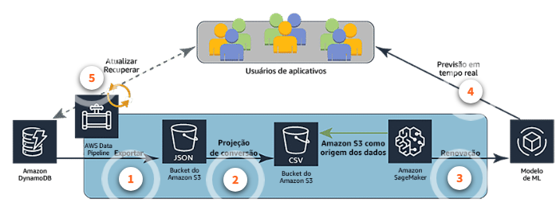

1. Etapa 1: O AWS Data Pipeline exporta uma tabela do Amazon DynamoDb na forma de arquivos JSON. Esses arquivos são colocados em um bucket do amazon S3.
   
2. Etapa 2: Em seguida, o Data Pipeline converte os arquivos JSON em arquivos CSV para que o Amazon SageMaker possa ler os dados. Esses arquivos são colocados em um segundo bucket do Amazon S3.
   
3. Etapa 3: O modelo do Amazon SageMaker é treinado com os novos dados do bucket do Amazon S3.
   
4. Etapa 4: O modelo agora pode prever a probabilidade de um novo cliente assinar seu novo produto com base nas informações fornecidas pelo Amazon SageMaker.
   
5. Etapa 5: Quando um novo usuário assina o serviço, essas informações são enviadas para o DynamoDb. Isso aciona o Data Pipeline para executar todo o processo novamente

O __Amazon DynamoDB__ é o local de armazenamento dos dados do aplicativo. O __AWS Data Pipeline__ orquestra o fluxo de dados e a preparação para uso no __Amazon SageMaker__. Em seguida, você pode treinar um __modelo de ML__ para usar os dados no Amazon SageMaker para fazer previsões em tempo real com base na atividade do usuário.

#### Desafio de negócios

Imagine um hospital que tenha centenas de médicos e atenda milhares de pacientes todos os dias. Essa empresa está sempre procurando as melhores maneiras de usar todos os dados disponíveis para ajudar os médicos a fazerem diagnósticos oportunos e precisos para que possam recomendar os melhores tratamentos para seus pacientes.

"Preciso criar um aplicativo que consiga coletar e analisar dados de pacientes a partir de consultas anteriores, históricos familiares e informações médicas comuns para melhorar as recomendações de tratamento"

- Parece que você precisa de um aplicativo que consiga aplicar a Análise cognitiva com precisão para melhorar continuamente.

### Análise cognitiva

Análise cognitiva é a forma mais recente de análise de dados. Ele oferece uma oportunidade incrível de fornecer recomendações altamente especializadas para empresas sem qualquer envolvimento humano, além da configuração inicial e do treinamento dos modelos de ML.

Alguns exemplos reais de análise cognitiva são:

- Software financeiro que fornece recomendações de investimento precisas, em tempo real e baseadas em fatos;
- Software para a área de saúde que oferece aos clientes acesso a recomendações confiáveis sobre tratamentos e opções atualizadas de saúde;
- Software veterinário que ajuda os veterinários a diagnosticar com rapidez e precisão seus pacientes;
- Software que auxilia ligas de futebol americano e entusiastas a gerenciarem suas equipes.

### Serviços analíticos e velocidade

Na primeira vez em que você envia dados por um sistema de análise de dados, os dados fluem da ingestão para um local de armazenamento intermediário. Em seguida, os dados são processados a partir do local intermediário e podem resultar na colocação dos dados em um datastore analítico. O processamento dos dados do local intermediário pode ser repetido muitas vezes para produzir muitos resultados analíticos diferentes.

É importante ter uma compreensão sólida da velocidade que você pode esperar dos diferentes tipos de processamento.

**ANÁLISE EM BATCH**

A análise em batch geralmente envolve consulta a grandes quantidades de dados “frios”. A análise em batch é implementada em grandes conjuntos de dados para produzir um grande número de resultados analíticos de forma regular. Os sistemas baseados em MapReduce, como o __Amazon EMR__, são exemplos de plataformas compatíveis com análise em batch.

Os frameworks de alto nível executados no Apache Hadoop podem simplificar e acelerar significativamente a análise em batch. O framework que deve usar depende muito do tipo de carga de trabalho que você tem. Alguns dos frameworks mais populares usados com o Hadoop são Hive, Flink, Tez, HBase, Presto, Pig e Spark. Cada um desses frameworks pode ser instalado em clusters do Amazon EMR.

Nota: vários sistemas e plataformas podem ser empilhados ou combinados entre si. Por exemplo, o mecanismo de consulta do Hive emprega trabalhos MapReduce para implementar vários componentes de suas consultas SQL. A maioria dos data warehouses tem algum suporte, até mesmo amplo, para executar análise em batch.

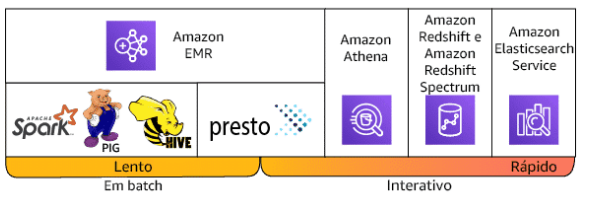

**ANÁLISE INTERATIVA**

Análise interativa normalmente envolve a execução de consultas intrincadas em conjuntos de dados complexos em altas velocidades. Esse tipo de análise é interativo, pois permite que o usuário consulte e veja os resultados imediatamente. A avaliação em batch geralmente é executada em segundo plano, fornecendo avaliação em formato de relatórios entregues de forma programada.

Para avaliaçãos interativas, o __Amazon Athena__ facilita a avaliação de dados diretamente no Amazon S3 e no Amazon S3 Glacier usando consultas SQL padrão. O Athena é um serviço sem servidor, por isso, não é necessário configurar ou gerenciar a infraestrutura. Você pode começar a consultar dados imediatamente, obter resultados em segundos e pagar apenas pelas consultas executadas. Basta apontar para os dados no Amazon S3, definir o esquema e iniciar as consultas usando SQL padrão. A maioria dos resultados é entregue em segundos.

O __Amazon ES__ permite pesquisar, explorar, filtrar, agregar e visualizar seus dados quase em tempo real. O serviço tem APIs fáceis de usar e recursos de análise em tempo real, juntamente com a disponibilidade, a escalabilidade e a segurança exigidas pelas cargas de trabalho de produção.

O __Amazon Redshift__ oferece a capacidade de executar consultas complexas e análises em petabytes de dados estruturados e inclui o Redshift Spectrum, que executa consultas SQL diretamente em exabytes de dados estruturados ou não estruturados no Amazon S3 sem precisar mover dados de forma desnecessária.

**ANÁLISE EM STREAM**

Análise em stream exige a ingestão de uma sequência de dados e a atualização incremental de métricas, relatórios e estatísticas de resumo em resposta a cada registro de dados recebido. Esse método é mais adequado para funções de monitoramento e resposta em tempo real.

O processamento de dados de streaming requer duas camadas: uma camada de armazenamento e uma camada de processamento. A camada de armazenamento precisa ser compatível com a solicitação de registros e ter forte consistência para permitir leituras e gravações rápidas, de baixo custo e reproduzíveis de grandes fluxos de dados. A camada de processamento é responsável pelo consumo de dados da camada de armazenamento, realizando cálculos sobre esses dados e, em seguida, enviando notificações para a camada de armazenamento excluir os dados que não são mais necessários. Surgiram várias plataformas que oferecem a infraestrutura necessária para criar aplicativos de dados de streaming, incluindo o Amazon Kinesis, o Apache Kafka, o Apache Flume, o Apache Spark Streaming e o Apache Storm.

O __Amazon Kinesis__ é uma plataforma para dados de streaming na AWS, oferecendo serviços avançados para facilitar o carregamento e a análise de dados de streaming e permite que você crie aplicativos de dados de streaming personalizados para necessidades específicas. O Kinesis oferece dois serviços: o Amazon Kinesis Data Firehose e o Amazon Kinesis Data Streams.

Se os dados no fluxo precisarem de conversão de formato, transformação, enriquecimento ou filtragem, você poderá pré-processar os dados usando uma função do __AWS Lambda__. Você pode fazer isso antes que o código SQL do aplicativo seja executado ou antes que o aplicativo crie um esquema do seu stream de dados.

Você pode instalar plataformas de dados de streaming de sua escolha no Amazon Elastic Compute Cloud (Amazon EC2) e no Amazon EMR e criar suas próprias camadas de armazenamento e processamento em stream. Ao criar sua solução de dados em streaming no Amazon EC2 e no Amazon EMR, você pode evitar o atrito causado pelo provisionamento da infraestrutura e obter acesso a diversos frameworks de armazenamento e processamento em stream. As opções da camada de armazenamento de dados em streaming são o Apache Kafka e o Apache Flume. As opções para a camada de processamento em stream são o __Apache Spark Streaming__ e o __Apache Storm__.

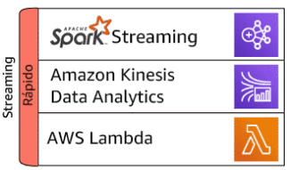

### Soluções de avaliação de dados e serviços AWS

Anteriormente, na lição 1, apresentamos os componentes de uma solução de avaliação de dados. Vamos revisar esses componentes e os serviços envolvidos.

1. **Ingerir/coletar dados brutos**: Você pode coletar dados de duas maneiras: em batches grandes ou em um processo de stream.

Os serviços incluem:

- Amazon EMR
- AWS Glue
- Amazon Kinesis: Data Firehose, Data Streams, Data Analytics, Video Streams

2. **Armazenar**: Você pode armazenar dados de duas maneiras: armazenando objetos ou armazenando registros em um banco de dados ou data warehouse.

Os serviços incluem:

- Amazon S3
- Data lakes do Amazon S3
- Amazon RDS
- Amazon DynamoDB
- Amazon Redshift

3. **Processar / Analisar**: O processamento e a análise de dados são feitos em vários estágios diferentes, sendo um processo iterativo. Há o processamento e a limpeza iniciais pelos quais os dados passarão. Em seguida, os dados serão colocados em um datastore analítico. Isso pode ocorrer no nível de objeto ou registro. Os dados podem ser reprocessados e analisados a partir do datastore analítico.

Os serviços incluem:

- Amazon ML
- Amazon EMR
- AWS Glue
- Amazon Kinesis Data Analytics
- Amazon Athena

4. **Consumir / Visualizar**: Você pode consumir e visualizar dados de diversas maneiras, usando uma grande variedade de ferramentas. Muitas vezes, a ferramenta para consumir e visualizar os dados é a mesma.

Os serviços incluem:

- Amazon Redshift
- Amazon QuickSight
- Amazon Athena

#### Resumo

- Quais foram as vendas totais em abril? As perguntas relacionadas a eventos anteriores são respondidas usando avaliação descritiva.
- Quais são as vendas totais do ano a ano para a região Ásia-Pacífico? As perguntas que comparam conjuntos de dados atuais com conjuntos de dados anteriores são respondidas usando avaliação diagnóstica.
- Qual é o crescimento projetado para internações relacionadas a tabagismo no próximo ano? As perguntas que procuram previsões de eventos futuros são respondidas usando avaliação preditiva.
- Quais produtos devo comprar se gosto do time Seattle Seahawks? Perguntas que buscam recomendações com base em preferências ou histórico de compras anteriores são respondidas usando avaliação prescritiva.
- Qual é o número médio de veículos detectados pela minha campainha de vídeo?Perguntas que exigem avaliação de vídeo, imagens e voz são respondidas usando avaliação cognitiva.

### introdução à visualização de dados

Agora que você sabe quais são os diferentes tipos de avaliação, precisa entender como implementá-los para produzir as respostas às necessidades de sua empresa.

“Uma avaliação de dados não é apenas __dados e gráficos__. É sobre __encontrar__ e __contar uma história__.” - Glen Rabbie, CEO da Yellowfin.

#### Preparação de dados

Lembre-se de que há um processo pelo qual os dados devem passar para serem realmente valiosos. Esse processo inclui:

1. **Exploração de dados** - essa primeira fase geralmente faz parte do planejamento envolvido na criação de uma operação de ETL.
2. **Limpeza de dados** - esse é o processo de normalização dos dados dentro da operação de ETL para garantir que os campos contenham os valores corretos e lidar com o problema de valores ausentes.
3. **Transformação de dados** - essa fase envolve a aplicação de funções para manipular dados em novos formatos para fins analíticos.
4. **Visualização de dados** - esse é o processo de criação de relatórios e painéis para apresentar o valor contido nos dados.

Já discutimos os três primeiros processos de análise de informações. Esta lição ajudará você a entender o processo final, que é a visualização dos dados.

#### O que há em um relatório?

Os relatórios analíticos são apresentados em vários formatos e tamanhos diferentes. A origem dos dados raramente afeta os relatórios resultantes. Os relatórios são organizados para atender às necessidades dos consumidores dos relatórios.

Há três tipos amplos de relatórios: estáticos, interativos e painéis.

1. **Os relatórios estáticos** não desapareceram nesta era digital. Na verdade, ainda são muito utilizados para apresentações e reuniões. São encontrados em formato PDF e slides do PowerPoint e, muitas vezes, podem ser acessados por meio de portais da web e interfaces de software.
   
2. **Os relatórios interativos** estão se tornando cada vez mais comuns. Esses tipos de relatórios geralmente se enquadram como business intelligence de autoatendimento. Esses relatórios costumam ter um estilo de relatório para impressão, mas têm a vantagem de que os consumidores podem aplicar filtros a tabelas e gráficos, alterar as escalas e até mesmo agrupar e classificar os valores nos relatórios. Isso permite que um consumidor conte sua própria história usando a base estabelecida pelo criador do relatório.
   
3. **Painéis** são outra ferramenta de relatórios muito conhecida. A interatividade dos painéis depende do software empregado. Os consumidores encontram o maior benefício em painéis quando se concentram em roll-ups de alto nível dos principais fatores de negócios.

Relatórios e painéis são compostos por vários gráficos e tabelas para responder perguntas. Se as perguntas forem claras, o relatório ou o painel fornecerão as respostas. Relatórios e painéis também podem ser divididos em páginas ou exibições. Essas páginas devem ter um único tema para todos os elementos do relatório nelas. É muito comum dar aos consumidores de relatórios e painéis interativos filtros que podem ser aplicados a toda a página ou a elementos individuais na página.

**DESAFIO DE NEGÓCIOS**

Preciso conseguir fazer perguntas de acompanhamento e dividir os dados para descobrir informações sem precisar consultar o tempo todo minha equipe de business intelligence para executar consultas únicas.

Meus consumidores exigem relatórios fáceis de usar e interativos para que possam controlar as visualizações.

"Meus clientes exigem relatórios e painéis interativos que permitam alterar filtros. O que devo usar?"

**A OPÇÃO AWS**

O **Amazon QuickSight** é um serviço analítico de negócios rápido, fácil de usar e desenvolvido para a nuvem que permite que todos os funcionários de uma empresa criem exibições, executem avaliações únicas e extraiam rapidamente informações empresariais de seus dados, a qualquer momento, em qualquer dispositivo.

Painéis interativos disponibilizam aos consumidores de painéis uma forma de autoatendimento para consumir e separar seus dados para responder perguntas sem precisar depender de uma equipe de business intelligence.

Com o Amazon QuickSight, é possível fazer upload de arquivos CSV e Excel; conectar-se a aplicativos de software como serviço (SaaS), como o Salesforce; acessar bancos de dados on-premises, como o SQL Server, o MySQL e o PostgreSQL; e utilizar de forma contínua suas origens de dados da AWS, como o Amazon Redshift, o Amazon RDS, o Amazon Aurora, o Amazon Athena e o Amazon S3.

O Amazon QuickSight permite que as empresas escalem seus recursos analíticos de negócios para centenas de milhares de usuários e oferece desempenho de consultas rápido e responsivo usando um mecanismo robusto na memória conhecido como SPICE.

#### Práticas recomendadas para escrever relatórios

Elaborar um relatório sólido que fornecerá aos consumidores o que eles precisam para tomar decisões críticas é uma forma de arte. Há algumas etapas para ter sucesso:

1. Coletar dados, fatos, itens de ação e conclusões.
2. Identificar o público, as expectativas dele e o método apropriado de entrega.
3. Identificar os estilos de visualização e o estilo de relatório que melhor atendem às necessidades do público.
4. Criar os relatórios e painéis.

Esse processo pode ser demorado na primeira vez. No entanto, assim que você concluir a primeira etapa de coleta dos dados, poderá usar esse mesmo conjunto de dados em vários relatórios e painéis diferentes. As etapas 2 a 4 podem ser diferentes para cada relatório ou painel criado.

