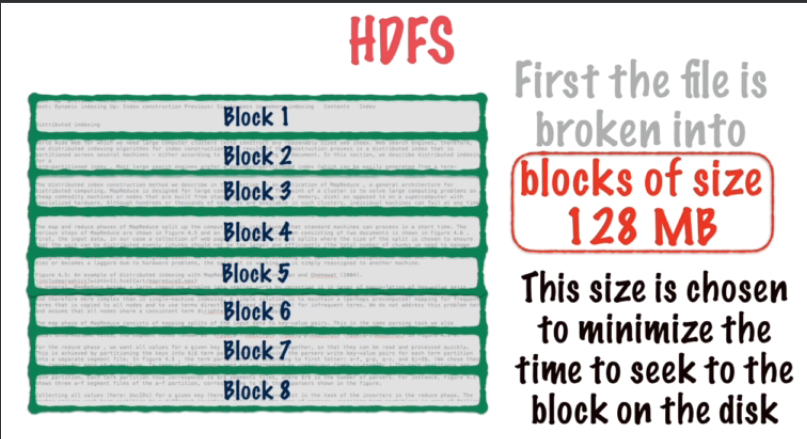
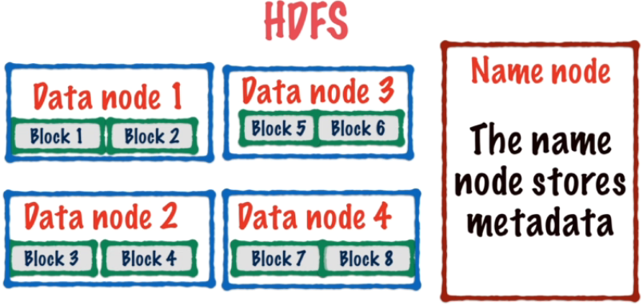
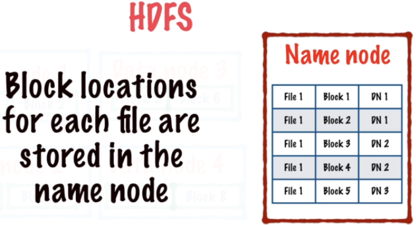
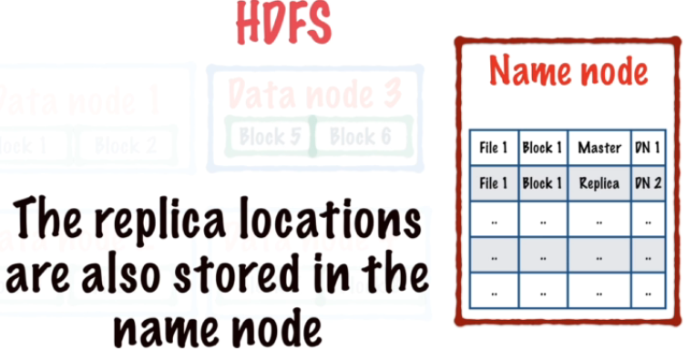
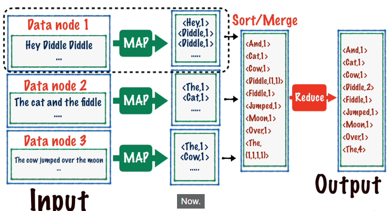

# What is Hadoop?


- Hadoop é um framework desenvolvido e mantido pelo Apache Software Foundation.
- É um Software Open Source
- Hadoop foi escrito em JAVA
- Permite executar simultaneamente em multiplas servers.


O Hadoop contém dois pontos principais:

1. Um sistema para gerenciar e organizar arquivos(dados) (**HDFS**)
2. Um framework para processar data em multiplos servers. (**MapReduce**)
3. Um framework que executa processamento de dados. (**YARN**) - ADICIONADO EM 2013

- Esses dois componentes formam o HADOOP. 
- HDFS + MapReduce = HADOOP

- O google precisa do HDFS e MapReduce para construir os seus ótimos sistemas de pesquisas.

- o Hadoop em 2013 lançou uma nova versão que divide o mapReduce em 2 partes:
  1. MapReduce = framework que define tarefas de processamento de dados
  2. YARN = framework que executa processamento de dados


## HDFS (armazenamento de dados)

- Hadoop utiliza esse Sistema de dados **HDFS** para armazenar dados em multiplos discos;
- por ser um sistema de arquivo distribuido, os dados não estão em apenas um disco mas através de **multiplos discos** que estão espalhados pelo DATA CENTER;
- A ideia do hadoop é trabalhar em um grupo de maquinas (**Cluster**), pois apenas em uma máquina, perde o propósito de computação distribuida;
- Cada máquina no cluster se chama **NODE (Nós)**;
- Um **node** desse **cluster** é chamado de **master node**;
- o master node gerencia todo o sistema


### Master Node (Name Node)

O name node armazena:
  1. A **estrutura do diretório**
  2. **Metadata** para todos os arquivos através do cluster (**onde** e em que **formato** o arquivo foi armazenado)


### Data Nodes

- É chamado de data nodes , todos os outro que não forem o Master
- Eles armazenam os dados distribuidos em arquivos de disco físico

- O arquivo salvo é quebrado em blocos de 128MB e armazenado entre o cluster.
- Agora a leitura de dados em um bloco é limitada pela taxa de processamento de dados de 100MB por segundo.
- O tamanho do bloco é uma troca entre: reduzir o tempo de busca dos dados e o tamanho dos dados do Map de tarefas.
- Quando executamos o MapReduce, iniciamos uma tarefa de mapeamento e normalmente é executado em apenas um bloco de data de 128MB.



- Esses blocos são armazenados através dos DataNodes(cluster)



- A localização dos blocos de cada arquivo são armazenadas no MASTER NODE
- File1, Block1 está armazenado no data node 1.




__Um arquivo é lido usando:__
  1. O **Metadado** no Master node
  2. Os **Blocos** nos Data Nodes

### Possíveis Problemas

O que acontece se **um** dos **blocos** for corrompido?

- Você pode definir um fator de replicação de blocos no HDFS, determina quantas copias dos dados é armazenado.
- Cada bloco é replicado e essas réplicas são armazenadas em diferentes data nodes, através de cópias com versões diferentes.
- Isso proteje de data node crashes


O que acontece se **todos** os **data nodes** forem corrompido?


- A localização das réplicas são armazenadas no Master Node
- File 1, Block 1, DataNode 1 - > File 1, Block 1, Data Node 2




## Introduction MapReduce (processamento de dados)


- Um arquivo consiste é dividido em blocos e esses blocos são armazenados em diferentes Data Nodes.


### Objetivo do MapReduce (exemplo)

- Encontrar o número de vezes que a palavra "hello", apresenta no arquivo.

**Opção 1**

1. Reconstruir o arquivo completamente em 1 Node.
2. Processar o arquivo para contar o número de "hello"s

- **Prós**: Esse tipo de abordagem é muito simples de escrever, essa é a principal vantagem
- **Contras**: Nos não estamos tirando vantagem do paralelismo inerente do hadoop.

**Opção 2 (melhores práticas)**

1. Processar cada bloco armazenado nos nodes, recebendo o resultado da contagem de cada bloco e é feito um merge dos resultados dos blocos. Sem precisar transferir dados de um node para outro. Os dados são processados diretamento nos blocos.
2. O resultado é armazenado em um node e podemos combinar os resultados nesse node para gerar a contagem de palavra "hello" em todo arquivo. Basicamente é feito um **SUM** de todos os resultados armazenados em um único node.

- Esse é o funcionamento do **MapReduce** = é um jeito de processar paralelamente tasks de processamento de dados.

- O MapReduce trabalha em duas fases:
  1. **MapPhase**, processar individualmente cada bloco de arquivo armazenado nos nodes
  2. **ReducePhase**, combinar os dados dos resultados em apenas um node.

- O MAP opera em 1 bloco, 1 node em paralelo em todos os nodes ao mesmo tempo.
- O Reduce combina todos os resultados de vários nodes, em apena um node.


O programador precisa se concentrar em definir duas funções:
- map()
- reduce()

e o hadoop cuida do resto.

### Exemplificando

- **map()** = **MapPhase** conta o número de "hello" de cada bloco em cada node e nesses nodes ficam o resultado de quantos "hello" contém em cada bloco individualmente.
- **reduce()** = **ReducePhase** operação sum() de todos os resultados dos blocos e o resultado geral é armazenado em apenas 1 node.


* Basicamente o hadoop oferece paralelismo através de  map + reduce tasks


## YARN (gerenciamento de recursos)

- Serve para gerenciar recursos no cluster de hadoop
- Antes, até 2013/14. o MapReduce cuidava do gerenciamento de recursos e também do processamento do map e do reduce de cada data node.
- Agora o MapReduce é focado apenas no processamento de dados.

O **YARN** coordena todas as diferentes tarefas de **MapReduce** em execução no **cluster**.

- YARN também **monitora falhas** e **atribui novos nodes** quando outros falharem.


### Ordem de execução

1. **MapReduce**: usuários definem MAP e Reduce tasks usando a API do MapReduce, esse 
2. **YARN**: Um trabalho é adicionado ao cluster. também verifica se os recursos estão alocados corretamente para o MapReduce trabalhar. **adiciona um trabalho ao cluster e gerencia os recursos.**
3. **HDFS**: YARN descobre onde e como executar o trabalho e armazena o resultado do MapReduce em hdfs


## On premises Hadoop install

- Hadoop funciona apenas em linux/unix.
- Hadoop even though hadoop is normally run on a cluster in a production environment, you would actually be
- Hadoop tem 3 diferentes versões, duas são pra simulação e teste e outra é um ambiente real de produção hadoop.

### Versões do Hadoop

1. **Standalone** = 
   - Nesse modo o hadopp usa seu sistema de arquivos local ao invés do HDFS para armazenar dados e uma java virtual machine(jvm) fica em execução para rodar os trabalhos de MapReduce ou outros.
   - Nesse modo o HDFS e o YARN não funcionam, pois está em apenas um computador e não em um cluster.
   - Funciona apenas o MapReduce, é **usado apenas para testar trabalhos de MapReduce**.
   - Esse modo é utilizado para testar programas de MapReduce antes de rodar eles em um cluster


2. **Pseudo-distributed** = 
   
   - Nesse modo o hadoop está rodando em apenas uma máquina com 2 JVMs.
   - É uma simulação real do cluster hadoop.
   - 1 JVM coordena o Master Node e a outra JVM coordena o data node.
   - Todos os 3 componentes estão rodando nessa versão do hadoop.
   - O YARN para coordenar os trabalhos.
   - Você escolhe se quer rodar essa versão na sua máquina local linux ou mac ou em uma VM linux.


3. **Fully-distributed** = 
   - Está rodando hadoop em um cluster de máquinas.
   - Essas maquinas precisam estar rodando linux ou unix e se comunicar entre si através da internet, e juntos eles formam o cluster hadoop.
   - O hadoop precisa ser instalado em todas as maquinas do cluster, se você quiser adicionar 100 maquinas, precisará instalar o hadoop em todas elas e certificar de configurar que essas máquinas estão se conectando entre si.
   - Serviços de Hadoop para empresas : CLOUDERA, Hortonworks e MapR. Essas empresas oferecem serviços de gerenciamento de todo os clusters e você pode usar apenas uma interface gráfica para configurar o cluster e os serviços de gerenciamento.

**O cluster podem ser feito por**:
1. Servers linux em um data center on-premises
2. Ou através de serviços de nuvem como AWS EC2, Azure ou GCP. Empresas de pequeno e medio porte e startups, utilizam muito os serviços de nuvem.


### Instalando Hadoop Standalone


- Os serviços de configuração manual e gerenciamento dos nodes num cluster hadoop, é complicado e propenso a falhas. É um grande trabalho e se paga muito dinheiro para esses profissionais.
- Vamos iniciar um BabyCluster com 2 Vms linux, uma em nossa maquina local e vamos mmontar um cluster na nuvem usando o CLOUDERA

- Utilizar um ambiente linux ou unix, windows com WSL ou Virtual box com linux .

#### Instalando o Java 8 JDK no WSL2 Ubuntu 22.04

1. Verificar se o java está instalado ```java -version```
2. Verificar no WSL o sistema operacional e versão ```cat /etc/os-release```, ```uname -m```
3. Checando no localhost a versão do WSL ```wsl -l -v```
4. Atualizando pacotes: ```sudo apt update```, ```sudo apt upgrade```
5. Instalando JDK8 no Ubuntu WSL2: ```sudo apt install openjdk-8-jdk -y```
6. Repetir etapa 1

#### Atualizar chave SSH:

- o Hadoop frequentemente usa o SSH para comunicação entre os nós do cluster e para autenticação. 
- Gerar uma chave SSH e configurar a autenticação sem senha no seu sistema local.
- O comando ssh-keygen é usado para gerar uma chave SSH. O exemplo usa o algoritmo DSA (-t dsa). Recomendo usar RSA ou Ed25519, pois eles são mais seguros e amplamente suportados: Isso irá gerar uma chave SSH RSA sem senha no arquivo ~/.ssh/id_rsa.
- Adicionar chave pública ao authorized_keys: O comando cat está anexando a chave pública recém-gerada ao arquivo ~/.ssh/authorized_keys. Isso permite fazer login na sua própria conta sem digitar a senha SSH:


1. A chave ssh localhost deve estar sem password.
2. Gerar uma chave SSH RSA sem senha no arquivo ~/.ssh/id_rsa. ```ssh-keygen -t rsa -P '' -f ~/.ssh/id_rsa```
3. Adicionar chave pública ao authorized_keys ```cat ~/.ssh/id_rsa.pub >> ~/.ssh/authorized_keys``` Isso permite fazer login na sua própria conta sem digitar a senha SSH.
4. ```ssh localhost``` retorna **ssh: connect to host localhost port 22: Connection refused**
5. O meu wsl ja estava com muita coisa instalada, docker, etc.
6. Optei por desinstalar o ssh e instalar novamente: ```sudo apt remove openssh-server```, ```sudo apt remove openssh-client```
7. instalando o ssh: ```sudo apt install openssh-server -y```
8. Porém o passo 9 deve ser tentando antes de remover
9. ```sudo service ssh status```, ```sudo service ssh start```
10. ```ssh localhost```, agora conecta sem senha

- O Hadoop necessita que o localhost esteja sem senha para que o hadoop inicie automaticamente.

#### Instalar o Apache Hadoop

1. baixar o arquivo de binários do hadoop [hadopp binaries](https://hadoop.apache.org/releases.html)
2. criando diretório para o arquivo:```cd home/lucas```, ```mkdir hadoop-install```, ```cd hadoop-install```
3. baixando arquivo: ```wget https://dlcdn.apache.org/hadoop/common/hadoop-3.3.6/hadoop-3.3.6.tar.gz```
4. Descompactando arquivo: ```tar -vzxf nomedoarquivo.tar.gz```, ```tar -vzxf hadoop-3.3.6.tar.gz```
5. baixei o arquivo errado, para baixar o [standalone](https://dlcdn.apache.org/hadoop/common/) ```wget https://dlcdn.apache.org/hadoop/common/hadoop-3.3.6/hadoop-3.3.6.tar.gz```
6. ```rm -rf hadoop-3.3.6```, ```rm -rf hadoop-3.3.6.tar.gz```
7. ```tar -vzxf hadoop-3.3.6.tar.gz ```
8. Procurar o caminho do java : ```/usr/lib/jvm/java-8-openjdk-amd64```
9. Procurar caminho para onde o hadoop foi extraido: ```/home/hadoop/hadoop-install/hadoop-3.3.6/etc/hadoop```
10. Editar o arquivo hadoop-env.sh: ```nano hadoop-env.sh```
11. Descomentar a linha JAVA_HOME e colocar o destino do java etapa 8
12. Ctrl + o para salvar e crtl + x para sair
  

Instalando o pseudo distributed

- abrir os outros arquivos e editar
- entrar na pasta do hadoop e rodar ```bin/hdfs namenode -format```
- script para rodar o hdfs ```sbin/start-dfs.sh``` cria dois namemode e um data node
- e para parar ```sbin/stop-dfs.sh```
- SE VOCÊ DESLIGAR OU REINICIAR O SISTEMA SEM UTILIZAR O STOP, vai perder todos os dados.
- ```localhost:9870```
- ```bin/hdfs dfs -mkdir /user``` ```bin/hdfs dfs -mkdir /user/lucasbergamo```
- ```jps```
- ```sbin/start-yarn.sh``` e depois quando finalizar ```sbin/stop-yarn.sh```


### MAPREDUCE

- cada input no mapreduce significa a entrada no arquivo de texto
- toda linha, número da linha, é transformado e no output cada texto é relacionado a um par de chaves-valor
- a operação de reduce é fazer um merge dos resultados para produzir um arquivo final



- O Input do reduce é uma palavra e uma lista, o output é a palavra e o número dessa palavra na lista.

CRIAR UMA CHECAGEM DE PALAVRAS EM UM ARQUIVO DE TEXTO

1. Escrever a função map()
2. Escrever a função reduce()
3. Escolher um driver para guardar o resultado do mapreduce

isso é chamado de **Job** do driver

a input de keyvalue deve ser a mesma do output

- lembrete : quando for rodar um job o diretório de ouput não pode existir um diretório com o nome igual ao diretório do output