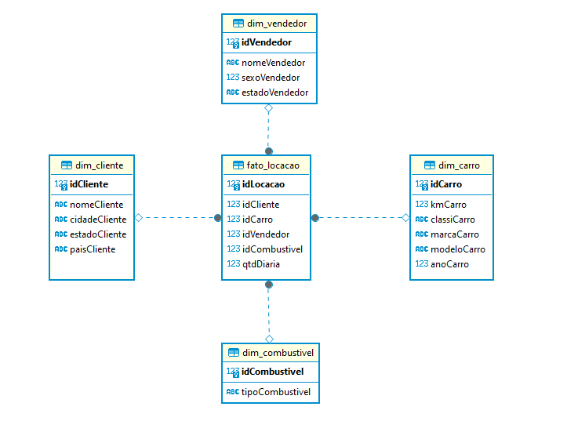
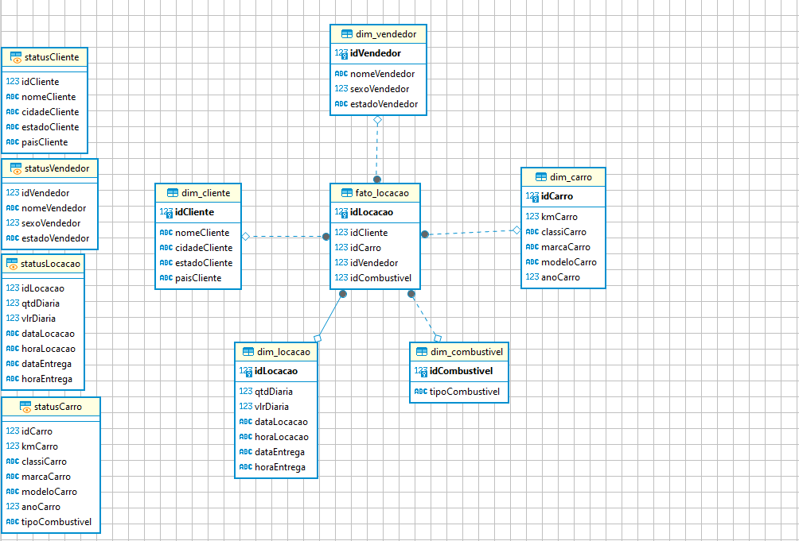

Passo a Passo:

1. utilizarei o star schema
2. dimensão é igual a um dado descritivo
3. constituida por fatos que são (tabelas de medidas) e dimensões que são (tabelas de contexto)
4. os fatos são medidas quantitativas como vendas e as dimensões são o contexto dessas medidas como data, local, produto...
5. modelagem dimensional é usada para análise.
6. resolvi deixar o fato_locacao apenas com as chaves estrangeiras e criar uma dim_locacao com os detalhes de valores e horarios da locacao

- Após criar as Views

